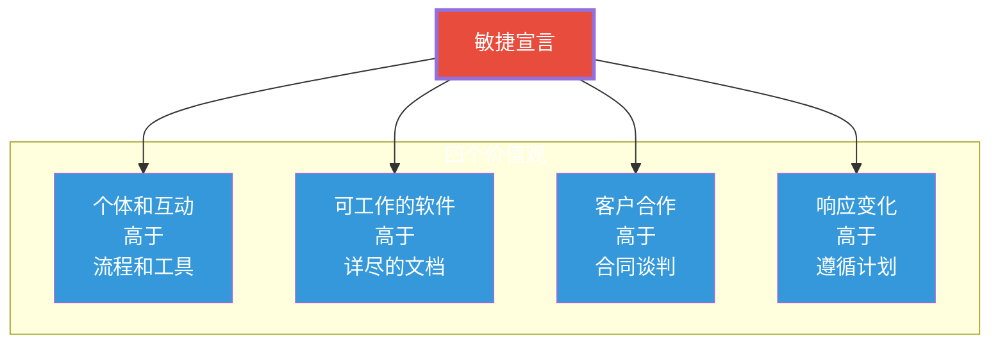
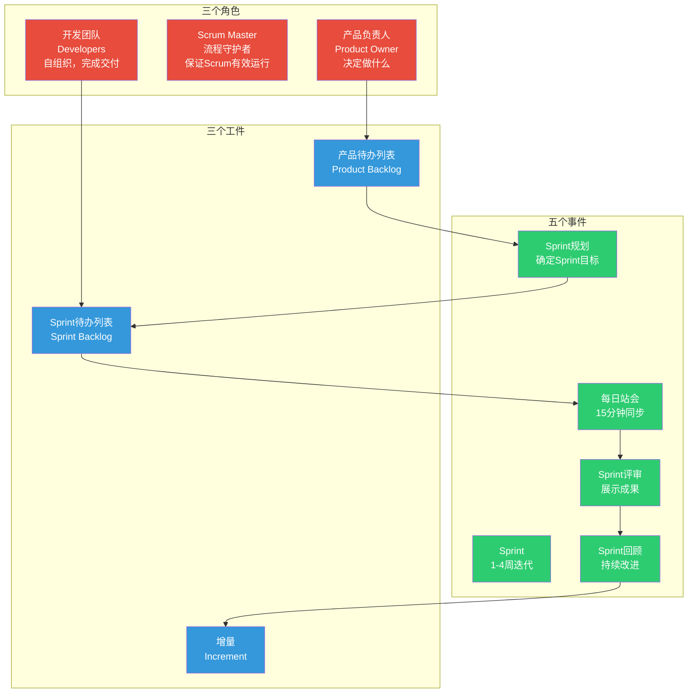

# 敏捷与Scrum：从理论到实践

> [!abstract] 核心论点
> 敏捷不是"没有计划"，而是"换一种方式做计划"。传统的"先计划再执行"在不确定环境中会失效，敏捷的"短周期迭代+持续反馈"是应对不确定性的更优解。**Scrum不是敏捷的全部，但它是目前最成熟、最广泛应用的敏捷框架。**

---

## 一、敏捷宣言：四个价值观十二条原则

2001年，17位软件开发者签署了《敏捷软件开发宣言》，奠定了敏捷运动的思想基础：

> [!important] 敏捷价值观的关键点
> 注意措辞是"高于"而不是"替代"。敏捷并不否定流程、文档、合同和计划的价值，而是认为**在面对不确定性时，左边的事项比右边的事项更重要**。这是很多人对敏捷的误解——敏捷不是"不写文档"，而是"不要为了写文档而写文档"。

---

## 二、Scrum框架：角色、事件、工件

Scrum是敏捷家族中最流行的框架，其核心结构可以用"3355"来记忆：

### 3.1 三个角色

| 角色 | 职责 | 关键能力 | 常见误区 |
|------|------|---------|----------|
| **产品负责人** | 管理产品待办列表、定义需求优先级、最大化价值 | 决策力、领域知识 | 变成"需求传话筒" |
| **Scrum Master** | 确保Scrum流程正确执行、消除障碍、教练团队 | 教练能力、引导能力 | 变成"项目经理" |
| **开发团队** | 自组织完成Sprint交付、估算工作量 | 技术能力、协作能力 | 变成"被分配任务的人" |

### 3.2 五个事件

> [!tip] Scrum事件的黄金法则
> - **Sprint**：1-4周，固定周期，不做中途变更
> - **Sprint规划**：8小时/月Sprint，回答"这个Sprint做什么？怎么做？"
> - **每日站会**：15分钟，回答"昨天做了什么？今天做什么？有什么障碍？"
> - **Sprint评审**：4小时/月Sprint，展示成果，收集反馈
> - **Sprint回顾**：3小时/月Sprint，检视自身，找出改进点

### 3.3 三个工件

| 工件 | 内容 | 负责人 | 更新频率 |
|------|------|-------|---------|
| **产品待办列表** | 所有需求的有序列表，越靠前越细化 | 产品负责人 | 持续 |
| **Sprint待办列表** | 当前Sprint要完成的任务 | 开发团队 | 每日 |
| **增量** | 每个Sprint完成的可交付产品功能 | 开发团队 | 每个Sprint |

---

## 三、Scrum在实践中的常见问题

### 3.1 "伪Scrum"的六个症状

> [!warning] 你的团队真的在做Scrum吗？
> 1. **Sprint中途变更范围**：产品负责人在Sprint中加需求——这是最常见的"伪Scrum"
> 2. **站会变成汇报会**：每个人对经理汇报进度，而不是互相同步——这是"向上管理"，不是自组织
> 3. **没有真正的Sprint回顾**：回顾变成了"吃蛋糕"而不是"找改进"
> 4. **Scrum Master变成项目经理**：分配任务、催进度、写报告——这是"项目经理换了个马甲"
> 5. **产品负责人不在场**：团队自己做决策，PO只在Sprint评审时出现
> 6. **没有可交付的增量**：每个Sprint结束时只有"代码"没有"可用的功能"

### 3.2 从"做Scrum"到"成为敏捷"

---

## 四、敏捷与PMBOK的关系

> [!tip] 敏捷不是PMBOK的对立面
> PMBOK第7版已经将"敏捷和适应性方法"纳入核心框架。两者的关系不是"二选一"：
>
> - **PMBOK提供"完整的知识地图"**——告诉你项目管理需要考虑哪些方面
> - **敏捷提供"在不确定环境下的实践方法"**——告诉你在需求变化快时怎么做
>
> 优秀的项目经理是"双模式"的——在需要稳定时用预测型方法，在需要灵活时用敏捷方法。

关于两种方法的融合，详见 [[05-产品与开发/项目管理方法论/03_瀑布与混合模式：什么时候选什么]]。

---

## 五、Scrum团队与团队动力

Scrum团队的设计与组织行为学中的高效团队特征高度一致：

| 高效团队特征 | Scrum中的体现 |
|-------------|-------------|
| 自主性 | 自组织团队，自己决定如何完成工作 |
| 目标明确 | Sprint目标，每个Sprint有清晰的方向 |
| 反馈及时 | 每日站会、Sprint评审、回顾形成持续反馈循环 |
| 角色清晰 | 产品负责人、Scrum Master、开发团队角色明确 |
| 持续改进 | Sprint回顾是制度化的改进机制 |
| 心理安全感 | 回顾会中的"安全空间"是团队信任的基础 |

关于团队动力和组织行为学的深入探讨，详见 [[03-HR人事/组织行为学精要/03_群体行为与团队动力]]。

---

## 本文档的关联知识

| 关联知识库 | 具体关联文档 | 关联内容 |
|------------|-------------|----------|
| 项目管理方法论 | [[05-产品与开发/项目管理方法论/01_项目管理知识体系：全景与框架]] | PMBOK与敏捷的互补关系 |
| 项目管理方法论 | [[05-产品与开发/项目管理方法论/03_瀑布与混合模式：什么时候选什么]] | 方法论选择的决策框架 |
| 项目管理方法论 | [[05-产品与开发/项目管理方法论/04_需求管理与范围控制：如何不跑偏]] | 产品待办列表的管理 |
| 组织行为学精要 | [[03-HR人事/组织行为学精要/03_群体行为与团队动力]] | Scrum团队的自组织与团队发展阶段 |
| 组织行为学精要 | [[03-HR人事/组织行为学精要/02_动机与激励理论：为什么人会努力工作]] | 自我决定论与Scrum的内在一致性 |