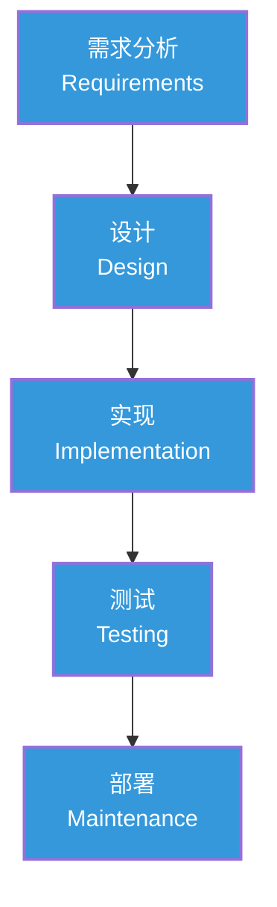
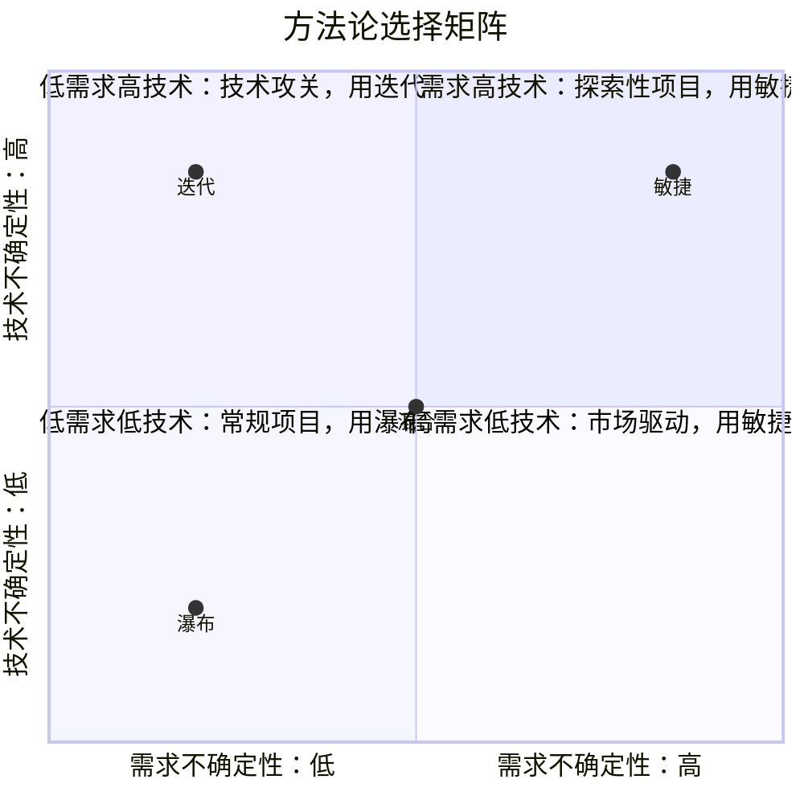

# 瀑布与混合模式：什么时候选什么

> [!abstract] 核心论点
> 一个常见的误解是"瀑布过时了，敏捷才是未来"。事实是：**每种方法论都有其适用的场景。** 关键不是"用哪个更好"，而是"在什么情况下用哪个"。更关键的是，大多数项目不是"纯瀑布"或"纯敏捷"，而是**混合模式**。

---

## 一、瀑布模型：经典但未被淘汰

### 1.1 瀑布模型的核心逻辑

瀑布模型将项目分为顺序执行的阶段，每个阶段完成后才能进入下一阶段：



### 1.2 瀑布模型的适用条件

| 条件 | 说明 | 例子 |
|------|------|------|
| **需求稳定** | 项目开始时需求已经明确，且不会频繁变化 | 建筑、制造、合规系统 |
| **技术成熟** | 使用的技术方案已经验证，没有重大不确定性 | 基建工程、移植项目 |
| **阶段清晰** | 工作可以自然分为独立的阶段 | 火箭发射、药品审批 |
| **监管要求** | 外部监管要求严格的阶段审批 | 医疗设备、航空航天 |
| **团队分布** | 团队无法频繁沟通，需要明确的阶段文档 | 外包开发、跨国协作 |

---

## 二、敏捷 vs 瀑布：决策框架

### 2.1 方法论选择矩阵



### 2.2 关键决策维度

| 维度 | 倾向于瀑布 | 倾向于敏捷 |
|------|-----------|-----------|
| **需求清晰度** | 需求明确、稳定 | 需求模糊、变化快 |
| **技术确定性** | 技术方案成熟 | 技术方案需要探索 |
| **项目规模** | 大规模、长周期 | 小到中型、快速迭代 |
| **团队结构** | 大团队、分工明确 | 小团队、自组织 |
| **客户参与度** | 阶段性参与 | 持续参与 |
| **风险容忍度** | 低风险容忍 | 高风险容忍 |

---

## 三、混合模式：敏捷+瀑布的最佳实践

### 3.1 混合模式的常见形态

```mermaid
flowchart TD
    subgraph 前端：瀑布式规划
        H1["整体架构设计"]:::water
        H2["系统需求规格"]:::water
        H3["技术选型决策"]:::water
    end

    subgraph 中段：敏捷式开发
        S1["Sprint 1"]:::agile
        S2["Sprint 2"]:::agile
        S3["Sprint 3"]:::agile
        S4["Sprint N"]:::agile
    end

    subgraph 后端：瀑布式交付
        T1["系统集成测试"]:::water
        T2["用户验收测试"]:::water
        T3["部署上线"]:::water
    end

    H1 --> H2 --> H3 --> S1
    S1 --> S2 --> S3 --> S4
    S4 --> T1 --> T2 --> T3

    classDef water fill:#3498DB,color:#fff
    classDef agile fill:#2ECC71,color:#fff
```

### 3.2 三种混合模式

| 模式 | 描述 | 适用场景 | 风险 |
|------|------|---------|------|
| **前端瀑布+后端敏捷** | 先做完整的设计规划，再用敏捷开发 | 系统集成项目 | 设计阶段可能过度规划 |
| **前端敏捷+后端瀑布** | 先用敏捷探索需求，再用瀑布式交付 | 创新产品开发 | 需求探索可能不够充分 |
| **分层混合** | 架构层用瀑布，功能层用敏捷 | 大型平台项目 | 两层之间协调成本高 |

> [!tip] 混合模式的关键成功因素
> 1. **明确切换点**：在什么条件下从规划切换到开发？从开发切换到交付？
> 2. **接口管理**：瀑布阶段和敏捷阶段的交付物如何衔接？
> 3. **团队配置**：团队需要同时具备瀑布和敏捷两种工作方式的能力

---

## 四、方法论选择的决策流程

> [!example] 方法论选择检查清单
> 在项目启动阶段，回答以下问题来决定方法论：
>
> 1. **需求分析**：需求能在项目开始时完全定义吗？(是→瀑布倾向，否→敏捷倾向)
> 2. **技术分析**：核心技术方案是否已验证？(是→瀑布倾向，否→敏捷倾向)
> 3. **交付分析**：客户需要早期交付部分功能吗？(是→敏捷倾向，否→瀑布倾向)
> 4. **团队分析**：团队是否具备自组织能力？(是→敏捷倾向，否→瀑布倾向)
> 5. **风险分析**：项目的主要风险是需求不确定还是技术不确定？
>
> **计分规则**：每个"是"给对应方法加1分，得分最高的方法作为起点，再根据项目特征进行裁剪。

---

## 五、AI时代的方法论演进

> [!warning] AI对方法论选择的三个影响
> 1. **降低了迭代成本**：AI生成代码和测试的速度远快于人类，这使得"快速迭代"的可行性大大提高，敏捷的优势更加突出
> 2. **改变了"需求明确"的定义**：当AI可以快速生成原型，需求的"明确"不再需要详细文档，而是"我知道我想要什么，AI帮我快速验证"
> 3. **混合模式成为主流**：AI擅长执行（编码、测试、文档），人类擅长决策（规划、评审、决策），这天然形成了"人类用瀑布式规划+AI用敏捷式执行"的混合模式

关于AI对项目管理的系统性影响，详见 [[05-产品与开发/项目管理方法论/08_AI时代的项目管理变革]]。关于AI项目长周期管理的系统方法论，详见 [[01-AI技术/超长项目AI跑/00_MOC_超长项目AI跑中枢]]。

---

## 本文档的关联知识

| 关联知识库 | 具体关联文档 | 关联内容 |
|------------|-------------|----------|
| 项目管理方法论 | [[05-产品与开发/项目管理方法论/01_项目管理知识体系：全景与框架]] | 项目生命周期的基础知识 |
| 项目管理方法论 | [[05-产品与开发/项目管理方法论/02_敏捷与Scrum：从理论到实践]] | 敏捷方法的核心实践 |
| 项目管理方法论 | [[05-产品与开发/项目管理方法论/08_AI时代的项目管理变革]] | AI对方法论选择的影响 |
| 超长项目AI跑 | [[01-AI技术/超长项目AI跑/00_MOC_超长项目AI跑中枢]] | AI项目长周期管理的系统方法论 |