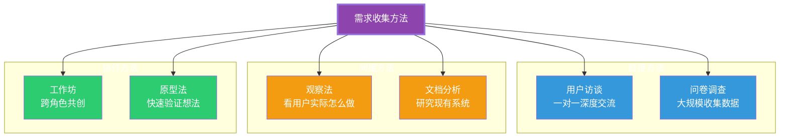
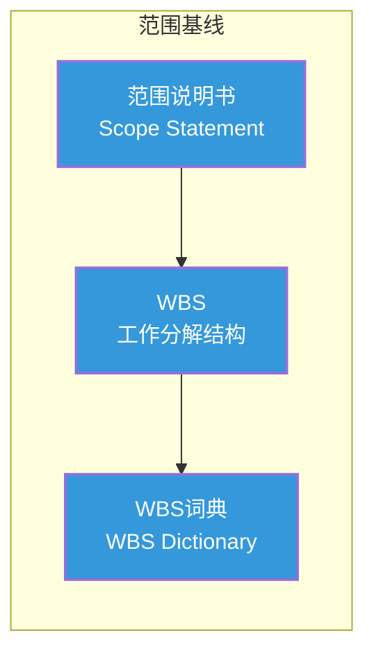
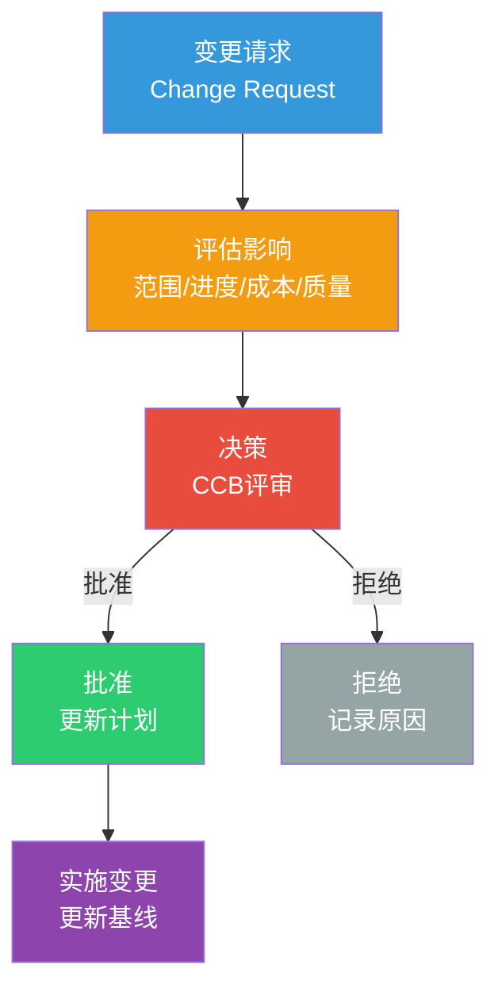

# 需求管理与范围控制：如何不跑偏

> [!abstract] 核心论点
> 项目失败的第一大原因不是"技术没做好"，而是"需求没管好"。范围蔓延（Scope Creep）是项目经理的"头号杀手"——需求不断膨胀，但时间和预算没有增加。**需求管理的核心不是"冻结需求"，而是"建立一个有序的变更机制"，让每一次变更都是经过深思熟虑的决策。**

---

## 一、需求收集：从"用户想要什么"到"用户真正需要什么"

### 1.1 需求收集的四大方法

### 1.2 需求收集的常见陷阱

> [!warning] 需求收集的六大陷阱
> 1. **用户不知道自己想要什么**——经典福特名言："如果我问用户想要什么，他们会说'更快的马'"
> 2. **说和做不一致**——用户说"这个功能很重要"，但实际使用中从不使用
> 3. **关键干系人不在场**——决策者不在需求收集会议中，需求全凭"传递"
> 4. **过度承诺**——为了取悦客户，答应一切需求
> 5. **假设而不是验证**——"我觉得用户需要这个"，而不是"用户验证了需要这个"
> 6. **需求优先级缺失**——所有需求都是"高优先级"，等于没有优先级

---

## 二、范围管理：用"基线"锁定边界

### 2.1 范围基线的构成

| 组件 | 内容 | 作用 |
|------|------|------|
| **范围说明书** | 项目目标、交付物、验收标准、除外责任 | 定义"做什么"和"不做什么" |
| **WBS** | 将项目工作分解为可管理的工作包 | 明确"有什么工作要做" |
| **WBS词典** | 每个工作包的详细描述 | 确保每个人对工作有一致的理解 |

### 2.2 范围蔓延的早期预警信号

> [!tip] 警惕这些信号
> 1. 需求文档不断被修改，且修改没有经过正式审核
> 2. 项目成员开始做"计划外"的工作
> 3. 干系人开始说"顺便加个小功能"
> 4. 验收标准不断被"微调"
> 5. 项目进度已经落后，但范围还在增加

---

## 三、变更控制：不是"不让改"，而是"让改得有序"

### 3.1 变更控制流程

### 3.2 变更控制委员会（CCB）

> [!important] CCB的组成和职责
> 变更控制委员会（Change Control Board）是范围管理的"守门人"：
>
> - **组成**：项目经理、客户代表、技术负责人、业务负责人
> - **职责**：评估变更请求的影响，决定批准或拒绝
> - **频率**：根据项目需要，定期或紧急召开
> - **原则**：所有变更必须经过正式评估，不能"口头同意"

---

## 四、敏捷中的需求管理：Product Backlog

在敏捷方法中，需求管理通过Product Backlog来实现：

| 传统方法 | 敏捷方法 | 优势 |
|---------|---------|------|
| 需求文档 | 用户故事 | 更灵活、更易理解 |
| 一次性冻结 | 持续优先级排序 | 适应变化 |
| 变更控制委员会 | 产品负责人决策 | 决策更快 |
| 范围基线 | 发布计划 | 动态调整 |
| 变更请求 | Backlog重新排序 | 流程更轻 |

关于敏捷方法的详细实践，详见 [[05-产品与开发/项目管理方法论/02_敏捷与Scrum：从理论到实践]]。

---

## 五、需求管理中的谈判技巧

需求管理本质上是一个持续谈判的过程——和客户谈判、和干系人谈判、和团队成员谈判。

> [!tip] 需求谈判的五个原则
> 1. **说"不"的艺术**：不是所有需求都要接受，但拒绝时要给出替代方案
> 2. **用数据说话**：不要只说"这个需求做不了"，要说"这个需求需要增加XX成本"
> 3. **优先级排序**：当客户要求加需求时，请他去掉一个同等优先级的已有需求
> 4. **透明化**：让所有干系人看到范围变更对进度和成本的影响
> 5. **记录一切**：每次需求变更都要有书面记录，事后追溯是项目管理的基本功

关于冲突管理中的谈判策略，详见 [[03-HR人事/组织行为学精要/07_冲突与谈判：建设性冲突管理]]。

---

## 本文档的关联知识

| 关联知识库 | 具体关联文档 | 关联内容 |
|------------|-------------|----------|
| 项目管理方法论 | [[05-产品与开发/项目管理方法论/01_项目管理知识体系：全景与框架]] | 范围管理是PMBOK十大知识领域之一 |
| 项目管理方法论 | [[05-产品与开发/项目管理方法论/02_敏捷与Scrum：从理论到实践]] | 敏捷需求管理的实践 |
| 项目管理方法论 | [[05-产品与开发/项目管理方法论/05_风险管理：识别、评估与应对]] | 范围变更本身就是风险事件 |
| 组织行为学精要 | [[03-HR人事/组织行为学精要/07_冲突与谈判：建设性冲突管理]] | 需求谈判中的冲突管理 |
| 超长项目AI跑 | [[01-AI技术/超长项目AI跑/00_MOC_超长项目AI跑中枢]] | AI项目中的需求管理特殊性 |