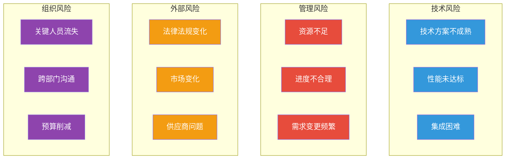
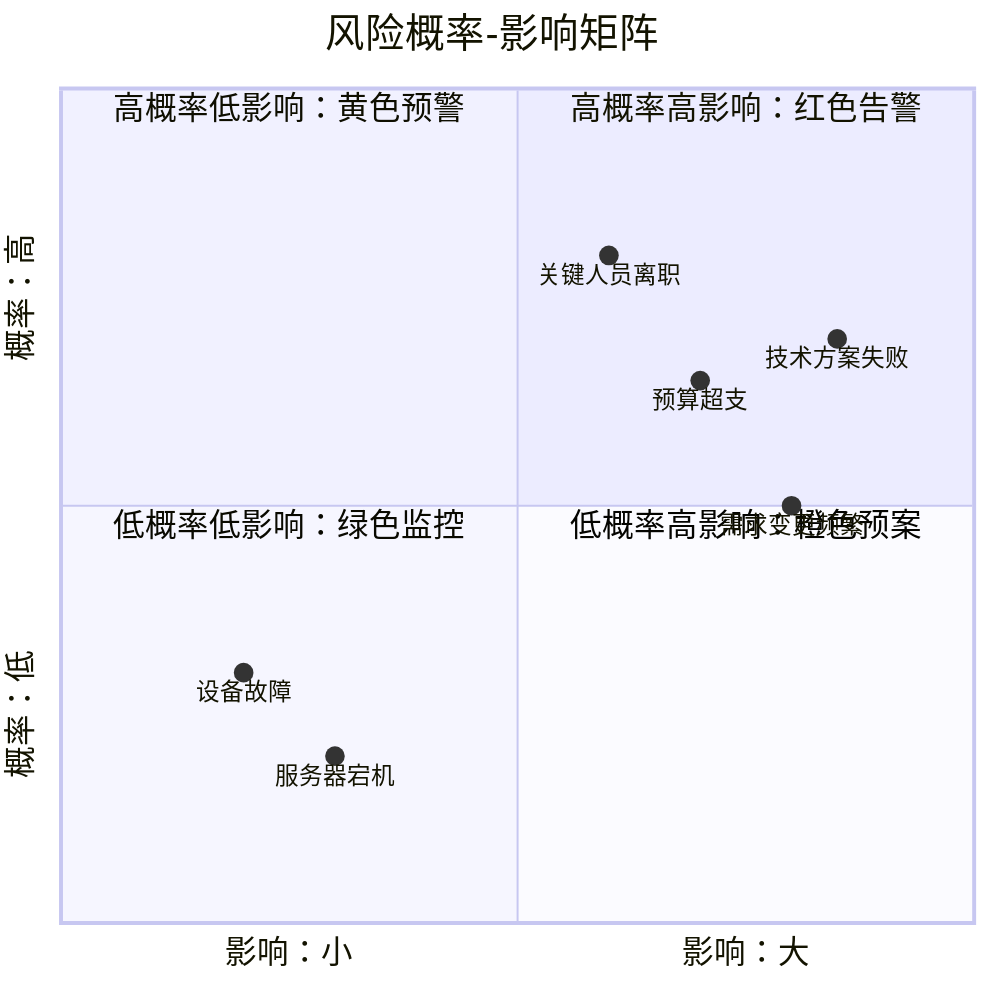
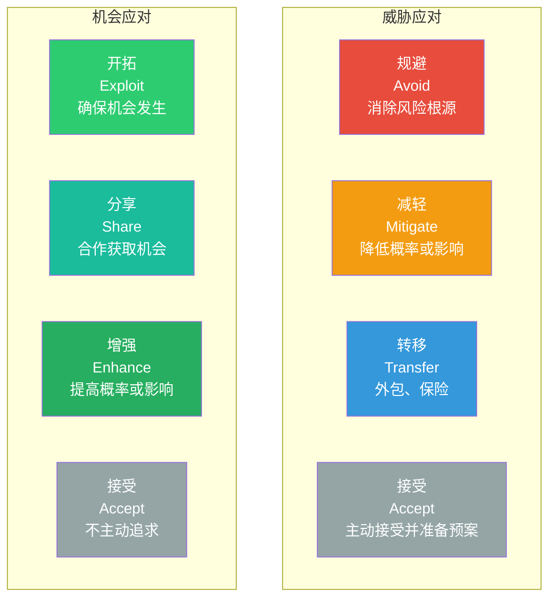

# 风险管理：识别、评估与应对

> [!abstract] 核心论点
> 风险管理不是"预测未来"——没有人能准确预测未来。风险管理是**建立一种"感知-响应"的机制**，让项目在不确定性中保持弹性和适应能力。**好的风险管理不是"风险不发生"，而是"风险发生时，你知道该怎么做"。**

---

## 一、风险管理流程

---

## 二、风险识别：不知道的风险才是最大的风险

### 2.1 风险识别的四大方法

| 方法 | 描述 | 适用场景 | 输出 |
|------|------|---------|------|
| **头脑风暴** | 团队集体讨论可能的风险 | 项目启动阶段 | 风险长列表 |
| **德尔菲法** | 匿名征求专家意见，迭代收敛 | 缺乏历史数据 | 专家共识 |
| **检查清单** | 基于历史项目经验的清单 | 有类似项目经验 | 结构化的风险清单 |
| **SWOT分析** | 从优势、劣势、机会、威胁四个维度 | 战略层面 | 风险分类 |

### 2.2 风险分类框架

风险可以按来源分类，不同来源需要不同的管理策略：

---

## 三、风险评估：概率×影响

### 3.1 风险概率-影响矩阵

### 3.2 风险等级划分

| 风险等级 | 概率×影响得分 | 行动要求 | 汇报频率 |
|---------|-------------|---------|----------|
| **红色（高）** | 0.5-1.0 | 必须制定应对计划，持续监控 | 每周 |
| **黄色（中）** | 0.2-0.5 | 制定应对计划，定期监控 | 每月 |
| **绿色（低）** | 0-0.2 | 监控即可，不需要主动应对 | 每季度 |

---

## 四、风险应对策略

### 4.1 四种基本应对策略

### 4.2 风险应对策略选择指南

| 风险类型 | 首选策略 | 备选策略 | 案例 |
|---------|---------|---------|------|
| 技术不可行 | 规避 | 减轻 | 项目中放弃使用未经验证的技术 |
| 关键人员离职 | 减轻 | 转移 | 建立知识共享机制，减少单点依赖 |
| 供应商延迟 | 转移 | 接受 | 合同约定违约金，同时准备备用供应商 |
| 需求变更频繁 | 接受 | 减轻 | 建立变更控制机制，预留缓冲时间 |
| 预算超支 | 减轻 | 转移 | 设置预算储备，明确超支责任 |

---

## 五、风险登记册：项目风险管理的"核心文档"

> [!example] 风险登记册模板
>
> | 风险ID | 风险描述 | 概率 | 影响 | 得分 | 应对策略 | 应对行动 | 负责人 | 状态 |
> |--------|---------|------|------|------|---------|---------|--------|------|
> | R001 | 核心开发人员离职 | 0.4 | 0.8 | 0.32 | 减轻 | 建立知识库、交叉培训 | 项目经理 | 监控中 |
> | R002 | 服务器性能不达标 | 0.3 | 0.6 | 0.18 | 转移 | 选择云服务商性能保障 | 技术负责人 | 已关闭 |
> | R003 | 客户需求变更 | 0.7 | 0.5 | 0.35 | 接受 | 预留20%缓冲时间 | 项目经理 | 持续 |
>
> **风险登记册是活文档**，不是做一次就完事。每次项目会议都要回顾风险登记册，更新状态，识别新风险。

---

## 六、风险管理中的心理学陷阱

> [!warning] 风险管理中的认知偏差
> 1. **乐观偏差**：人们倾向于低估风险，认为"我们不会遇到这个问题"
> 2. **确认偏差**：只关注支持自己观点的信息，忽视风险信号
> 3. **锚定效应**：过分依赖第一个信息（如"类似项目没出过问题"）
> 4. **从众效应**：团队集体乐观，没人敢说"这可能不行"
>
> **应对方法**：在风险评估中采用"预死亡法"——假设项目已经失败，然后倒推"为什么会失败"。

---

## 本文档的关联知识

| 关联知识库 | 具体关联文档 | 关联内容 |
|------------|-------------|----------|
| 项目管理方法论 | [[05-产品与开发/项目管理方法论/01_项目管理知识体系：全景与框架]] | 风险管理是PMBOK十大知识领域之一 |
| 项目管理方法论 | [[05-产品与开发/项目管理方法论/04_需求管理与范围控制：如何不跑偏]] | 范围变更是重要风险源 |
| 项目管理方法论 | [[05-产品与开发/项目管理方法论/06_干系人管理：把关键人变成同盟]] | 干系人风险是常被忽视的风险类型 |
| 项目管理方法论 | [[05-产品与开发/项目管理方法论/07_项目复盘与知识管理：如何让每个项目都增值]] | 复盘中的风险经验教训 |
| 组织行为学精要 | [[03-HR人事/组织行为学精要/03_群体行为与团队动力]] | 团队决策中的风险认知偏差 |