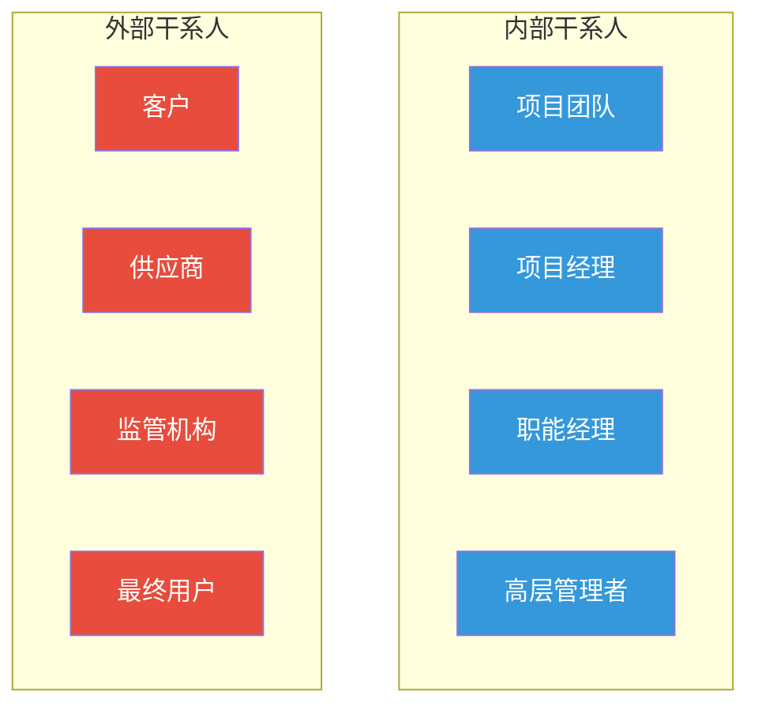
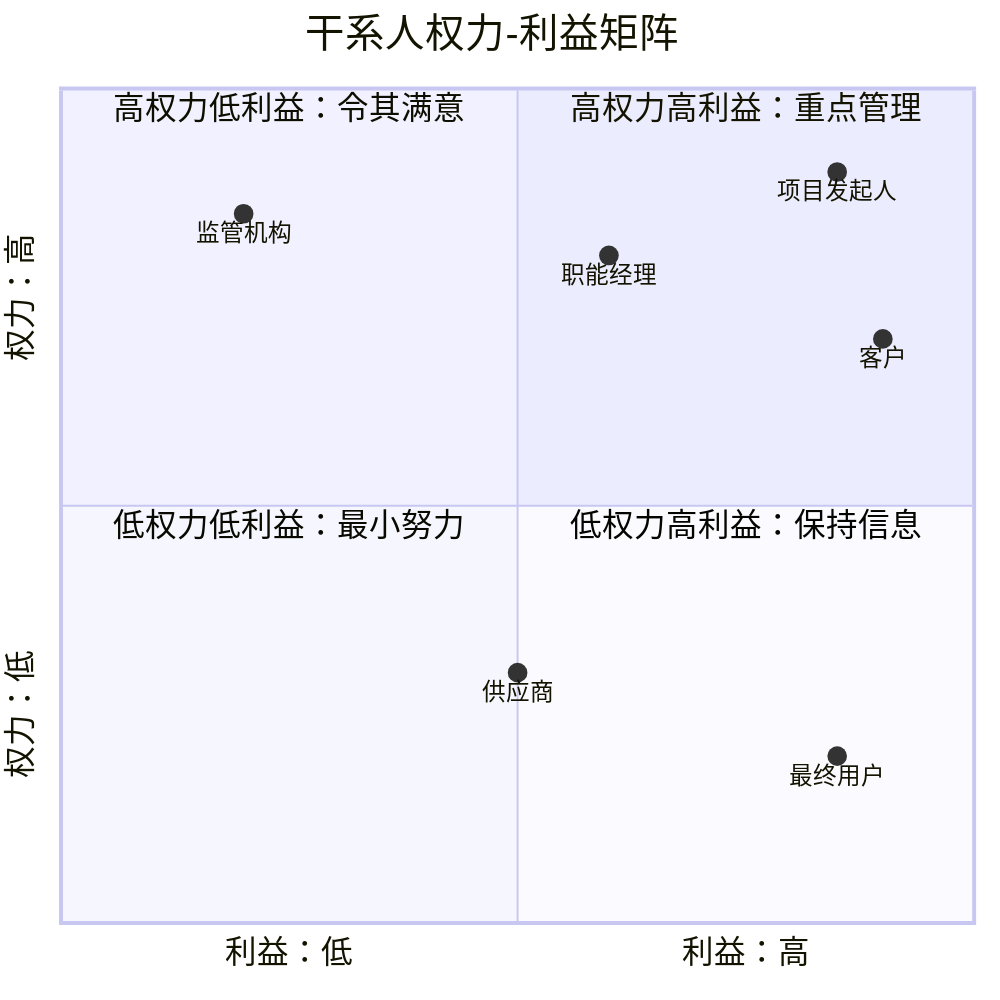
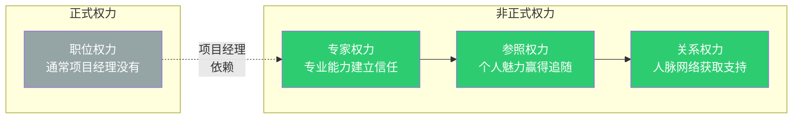

# 干系人管理：把关键人变成同盟

> [!abstract] 核心论点
> 项目失败最常见的原因不是技术问题，也不是资源不足，而是**干系人管理失败**。一个关键干系人的反对，可以摧毁一个技术完美、资源充足的项目。**项目经理的真正工作不是"管项目"，而是"管人"——尤其是那些对项目有权力和影响力的人。**

---

## 一、谁是干系人？为什么需要管理？

干系人（Stakeholder）是指**能影响项目、被项目影响、或认为自己被项目影响**的任何个人或组织。

> [!important] 干系人管理的核心原则
> **不是所有干系人都需要同样程度的管理。** 关键干系人需要密切关注，次要干系人只需要定期沟通。管理的挑战在于：**如何识别出真正的"关键干系人"**，并针对性地制定管理策略。

---

## 二、干系人分析：识别关键人物

### 2.1 权力-利益矩阵

### 2.2 四类干系人的管理策略

| 权力 | 利益 | 管理策略 | 目标 | 投入精力 |
|------|------|---------|------|---------|
| **高** | **高** | 重点管理 | 成为项目同盟 | 最高 |
| **高** | **低** | 令其满意 | 确保不反对项目 | 高 |
| **低** | **高** | 保持信息 | 保持支持，提供信息 | 中 |
| **低** | **低** | 最小努力 | 监控即可 | 最低 |

### 2.3 干系人支持度评估

> [!tip] 干系人支持度变化跟踪
> 对每个关键干系人，评估其对项目的支持度（从-5到+5）：
> - **-5到-1**：反对者——需要主动管理，了解反对原因
> - **0**：中立——需要引导，转化为支持者
> - **+1到+5**：支持者——需要维护，让他们成为同盟
>
> 关键问题是：**他们的支持度在项目过程中是上升还是下降？**

---

## 三、影响力策略：如何让干系人支持你

### 3.1 项目经理的"无权领导"

项目经理通常是"有责无权"的——对项目负责，但没有直接的人事权和预算权。因此，**影响力是项目经理的核心武器**。

### 3.2 干系人沟通计划

| 干系人 | 沟通方式 | 频率 | 内容 | 负责人 |
|--------|---------|------|------|--------|
| 项目发起人 | 一对一会议 | 每周 | 项目状态、关键决策、风险 | 项目经理 |
| 客户 | 项目评审会 | 每月 | 交付物演示、反馈收集 | 项目经理 |
| 项目团队 | 站会 | 每日 | 任务同步、障碍识别 | Scrum Master |
| 职能经理 | 邮件+会议 | 每两周 | 资源调配、进度同步 | 项目经理 |
| 最终用户 | 用户群 | 持续 | 进度更新、使用培训 | 产品负责人 |

---

## 四、处理干系人冲突

### 4.1 常见干系人冲突类型

| 冲突类型 | 典型场景 | 处理策略 |
|---------|---------|---------|
| **利益冲突** | 部门A和部门B争夺同一资源 | 协商、优先级排序、升级决策 |
| **目标冲突** | 业务方要质量，管理层要速度 | 用数据说明权衡，明确优先级 |
| **角色冲突** | 职能经理和项目经理争夺控制权 | 明确权责边界，建立合作机制 |
| **个人冲突** | 关键干系人之间个人恩怨 | 聚焦业务，避免卷入个人矛盾 |

### 4.2 干系人冲突调解

关于冲突管理的系统方法论，详见 [[03-HR人事/组织行为学精要/07_冲突与谈判：建设性冲突管理]]。

---

## 五、干系人管理的"隐形"层面：权力与政治

> [!warning] 干系人管理的深层逻辑
> 干系人管理的"明面"是沟通和关系维护，但"暗面"是权力和政治。理解组织中的权力结构，比任何沟通技巧都重要。
>
> - **谁真正有决策权？**——可能不是写在组织架构图上的那个人
> - **谁的反对可以"杀死"项目？**——可能是看似不重要的人
> - **谁在私下支持或反对？**——公开表态和私下立场可能不同
>
> 关于组织权力的系统分析，详见 [[03-HR人事/组织行为学精要/06_权力与政治：组织中的影响力游戏]]。

---

## 六、AI时代干系人管理的新变化

> [!tip] AI对干系人管理的三个影响
> 1. **干系人范围扩大**：AI系统引入后，需要管理的新干系人包括法务（合规）、伦理委员会、AI供应商等
> 2. **沟通方式变化**：AI可以生成个性化的沟通内容，但需要警惕"AI沟通"可能缺乏人情味
> 3. **信任机制变化**：干系人不仅需要信任项目经理，还需要信任AI系统的输出

---

## 本文档的关联知识

| 关联知识库 | 具体关联文档 | 关联内容 |
|------------|-------------|----------|
| 项目管理方法论 | [[05-产品与开发/项目管理方法论/01_项目管理知识体系：全景与框架]] | 干系人管理是PMBOK十大知识领域 |
| 项目管理方法论 | [[05-产品与开发/项目管理方法论/05_风险管理：识别、评估与应对]] | 干系人风险是重要风险类型 |
| 组织行为学精要 | [[03-HR人事/组织行为学精要/06_权力与政治：组织中的影响力游戏]] | 组织权力结构分析 |
| 组织行为学精要 | [[03-HR人事/组织行为学精要/04_领导力理论：从特质到情境到变革]] | 领导力与影响力的关系 |
| 组织行为学精要 | [[03-HR人事/组织行为学精要/07_冲突与谈判：建设性冲突管理]] | 干系人冲突管理 |