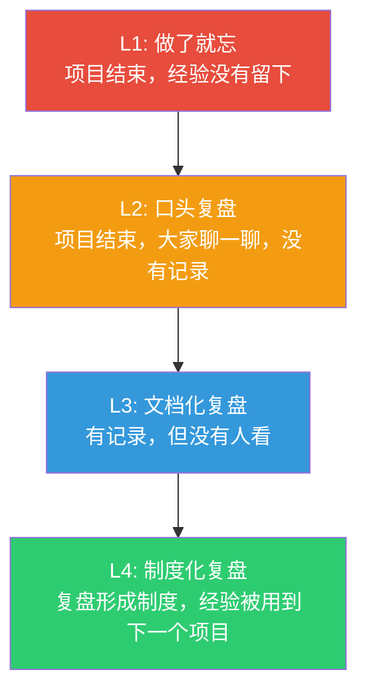
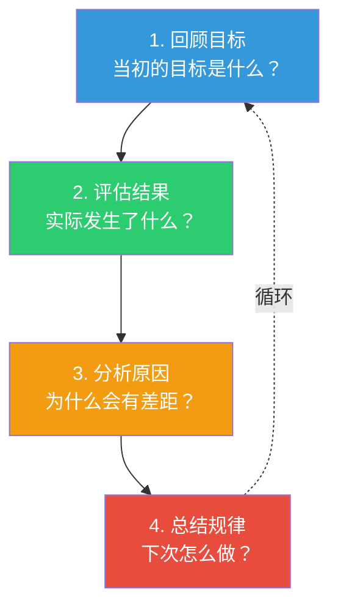
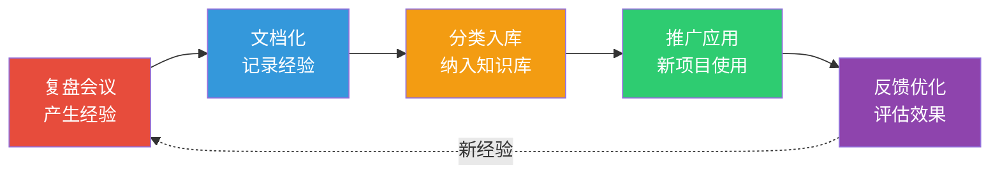

# 项目复盘与知识管理：如何让每个项目都增值

> [!abstract] 核心论点
> 一个项目结束了，但它的价值不应该结束。**每个项目都留下了宝贵的经验教训——问题在于，大多数组织没有系统性地收集、提炼和应用这些经验。** 结果就是：同样的错误在不同项目中反复出现，成功的经验随着人员流动而流失。项目复盘和知识管理，就是将"项目经验"转化为"组织能力"的系统方法。

---

## 一、为什么复盘？——不反思的项目等于白做

### 1.1 复盘的四个层次



> [!important] 复盘的终极目标
> 不是"复盘会开完了"，而是"经验被用上了"。**复盘的产出不是"文档"，而是"行为改变"。** 如果复盘后没有任何行为变化，那么复盘就是浪费时间。

---

## 二、复盘方法论：四步法

### 2.1 复盘的四步流程



### 2.2 各步骤的关键问题

| 步骤 | 关键问题 | 常见陷阱 | 实用技巧 |
|------|---------|---------|----------|
| **回顾目标** | 目标是什么？为什么设定这个目标？ | 事后修改目标，让结果看起来更好 | 复盘前先回顾项目启动时的原始文档 |
| **评估结果** | 实际结果与目标的差距？亮点和不足？ | 只关注"做了多少"，不关注"效果如何" | 用数据说话，分"亮点"和"不足"两类 |
| **分析原因** | 成功/失败的根本原因是什么？ | 归因偏差——成功归自己，失败归外部 | 用"5Why分析法"深入挖掘根因 |
| **总结规律** | 可以固化什么经验？可以改进什么？ | 经验太泛，无法指导行动 | 总结要具体到"下次遇到X时，做Y" |

### 2.3 复盘中的"三不原则"

> [!tip] 复盘会议的"三不原则"
> 1. **不追责**：复盘不是"批斗会"，目的是"找原因"不是"找人负责"
> 2. **不掩饰**：如果复盘会大家都不敢说真话，复盘的产出就是垃圾
> 3. **不泛泛**：每个结论都要具体到"下次可以怎么改进"

---

## 三、复盘的四种类型

| 类型 | 时机 | 参与人 | 重点 | 时长 |
|------|------|-------|------|------|
| **Sprint回顾** | 每个Sprint结束 | Scrum团队 | 过程改进 | 1-2小时 |
| **里程碑复盘** | 每个关键里程碑 | 项目核心团队 | 阶段性总结 | 2-4小时 |
| **项目结项复盘** | 项目结束 | 全部干系人 | 全面总结 | 半天 |
| **专项复盘** | 重大事件后 | 相关人员 | 深度分析 | 按需 |

---

## 四、从复盘到知识管理

### 4.1 经验教训的"知识转化"流程



### 4.2 经验教训的"知识颗粒度"

> [!tip] 什么样的经验教训是有用的？
> **好的经验教训**：
> - "在项目启动阶段，如果客户需求文档超过50页，务必安排一次需求澄清会"
> - "当使用React 18+TypeScript时，建议在项目初期就配置ESLint的'严格模式'"
>
> **不好的经验教训**：
> - "沟通很重要"（太泛）
> - "需求要管好"（太泛）
> - "团队要团结"（太泛）
>
> **好的经验教训 = 具体情境 + 具体行动 + 可验证的效果**

---

## 五、组织知识库的建设

复盘产出的经验教训，需要系统性地沉淀到组织知识库中。知识库不是简单的"文档堆积"，而是要有良好的分类和检索机制。

关于知识库的系统设计方法，详见 [[07-学习成长/知识管理体系/04_知识库的结构设计：从混乱到有序]]。

### 经验教训库的结构示例

```
经验教训库/
├── 需求管理/
│   ├── 2024-001-需求变更频繁导致延期.md
│   └── 2024-002-用户访谈技巧总结.md
├── 技术/
│   ├── 2024-003-微服务拆分过度的问题.md
│   └── 2024-004-数据库迁移方案对比.md
├── 团队管理/
│   ├── 2024-005-远程团队沟通策略.md
│   └── 2024-006-新成员入职流程优化.md
└── 流程/
    ├── 2024-007-评审流程优化建议.md
    └── 2024-008-部署流程标准化.md
```

---

## 六、知识管理中的"知"与"行"

> [!warning] 项目知识管理的最大挑战
> 知识管理最大的挑战不是"怎么记录"，而是"怎么用"：
> - **记录了很多，但没人看**：经验教训库变成了"数字坟墓"
> - **看了但不做**：知道"要这样做"，但实际项目中没有执行
> - **做了但不持续**：新项目开始时热情高涨，两周后就忘了
>
> **解决方案**：将知识管理嵌入项目流程，而不是"额外的工作"。例如，在项目启动阶段，强制要求检索经验教训库；在项目评审中，强制要求汇报"本次项目如何使用了过去经验"。

---

## 本文档的关联知识

| 关联知识库 | 具体关联文档 | 关联内容 |
|------------|-------------|----------|
| 项目管理方法论 | [[05-产品与开发/项目管理方法论/01_项目管理知识体系：全景与框架]] | 收尾过程组中的经验教训总结 |
| 项目管理方法论 | [[05-产品与开发/项目管理方法论/05_风险管理：识别、评估与应对]] | 经验教训是风险识别的重要输入 |
| 知识管理体系 | [[07-学习成长/知识管理体系/00_MOC_知识管理体系中枢]] | 知识管理的系统方法论 |
| 知识管理体系 | [[07-学习成长/知识管理体系/04_知识库的结构设计：从混乱到有序]] | 知识库的结构化设计 |
| 知识管理体系 | [[07-学习成长/知识管理体系/05_输出驱动输入：以写作为核心的学习闭环]] | 复盘输出与知识管理 |