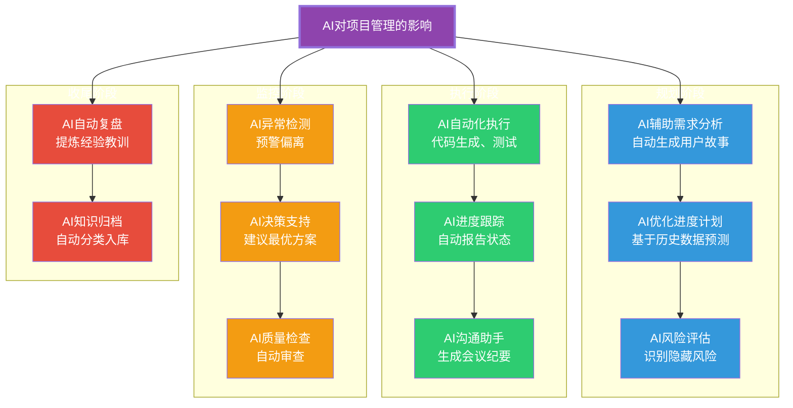
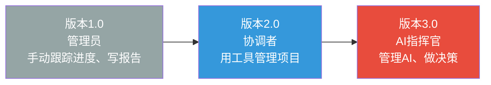

# AI时代的项目管理变革

> [!abstract] 核心论点
> AI正在从根本上改变项目管理的方式。它不是在"项目管理工具"上加一个AI功能，而是**重新定义"项目经理做什么"、"项目团队怎么协作"、"项目决策怎么做出"**。这不是渐进式的改进，而是范式的转变。拥抱AI的项目经理不会被淘汰，但拒绝AI的项目经理可能会。

---

## 一、AI对项目管理的系统影响

---

## 二、项目经理角色的三次跃迁

### 从"管理员"到"AI指挥官"

| 维度 | 传统项目经理 | AI赋能的项目经理 |
|------|------------|----------------|
| **核心工作** | 计划、跟踪、报告 | 决策、判断、协调 |
| **信息处理** | 手动收集、整理 | AI自动分析、呈现 |
| **决策方式** | 凭经验+直觉 | 数据+AI建议+人类判断 |
| **沟通方式** | 人工撰写、分发 | AI生成、人工审核 |
| **风险管理** | 定期识别 | AI持续监控、预警 |
| **时间分配** | 60%日常事务 | 20%日常事务，80%创造价值 |

---

## 三、AI改变项目管理的五大领域

### 3.1 需求管理：AI辅助需求分析

AI可以大幅提升需求管理的效率和质量：

> [!tip] AI在需求管理中的应用
> - **自动生成用户故事**：从业务描述中提取关键信息，生成结构化用户故事
> - **需求冲突检测**：AI自动识别不同需求之间的矛盾
> - **优先级建议**：基于业务价值、成本和风险，AI建议需求优先级
> - **需求追踪**：AI自动建立需求与实现之间的关联

### 3.2 进度管理：AI预测 vs 人类计划

传统进度管理是"制定计划-跟踪执行-纠正偏差"的循环。AI将其转变为"持续预测-动态调整"：

| 传统方法 | AI增强方法 |
|---------|-----------|
| 基于经验的估算 | 基于历史数据的AI估算 |
| 静态甘特图 | 动态预测模型 |
| 事后偏差分析 | 事前预警预测 |
| 月度回顾 | 实时状态感知 |

### 3.3 风险管理：AI的"第六感"

AI在风险管理中的最大价值是"发现人类看不到的风险"：

> [!important] AI风险管理的三大优势
> 1. **模式识别**：AI可以从历史项目中识别出"导致失败的模式"，提前预警
> 2. **实时监控**：AI可以持续监控项目数据，发现异常信号
> 3. **情景模拟**：AI可以快速模拟"如果X发生，项目会怎样"

### 3.4 沟通管理：AI作为"沟通枢纽"

AI可以承担项目沟通中的大量事务性工作：

- 自动生成会议纪要
- 智能翻译跨语言沟通
- 个性化推送项目状态给不同干系人
- 自动检测沟通中的"风险信号"

### 3.5 知识管理：AI自动沉淀

> [!tip] AI驱动的知识管理
> 项目复盘后的经验教训，AI可以自动识别、分类、并关联到相关项目。当新项目启动时，AI可以主动推送"相关经验教训"——"这个项目和你正在做的项目类似，当时遇到了XX问题，解决方案是YY。"

---

## 四、AI项目管理的特殊性：引用超长项目AI跑方法论

> [!warning] AI项目本身就是"长周期、高不确定性"项目
> 当项目本身是AI项目时（如开发一个AI应用、训练一个模型），项目管理面临额外的挑战：
> 1. **结果不确定**：AI项目的结果高度不确定（模型能不能收敛？效果能不能达标？）
> 2. **实验性工作**：AI开发有大量实验性工作，传统的"计划-执行"模式不适用
> 3. **快速迭代**：AI技术的快速发展要求项目团队快速适应变化
> 4. **跨会话管理**：AI项目通常需要多个开发会话，每次新会话AI需要重新理解上下文

对于AI项目的长周期、跨会话管理，[[01-AI技术/超长项目AI跑/00_MOC_超长项目AI跑中枢]] 提供了系统的方法论。该知识库的核心框架——"**多级记忆体系**"、"**架构锚点**"、"**跨会话传承**"——直接解决了AI项目管理中的特殊性挑战：

| 超长项目AI跑方法论 | 在AI项目管理中的应用 |
|-------------------|-------------------|
| **多级记忆体系（L0-L4）** | 解决AI项目中的"上下文断裂"问题，确保AI在多次会话中保持一致性 |
| **架构锚点** | 用Spec锁定AI在项目中的行为边界，防止"AI自由发挥"导致架构漂移 |
| **项目拆解** | 将AI项目拆解为"可消化单元"，每个会话只做一件事 |
| **跨会话传承** | 每次AI会话结束时输出结构化交接记录，实现"知识传承" |
| **测试驱动** | 让AI自己守护代码质量，防止AI生成代码的"退化"问题 |

---

## 五、项目经理的AI时代生存指南

> [!tip] AI时代项目经理必须掌握的五大新能力
> 1. **AI素养**：理解AI的能力边界和局限性，知道什么任务适合给AI，什么必须人类做
> 2. **Prompt工程**：会写好的提示词，让AI生成高质量的产出
> 3. **AI输出审核**：能够判断AI生成的内容是否准确、合理
> 4. **人机协作设计**：能够设计"人+AI"的协作流程，知道什么时候谁做什么
> 5. **AI伦理意识**：理解AI引入项目后的伦理问题（偏见、透明度、责任归属）

---

## 六、未来展望：项目管理的新范式

> [!quote] 未来已来，只是分布不均
> AI不会完全取代项目经理，但会重新定义项目经理的工作。**未来的项目经理不是"管理项目的人"，而是"管理人+AI混合团队交付价值的人"。** 那些只做"计划-跟踪-报告"的项目经理会被AI替代，而那些能够做"决策-判断-协调"的项目经理会变得更加珍贵。

关于AI对组织行为更深层的影响，详见 [[03-HR人事/组织行为学精要/08_AI时代的组织行为新议题]]。关于AI对知识管理的影响，详见 [[07-学习成长/知识管理体系/06_AI时代的个人知识管理变革]]。

---

## 本文档的关联知识

| 关联知识库 | 具体关联文档 | 关联内容 |
|------------|-------------|----------|
| 项目管理方法论 | [[05-产品与开发/项目管理方法论/01_项目管理知识体系：全景与框架]] | PMBOK在AI时代的演进 |
| 项目管理方法论 | [[05-产品与开发/项目管理方法论/02_敏捷与Scrum：从理论到实践]] | AI对敏捷实践的影响 |
| 项目管理方法论 | [[05-产品与开发/项目管理方法论/03_瀑布与混合模式：什么时候选什么]] | AI时代的方法论选择 |
| 超长项目AI跑 | [[01-AI技术/超长项目AI跑/00_MOC_超长项目AI跑中枢]] | AI项目长周期管理的系统方法论 |
| 组织行为学精要 | [[03-HR人事/组织行为学精要/08_AI时代的组织行为新议题]] | AI对团队行为的系统性影响 |
| 知识管理体系 | [[07-学习成长/知识管理体系/06_AI时代的个人知识管理变革]] | AI对知识管理的影响 |