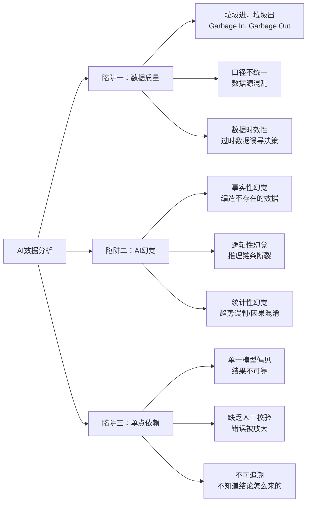
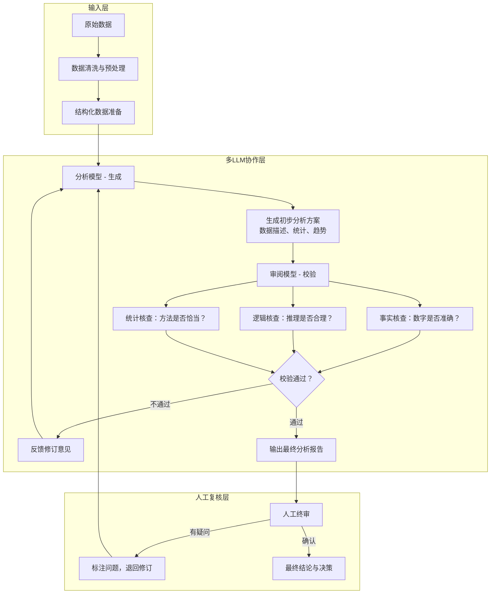

# AI数据分析方案总纲 — 注意事项、多LLM协作与质量保障

> 用AI做数据分析，最大的风险不是AI不够聪明，而是**你相信了AI的「一本正经胡说八道」**。本文从数据质量、AI幻觉、多LLM协作三个维度，给出完整的AI数据分析方案。

---

## 一、核心问题：AI做数据分析的三大陷阱



### 陷阱一：数据质量陷阱

> "Garbage In, Garbage Out"——这是数据分析领域亘古不变的法则。AI再强大，也救不了脏数据。

| 问题类型 | 表现 | 后果 |
|---------|------|------|
| 数据源不干净 | 缺失值、异常值、重复数据 | 统计结果偏差 |
| 口径不统一 | 各部门对同一指标定义不同 | 结论不可比，决策错误 |
| 数据时效性差 | 使用了过时的数据 | 趋势判断完全错误 |
| 数据孤岛 | 数据分散在不同系统 | 分析不全面，结论片面 |

### 陷阱二：AI幻觉陷阱

AI幻觉是AI数据分析中最隐蔽、最危险的陷阱。它不是你一眼能看出来的「明显错误」，而是**看起来完全合理但实际上错误的结论**。

| 幻觉类型 | 在数据分析中的表现 | 危害程度 |
|---------|------------------|---------|
| **事实性幻觉** | 编造不存在的统计数据、引用不存在的文章/报告 | ⭐⭐⭐⭐⭐ |
| **逻辑性幻觉** | 推理链条断裂，但结论看起来合理 | ⭐⭐⭐⭐ |
| **统计性幻觉** | 误判趋势方向、混淆相关与因果 | ⭐⭐⭐⭐⭐ |
| **数字性幻觉** | 计算错误、数字凭空产生 | ⭐⭐⭐⭐ |

### 陷阱三：单点依赖陷阱

只依赖一个AI模型做数据分析，相当于把所有鸡蛋放在一个篮子里：

- **模型偏见**：每个模型有其固有的偏见和盲区
- **缺乏纠错机制**：没人检查AI的输出，错误被直接采纳
- **不可追溯**：AI的推理过程是黑箱，不知道结论怎么来的

---

## 二、核心解决方案：多LLM协作架构

### 2.1 架构设计：生成 + 审阅 双模型协作

针对AI数据分析的核心痛点，最有效的工程方案是**多LLM协作（Multi-LLM Collaboration）**——让一个模型负责生成分析，另一个模型负责审阅校验。



### 2.2 多LLM协作的三种模式

| 模式 | 描述 | 适用场景 | 效果 |
|------|------|---------|------|
| **串行审阅** | 模型A生成 → 模型B审阅 → 反馈给A修订 | 通用数据分析 | 错误率降低 60-80% |
| **并行投票** | 多个模型各自独立分析 → 投票选出最优结果 | 关键决策分析 | 结果更稳健 |
| **分角色协作** | 不同模型担任不同角色（分析师/审核员/质疑者） | 复杂分析任务 | 覆盖更全面 |

### 2.3 推荐实践：串行审阅 + 知识库增强

**串行审阅（Author + Reviewer）** 是最推荐的数据分析模式：

```
Step 1: 分析模型（Author）生成分析报告
  ├── 数据描述统计
  ├── 趋势分析
  ├── 关联分析
  └── 结论与建议

Step 2: 审阅模型（Reviewer）逐项核查
  ├── 数字准确性：核对原始数据，确保无幻觉
  ├── 逻辑一致性：推理链条是否完整
  ├── 方法恰当性：统计方法是否合适
  └── 结论可靠性：建议是否基于数据

Step 3: 分析模型根据审阅意见修订
  └── 修正错误，补充依据，完善结论

Step 4: 人工终审
  └── 确认无误后输出
```

**关键配置**：
- 使用不同厂商/不同版本的模型担任分析和审阅角色（避免同类错误）
- 审阅模型使用更严格的采样参数（temperature=0.1）
- 分析模型可使用稍高的温度（temperature=0.3）以保持创造性

### 2.4 RAG增强：对抗幻觉的关键武器

检索增强生成（RAG）是目前对抗AI幻觉最主流的工程方案。在数据分析中，RAG的核心价值是**让AI的分析基于真实数据，而不是模型记忆**。

| RAG组件     | 在数据分析中的作用    | 最佳实践                     |
| --------- | ------------ | ------------------------ |
| **向量检索**  | 从知识库中检索相关文档  | 结合语义边界分块，添加元数据           |
| **关键词检索** | 精确匹配数据指标     | 与向量检索混合使用（Hybrid Search） |
| **重排序**   | 对检索结果进行二次排序  | 使用交叉编码器模型提升精度            |
| **来源追溯**  | 每个结论可溯源到原始数据 | 强制模型在输出中标注数据来源           |

---

## 三、AI数据分析的完整流程规范

### 3.1 数据准备阶段

```
┌────────────────────────────────────────────┐
│ 数据准备阶段                                 │
├────────────────────────────────────────────┤
│ 1. 数据源确认：明确数据来源、时间范围、采集方式  │
│ 2. 数据清洗：处理缺失值、异常值、重复数据       │
│ 3. 口径对齐：统一指标定义和计算方式             │
│ 4. 数据抽样：确认样本量是否足够，是否具有代表性   │
│ 5. 数据脱敏：处理敏感信息，确保合规             │
└────────────────────────────────────────────┘
```

### 3.2 分析执行阶段

```
┌────────────────────────────────────────────┐
│ 分析执行阶段（多LLM协作）                    │
├────────────────────────────────────────────┤
│ 1. 分析模型生成初步分析方案                   │
│    - 明确分析目标与问题                       │
│    - 选择分析方法与模型                       │
│    - 生成初步结果                             │
│ 2. 审阅模型进行校验                          │
│    - 数字准确性核查                           │
│    - 逻辑完整性核查                           │
│    - 方法恰当性核查                           │
│ 3. 迭代修订（最多3轮）                       │
│ 4. 达到质量标准后进入下一阶段                  │
└────────────────────────────────────────────┘
```

### 3.3 结果输出阶段

```
┌────────────────────────────────────────────┐
│ 结果输出阶段                                 │
├────────────────────────────────────────────┤
│ 1. 人工终审                                  │
│    - 核心结论复核                             │
│    - 数据来源追溯                             │
│    - 决策建议评估                             │
│ 2. 标注置信度                                │
│    - 高置信度：数据充分，方法可靠               │
│    - 中置信度：数据有限，仅供参考               │
│    - 低置信度：需进一步验证                     │
│ 3. 存档与回溯                                │
│    - 保存分析过程记录                          │
│    - 保存原始数据快照                          │
│    - 保存AI分析链条                            │
└────────────────────────────────────────────┘
```

---

## 四、AI幻觉检测与应对矩阵

### 4.1 幻觉检测方法

| 检测方法 | 原理 | 在数据分析中的用法 |
|---------|------|-----------------|
| **交叉验证** | 用不同模型/方法验证同一结论 | 让两个不同模型独立分析同一组数据，对比结论 |
| **事实核查** | 核对AI输出的数字是否与原始数据一致 | 要求AI输出每个指标的来源和计算过程 |
| **逻辑链追踪** | 检查推理链条的每一步是否合理 | 要求AI用CoT（思维链）展示完整推理过程 |
| **反向验证** | 从结论反推数据是否支持 | 如果结论是"A增长了"，反向检查原始数据中A的值 |
| **边界测试** | 测试极端情况下的合理性 | 用已知的极端值测试AI是否产出合理的结论 |

### 4.2 应对策略优先级

```
P0 - 必须做：数据源标注 + 来源追溯
  └── 每个数据点都要标注来源，每个结论都要可追溯

P1 - 强烈建议：多LLM审阅 + 人工复核
  └── 至少两个模型交叉验证，关键结论人工确认

P2 - 锦上添花：RAG增强 + 外部知识库对接
  └── 对接企业内部知识库，确保分析基于权威数据
```

---

## 五、多LLM协作的工程落地建议

### 5.1 模型选型建议

| 角色 | 推荐模型特性 | 推荐参数 |
|------|------------|---------|
| **分析模型（Author）** | 推理能力强，创造性适中 | temperature=0.3, top_p=0.9 |
| **审阅模型（Reviewer）** | 严谨、精确、批判性强 | temperature=0.1, top_p=0.5 |
| **建议：使用不同厂商的模型** | 避免同类偏见 | 如 DeepSeek + GPT + Claude 组合 |

### 5.2 Prompt设计要点

**分析模型Prompt原则**：
- 明确要求输出数据来源
- 要求展示完整推理过程（CoT）
- 指定输出格式（结构化、可验证）

**审阅模型Prompt原则**：
- 专注审查，不生成新内容
- 逐项检查：数字→逻辑→方法→结论
- 发现错误时给出具体修改建议

### 5.3 质量评估指标

| 指标 | 定义 | 达标标准 |
|------|------|---------|
| 数字准确率 | 报告中的数字与原始数据一致的比例 | ≥ 99% |
| 来源可追溯率 | 每个结论可追溯到数据来源的比例 | 100% |
| 逻辑完整率 | 推理链条无断裂的比例 | ≥ 95% |
| 审阅通过率 | 审阅模型一次通过的比例 | ≥ 80% |
| 人工复核率 | 需要人工修改的比例 | ≤ 20% |

---

## 六、总结：AI数据分析的黄金法则

```
1. 永远假设AI会犯错 → 建立多LLM审阅机制
2. 数据质量是一切的基石 → 先清洗，再分析
3. 每个结论都要可追溯 → 标注数据来源
4. 关键决策必须人工复核 → AI提供建议，人做决定
5. 持续迭代改进 → 记录每次分析中的错误，优化流程
6. 不同场景用不同模型 → 没有万能模型，选对模型是关键
7. 标注置信度 → 让决策者知道结论的可靠程度
```

---

## 关联笔记

- [[06-数据分析/AI数据分析/招聘运营_AI数据分析实战]] — 招聘运营中的AI数据分析实战
- [[03-HR人事/校招测评/00_MOC_校招测评中枢]] — 校招测评中枢索引