# AI数据分析知识库 🧠

> 覆盖"认知→工具→方法→实战→治理"全链路，系统性掌握AI时代如何用数据驱动决策。

---

## 模块速览

```mermaid
flowchart TD
    START[🧠 AI数据分析] --> A[认知篇]
    START --> B[基础篇]
    START --> C[工具篇]
    START --> D[方法篇]
    START --> E[实战篇]
    START --> F[治理篇]
    START --> G[进阶篇]

    A --> A1["[[06-数据分析/AI数据分析/01_认知_为什么AI数据分析不是自动做报表]] ⭐先看"]
    A --> A2["[[06-数据分析/AI数据分析/02_认知_传统分析vsAI分析]]"]
    A --> A3["[[06-数据分析/AI数据分析/03_认知_数据分析师转型路线图]]"]

    B --> B1["[[06-数据分析/AI数据分析/04_基础_统计学思维]]"]
    B --> B2["[[06-数据分析/AI数据分析/05_基础_分析方法论]]"]
    B --> B3["[[06-数据分析/AI数据分析/06_基础_指标体系建设]]"]

    C --> C1["[[06-数据分析/AI数据分析/07_工具_全景图与选型指南]]"]
    C --> C2["[[06-数据分析/AI数据分析/08_工具_通用AI助手]]"]
    C --> C3["[[06-数据分析/AI数据分析/09_工具_专业AI分析工具]]"]
    C --> C4["[[06-数据分析/AI数据分析/10_工具_BI工具+AI]]"]
    C --> C5["[[06-数据分析/AI数据分析/11_工具_编程+AI辅助]]"]

    D --> D1["[[06-数据分析/AI数据分析/12_方法_Prompt工程]]"]
    D --> D2["[[06-数据分析/AI数据分析/13_方法_多LLM协作架构]] ⭐核心"]
    D --> D3["[[06-数据分析/AI数据分析/14_方法_AI幻觉检测与数据质量]] ⭐核心"]
    D --> D4["[[06-数据分析/AI数据分析/15_方法_RAG在数据分析中的应用]]"]
    D --> D5["[[06-数据分析/AI数据分析/16_方法_从描述到因果分析]]"]

    E --> E1["[[06-数据分析/AI数据分析/17_实战_招聘运营数据分析]] ⭐P0"]
    E --> E2["[[06-数据分析/AI数据分析/18_实战_产品数据分析]]"]
    E --> E3["[[06-数据分析/AI数据分析/19_实战_用户增长数据分析]]"]
    E --> E4["[[06-数据分析/AI数据分析/20_实战_业务决策分析]]"]

    F --> F1["[[06-数据分析/AI数据分析/21_治理_数据治理]]"]
    F --> F2["[[06-数据分析/AI数据分析/22_治理_可信度评估]]"]
    F --> F3["[[06-数据分析/AI数据分析/23_治理_安全与合规]]"]
    F --> F4["[[06-数据分析/AI数据分析/24_治理_分析资产沉淀]]"]

    G --> G1["[[06-数据分析/AI数据分析/25_进阶_预测分析与模拟推演]]"]
    G --> G2["[[06-数据分析/AI数据分析/26_进阶_因果推断与实验设计]]"]
    G --> G3["[[06-数据分析/AI数据分析/27_进阶_决策智能体]]"]
```

| 模块 | 笔记数 | 核心定位 | 建设进度 |
|------|--------|---------|---------|
| 🧠 认知篇 | 3 篇 | 建立正确的AI数据分析认知框架 | ✅ 已完成 |
| 📐 基础篇 | 3 篇 | 统计学、方法论、指标体系——AI时代保值的能力 | ✅ 已完成 |
| 🔧 工具篇 | 5 篇 | 2026年AI数据分析工具链全景与选型 | ✅ 已完成 |
| ⚙️ 方法篇 | 5 篇 | 多LLM协作、幻觉检测、RAG、Prompt等核心方法 | ✅ 已完成 |
| 🎯 实战篇 | 4 篇 | 招聘运营、产品、增长、业务决策场景落地 | ✅ 已完成 |
| 🛡️ 治理篇 | 4 篇 | 数据治理、可信度、安全合规、资产沉淀 | ✅ 已完成 |
| 🚀 进阶篇 | 3 篇 | 预测分析、因果推断、决策智能体 | ✅ 已完成 |

---

## 使用指南

| 你的状态 | 打开什么 |
|---------|---------|
| 刚接触AI数据分析，想知道它跟传统分析有什么区别 | 认知篇 → 先看[[06-数据分析/AI数据分析/01_认知_为什么AI数据分析不是自动做报表]] |
| 想用AI做数据分析但担心AI胡说八道 | 方法篇 → [[06-数据分析/AI数据分析/13_方法_多LLM协作架构]] + [[06-数据分析/AI数据分析/14_方法_AI幻觉检测与数据质量]] |
| 想知道2026年有哪些AI分析工具、怎么选 | 工具篇 → [[06-数据分析/AI数据分析/07_工具_全景图与选型指南]] |
| 想把AI数据分析落地到招聘运营工作中 | 实战篇 → [[06-数据分析/AI数据分析/17_实战_招聘运营数据分析]] |
| 想知道AI分析的结果靠不靠谱 | 治理篇 → [[06-数据分析/AI数据分析/22_治理_可信度评估]] |
| 想系统学习AI数据分析的完整方法论 | 从认知篇开始，按顺序读到进阶篇 |

---

## 关键原则

> [!tip] AI数据分析的四条黄金法则
> 1. **问题先于数据** — 从业务问题出发，而不是从已有数据出发
> 2. **语义先于模型** — 指标、实体、口径和业务规则没有建好，模型越强，幻觉越有迷惑性
> 3. **证据先于表达** — 所有结论都要能追溯、能复核、能质疑
> 4. **闭环先于自动化** — 先保证问题→分析→行动→结果能闭环，再逐步提高自动化程度

---

## 关联知识库

- [[03-HR人事/校招测评/00_MOC_校招测评中枢]] — 招聘数据来源与分析需求
- [[03-HR人事/招聘与面试体系/00_MOC_招聘与面试体系中枢]] — 招聘流程数据的分析框架
- [[05-产品与开发/AI产品经理方法论/00_MOC_AI产品经理方法论中枢]] — 产品数据分析
- [[04-商业与战略/增长与运营方法论/00_MOC_增长与运营方法论中枢]] — 增长数据分析
- [[03-HR人事/培训与人才发展/00_MOC_培训与人才发展中枢]] — 培训数据分析
- [[01-AI技术/AI Agent开发实战/00_MOC_AI Agent开发实战中枢]] — 决策智能体