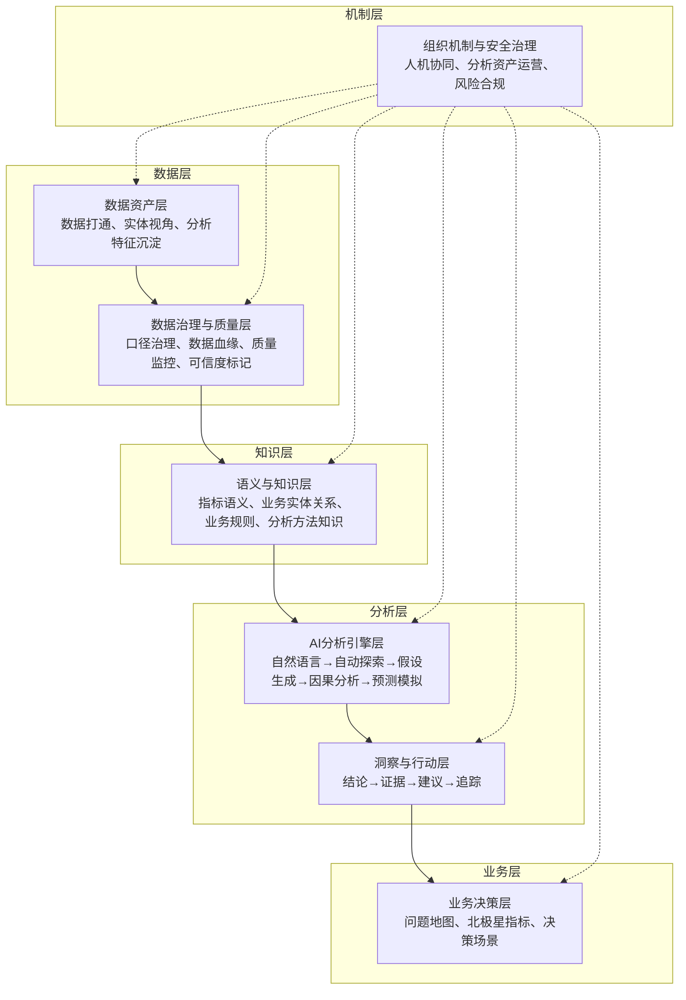

# 为什么AI数据分析不是"自动做报表"

> [!abstract] 核心观点
> 很多企业谈 AI 数据分析，第一反应是把自然语言转成 SQL，或者让大模型自动生成图表。这当然有价值，但如果只停在这里，AI 只是一个更顺手的查询入口。它提高的是取数效率，不一定提高判断质量。真正的 AI 数据分析框架，应该回答一个更根本的问题：**企业如何把分散的数据、模糊的问题、人的经验和机器的推理能力，组织成一套可持续运转的决策系统。**

---

## 一、传统数据分析的"隐性损耗"

传统数据分析大多是"人提问→数据团队取数→分析师解释→业务方拍板"的线性流程。这个流程的问题不只是慢，更关键的是链条里有大量隐性损耗：

| 损耗环节 | 具体表现 | 后果 |
|---------|---------|------|
| 问题传递 | 业务问题在传递中被简化成字段需求 | 分析结果偏离真实需求 |
| 指标口径 | 同一指标在不同团队之间定义不同 | 数据打架，决策无从下手 |
| 分析深度 | 分析结果停留在描述层，很少进入因果层和行动层 | 报表越来越多，但洞察越来越少 |
| 经验沉淀 | 分析经验沉淀在个人脑子里，难以复用 | 人走了，知识也走了 |
| 决策效率 | 从提问到决策，周期长、环节多 | 错过最佳决策窗口 |

AI 的价值不应只是把这条链条压缩，而是**改变链条本身**。它可以把"问题理解、数据发现、指标解释、模式识别、假设生成、因果验证、行动建议、效果追踪"连成闭环。

---

## 二、AI数据分析的七层框架

基于 AI 的数据分析框架可以分为七层，从数据资产到决策智能 [$TRAE_REF](https://cloud.tencent.com.cn/developer/article/2695219)：

这七层不是简单的技术堆栈，而是一条价值链：

- **越往下**，解决"数据是否可信、可用、可理解"
- **越往上**，解决"分析是否能解释问题、指导行动、产生结果"
- **AI 处在中间**，不是替代所有人，而是作为连接数据与决策的推理中枢

---

## 三、四大误区与纠偏

### 误区一：AI数据分析 = 自动做报表

**误**：把AI当成更快的取数工具，认为"自然语言转SQL"就是AI分析的全部。

**正**：AI真正的价值是重构决策系统。它应该帮企业从"被动回答"转向"主动洞察"，从"描述发生了什么"到"解释为什么发生、预测将要发生什么、建议应该怎么做"。

### 误区二：AI能自动保证分析结果正确

**误**：AI生成的结论可以直接用，因为大模型"很聪明"。

**正**：AI最大的风险之一，是它能自信地解释错误数据。传统报表里，错误可能表现为一个数字不对；AI分析里，错误会扩展成一整套看似合理的叙事。**所有AI结论都需要人工复核和证据链追溯。**

### 误区三：AI会取代数据分析师

**误**：有了AI，数据分析师这个岗位就没用了。

**正**：不会使用AI的数据分析师会被淘汰，但会使用AI的分析师价值更高。角色会从"取数工具人"升级为"数据架构师"和"业务顾问" [$TRAE_REF](https://www.asktable.com/zh-CN/articles/2026-03-04/data-analyst-transformation-guide-sql-to-ai-prompt-engineer)。

### 误区四：AI分析工具越强越好

**误**：选工具时只看模型能力，认为"越智能的AI越好"。

**正**：工具越强，越需要有严格的数据治理和语义层支撑。如果指标、实体、口径和业务规则没有建好，模型越强，幻觉越有迷惑性。

---

## 四、核心原则：问题先于数据

AI 数据分析最容易失败的地方，是从数据开始，而不是从问题开始。数据本身没有方向。没有业务问题，AI 只能在已有数据里寻找看似有趣的相关性，最后生成一堆漂亮但无用的结论。

**好的做法**：

1. **定义问题**：把业务问题拆成可分析、可验证、可行动的对象
2. **建立假设**：提出可以验证的因果假设
3. **调用数据**：基于问题找到可信数据
4. **验证输出**：用数据验证/否定假设
5. **推动行动**：把分析结果转化为业务动作

**坏的做法的**：

1. 把所有数据喂给AI
2. 让AI"看看有什么发现"
3. 拿AI输出的相关性结论当决策依据
4. 不知道结论从哪来的，也不知道能不能信

---

## 五、AI数据分析的五个层次

AI 在数据分析中能做的事情，按深度可以分为五个层次：

| 层次 | 能力 | AI能做什么 | 人做什么 |
|------|------|-----------|---------|
| L1 描述 | 发生了什么 | 自动生成报表、趋势图、异常标记 | 确认分析范围、解读上下文 |
| L2 诊断 | 为什么发生 | 维度下钻、贡献度分析、根因定位 | 验证假设、补充业务背景 |
| L3 预测 | 将要发生什么 | 时间序列预测、趋势外推、风险预警 | 设定预测边界、判断可信度 |
| L4 因果 | 做了会怎样 | 实验设计辅助、反事实模拟、敏感性分析 | 设计实验、判断因果方向 |
| L5 建议 | 应该怎么做 | 方案生成、效果模拟、优先级排序 | 拍板决策、承担责任 |

目前大多数 AI 数据分析产品停留在 L1-L2 层次，L3-L5 需要更强的人工介入和治理保障。

---

## 六、总结

> [!quote] 一句总结
> AI 数据分析不是把分析师替换掉，也不是把老板变成提示词工程师。它要让一个组织少一点拍脑袋，多一点可验证的判断；少一点报表堆积，多一点行动闭环；少一点经验孤岛，多一点持续学习。

**下一步**：理解了这个本质之后，进入 [[06-数据分析/AI数据分析/02_认知_传统分析vsAI分析]]，看看传统分析工作流和AI分析工作流的具体对比。

---

## 关联笔记

- [[06-数据分析/AI数据分析/02_认知_传统分析vsAI分析]] — 传统流 vs AI流的具体对比
- [[06-数据分析/AI数据分析/03_认知_数据分析师转型路线图]] — 转型路径与技能清单
- [[06-数据分析/AI数据分析/13_方法_多LLM协作架构]] — 如何确保AI分析的质量
- [[06-数据分析/AI数据分析/14_方法_AI幻觉检测与数据质量]] — 如何检测和防止AI一本正经胡说八道
- [[06-数据分析/AI数据分析/00_MOC_AI数据分析中枢]] — 返回中枢索引