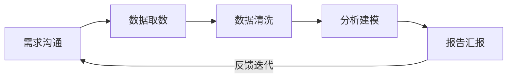
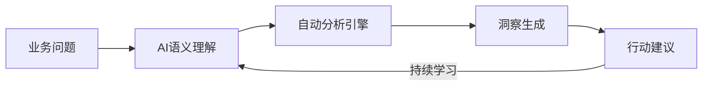
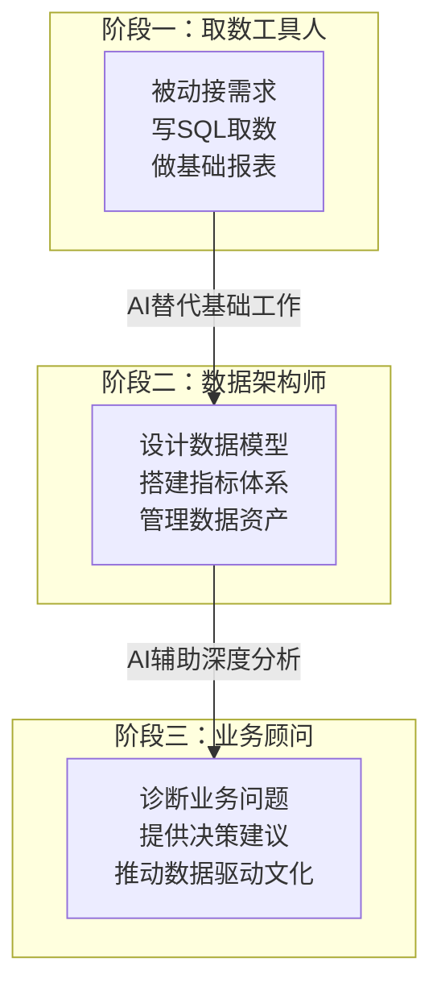
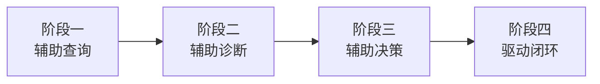

# 传统分析 vs AI分析

## 概述

本文件系统对比传统数据分析工作流与AI驱动的数据分析工作流，揭示两者在效率、深度、门槛和角色定位上的根本差异，帮助读者理解数据分析范式的变革方向。

---

## 一、传统数据分析工作流的五个环节与痛点

传统数据分析通常遵循以下五个环节，形成一条线性流水线：



### 1.1 需求沟通
- 业务方提出需求，分析师理解并转化为技术问题
- 痛点：沟通成本高，需求理解偏差常见，多次往返确认

### 1.2 数据取数
- 编写SQL从数据库提取数据，连接多张表
- 痛点：取数耗时，数据源分散，权限申请周期长

### 1.3 数据清洗
- 处理缺失值、异常值、重复数据、格式统一
- 痛点：占据分析师60%-80%的时间，重复性高

### 1.4 分析建模
- 使用Excel/SPSS/Python/R进行描述统计、交叉分析、回归分析等
- 痛点：方法选择依赖个人经验，模型验证不充分

### 1.5 报告汇报
- 制作PPT/Excel图表，撰写分析结论和建议
- 痛点：图表制作耗时，结论难以量化，跟踪执行效果差

> [!quote] 传统分析的"二八困境"
> 数据分析师80%的时间花在取数、清洗和做表上，仅有20%的时间用于真正的分析和洞察 [$TRAE_REF](https://www.asktable.com/zh-CN/articles/2026-03-04/data-analyst-transformation-guide-sql-to-ai-prompt-engineer)

---

## 二、AI分析工作流的新范式

AI分析重新定义了数据分析的流程，从"人找数据"变为"数据找人"：



### 2.1 业务问题
- 用户直接用自然语言描述业务问题
- 无需掌握SQL或技术术语

### 2.2 AI语义理解
- LLM将业务问题转化为分析任务
- 理解上下文、意图和隐含假设

### 2.3 自动分析引擎
- AI自动完成取数、清洗、建模、可视化全流程
- 可选多种分析方法并自动推荐最优方案

### 2.4 洞察生成
- 自动输出分析结论，标注关键发现
- 支持追问和钻取（Drill-down）

### 2.5 行动建议
- 基于分析结果生成可执行的业务建议
- 支持自动推送到决策者

> [!tip] 核心变化
> 分析师的角色从"执行者"转变为"审核者"和"提问者"——不再需要手动完成每个步骤，而是需要判断AI的分析是否合理、结论是否可靠。

---

## 三、两种工作流对比

| 维度 | 传统分析 | AI分析 |
|------|----------|--------|
| **效率** | 单次分析1-5天 | 单次分析分钟级 |
| **分析深度** | 受限于分析师时间和能力 | 可自动尝试多种分析方法 |
| **使用门槛** | 需要SQL/统计/BI工具技能 | 自然语言即可 |
| **可重复性** | 每次手动操作，复现成本高 | 分析流程可一键复现 |
| **可追溯性** | 依赖个人记录，容易遗漏 | 分析日志自动记录，可完整追溯 |
| **扩展性** | 单次分析，难以规模化 | 可并行分析多个业务问题 |
| **成本** | 人力成本高，周期长 | 初始投入高，边际成本低 |

> [!quote] 效率对比数据
> 根据行业实践，AI分析工具在数据准备阶段可将效率提升5-10倍，在分析建模阶段提升3-5倍，整体分析周期缩短70-80% [$TRAE_REF](https://m.sohu.com/a/1048678543_122827973/)

---

## 四、角色变化：从"取数工具人"到"业务顾问"



### 4.1 取数工具人（当前多数人的状态）
- 工作内容：写SQL、做报表、响应临时需求
- 被AI替代风险：高
- 核心竞争力：无（容易被自动化）

### 4.2 数据架构师（中期目标）
- 工作内容：设计数据模型、定义指标体系、搭建数据平台
- 被AI替代风险：中
- 核心竞争力：架构思维、业务理解、数据治理能力

### 4.3 业务顾问（长期目标）
- 工作内容：诊断业务问题、提供决策建议、推动数据文化
- 被AI替代风险：低
- 核心竞争力：业务洞察、沟通能力、战略思维

> [!warning] 转型窗口期
> 2026年是数据分析师转型的关键窗口期。基础取数和报表岗位正在快速被AI替代，预计到2027年，超过60%的基础数据分析工作将由AI完成 [$TRAE_REF](https://www.asktable.com/zh-CN/articles/2026-03-04/data-analyst-transformation-guide-sql-to-ai-prompt-engineer)

---

## 五、案例对比：招聘渠道分析

### 传统方式

```mermaid
flowchart TD
    A[业务方提出需求:<br/>"分析各招聘渠道效果"] --> B[沟通3轮明确指标:<br/>简历数、面试率、offer<br/>率、入职率]
    B --> C[写SQL从ATS<br/>系统取数]
    C --> D[Excel清洗数据:<br/>去重、匹配、分类]
    D --> E[制作透视表+图表]
    E --> F[撰写PPT报告]
    F --> G[汇报+等待反馈]
    G -->|如有新问题| C
```

**耗时：3-5个工作日**
**痛点：** 需求沟通2-3轮、数据清洗耗时、分析维度单一、报告格式固定

### AI方式

```mermaid
flowchart TD
    A[业务方提问:<br/>"哪个招聘渠道性价比最高?"] --> B[AI自动理解:<br/>性价比=成本/入职数]
    B --> C[AI自动取数+清洗<br/>+计算各渠道ROI]
    C --> D[AI输出分析报告:<br/>渠道排名+趋势+建议]
    D --> E[追问:<br/>"技术岗和非技术岗<br/>是否有差异?"]
    E --> F[AI自动钻取分析]
    F --> G[AI补充建议]
```

**耗时：10-30分钟**
**优势：** 自然语言交互、自动理解、支持追问、即时输出

> [!quote] 案例总结
> 传统方式下，分析师是"翻译者"（将业务问题翻译为技术方案）；AI方式下，分析师是"评判者"（评判AI的分析是否准确、建议是否可行）。两种角色的价值创造方式截然不同。

---

## 六、转型的四个阶段



### 阶段一：辅助查询（1-2周）
- AI帮助快速取数和查询
- 分析师负责解读结果
- 工具：ChatBI、AI SQL助手

### 阶段二：辅助诊断（2-4周）
- AI自动发现问题并给出诊断
- 分析师负责验证和补充
- 工具：AI分析平台、自动化洞察工具

### 阶段三：辅助决策（1-2个月）
- AI提供多种分析视角和决策建议
- 分析师负责综合判断和决策
- 工具：AI决策支持系统、智能BI

### 阶段四：驱动闭环（2-3个月）
- AI自动监控业务指标，主动推送洞察
- 分析师负责制定分析策略和优化AI模型
- 工具：AI Agent、自动分析流水线

> [!info] 转型路径建议
> 不必一次性完成所有阶段的转型。建议从"辅助查询"开始，逐步过渡到更高阶段。每个阶段的核心是：**让AI做AI擅长的事，让人做人擅长的事**。详见 [[06-数据分析/AI数据分析/03_认知_数据分析师转型路线图]]。

---

## 关联文档

- [[06-数据分析/AI数据分析/00_MOC_AI数据分析中枢]] - 知识库总入口
- [[06-数据分析/AI数据分析/03_认知_数据分析师转型路线图]] - 转型具体路径
- [[06-数据分析/AI数据分析/04_基础_统计学思维]] - AI时代必备的统计学思维