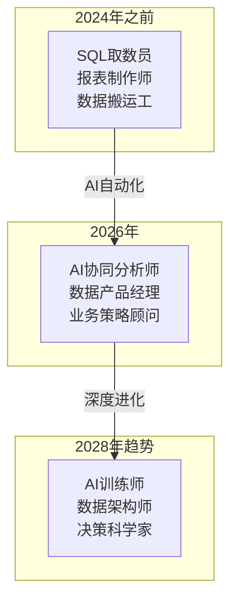
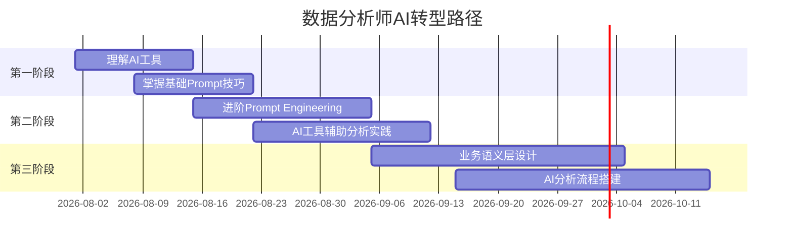
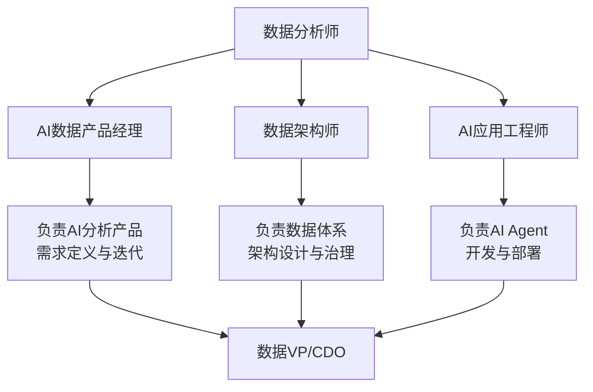
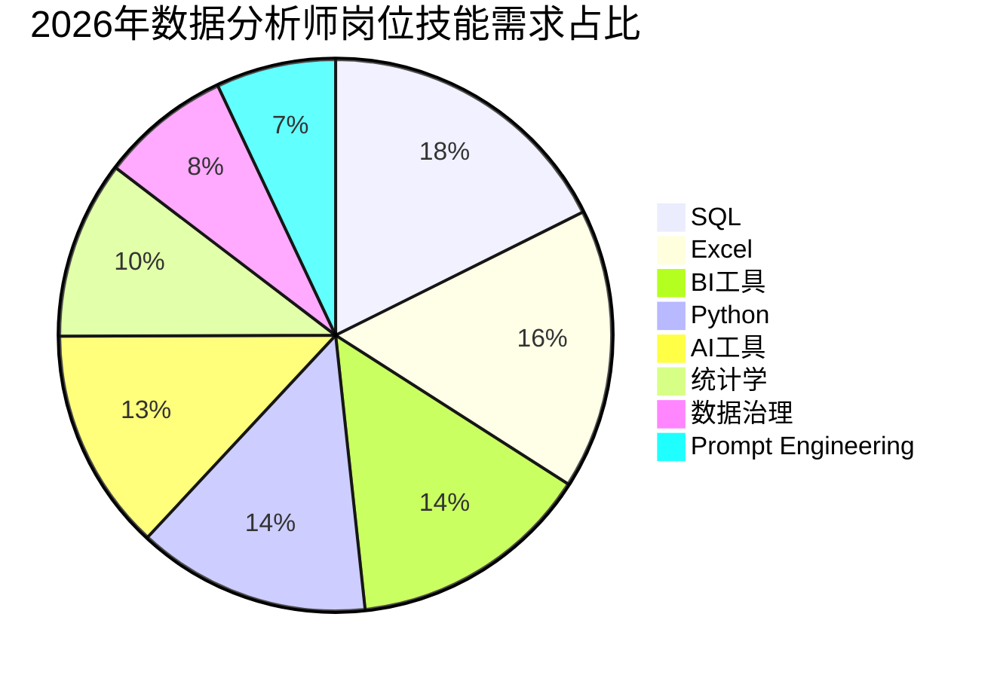

# 数据分析师转型路线图

## 概述

2026年，AI正在重塑数据分析行业。本文件提供一份从传统数据分析师向AI时代数据分析师转型的完整路线图，涵盖技能升级、角色演变和职业发展路径。

---

## 一、2026年数据分析师角色变化全景

数据分析师的角色正在经历根本性转变：

> [!quote] 转型趋势
> 数据分析师正在从"技术执行者"转变为"业务策略者"。AI不是替代分析师，而是替代那些只做"取数-做表"的重复性工作。真正能创造价值的分析师，是那些懂得如何利用AI放大自己业务洞察力的人 [$TRAE_REF](https://www.asktable.com/zh-CN/articles/2026-03-04/data-analyst-transformation-guide-sql-to-ai-prompt-engineer)

### 关键变化

| 维度 | 传统分析师 | AI时代分析师 |
|------|-----------|-------------|
| 核心技能 | SQL、Excel、BI工具 | Prompt Engineering、语义层设计、AI工具协同 |
| 工作方式 | 手动执行每个步骤 | 定义问题、审核AI输出 |
| 价值创造 | 数据产出效率 | 业务洞察质量和决策影响 |
| 工具栈 | 数据库 + BI工具 | AI平台 + 语义层 + 传统工具 |
| 与业务的关系 | 被动响应需求 | 主动诊断问题、推动决策 |

---

## 二、转型三阶段路径

### 第一阶段：理解AI工具（1-2周）

**目标：** 熟悉主流AI数据分析工具，理解AI能做什么、不能做什么

**学习内容：**
- 体验AI数据分析工具（ChatBI、AI SQL助手、Copilot for Excel等）
- 理解AI分析的基本原理（LLM + 数据分析的组合方式）
- 掌握AI工具的优缺点和适用场景

**输出：**
- 能用AI工具完成一次简单数据分析
- 能判断哪些任务适合交给AI，哪些需要人工处理

> [!tip] 第一阶段建议
> 不要试图一次性掌握所有AI工具。选择一个你最常用的分析场景，找到对应的AI工具，先跑通一个完整流程。

### 第二阶段：掌握Prompt Engineering（2-4周）

**目标：** 能够编写高质量的分析Prompt，让AI产出准确、可用的分析结果

**学习内容：**
- 分析类Prompt的黄金结构：角色设定 + 上下文 + 任务描述 + 输出格式
- 常见分析任务的Prompt模板（趋势分析、对比分析、归因分析等）
- Prompt调试与优化：如何通过迭代提升AI分析质量

**输出：**
- 建立个人Prompt模板库
- 能用Prompt完成80%的日常分析工作

> [!quote] Prompt Engineering是核心技能
> 在AI时代，Prompt Engineering是数据分析师最重要的新技能。一个好的分析Prompt，决定了AI输出的质量和可用性。这不仅仅是"提问"，而是"如何精准地定义分析任务" [$TRAE_REF](https://www.asktable.com/zh-CN/articles/2026-03-04/data-analyst-transformation-guide-sql-to-ai-prompt-engineer)

### 第三阶段：设计业务语义层（1-2个月）

**目标：** 能够搭建和维护业务语义层，让AI理解业务上下文

**学习内容：**
- 语义层的概念和作用（将数据字段映射为业务术语）
- 指标体系的定义和管理（KPI、维度、计算逻辑）
- 数据血缘和元数据管理

**输出：**
- 设计一个业务域的语义层
- 能通过语义层让AI准确理解业务问题

> [!info] 语义层是AI分析的基础
> AI分析的质量高度依赖于底层数据的语义化程度。一个设计良好的语义层，相当于给AI配备了"业务词典"，让AI能够准确理解"活跃用户"、"转化率"等业务术语的准确含义。

---

## 三、新技能清单

### 必备技能（必须掌握）

| 技能 | 说明 | 建议学习时间 |
|------|------|------------|
| **Prompt Engineering** | 编写高质量分析Prompt | 2-4周 |
| **语义层设计** | 将业务术语映射为数据模型 | 1-2个月 |
| **AI工具使用** | 熟悉主流AI分析平台 | 1-2周 |
| **AI输出审核** | 判断AI分析结果的准确性 | 持续积累 |

### 保留技能（仍需掌握）

| 技能 | 说明 | 为何重要 |
|------|------|---------|
| **SQL** | 数据查询和验证 | AI生成的SQL需要人工审核和优化 |
| **统计学** | 分析方法选择、结果解读 | AI算得快但不会判断方法是否合适 |
| **业务理解** | 将数据转化为业务洞察 | 这是AI无法替代的核心能力 |
| **数据可视化** | 设计有效的图表展示 | 指导AI生成更好的可视化 |

### 新兴技能（面向未来）

| 技能 | 说明 | 建议学习路径 |
|------|------|------------|
| **LLM微调** | 针对特定业务场景微调模型 | 了解基本原理，实践从API调用开始 |
| **AI Agent设计** | 设计自动化分析Agent | 学习LangChain/AutoGen框架 |
| **数据治理** | 数据质量、安全、合规 | 关注数据隐私法规和治理框架 |
| **AI伦理** | 分析结果的公平性和透明度 | 关注行业最佳实践 |

---

## 四、职业发展路径

### 路径一：AI数据产品经理
- **核心能力：** 产品思维 + 数据分析 + AI理解
- **工作内容：** 定义AI分析产品的功能、设计交互流程、推动产品迭代
- **适合人群：** 善于沟通、有产品sense、理解业务的分析师

### 路径二：数据架构师
- **核心能力：** 数据建模 + 架构设计 + 技术广度
- **工作内容：** 设计数据平台架构、搭建语义层、管理数据资产
- **适合人群：** 技术功底扎实、喜欢系统性思考的分析师

### 路径三：AI应用工程师
- **核心能力：** 编程 + LLM应用开发 + 数据分析
- **工作内容：** 开发AI分析Agent、搭建RAG系统、优化分析流程
- **适合人群：** 有编程基础、对AI技术感兴趣的分析师

---

## 五、2026年数据分析师技能需求数据

根据2026年行业招聘数据，数据分析师岗位的技能需求分布如下：

> [!quote] 数据来源
> 以上数据基于2026年主流招聘平台的数据分析师岗位JD分析。AI工具相关技能（AI工具使用、Prompt Engineering）的需求增速最快，同比增长超过200% [$TRAE_REF](https://m.sohu.com/a/1048678543_122827973/)

### 关键趋势解读

1. **SQL仍是基础门槛**：88%的岗位要求SQL，但要求从"能写SQL"变为"能审核和优化AI写的SQL"
2. **AI工具需求暴涨**：AI工具使用能力的需求从2024年的不足10%增长到2026年的65%
3. **"全栈"趋势明显**：同时要求传统技能（SQL/Excel）和AI技能的分析师薪酬溢价达30-50%
4. **软技能需求上升**：沟通能力、业务理解、战略思维等软技能的要求权重显著提升

---

## 六、转型建议

### 6.1 从实践中学习
- 不要等到"学完"再开始——在工作中找一个真实场景，用AI工具做一遍
- 对比AI输出和传统方式的结果，总结经验
- 逐步扩大AI工具的使用范围

### 6.2 建立个人品牌
- 在行业社区分享AI分析实践经验和心得
- 建立个人Prompt模板库，开放分享
- 参与行业讨论，积累影响力

### 6.3 持续学习
- 关注AI数据分析领域的最新进展
- 定期更新自己的工具栈和技能树
- 保持对业务的理解，这是AI无法替代的核心竞争力

> [!warning] 转型的紧迫性
> 2026年是一个分水岭。还在用传统方式做分析的分析师，将在1-2年内面临被AI替代的风险。主动拥抱AI工具、提升业务洞察力，是每个数据分析师都必须面对的选择。详见 [[06-数据分析/AI数据分析/02_认知_传统分析vsAI分析]]。

---

## 关联文档

- [[06-数据分析/AI数据分析/00_MOC_AI数据分析中枢]] - 知识库总入口
- [[06-数据分析/AI数据分析/02_认知_传统分析vsAI分析]] - 传统分析vsAI分析对比
- [[06-数据分析/AI数据分析/04_基础_统计学思维]] - AI时代必备的统计学思维