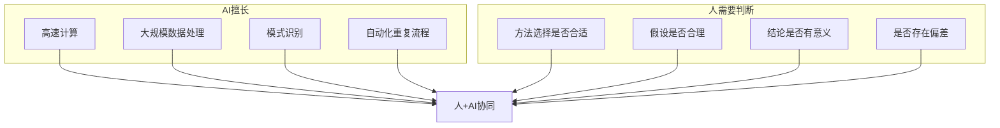
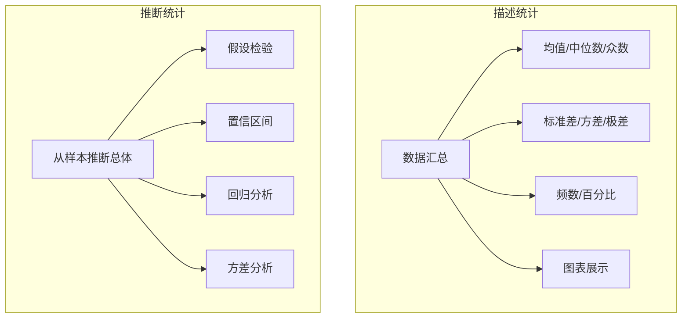
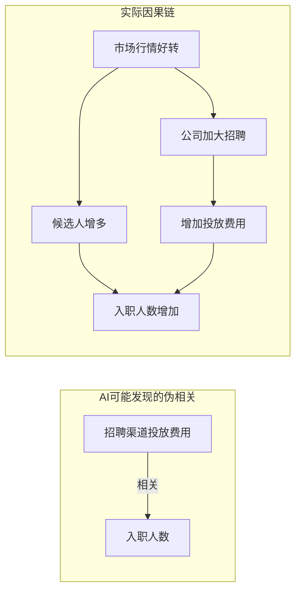
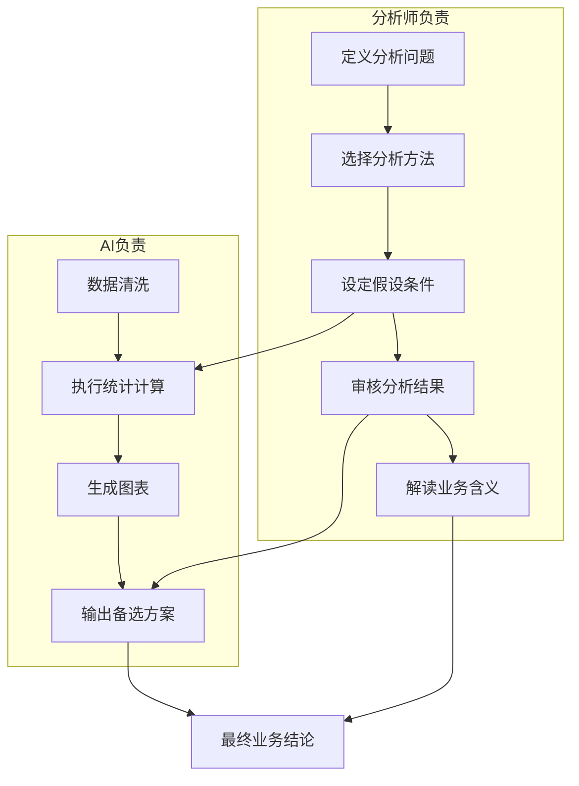

# 统计学思维

## 概述

在AI时代，统计学思维是数据分析师最保值的能力。AI可以快速执行统计计算，但无法判断"用哪种方法""结果是否合理""结论是否可靠"。本文件系统梳理AI时代必备的统计学思维要点。

---

## 一、为什么统计学思维是AI时代最保值的能力



> [!quote] 核心观点
> AI算得快，但AI不会问"为什么"。统计学思维的价值在于：**在AI给出结果之前，你能判断应该用什么方法；在AI给出结果之后，你能判断结果是否可靠。** 这是AI无法替代的核心能力 [$TRAE_REF](https://www.asktable.com/zh-CN/articles/2026-03-04/data-analyst-transformation-guide-sql-to-ai-prompt-engineer)

### AI的局限
- AI不知道"相关不等于因果"——它会自动输出相关性分析，但不会判断哪些是伪相关
- AI不知道"样本是否有偏差"——它默认数据是完美的，但实际数据往往有各种偏差
- AI不知道"这个分析方法是否适合这个问题"——它会尝试多种方法，但不会选择最合适的那一个

---

## 二、描述统计 vs 推断统计



### 描述统计：AI能做什么
- AI能快速计算所有描述统计指标
- AI能自动生成可视化图表
- **人需要判断：** 这些指标是否合理？均值是否能代表整体？是否有异常值影响？

### 推断统计：人需要判断什么
- AI能执行假设检验、计算p值、构建回归模型
- **人需要判断：**
  - 样本量是否足够？
  - 样本是否有代表性？
  - 检验方法选择是否正确？
  - 结论是否可以推广到总体？

> [!info] 一个典型场景
> AI对两组数据做了t检验，p=0.04，AI得出结论"两组有显著差异"。但作为分析师，你需要判断：
> 1. 样本量是否足够大？
> 2. 是否满足t检验的前提假设（正态分布、方差齐性）？
> 3. p=0.04在实际业务中是否有意义？
> 4. 是否存在多重比较问题？

---

## 三、相关性与因果性

这是AI最容易犯、也最危险的分析错误。

### 核心区别

| 概念 | 定义 | AI的能力 | 人的判断 |
|------|------|---------|---------|
| **相关性** | 两个变量之间存在统计关联 | AI擅长发现 | 需要判断是否有实际意义 |
| **因果性** | 一个变量导致另一个变量的变化 | AI无法判断 | 需要结合业务逻辑和实验设计 |

### 经典案例：AI的因果混淆



> [!quote] 警示
> AI可能会发现"招聘渠道投放费用与入职人数正相关"，并建议"增加投放费用"。但实际原因可能是"市场行情好转使得候选人增多，同时业务扩张导致招聘需求增加"。AI无法识别这种混淆变量，需要分析师通过业务判断和实验设计来验证因果性 [$TRAE_REF](https://m.sohu.com/a/1048678543_122827973/)

### 如何判断因果性
1. **时间顺序：** 原因先于结果
2. **相关性：** 原因和结果共同变化
3. **排除混淆变量：** 没有其他因素可以解释这种关系
4. **实验验证：** 通过A/B测试或随机对照实验验证

---

## 四、核心统计概念

### 4.1 统计显著性
- **定义：** 观察到的差异不太可能是由随机因素造成的
- **AI能做的：** 计算p值，判断是否小于0.05
- **人需要判断的：**
  - 0.05这个阈值是否适合当前场景？
  - 样本量很大时，微小差异也可能显著——但实际业务中是否有意义？
  - 样本量很小时，即使有实际意义的效果也可能不显著

### 4.2 置信区间
- **定义：** 总体参数可能落在的范围
- **AI能做的：** 计算置信区间
- **人需要判断的：** 置信区间的宽度是否可接受？是否需要增加样本量？

### 4.3 p值
- **常见误解：** p=0.01意味着"结论错误的概率是1%"
- **正确理解：** p=0.01意味着"如果原假设为真，观察到当前结果（或更极端结果）的概率是1%"
- **AI的局限：** AI不会自动考虑p值的多重比较问题（做20次检验，期望会有1次p<0.05）

### 4.4 抽样偏差
- **定义：** 样本不能代表总体
- **AI的局限：** AI默认数据是随机抽样的，但实际数据往往有系统偏差
- **人需要判断的：** 数据来源是否有偏差？样本是否代表目标总体？

> [!warning] 常见统计陷阱
> 详见第五节"招聘运营场景中的统计陷阱"。

---

## 五、招聘运营场景中的统计陷阱

### 5.1 小样本偏差

```mermaid
flowchart LR
    A[某渠道仅投递5份简历<br/>入职3人<br/>入职率60%] --> B[AI得出结论:<br/>"该渠道入职率最高"]
    B --> C[实际:样本量太小<br/>60%的入职率不可靠<br/>需扩大样本]
```

**案例：** 某新招聘渠道只来了5份简历，入职3人，入职率60%。AI可能认为这是"最高效的渠道"。但实际是因为样本量太小，只要多来几份简历，这个比例可能大幅下降。

**解决方法：** 对AI的分析结果，先问"样本量是多少？"样本量小于30的统计推断需要谨慎对待。

### 5.2 幸存者偏差

**案例：** 分析"高绩效员工背景"时，只分析了当前在职员工，忽略了已经离职的员工。AI可能发现"高绩效员工都来自某类学校"，但实际可能是因为那类学校的员工留存率更高，而非绩效更高。

**解决方法：** 明确数据范围，确保分析包含了所有相关群体（包括"失败者"）。

### 5.3 选择偏差

**案例：** 分析"哪个招聘渠道的候选人质量最高"时，不同渠道的简历筛选标准不同导致偏差。猎头推荐的简历可能已经经过初筛，而招聘网站的直接投递则没有筛选。

**解决方法：** 在分析前明确数据生成过程，了解不同渠道的筛选机制差异。

> [!info] 为什么AI容易忽略这些偏差？
> AI的统计能力体现在"给定数据，执行计算"，但AI没有"数据生成过程"的意识。它不会自动问"这些数据是怎么来的？""数据是否完整？""是否有选择偏差？"这些问题是数据质量的基本判断，属于统计学思维的核心范畴。

---

## 六、AI辅助统计：人机协作的最佳实践



### 6.1 AI擅长的统计工作
- 数据清洗和预处理
- 描述统计计算
- 假设检验执行
- 回归模型拟合
- 可视化图表生成
- 多方案并行分析

### 6.2 人需要负责的统计判断
- 分析问题定义是否清晰？
- 分析方法选择是否合适？
- 数据假设是否满足？
- 结果是否可靠？
- 结论是否有业务意义？

### 6.3 用AI验证统计假设的方法

> [!tip] 实践建议
> 1. **让AI做敏感性分析：** 要求AI用不同的方法或参数多次分析，对比结果是否一致
> 2. **让AI检查假设条件：** 要求AI检验数据是否满足正态分布、方差齐性等假设
> 3. **让AI做交叉验证：** 要求AI将数据分成训练集和测试集，验证结果的稳定性
> 4. **让AI暴露局限性：** 明确要求AI指出分析结果的局限性和潜在偏差
> 5. **人工复核：** 对AI的关键结论，手动验证或通过替代方法验证

---

## 七、实践建议

1. **把AI当作"计算器"，不是"思考者"**：AI擅长计算，但思考和分析的责任始终在人
2. **先问"为什么"，再问"是什么"**：在让AI执行分析之前，先想清楚分析的目标和方法
3. **永远怀疑数据质量**：AI不会质疑数据，但你必须质疑
4. **相关性是起点，因果性是终点**：AI帮你发现相关性，你来判断因果性
5. **持续学习统计方法**：AI时代的统计学不是不重要了，而是更重要了——因为你需要判断AI用对了没有

> [!quote] 总结
> 统计学思维是AI时代数据分析师最保值的能力。AI可以替代技术，但不能替代判断。学会与AI协作，让AI做计算，让自己做判断，是每个数据分析师的必修课。详见 [[06-数据分析/AI数据分析/02_认知_传统分析vsAI分析]] 和 [[06-数据分析/AI数据分析/03_认知_数据分析师转型路线图]]。

---

## 关联文档

- [[06-数据分析/AI数据分析/00_MOC_AI数据分析中枢]] - 知识库总入口
- [[06-数据分析/AI数据分析/02_认知_传统分析vsAI分析]] - 传统分析vsAI分析对比
- [[06-数据分析/AI数据分析/03_认知_数据分析师转型路线图]] - 转型具体路径