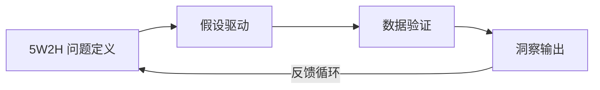
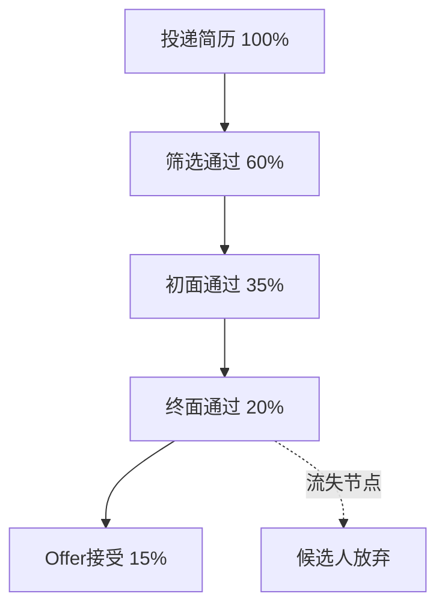
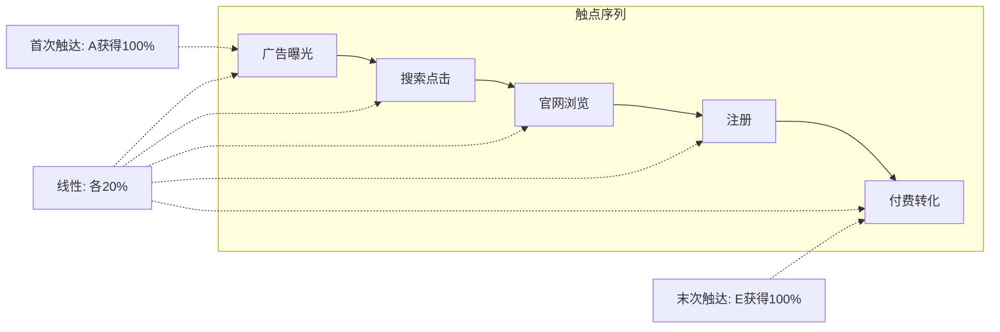
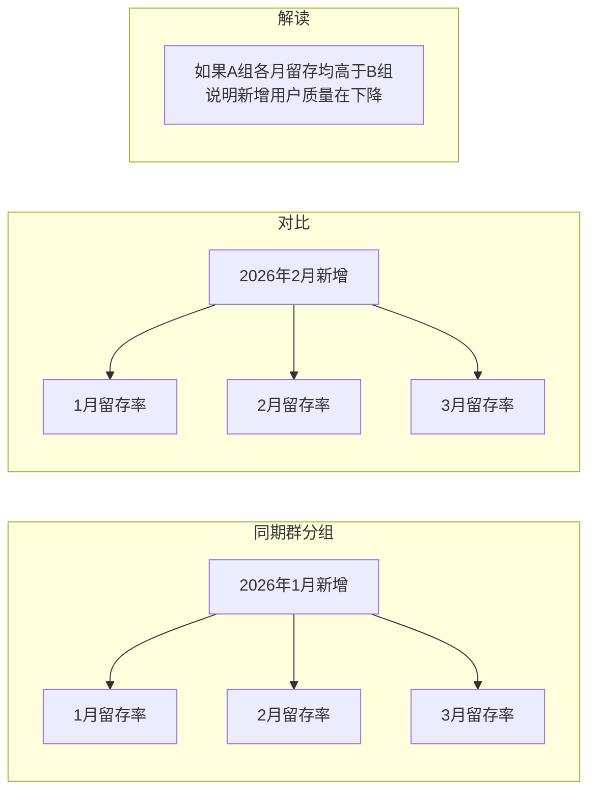
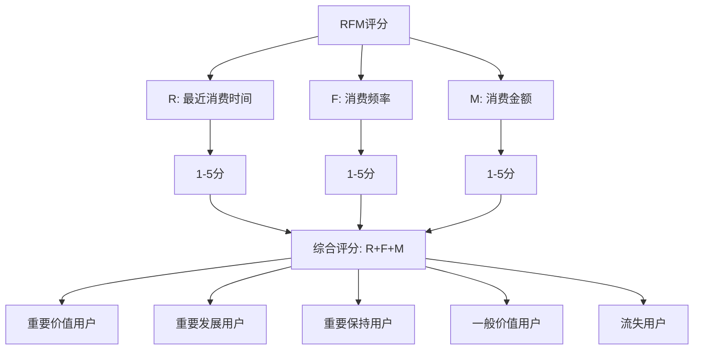
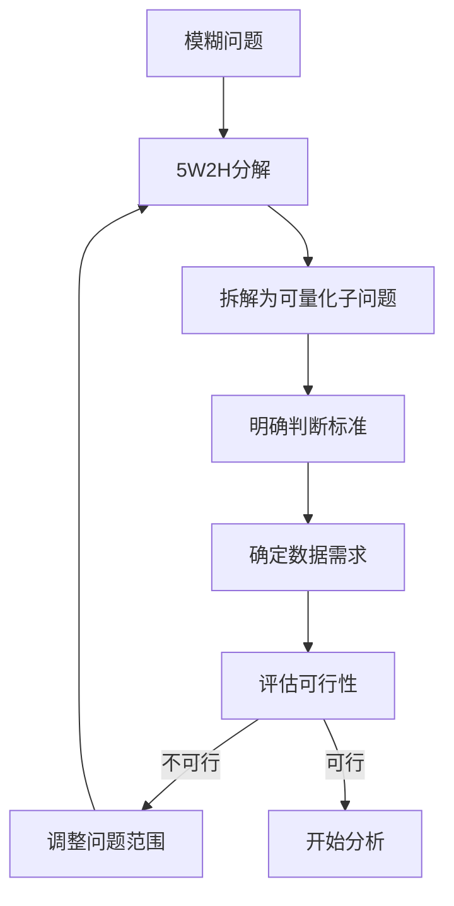
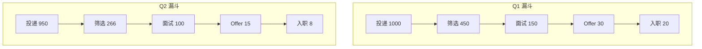

# 分析方法论

> 掌握分析方法论是数据分析的"内功"。没有方法论的支撑，再强的AI工具也只能产出漂亮的数字，而非有价值的洞察。

[[06-数据分析/AI数据分析/00_MOC_AI数据分析中枢]] | [[06-数据分析/AI数据分析/06_基础_指标体系建设]] | [[06-数据分析/AI数据分析/07_工具_全景图与选型指南]]

---

## 一、通用分析框架

一个完整的分析流程可以概括为以下四个阶段：

### 1.1 5W2H 问题定义

5W2H是将模糊的业务问题转化为可分析问题的结构化框架：

| 维度 | 英文 | 分析中的含义 |
|------|------|-------------|
| What | 是什么 | 现象/问题的具体描述 |
| Why | 为什么 | 问题发生的根因假设 |
| Who | 谁 | 涉及的用户/群体/角色 |
| When | 何时 | 时间维度上的分布模式 |
| Where | 哪里 | 空间/渠道/触点的分布 |
| How | 如何 | 行为路径/转化过程 |
| How Much | 多少 | 量级/程度/影响范围 |

> [!tip] 问题定义的关键
> 大多数分析失败的根本原因，不是分析方法不对，而是"问题本身没有定义清楚"。在投入分析之前，先花时间把模糊的业务问题转化为可量化、可验证的分析问题。

### 1.2 假设驱动

基于业务理解提出可验证的假设：

- 假设必须可证伪：能够通过数据支持或推翻
- 假设需要优先级：按影响范围和发生概率排序
- 假设需要业务判断：AI可以生成候选假设，但业务专家需要筛选

### 1.3 数据验证

选择合适的分析方法对假设进行验证。这是下一节的核心内容。

### 1.4 洞察输出

分析结果输出规范：

> [!quote] 分析结果四要素
> **结论** + **证据** + **不确定度** + **建议**

- **结论**：分析的核心发现，一句话说清楚
- **证据**：支撑结论的数据、图表、统计指标
- **不确定度**：数据的置信区间、局限性、可能偏差
- **建议**：基于发现的可执行行动方案

---

## 二、常见分析方法详解

### 2.1 漏斗分析

**定义**：漏斗分析用于追踪用户在完成某个目标过程中，在每个步骤的转化和流失情况。

**适用场景**：用户转化路径分析，如招聘流程中的"投递简历→筛选通过→面试→Offer→入职"。

**关键分析维度**：

- 整体转化率：从起点到终点的总转化率
- 步骤流失率：每一步的流失比例
- 步骤耗时：用户在每个步骤停留的时间
- 分群对比：不同渠道/不同岗位的漏斗对比

> [!example] 招聘渠道转化诊断
> 假设某公司通过三个渠道（Boss直聘、猎聘、内推）招聘，整体入职率仅为5%。通过漏斗分析发现：
> - 内推渠道的"简历→面试"转化率最高（40%），但投递量较少
> - Boss直聘的投递量最大，但"简历→筛选通过"阶段流失严重（仅20%）
> - 进一步分析发现，Boss直聘的简历匹配度较低，建议调整职位描述关键词
> 
> 结论：当前瓶颈在简历筛选阶段，建议优先优化Boss直聘的职位描述和筛选标准。

### 2.2 归因分析

**定义**：归因分析用于确定不同触点对最终转化结果的贡献权重。

**常见归因模型**：

| 模型 | 原理 | 适用场景 |
|------|------|---------|
| 首次触达归因 | 100%的功劳归第一个触点 | 品牌认知类分析 |
| 末次触达归因 | 100%的功劳归最后一个触点 | 转化效率分析 |
| 线性归因 | 每个触点均分功劳 | 均匀接触的消费路径 |
| 时间衰减归因 | 越接近转化的触点权重越高 | 长决策周期场景 |
| 位置归因（U型） | 首次和末次各40%，中间20% | 综合考虑拉新和转化 |
| 数据驱动归因 | 基于机器学习计算贡献权重 | 有充足转化数据时 |

> [!warning] 归因分析的局限
> 归因模型本质上是"规则的假设"，不同的归因模型会得出截然不同的结论。AI工具可以自动计算归因权重，但选择哪种模型需要结合业务实际的决策路径来判定。

### 2.3 同期群分析（Cohort Analysis）

**定义**：将用户按照首次行为发生的时间分组，追踪各组在后续周期内的行为表现。

**核心价值**：区分"新增用户的质量"和"产品/运营策略的效果"。

**典型应用**：

- 用户留存跟踪：每个月新增用户的次月、次次月留存
- 付费转化周期：不同月份注册用户的首次付费时间分布
- 产品迭代效果：改版前后新增用户的活跃度对比

### 2.4 RFM分析

**定义**：基于最近消费时间（Recency）、消费频率（Frequency）、消费金额（Monetary）三个维度对用户进行价值分层。

**分层策略**：

| 用户类型 | R | F | M | 运营策略 |
|---------|---|---|---|---------|
| 重要价值用户 | 高 | 高 | 高 | VIP维护，重点保留 |
| 重要发展用户 | 高 | 低 | 高 | 提升频率，交叉销售 |
| 重要保持用户 | 低 | 高 | 高 | 激活召回，防止流失 |
| 流失用户 | 低 | 低 | 低 | 低成本唤醒或放弃 |

### 2.5 趋势分析

**定义**：指标的时序变化分析，关注长期趋势、周期性波动和异常突变。

**三看原则**：

1. **看趋势**：长期是上升还是下降
2. **看周期**：是否存在日/周/月/季节性规律
3. **看突变**：是否有异常点，触发原因是什么

### 2.6 对比分析

**核心逻辑**：单一数据没有意义，对比才能产生洞察。

**对比维度**：

- 时间对比：同比、环比、定基比
- 空间对比：不同地区/渠道/门店对比
- 群体对比：实验组 vs 对照组
- 目标对比：实际值 vs 目标值

### 2.7 结构分析

**定义**：分析整体中各组成部分的占比和变化。

**常用方法**：

- 帕累托分析（二八定律）：找到贡献80%结果的关键20%因素
- 杜邦分解：将复合指标拆解为多个驱动因素
- 贡献度分析：计算各因素对整体变化的贡献率

---

## 三、AI在分析方法论选择中的辅助作用

> AI可以快速推荐分析方法，但最终的选择需要人的业务判断。

**AI能做什么**：

1. 基于问题描述自动推荐最合适的分析方法
2. 生成分析模板和分析代码
3. 自动执行数据预处理和初步分析
4. 生成分析报告初稿

**AI不能做什么**：

1. 判断业务场景的特殊性：两个看起来相似的"漏斗分析"，其业务含义可能完全不同
2. 理解隐性约束：数据不可用、口径不一致、政策限制等
3. 承接"不确定度"：AI的自信度不等于分析结果的置信度

> [!important] 人机协同原则
> **AI推荐 + 人判断 + 人对结果负责**。AI是能力放大器，不是决策替代者。[$TRAE_REF](https://cloud.tencent.com.cn/developer/article/2695219)

---

## 四、分析前的"问题定义"步骤

将模糊问题转化为可分析的问题，是分析流程中最关键也最容易被忽视的步骤。

**转化流程**：

**示例**：

| 模糊问题 | 转化后的可分析问题 |
|---------|------------------|
| 最近招聘效果不好 | 2026年Q2各渠道的简历投递量、面试转化率、Offer接受率同比变化如何？ |
| 用户流失严重 | 2026年1-6月各月新增用户的30天留存率趋势如何？哪个节点流失最多？ |
| 广告投放效果差 | 不同渠道的获客成本（CPA）和7日留存率如何？哪个渠道的ROI最高？ |

---

## 五、分析结果输出规范

分析结果的输出应该遵循"结论先行"原则，让决策者能在最短时间内抓住核心信息。

**标准结构**：

> [!abstract] 分析报告模板
> 1. **一句话结论**：本次分析的核心发现
> 2. **关键证据**：支撑结论的2-3个核心数据
> 3. **分析过程**：方法、数据范围、时间窗口
> 4. **不确定度声明**：数据局限性、假设条件、置信区间
> 5. **行动建议**：基于发现的可执行方案

**示例**：

> **结论**：2026年Q2技术岗招聘效率同比下降30%，主要原因是初筛通过率从45%下降到28%。
>
> **证据**：技术岗简历投递量同比仅下降5%（正常波动），但初筛通过率从45%降至28%，导致面试人数减少40%。
>
> **不确定度**：本次分析未区分不同技术岗位（前端/后端/算法），不同岗位的通过率可能存在差异。
>
> **建议**：建议复盘Q2的简历筛选标准是否收窄，或与招聘团队确认JD描述是否准确反映了岗位需求。

---

## 六、实战示例：用漏斗分析诊断招聘渠道转化问题

### 背景

某公司通过Boss直聘、猎聘、LinkedIn三个渠道招聘技术岗位，月均入职人数从20人下降到8人。

### 分析流程

**步骤1：问题定义**

- **What**：月均入职人数下降60%
- **When**：2026年Q2对比Q1
- **Where**：技术岗位，三个招聘渠道
- **How Much**：从20人/月到8人/月

**步骤2：假设生成**

- 假设A：简历投递量下降
- 假设B：筛选通过率下降
- 假设C：面试通过率下降
- 假设D：Offer接受率下降

**步骤3：漏斗分析**

**步骤4：数据验证**

| 指标 | Q1 | Q2 | 变化 |
|------|----|----|------|
| 简历投递量 | 1000 | 950 | -5% |
| 筛选通过率 | 45% | 28% | -17pp |
| 面试通过率 | 33% | 38% | +5pp |
| Offer接受率 | 67% | 53% | -14pp |
| 入职人数 | 20 | 8 | -60% |

**步骤5：结论**

> **结论**：入职人数下降的主要原因是**筛选通过率大幅下降**（从45%降至28%），其次是Offer接受率下降（从67%降至53%）。简历投递量基本稳定，排除"流量不足"的假设。
>
> **建议**：
> 1. 复盘Q2的简历筛选标准是否不合理收窄
> 2. 与用人部门确认筛选标准是否与岗位需求匹配
> 3. 针对Offer接受率下降，建议调研竞对的薪资水平

---

## 相关文档

- [[06-数据分析/AI数据分析/06_基础_指标体系建设]] - 指标体系是分析方法的基础
- [[06-数据分析/AI数据分析/07_工具_全景图与选型指南]] - 了解如何用AI工具加速分析
- [[06-数据分析/AI数据分析/17_实战_招聘运营数据分析]] - 招聘运营分析的完整实战
- [[06-数据分析/AI数据分析/00_MOC_AI数据分析中枢]] - 返回知识库中心