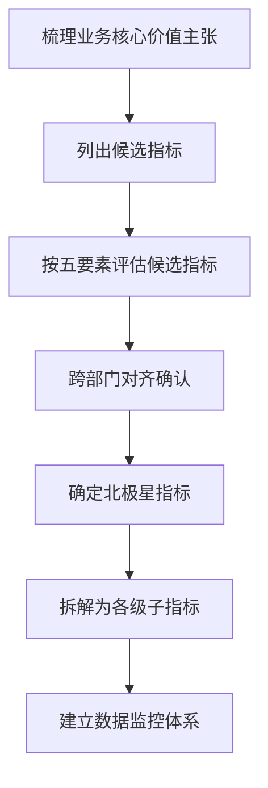
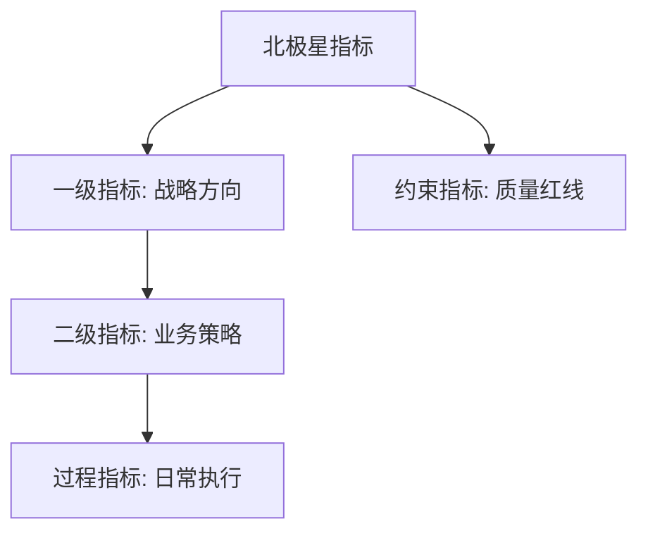
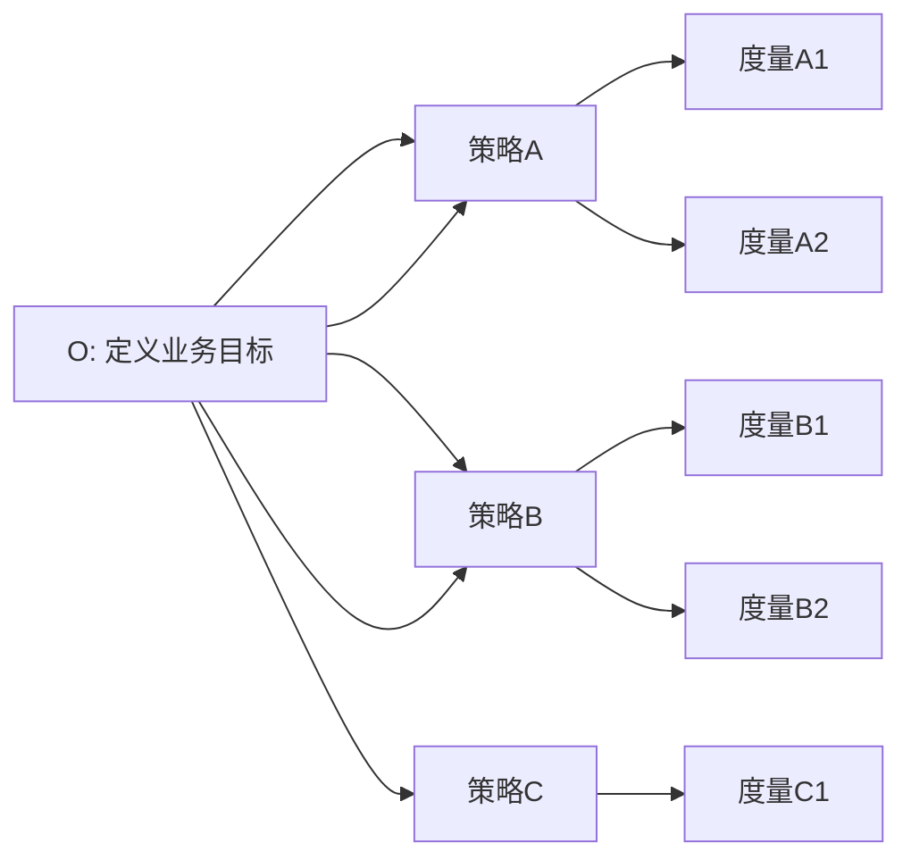
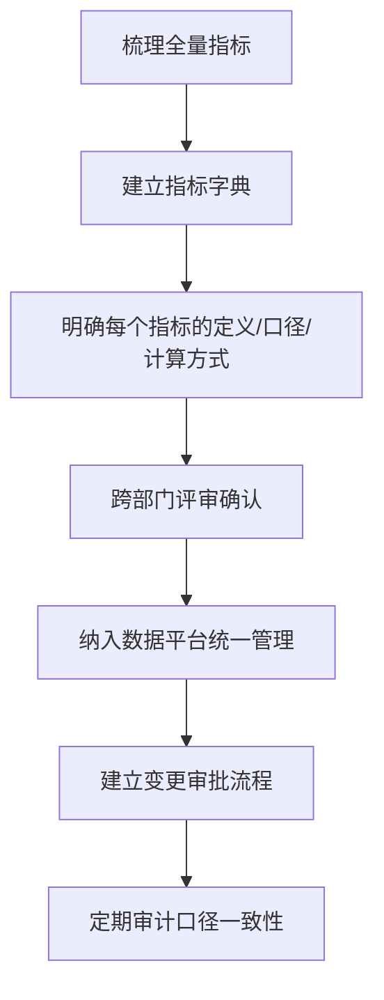
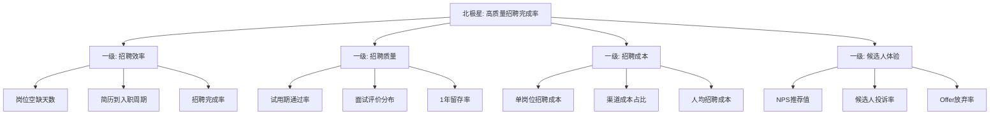

# 指标体系建设

> 指标体系是数据分析的"骨架"。没有好的指标体系，再厉害的分析方法也无从施展。

[[06-数据分析/AI数据分析/00_MOC_AI数据分析中枢]] | [[06-数据分析/AI数据分析/05_基础_分析方法论]] | [[06-数据分析/AI数据分析/07_工具_全景图与选型指南]]

---

## 一、北极星指标

### 1.1 什么是北极星指标

北极星指标（North Star Metric）是公司或产品最核心的"唯一"指标，它指引着整个组织朝着同一个方向努力。

### 1.2 好的北极星指标的特征

> [!quote] 北极星指标五要素
> 1. **反映用户价值**：指标上升代表用户获得了更多价值
> 2. **可拆解**：能够被分解为各级子指标
> 3. **可量化**：有明确的数据定义和计算口径
> 4. **可影响**：团队可以通过行动改变它
> 5. **长期导向**：关注长期价值而非短期收益

**好与不好的北极星指标对比**：

| 不好的北极星指标 | 问题 | 好的替代方案 |
|----------------|------|------------|
| 营收 | 短期压榨可能损害长期价值 | 活跃用户数/用户生命周期价值 |
| 页面浏览量 | 可能鼓励点击诱导而非优质内容 | 有效阅读时长/互动完成率 |
| 下载量 | 只关注获取，不关注留存 | 次日留存率/周活跃用户数 |

### 1.3 北极星指标的确定流程

---

## 二、指标分层体系

### 2.1 分层结构

指标应该按照"战略-战术-执行"进行分层管理：

**各层级说明**：

| 层级 | 描述 | 关注对象 | 更新频率 |
|------|------|---------|---------|
| 北极星指标 | 公司级核心目标，反映用户价值 | CEO/高管层 | 月度/季度 |
| 一级指标 | 北极星在业务维度的拆解 | 业务负责人 | 周度/月度 |
| 二级指标 | 一级指标在具体策略上的拆解 | 团队负责人 | 日度/周度 |
| 过程指标 | 日常运营的监控指标 | 执行人员 | 实时/日度 |
| 约束指标 | 必须守住的底线（如质量/合规） | 全员 | 视情况而定 |

### 2.2 分层原则

1. **上层指标驱动下层指标**：北极星指标的变化，一定可以通过一级指标的分解来定位原因
2. **下层指标支撑上层指标**：所有过程指标都应该能够追溯到对上层指标的贡献
3. **层级之间不能跳跃**：分析问题时要逐层下钻，不能从北极星直接跳到过程指标

---

## 三、OSM模型

### 3.1 OSM模型定义

OSM模型（Object-Strategy-Measure）是一个目标驱动的指标体系搭建方法：

| 要素 | 英文 | 含义 |
|------|------|------|
| O | Object | 业务的最终目标是什么 |
| S | Strategy | 为了达成目标，采取什么策略 |
| M | Measure | 如何衡量策略是否有效 |

### 3.2 OSM模型的应用流程

### 3.3 OSM模型示例

> [!example] 招聘运营的OSM拆解
> **O（目标）**：提升高质量招聘完成率
>
> **S1（策略1）**：拓宽优质候选人来源渠道
> - M1：各渠道简历投递量
> - M2：各渠道简历通过率
> - M3：各渠道获客成本
>
> **S2（策略2）**：提升面试效率和质量
> - M1：简历到面试转化率
> - M2：面试到Offer转化率
> - M3：平均面试轮次
>
> **S3（策略3）**：优化Offer到入职的转化
> - M1：Offer接受率
> - M2：Offer到入职平均天数
> - M3：竞对Offer对比分析

---

## 四、指标口径治理

### 4.1 口径治理的核心原则

> [!important] 口径治理"唯一性"原则
> **同一指标只能有一个权威定义**。如果确实需要不同版本，必须明确标注适用场景，且不能混用。

### 4.2 常见口径问题

| 问题类型 | 示例 | 影响 |
|---------|------|------|
| 同名不同口径 | 两个部门对"活跃用户"的定义不同 | 数据对不上，决策偏差 |
| 口径漂移 | 随着业务变化，口径悄然改变 | 同比/环比分析失真 |
| 计算时点不一致 | 一个用自然月，一个用财务月 | 汇总数据打架 |
| 分母不统一 | 转化率的分母是"曝光"还是"点击" | 指标不可比 |

### 4.3 口径治理方案

**指标字典应包含的字段**：

- 指标名称
- 指标定义
- 计算公式
- 数据来源
- 更新频率
- 口径说明
- 适用场景
- 负责团队

---

## 五、招聘运营指标体系示例

### 5.1 指标全景

以"高质量招聘完成率"为北极星指标，构建招聘运营的指标体系：

### 5.2 指标体系详解

| 层级 | 指标名称 | 定义 | 数据来源 |
|------|---------|------|---------|
| 北极星 | 高质量招聘完成率 | 入职满6个月且绩效合格的员工数 / 计划招聘人数 | HR系统 + 绩效系统 |
| 一级-效率 | 招聘完成率 | 实际入职人数 / 计划招聘人数 | 招聘系统 |
| 一级-效率 | 平均岗位空缺天数 | 从岗位审批到入职的平均天数 | 招聘系统 |
| 一级-质量 | 试用期通过率 | 试用期通过人数 / 入职人数 | 绩效系统 |
| 一级-质量 | 6个月留存率 | 入职满6个月在职人数 / 入职人数 | HR系统 |
| 一级-成本 | 单岗位招聘成本 | 总招聘费用 / 入职人数 | 财务系统 |
| 一级-体验 | 候选人NPS | 候选人愿意推荐的概率评分 | 调研系统 |

### 5.3 约束指标

在关注增长指标的同时，必须设置约束指标来防止"为了指标而做指标"：

> [!warning] 招聘运营的约束指标
> - 最低简历质量评分（防止为了完成简历量而降低筛选标准）
> - 合规流程完成率（防止为了效率而跳过必要环节）
> - 薪酬公平性指标（防止为了控制成本而压低薪资）

---

## 六、指标常见问题

### 6.1 虚荣指标

**定义**：看起来好看但无法指导决策的指标。

**常见虚荣指标**：

| 虚荣指标 | 看似意义 | 实际局限 |
|---------|---------|---------|
| 累计注册用户数 | 用户规模大 | 包含大量僵尸用户，无法反映真实活跃 |
| 页面浏览量 | 内容受欢迎 | 无法区分是有效浏览还是误触 |
| 下载量 | 产品受欢迎 | 下载不等于使用，次日留存更具参考价值 |

**如何避免**：关注"行为指标"而非"数字指标"，关注"比率"而非"总量"。

### 6.2 复合指标口径漂移

**问题**：复合指标（如"用户价值分"）由多个子指标加权计算，当子指标口径或权重变化时，历史数据失去可比性。

**解决方案**：

1. 每次口径变更时，建立新旧口径的对照表
2. 保留历史计算逻辑，支持按旧口径回溯
3. 在报告中明确标注口径变更时间和影响

### 6.3 指标打架

**问题**：不同部门使用同一指标名称，但计算结果不同。

**典型场景**：

- 运营部门的"活跃用户" = 7天内登录1次
- 产品部门的"活跃用户" = 30天内登录3次且完成核心操作
- 两个部门汇报时都称"活跃用户"，但数据差异巨大

**解决方案**：

> [!tip] 指标打架的解决策略
> 1. 建立企业级指标字典，统一命名和定义
> 2. 如果确实需要不同口径，使用不同的名称（如"周活跃用户" vs "月活跃用户"）
> 3. 在报表和看板中，每个指标都附带口径说明
> 4. 建立跨部门的数据治理委员会，仲裁口径争议

---

## 七、AI辅助指标体系

### 7.1 AI能做什么

AI在指标体系建设中主要发挥以下辅助作用：

1. **发现指标关联**：通过相关性分析和因果关系挖掘，发现指标之间的关联关系
2. **识别异常指标**：自动监控指标变化，标记异常波动
3. **推荐指标拆解**：基于北极星指标，通过行业知识推荐拆解方向
4. **自动生成指标字典**：从数据字典和业务文档中提取指标定义

### 7.2 AI不能做什么

> [!important] AI辅助指标体系的边界
> 1. **AI无法定义业务目标**：北极星指标的本质是"业务选择"，需要管理层基于战略判断决定
> 2. **AI无法替代口径确认**：口径是有业务含义的，需要业务团队确认
> 3. **AI无法判断指标好坏**：一个指标是否是"好指标"，取决于它是否能指导业务决策
> 4. **AI无法仲裁指标争议**：不同部门对指标口径的分歧，需要人协调

### 7.3 人机协同建议

> **AI推荐 + 人确认 + 人治理**。AI可以快速生成指标体系的初稿，但每一层级的指标定义、口径、权重都需要业务团队确认。

---

## 八、参考来源

- 腾讯云AI分析框架中的指标治理部分 [$TRAE_REF](https://cloud.tencent.com.cn/developer/article/2695219)
- [[06-数据分析/AI数据分析/05_基础_分析方法论]] - 分析方法论是指标体系的应用基础
- [[06-数据分析/AI数据分析/07_工具_全景图与选型指南]] - 了解如何用工具支撑指标体系
- [[06-数据分析/AI数据分析/17_实战_招聘运营数据分析]] - 招聘运营案例中的指标体系应用

---

## 相关文档

- [[06-数据分析/AI数据分析/05_基础_分析方法论]] - 分析方法与指标体系的关系
- [[06-数据分析/AI数据分析/07_工具_全景图与选型指南]] - 指标体系的技术支撑
- [[06-数据分析/AI数据分析/17_实战_招聘运营数据分析]] - 指标体系在招聘运营中的应用
- [[06-数据分析/AI数据分析/00_MOC_AI数据分析中枢]] - 返回知识库中心