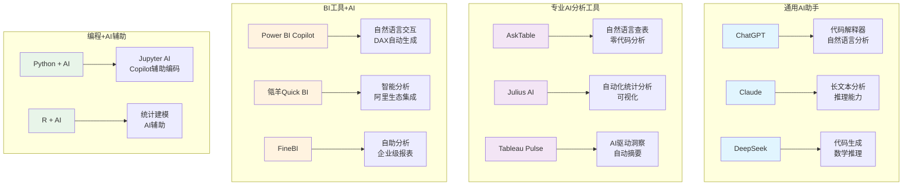
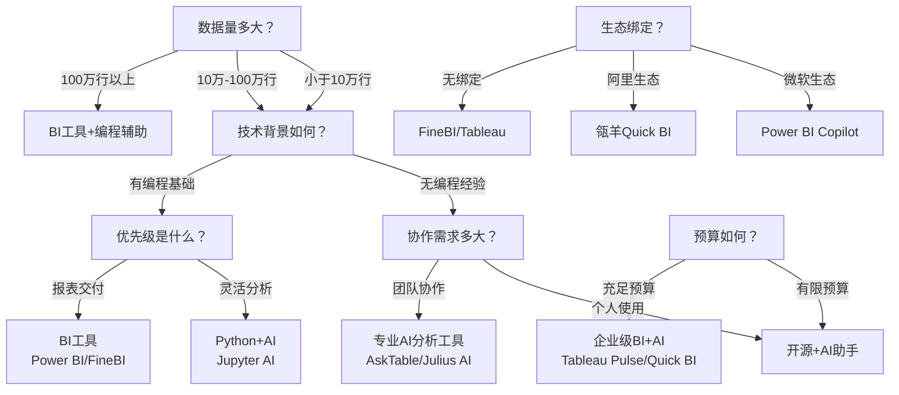
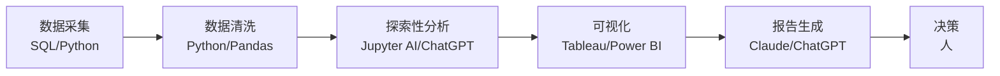

# 工具全景图与选型指南

> 工具是数据分析的"兵器"。选择合适的工具比掌握所有工具更重要。2026年的AI数据分析工具生态已经高度分化，理解每个工具的定位和能力边界，是高效分析的起点。

[[06-数据分析/AI数据分析/00_MOC_AI数据分析中枢]] | [[06-数据分析/AI数据分析/05_基础_分析方法论]] | [[06-数据分析/AI数据分析/06_基础_指标体系建设]]

---

## 一、2026年AI数据分析工具分类图谱

### 1.1 通用AI助手

| 工具 | 核心能力 | 适合人群 | 局限 |
|------|---------|---------|------|
| ChatGPT | 代码解释器、自然语言分析、图表生成 | 非技术用户快速探索 | 数据隐私、大文件处理受限 |
| Claude | 长文本分析、复杂推理、报告生成 | 需要深度分析报告的场景 | 代码执行能力弱于ChatGPT |
| DeepSeek | 代码生成、数学推理、开源可部署 | 需要本地化部署的团队 | 可视化能力相对较弱 |

### 1.2 专业AI分析工具

| 工具 | 核心能力 | 适合人群 | 特点 |
|------|---------|---------|------|
| AskTable | 自然语言查表、零代码数据分析 | 业务人员/非技术用户 | 类对话式交互，学习成本低 |
| Julius AI | 自动化统计分析、智能可视化 | 数据分析师 | 支持多种统计检验，自动选择图表 |
| Tableau Pulse | AI驱动洞察、自动摘要推送 | 企业级用户 | 集成Tableau生态，被动式洞察推送 |

### 1.3 BI工具+AI

| 工具 | 核心能力 | 适合人群 | 生态 |
|------|---------|---------|------|
| Power BI Copilot | 自然语言交互、DAX自动生成 | 微软生态用户 | 深度集成Office 365 |
| 瓴羊Quick BI | 智能分析、阿里生态集成 | 国内企业用户 | 阿里云生态，数据中台 |
| FineBI | 自助分析、企业级报表 | 大中型企业 | 帆软生态，强报表能力 |

### 1.4 编程+AI辅助

| 工具 | 核心能力 | 适合人群 | 特点 |
|------|---------|---------|------|
| Python + AI | Jupyter AI、Copilot编码 | 数据科学家/工程师 | 灵活度最高，可定制性最强 |
| R + AI | 统计建模、AI辅助分析 | 统计分析师 | 学术统计场景更优 |

---

## 二、选型决策树

> [!tip] 选型核心原则
> 不要追求"最强AI"，要追求"最适合你的场景"。工具选型应该是一个结构化决策过程，而不是跟风选择。

### 决策路径说明

**路径A：个人分析师 - 非技术背景**

推荐：ChatGPT/Claude 或 AskTable

- 数据量小，无需复杂建模
- 主要做探索性分析和简单可视化
- 不需要团队协作分析

**路径B：业务团队 - 需要协作分析**

推荐：AskTable / Julius AI / Tableau Pulse

- 业务人员自助分析
- 需要团队共享分析看板
- 需要自然语言交互降低门槛

**路径C：数据团队 - 技术背景**

推荐：Python + AI (Jupyter AI / Copilot)

- 需要高度定制化分析
- 需要处理大规模数据
- 需要将分析能力集成到产品中

**路径D：企业级 - 大规模部署**

推荐：Power BI Copilot / 瓴羊Quick BI / FineBI

- 需要企业级权限管理
- 需要与现有系统深度集成
- 需要标准化报表和治理体系

---

## 三、各工具能力对比表

> [!abstract] 工具能力矩阵
> 以下对比基于2026年各工具的主流版本功能，具体能力可能因版本和配置而异。

| 工具 | 自然语言查询 | 自动洞察 | 报告生成 | 协作共享 | 数据源接入 | 学习成本 |
|------|:----------:|:--------:|:--------:|:--------:|:----------:|:--------:|
| ChatGPT | 强 | 中 | 强 | 弱 | 中 | 低 |
| Claude | 强 | 强 | 强 | 弱 | 弱 | 低 |
| DeepSeek | 中 | 中 | 中 | 弱 | 弱 | 低 |
| AskTable | 强 | 中 | 中 | 中 | 中 | 极低 |
| Julius AI | 中 | 强 | 中 | 弱 | 中 | 中 |
| Tableau Pulse | 中 | 强 | 强 | 强 | 强 | 中 |
| Power BI Copilot | 强 | 中 | 强 | 强 | 强 | 中高 |
| 瓴羊Quick BI | 强 | 强 | 强 | 强 | 强 | 中 |
| FineBI | 中 | 中 | 强 | 强 | 强 | 中高 |
| Python+AI | 中 | 强 | 强 | 中 | 强 | 高 |

**对比维度说明**：

- **自然语言查询**：能否用自然语言直接查询数据并得到结果
- **自动洞察**：能否自动发现数据中的模式、异常和趋势
- **报告生成**：能否自动生成结构化分析报告
- **协作共享**：是否支持团队协作和看板分享
- **数据源接入**：支持的数据源类型和数量
- **学习成本**：从入门到能完成基础分析所需的时间

---

## 四、AI工具的能力边界

### 4.1 适合AI的场景

> [!tip] AI的强项
> 1. **探索性数据分析**：快速生成数据概览、分布、相关性
> 2. **模式发现**：自动识别异常值、聚类、趋势
> 3. **报告初稿**：基于分析结果生成结构化报告
> 4. **代码生成**：生成数据分析代码（SQL、Python、R）
> 5. **自然语言交互**：降低技术门槛，让业务人员自助分析
> 6. **可视化建议**：基于数据特征推荐合适的图表类型

### 4.2 不适合AI的场景

> [!warning] AI的局限
> 1. **业务敏感决策**：涉及重大战略决策时，AI的分析结果只能作为参考
> 2. **因果推断**：AI可以找到相关性，但很难验证因果关系
> 3. **数据质量极差**：当数据存在系统性偏差时，AI无法识别
> 4. **高不确定性场景**：AI倾向于给出"确定"的答案，但实际业务充满不确定性
> 5. **合规敏感场景**：涉及隐私、合规时，AI处理可能不满足监管要求
> 6. **跨领域推理**：需要结合多个领域知识时，AI可能遗漏关键变量

### 4.3 AI工具能力边界图

---

## 五、选型建议

### 5.1 核心原则

> [!quote] 选型四原则
> 1. **场景优先**：先明确你要解决什么问题，再选择工具
> 2. **团队匹配**：工具的技术门槛要与团队能力匹配
> 3. **生态考虑**：考虑工具与现有技术栈的集成成本
> 4. **渐进投入**：先小规模试用验证，再大规模推广

### 5.2 不同场景推荐

**场景一：创业公司 / 小团队**

- 推荐方案：ChatGPT + Python
- 理由：成本低、灵活度高
- 数据量 < 10万行时，ChatGPT可以直接处理
- 数据量大时，Python+AI辅助编码

**场景二：业务部门自助分析**

- 推荐方案：AskTable 或 Julius AI
- 理由：零代码、上手快
- 业务人员可以直接用自然语言提问
- 不需要依赖数据团队

**场景三：中大型企业BI体系**

- 推荐方案：Power BI Copilot 或 瓴羊Quick BI
- 理由：集成度高、治理完善
- 需要与现有IT系统打通
- 需要权限管理和数据治理

**场景四：数据科学团队**

- 推荐方案：Python + AI (Jupyter AI / Copilot)
- 理由：最大灵活度，可定制
- 需要自定义分析逻辑
- 需要将模型部署到生产环境

### 5.3 选型检查清单

> [!important] 选型前自检清单
> - [ ] 明确分析的用户是谁（业务还是技术团队）
> - [ ] 明确数据规模和数据源类型
> - [ ] 明确是否需要团队协作
> - [ ] 明确预算范围（免费/付费/企业版）
> - [ ] 明确是否需要本地化部署
> - [ ] 明确与现有技术栈的集成需求
> - [ ] 明确是否需要合规审计
> - [ ] 明确是否需要移动端支持

---

## 六、实战建议

### 6.1 不要过度依赖单一工具

> 数据分析不是"用哪个工具"的问题，而是"如何组合工具"的问题。一个典型的分析工作流可能涉及3-4个工具：

### 6.2 建立工具评估机制

选择工具后，建议定期评估：

1. **效果评估**：工具是否解决了你的核心问题
2. **使用率评估**：团队是否真正在使用
3. **成本评估**：投入产出比是否合理
4. **替代方案监控**：是否有更好的工具出现

### 6.3 关注工具生态演变

> AI工具领域变化极快，建议每季度关注一次工具生态变化，但不要频繁切换工具。选定核心工具后，保持至少6个月的使用周期，才能充分评估其价值。

---

## 七、参考来源

- 2026 AI数据分析工具横评 [$TRAE_REF](https://www.yeyulingfeng.com/566289.html)
- [[06-数据分析/AI数据分析/05_基础_分析方法论]] - 方法论是工具使用的基础
- [[06-数据分析/AI数据分析/06_基础_指标体系建设]] - 指标体系需要工具支撑
- [[06-数据分析/AI数据分析/17_实战_招聘运营数据分析]] - 招聘运营分析中的工具实践

---

## 相关文档

- [[06-数据分析/AI数据分析/05_基础_分析方法论]] - 工具与方法的配合
- [[06-数据分析/AI数据分析/06_基础_指标体系建设]] - 指标体系在工具中的落地
- [[06-数据分析/AI数据分析/17_实战_招聘运营数据分析]] - 工具在招聘运营中的实际应用
- [[06-数据分析/AI数据分析/00_MOC_AI数据分析中枢]] - 返回知识库中心