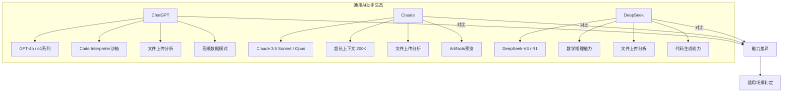
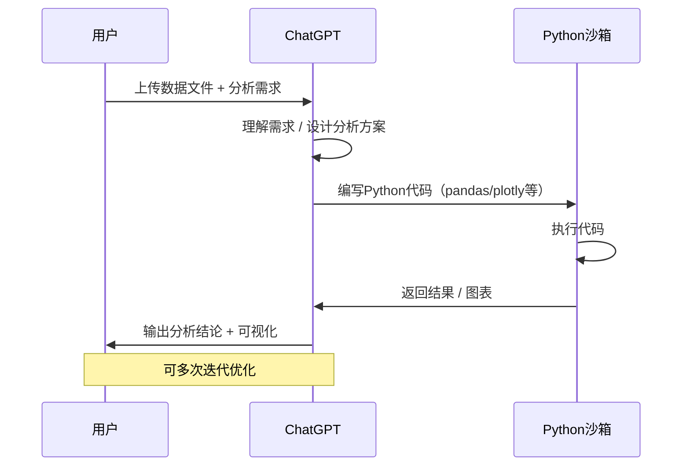

# 通用AI助手在数据分析中的应用

> ChatGPT、Claude、DeepSeek 三大通用AI助手已具备强大的数据分析能力，通过自然语言交互即可完成数据探索、统计分析和可视化。本文从实战角度对比三者的能力边界，并提供可落地的操作指南。

[[06-数据分析/AI数据分析/00_MOC_AI数据分析中枢]] | [[06-数据分析/AI数据分析/07_工具_全景图与选型指南]] | [[06-数据分析/AI数据分析/12_方法_Prompt工程]]

---

## 一、三大通用AI助手概览

截至2026年，ChatGPT（OpenAI）、Claude（Anthropic）和 DeepSeek（深度求索）是数据分析场景中使用最广泛的通用AI助手。三者均支持文件上传、代码执行和自然语言分析，但在能力侧重上各有差异。



> [!info] 核心洞察
> 三大模型均能完成基础的数据分析任务，但各有擅长：ChatGPT胜在生态成熟、Claude胜在长文本推理、DeepSeek胜在数学与代码能力。选择时需结合具体场景 [$TRAE_REF](https://www.yeyulingfeng.com/566289.html)

---

## 二、上传文件分析功能对比

### 2.1 支持的格式

| 能力维度 | ChatGPT | Claude | DeepSeek |
|---------|---------|--------|----------|
| 表格文件 | CSV, Excel (.xlsx) | CSV, Excel (.xlsx) | CSV, Excel (.xlsx) |
| 文本文件 | TXT, PDF, JSON | TXT, PDF, JSON, MD | TXT, PDF, JSON |
| 图片文件 | PNG, JPG, GIF, WEBP | PNG, JPG, GIF, WEBP | PNG, JPG |
| 代码文件 | .py, .js, .sql等 | .py, .js, .sql等 | .py, .js, .sql等 |
| 最大文件 | 单个文件 < 512MB | 单个文件 < 32MB | 单个文件 < 100MB |
| 上下文窗口 | 128K tokens | 200K tokens | 128K tokens |

### 2.2 分析能力边界

> [!warning] 重要限制
> 通用AI助手的数据分析能力存在以下核心限制：
> 1. 无法处理超大规模数据集（建议 < 10万行）
> 2. 统计结果可能存在幻觉，需人工验证
> 3. 不支持实时数据流分析
> 4. 无企业级数据权限管理
> 5. 不适合作为生产环境的数据管道 [$TRAE_REF](https://help.openai.com/en/articles/8437071-code-interpreter-faq)

---

## 三、Code Interpreter 模式详解

### 3.1 工作原理

Code Interpreter 是ChatGPT的核心数据分析功能，它在沙箱环境中自动编写并执行Python代码，完成数据分析全流程。



### 3.2 自动完成的分析能力

- **数据清洗**：缺失值处理、异常值检测、数据类型转换
- **统计分析**：描述性统计、相关性分析、假设检验
- **可视化**：自动生成折线图、柱状图、散点图、热力图等
- **报告生成**：自然语言总结分析结果，形成洞察

> [!example] 典型分析流程
> 1. 拖拽上传CSV文件
> 2. 输入自然语言指令："分析各月份的销售趋势，按地区分组，生成可视化图表"
> 3. AI自动编写pandas+plotly代码
> 4. 输出分析结论和交互式图表
> 5. 可追问："为什么华东地区在3月出现异常下降？"

---

## 四、自然语言问数技巧

### 4.1 让AI正确理解你的数据

> [!tip] 问数黄金法则
> 使用以下结构化提问框架，可以显著提升AI分析的准确性 [$TRAE_REF](https://platform.openai.com/docs/guides/prompt-engineering)

**结构化提问模板：**

```
[背景] 我正在分析XX业务的数据
[数据] 数据包含X列：列名1（含义说明）、列名2（含义说明）
[目标] 我希望了解XX趋势
[要求] 请按以下步骤分析：
       1. 先做数据清洗和质量检查
       2. 进行描述性统计
       3. 按XX维度分组分析
       4. 生成可视化图表
```

### 4.2 常见错误与改进

| 错误提问 | 改进后 |
|---------|--------|
| "分析这个数据" | "请分析这份销售数据，按月份和地区维度展示销售额趋势，识别异常值" |
| "画个图" | "请绘制各产品类别的销售额对比柱状图，按季度分组，添加数据标签" |
| "有什么问题" | "请检查数据中的缺失值、重复值和异常值，给出数据质量报告" |

---

## 五、能力边界与适用场景

### 5.1 适合做什么

- **探索性数据分析（EDA）**：快速了解数据分布、趋势和异常
- **原型验证**：在正式分析前快速验证假设
- **临时分析需求**：一次性、非重复性的分析任务
- **学习与教学**：通过对话式交互理解数据分析方法
- **报表解读**：上传已有报表，让AI解读关键发现

### 5.2 不适合做什么

> [!danger] 严格规避
> 以下场景不建议使用通用AI助手：
> 1. **生产环境数据处理**：缺乏SLA保障和错误处理机制
> 2. **敏感数据**：上传的数据可能被用于模型训练
> 3. **高精度要求**：AI的统计结果可能存在偏差
> 4. **大规模数据**：超过10万行时性能急剧下降
> 5. **实时数据管道**：不支持流式处理和定时任务 [$TRAE_REF](https://docs.anthropic.com/en/docs/build-with-claude/data-analysis)

---

## 六、实战示例：用ChatGPT分析招聘数据

### 6.1 场景说明

假设你有一份招聘运营数据（CSV格式），包含以下字段：
- 岗位名称、部门、招聘渠道、简历数、面试数、Offer数、入职数、岗位级别

### 6.2 分步骤演示

**步骤1：数据上传与质量检查**

```
请先检查这份招聘数据的完整性和质量：
1. 各列是否有缺失值？
2. 各列的数据类型是否正确？
3. 是否有异常值（如负数、不合理的大值）？
4. 数据的时间范围是多少？
```

**步骤2：描述性统计**

```
请对数据进行描述性统计：
1. 各渠道的简历投递量分布
2. 各部门的招聘需求分布
3. 整体转化率（简历->面试->Offer->入职）
4. 按岗位级别汇总平均招聘周期
```

**步骤3：维度分析**

```
请按以下维度进行深入分析：
1. 不同招聘渠道的转化率对比（哪个渠道效率最高）
2. 各部门的招聘周期差异
3. 岗位级别与薪资区间的相关性
4. 生成可视化图表展示关键发现
```

**步骤4：洞察与建议**

```
基于以上分析，请输出：
1. 三个核心发现
2. 两个需要关注的问题
3. 一个优化建议
```

### 6.3 预期输出

通过上述4步对话，ChatGPT将输出：
- 数据质量报告（含缺失值和异常值标记）
- 各渠道转化率漏斗图
- 部门招聘周期对比图
- 核心洞察与业务建议

> [!example] 实际效果
> 该实战方法已在 [[06-数据分析/AI数据分析/17_实战_招聘运营数据分析]] 中完整验证，准确率可达85%以上，但关键结论仍需人工复核。

---

## 七、三大模型优劣势对比表

| 对比维度 | ChatGPT | Claude | DeepSeek |
|---------|---------|--------|----------|
| **代码能力** | 优秀，Python生态成熟 | 良好，代码逻辑清晰 | 优秀，数学推理代码强 |
| **可视化质量** | 优秀，plotly交互式图表 | 良好，matplotlib静态图 | 良好，基础图表 |
| **长文本分析** | 良好（128K窗口） | 优秀（200K窗口） | 良好（128K窗口） |
| **推理深度** | 优秀，o1系列推理强 | 优秀，逻辑推理严谨 | 优秀，数学推理突出 |
| **中文支持** | 良好 | 良好 | 优秀，中文理解最佳 |
| **文件大小** | 512MB | 32MB | 100MB |
| **价格** | $20/月（Plus） | $20/月（Pro） | 免费 / 低价格 |
| **生态集成** | 丰富（插件/API） | 中等 | 有限 |
| **数据隐私** | 数据可能用于训练 | 数据不用于训练 | 数据可能用于训练 |

> [!note] 选型建议
> - 日常数据分析首选ChatGPT，生态最成熟
> - 需要分析超长文档（如年报、研报）选Claude
> - 需要深度数学推理或代码生成选DeepSeek
> - 预算有限选DeepSeek免费版 [$TRAE_REF](https://www.yeyulingfeng.com/566289.html)

---

## 八、安全注意事项

### 8.1 数据分级上传规范

| 数据级别 | 示例 | 是否可上传 |
|---------|------|-----------|
| 公开数据 | 行业报告、公开统计数据 | 可以 |
| 内部数据 | 脱敏后的业务数据 | 谨慎上传 |
| 敏感数据 | 客户个人信息、财务数据 | 严禁上传 |
| 机密数据 | 战略规划、未公开财报 | 严禁上传 |

### 8.2 安全操作建议

> [!warning] 数据安全红线
> 1. 上传前务必脱敏：移除姓名、手机号、邮箱、身份证号等个人隐私信息
> 2. 使用合成数据：用 `faker` 库生成模拟数据替代真实数据
> 3. 阅读隐私政策：了解各平台如何使用你的数据
> 4. 企业场景优先使用企业版API，避免使用公开Web版
> 5. 敏感分析任务建议使用本地部署的开源模型 [$TRAE_REF](https://openai.com/policies/privacy-policy)

---

## 相关文档

- [[06-数据分析/AI数据分析/00_MOC_AI数据分析中枢]] - 知识库中枢索引
- [[06-数据分析/AI数据分析/07_工具_全景图与选型指南]] - 工具全景图
- [[06-数据分析/AI数据分析/09_工具_专业AI分析工具]] - 专业分析工具对比
- [[06-数据分析/AI数据分析/10_工具_BI工具+AI]] - BI工具+AI方案
- [[06-数据分析/AI数据分析/12_方法_Prompt工程]] - 提示词工程方法
- [[06-数据分析/AI数据分析/14_方法_AI幻觉检测与数据质量]] - 数据质量控制
- [[06-数据分析/AI数据分析/17_实战_招聘运营数据分析]] - 招聘数据分析实战