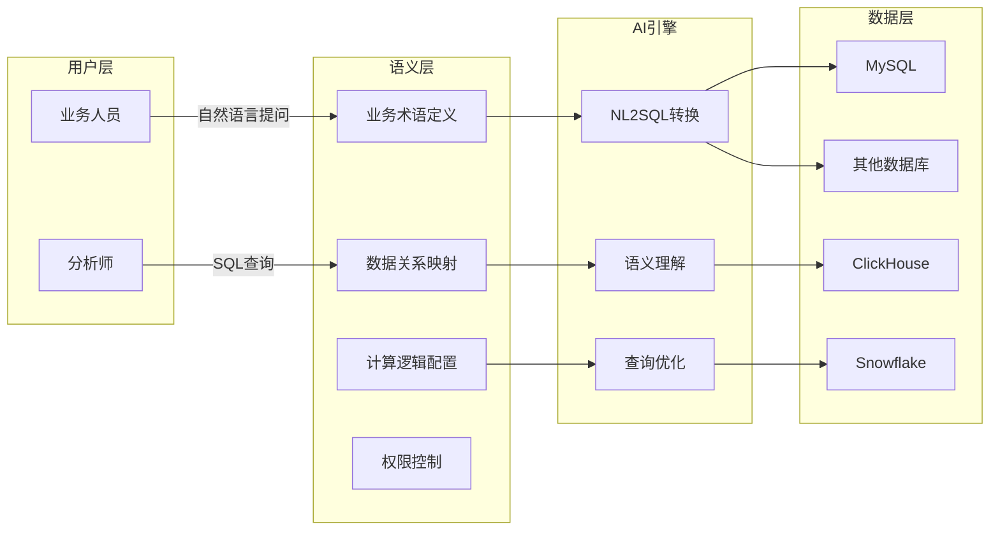
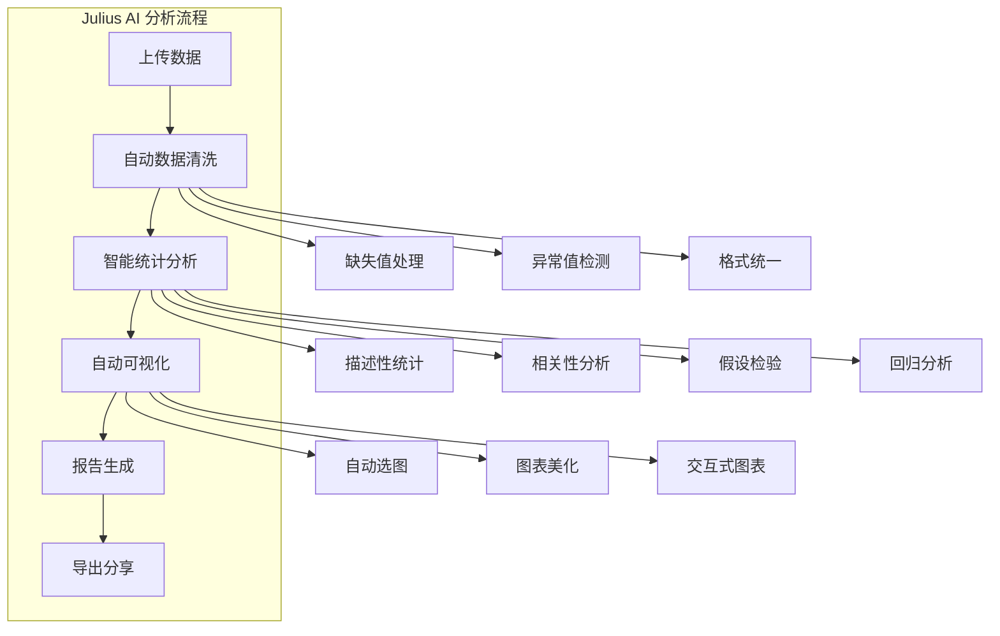
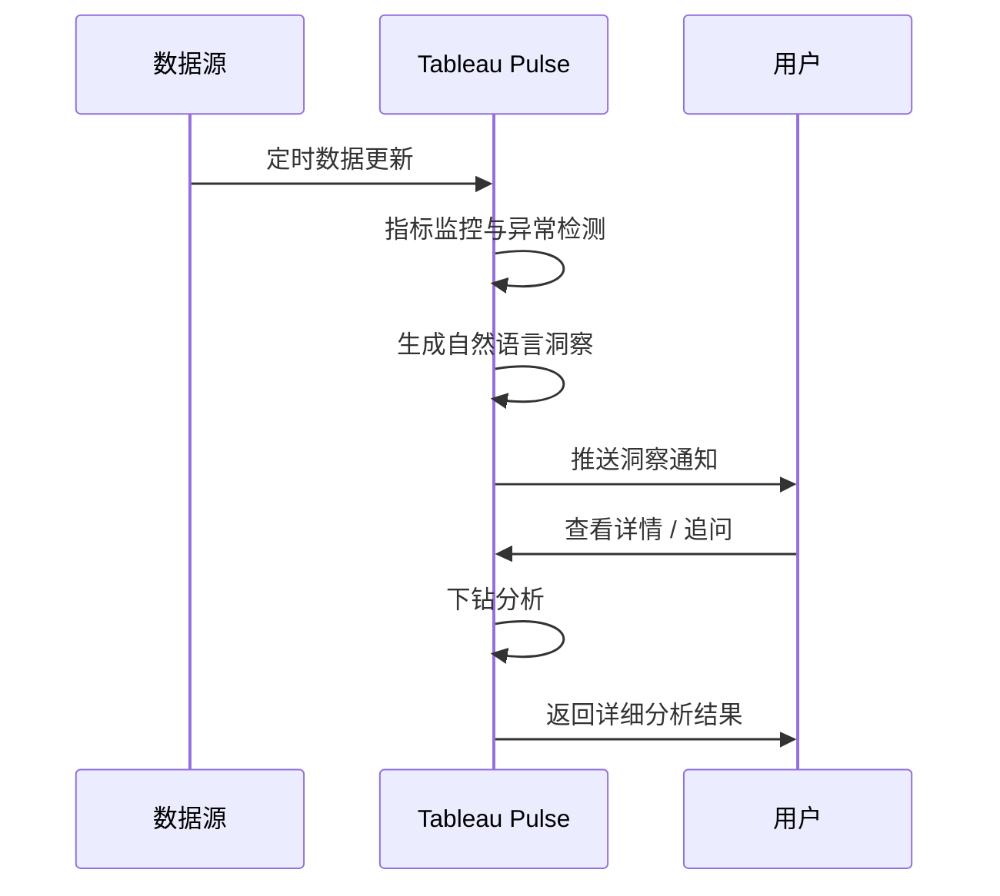
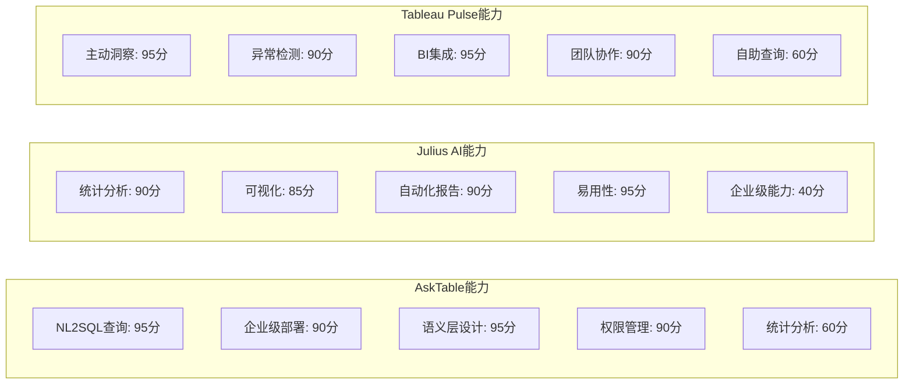

# 专业AI分析工具深度解析

> 相比通用AI助手，专业AI分析工具在特定领域（如数据库查询、统计分析、BI洞察）提供了更深入的能力。本文聚焦AskTable、Julius AI和Tableau Pulse三款工具，从架构设计到实战能力进行全方位对比。

[[06-数据分析/AI数据分析/00_MOC_AI数据分析中枢]] | [[06-数据分析/AI数据分析/07_工具_全景图与选型指南]] | [[06-数据分析/AI数据分析/08_工具_通用AI助手]]

---

## 一、AskTable：自然语言查表的革命

### 1.1 产品定位

AskTable 是一款面向企业的自然语言数据查询与分析平台，核心能力是让用户通过自然语言直接查询数据库，无需编写SQL。它将AI与业务语义层结合，实现了"问即所得"的数据分析体验。

[$TRAE_REF](https://www.asktable.com/zh-CN/articles/2026-03-04/data-analyst-transformation-guide-sql-to-ai-prompt-engineer)

### 1.2 业务语义层设计

AskTable 的核心创新在于"业务语义层"，它将复杂的数据库表结构映射为业务人员可理解的术语。

> [!info] 语义层价值
> 业务语义层是AskTable的核心竞争力。它将"user_id"这样的数据库字段映射为"用户ID"、"客户编号"等业务术语，让非技术人员也能自主查询数据，同时保证查询的准确性和安全性。 [$TRAE_REF](https://www.asktable.com/zh-CN/articles/2026-03-04/data-analyst-transformation-guide-sql-to-ai-prompt-engineer)

### 1.3 核心功能

| 功能模块 | 说明 | 适用场景 |
|---------|------|---------|
| 自然语言查表 | 用中文提问自动生成SQL | 业务人员日常数据查询 |
| 智能图表 | 根据查询结果自动推荐可视化 | 快速生成报表 |
| 数据洞察 | 自动分析数据中的趋势和异常 | 数据监控与预警 |
| 报表订阅 | 定时推送数据报告 | 管理汇报 |
| 权限管理 | 基于角色的数据访问控制 | 企业数据安全 |
| 多数据源 | 支持MySQL、ClickHouse、Snowflake等 | 异构数据环境 |

---

## 二、Julius AI：个人数据分析利器

### 2.1 产品定位

Julius AI 是一款面向个人分析师和中小团队的AI数据分析工具，专注于自动化统计分析和可视化报告生成。它更像一个"AI数据分析师"，可以独立完成从数据清洗到报告输出的全流程。

### 2.2 核心能力

### 2.3 功能详解

> [!example] Julius AI 典型工作流
> 1. 上传CSV或Excel文件（支持最多10万行数据）
> 2. AI自动分析数据结构，生成数据概要
> 3. 用户输入分析目标（如"找出影响销售额的关键因素"）
> 4. AI自动选择统计方法并执行分析
> 5. 生成包含图表的分析报告
> 6. 支持导出为PDF、HTML或PNG格式

**主要特性：**
- **自动化分析**：上传数据后自动生成分析报告
- **智能可视化**：根据数据类型自动选择最佳图表类型
- **统计建模**：支持回归分析、聚类分析、时间序列预测
- **对话式交互**：通过自然语言追问深入分析
- **多格式导出**：支持PDF、HTML、图片等格式

---

## 三、Tableau Pulse：AI驱动的主动洞察

### 3.1 产品定位

Tableau Pulse 是 Tableau（Salesforce旗下）推出的AI驱动数据洞察功能，它将数据分析从"被动查询"转变为"主动推送"。与传统的BI工具不同，Pulse会在数据发生变化时主动向用户推送洞察。

### 3.2 核心功能

**主动洞察推送：**
- 当关键指标发生变化时自动通知
- 自然语言描述数据变化的原因
- 自动识别异常值和趋势变化
- 支持个性化订阅（用户可订阅自己关注的指标）

**异常检测能力：**
- 基于统计模型的自动异常识别
- 多维度的根因分析
- 时间序列异常检测
- 支持自定义异常阈值

### 3.3 工作流程

> [!info] 核心价值
> Tableau Pulse 实现了从"人找数据"到"数据找人"的转变。用户不再需要主动打开仪表盘查看数据，而是在数据发生重要变化时收到通知，并附带自然语言描述的洞察解释。 [$TRAE_REF](https://www.yeyulingfeng.com/566289.html)

---

## 四、三款工具能力对比表

| 对比维度 | AskTable | Julius AI | Tableau Pulse |
|---------|---------|-----------|---------------|
| **核心定位** | 自然语言查表 | 自动统计分析 | 主动洞察推送 |
| **查询能力** | NL2SQL，直接查数据库 | 文件上传后分析 | 连接BI数据源 |
| **洞察深度** | 数据查询+简单分析 | 全流程统计分析 | 异常检测+根因分析 |
| **可视化** | 自动推荐图表 | 自动生成图表 | 集成Tableau可视化 |
| **协作共享** | 企业级报表订阅 | 个人导出分享 | 团队订阅推送 |
| **数据源接入** | 直接连接数据库 | CSV/Excel文件上传 | 连接Tableau数据源 |
| **学习成本** | 低（自然语言） | 低（对话式） | 低（订阅式） |
| **部署方式** | SaaS / 私有部署 | SaaS | SaaS（Tableau Cloud） |
| **价格参考** | 企业定价 | $20-50/月 | 含Tableau订阅 |
| **适用规模** | 中型到大型企业 | 个人/小团队 | 中大型企业BI团队 |

### 4.1 能力雷达图

---

## 五、适用场景建议

### 5.1 AskTable：适合有数据库的企业

**推荐场景：**
- 企业已有结构化数据库（MySQL、ClickHouse等）
- 业务人员需要自助查询数据，但不会SQL
- 需要统一的数据语义层管理
- 对数据安全和权限控制有严格要求

**不适合场景：**
- 没有数据库的数据分析需求
- 需要深度统计建模的场景
- 个人用户临时分析

### 5.2 Julius AI：适合个人探索

**推荐场景：**
- 个人分析师快速探索数据
- 数据科学初学者学习和验证
- 临时性的数据分析任务
- 需要快速生成分析报告

**不适合场景：**
- 企业级数据治理需求
- 实时数据查询
- 大规模数据（超过10万行）

### 5.3 Tableau Pulse：适合BI团队

**推荐场景：**
- 企业已有Tableau BI体系
- 需要主动监控关键指标
- 业务团队需要自动获取数据洞察
- 需要与现有BI仪表盘集成

**不适合场景：**
- 没有Tableau环境的企业
- 需要直接查询数据库的场景
- 个人用户独立使用

> [!tip] 选型决策框架
> - 有数据库 + 需要自助查询 = AskTable
> - 个人分析 + 快速探索 = Julius AI
> - 已有BI + 主动洞察 = Tableau Pulse
> - 如果预算有限，先使用 [[06-数据分析/AI数据分析/08_工具_通用AI助手]] 开始探索，再逐步升级到专业工具

---

## 六、参考来源

- [AskTable官网 - 数据分析师转型指南](https://www.asktable.com/zh-CN/articles/2026-03-04/data-analyst-transformation-guide-sql-to-ai-prompt-engineer) - AskTable的语义层设计理念和NL2SQL能力详解
- [工具横评 - 2026年AI数据分析工具对比](https://www.yeyulingfeng.com/566289.html) - 多款AI数据分析工具的横向评测
- [[06-数据分析/AI数据分析/07_工具_全景图与选型指南]] - 工具全景图
- [[06-数据分析/AI数据分析/08_工具_通用AI助手]] - 通用AI助手对比

---

## 相关文档

- [[06-数据分析/AI数据分析/00_MOC_AI数据分析中枢]] - 知识库中枢索引
- [[06-数据分析/AI数据分析/07_工具_全景图与选型指南]] - 工具全景图
- [[06-数据分析/AI数据分析/08_工具_通用AI助手]] - 通用AI助手对比
- [[06-数据分析/AI数据分析/10_工具_BI工具+AI]] - BI工具+AI方案
- [[06-数据分析/AI数据分析/12_方法_Prompt工程]] - 提示词工程方法
- [[06-数据分析/AI数据分析/15_方法_RAG在数据分析中的应用]] - RAG与数据检索