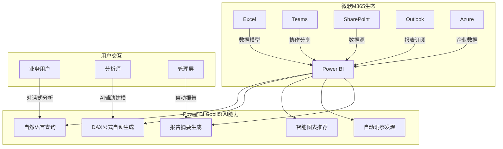
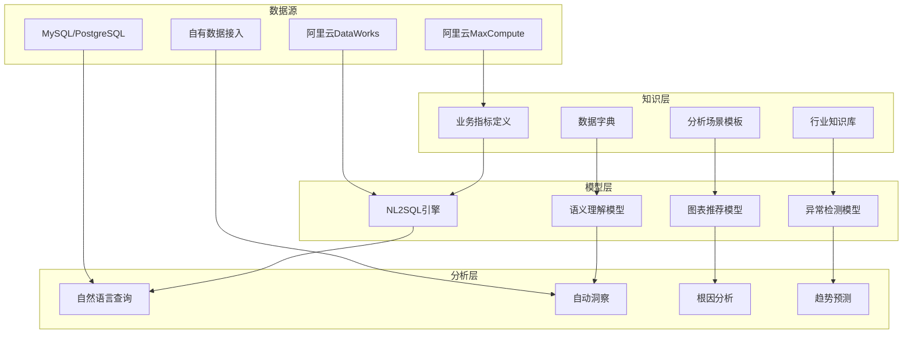
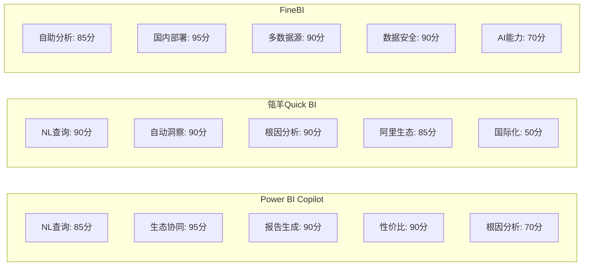
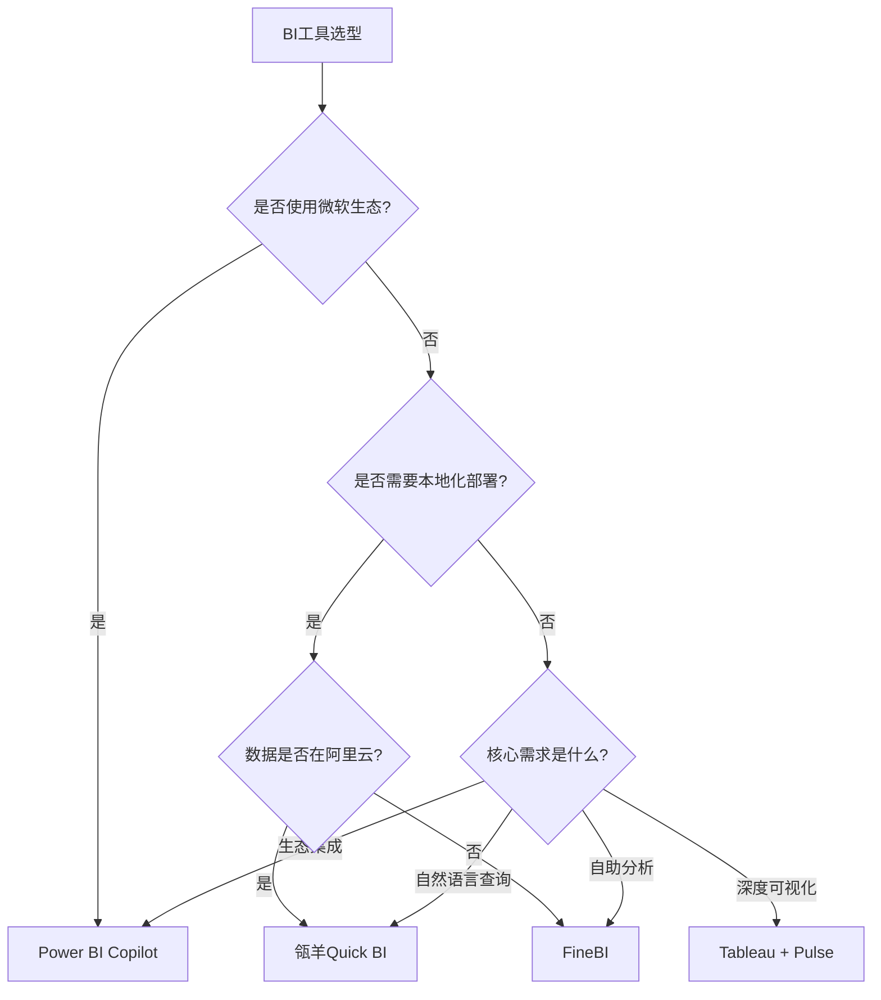

# BI工具+AI能力深度解析

> 2026年，AI已成为BI工具的标配能力。Power BI Copilot、瓴羊Quick BI和FineBI分别代表了国际巨头、国内云厂商和传统BI厂商三条路线。本文从实际业务场景出发，深度对比三款工具+AI的能力差异。

[[06-数据分析/AI数据分析/00_MOC_AI数据分析中枢]] | [[06-数据分析/AI数据分析/07_工具_全景图与选型指南]] | [[06-数据分析/AI数据分析/08_工具_通用AI助手]]

---

## 一、Power BI Copilot：微软生态的AI分析引擎

### 1.1 产品定位

Power BI Copilot 是微软将AI能力深度集成到Power BI的产物，与M365办公生态无缝协同。它利用自然语言处理技术，让用户通过对话即可完成数据准备、分析和报告生成。

### 1.2 M365生态协同

Power BI Copilot 的最大优势在于与微软生态的深度集成：

> [!info] 生态优势
> Power BI Copilot 与Excel无缝集成，用户可以在Excel中直接使用自然语言查询Power BI数据集，分析结果自动同步到Teams和SharePoint。对于已经使用M365的企业，这几乎是最低门槛的AI分析方案。 [$TRAE_REF](https://www.yeyulingfeng.com/566289.html)

### 1.3 核心功能详解

**DAX公式AI辅助：**
- 自然语言描述想要的度量值，AI自动生成DAX公式
- 对已有DAX公式进行解释和优化建议
- 自动检测DAX公式中的逻辑错误

**智能报告生成：**
- 自然语言描述报告需求，AI自动创建仪表盘
- 智能布局和图表类型推荐
- 自动生成数据故事和洞察摘要

**价格优势：**
- Power BI Pro：$10/用户/月（含AI功能）
- Power BI Premium：$20/用户/月（含高级AI功能）
- 相比同类产品，性价比极高

---

## 二、瓴羊Quick BI：阿里生态的智能分析平台

### 2.1 产品定位

瓴羊Quick BI 是阿里巴巴旗下瓴羊品牌推出的智能BI与分析平台，深度整合了阿里云生态的数据能力。其AI核心特色是NL2SQL（自然语言转SQL）、自动洞察和根因分析。

### 2.2 三位一体架构

瓴羊Quick BI 采用"知识层 + 模型层 + 分析层"的三位一体架构：

> [!info] 架构亮点
> 瓴羊Quick BI 的三位一体架构将业务知识（知识层）、AI模型（模型层）和分析能力（分析层）解耦，使得每个层次可以独立迭代优化。知识层的业务指标定义是保证查询准确性的关键。 [$TRAE_REF](https://m.finance.itbear.com.cn/html/2025-12/296633.html)

### 2.3 核心能力

**NL2SQL（自然语言转SQL）：**
- 支持中文自然语言直接查询数据库
- 自动识别业务术语并映射到数据表字段
- 复杂查询支持（多表关联、聚合计算、条件过滤）
- 查询结果自动生成图表

**自动洞察：**
- 数据变化趋势自动识别
- 关键指标异常波动检测
- 周期性模式发现
- 自动生成分析报告

**根因分析：**
- 多维下钻定位问题根因
- 自动计算各维度贡献度
- 时序异常根因定位
- 支持自定义分析路径

---

## 三、FineBI：自助式BI的AI升级

### 3.1 产品定位

FineBI 是帆软旗下的一站式数据分析平台，主打"自助式BI"理念。在AI能力加持下，FineBI实现了从"拖拽式分析"到"对话式分析"的升级，特别适合国内企业部署环境。

### 3.2 核心功能

**AI智能图表：**
- 自然语言描述图表需求，AI自动生成
- 智能图表类型推荐（基于数据特征）
- 图表样式自动美化
- 支持丰富的图表类型（50+种）

**自助式分析：**
- 拖拽式操作与AI对话双模式
- 多数据源对接（Excel、数据库、API、ERP等）
- 数据权限精细化管控
- 支持移动端查看

**国内企业适配：**
- 支持本地化部署
- 符合国内数据安全法规
- 完善的售后服务体系
- 中文界面和文档

> [!tip] 适用场景
> FineBI 特别适合以下场景：
> - 国内中大型企业，需要本地化部署
> - 已有ERP/CRM等系统，需要多源数据整合
> - 非技术业务人员自助分析需求
> - 对数据安全合规有严格要求

---

## 四、三款BI工具+AI能力对比表

| 对比维度 | Power BI Copilot | 瓴羊Quick BI | FineBI |
|---------|-----------------|-------------|--------|
| **自然语言查询** | 支持，集成Copilot | 支持，NL2SQL引擎 | 支持，AI智能图表 |
| **自动洞察** | 自动洞察发现 | 自动洞察+根因分析 | 智能图表推荐 |
| **报告生成** | AI自动生成报告 | 自动生成分析报告 | 自助式+AI辅助 |
| **协作共享** | Teams/SharePoint集成 | 阿里生态协同 | 企业级权限管理 |
| **数据源接入** | M365+Azure+第三方 | 阿里云生态+通用 | 50+种数据源 |
| **DAX辅助** | 支持，AI生成DAX | 不支持DAX | 支持公式辅助 |
| **部署方式** | 云部署（SaaS） | 云部署+私有化 | 本地化+云部署 |
| **价格参考** | Pro $10/用户/月 | 企业定价 | 企业定价 |
| **生态优势** | M365/Excel/Teams | 阿里云/钉钉 | 国内企业服务 |
| **适合规模** | 大型跨国企业 | 国内中大型企业 | 国内中大型企业 |

### 4.1 能力对比雷达

---

## 五、选型建议

### 5.1 微软生态企业选Power BI

**推荐条件：**
- 企业已使用M365办公套件（Teams、SharePoint、Outlook）
- 数据分析师熟悉Excel和Power BI
- 需要与Azure数据服务深度集成
- 预算有限但需要高性价比方案

**优势：** 生态协同无缝、价格最低（$10/用户/月）、AI能力持续更新

### 5.2 国内企业选FineBI或瓴羊Quick BI

**FineBI推荐条件：**
- 需要本地化部署
- 数据源种类繁多（ERP、CRM、数据库等）
- 对后续服务支持要求高
- 业务人员习惯拖拽式操作

**瓴羊Quick BI推荐条件：**
- 数据已上阿里云（MaxCompute、DataWorks）
- 企业使用钉钉作为办公平台
- 需要强大的NL2SQL和根因分析能力
- 业务查询需求频繁

### 5.3 需要深度可视化选Tableau

> [!note] 补充说明
> 虽然Tableau不在本文三款工具之列，但如果企业的核心需求是深度可视化分析，仍建议选择Tableau + [[06-数据分析/AI数据分析/09_工具_专业AI分析工具|Tableau Pulse]] 的组合。Tableau在可视化自由度和交互深度上仍是行业标杆。

### 5.4 选型决策树

---

## 六、2026年BI+AI趋势：从"人找数据"到"数据找人"

### 6.1 趋势概述

2026年BI+AI领域正在经历一场范式转变，核心变化方向是：**从被动查询到主动推送，从人工分析到智能洞察，从专业工具到全民参与。**

### 6.2 五大趋势

**趋势一：主动洞察成为标配**
- 所有主流BI工具都具备了主动推送洞察的能力
- 用户不再需要定时查看仪表盘
- AI在数据变化时自动生成洞察并推送给相关人员

**趋势二：自然语言交互全面普及**
- NL2SQL技术成熟度显著提升
- 业务人员可直接用自然语言查询数据
- 准确率从2024年的70%提升到2026年的90%+

**趋势三：AI分析师（AI Agent）雏形出现**
- AI可以独立完成"理解问题 -> 获取数据 -> 分析 -> 生成报告"全流程
- 多步骤分析任务可通过对话式交互完成
- 2026年AI Agent在数据分析中的渗透率已达30%+

**趋势四：从"描述性分析"到"诊断性分析"**
- AI不再只是描述"发生了什么"
- 开始具备"为什么会发生"的根因分析能力
- 部分场景已能提供"该怎么办"的建议性分析

**趋势五：数据民主化加速**
- 非技术人员的数据分析能力大幅提升
- 企业数据文化的建设门槛降低
- 数据分析不再是数据团队的专属工作

> [!quote] 趋势总结
> 2026年，BI+AI的终极目标是让每个业务决策者都拥有一个"私人数据分析师"。工具的选择不再是技术问题，而是生态和战略问题。 [$TRAE_REF](https://www.yeyulingfeng.com/566289.html)

---

## 七、参考来源

- [瓴羊白皮书 - 智能BI发展趋势](https://m.finance.itbear.com.cn/html/2025-12/296633.html) - 瓴羊Quick BI的三位一体架构详解
- [工具横评 - 2026年AI数据分析工具对比](https://www.yeyulingfeng.com/566289.html) - 多款BI+AI工具的横向评测
- [[06-数据分析/AI数据分析/07_工具_全景图与选型指南]] - 工具全景图
- [[06-数据分析/AI数据分析/08_工具_通用AI助手]] - 通用AI助手对比
- [[06-数据分析/AI数据分析/09_工具_专业AI分析工具]] - 专业AI分析工具对比

---

## 相关文档

- [[06-数据分析/AI数据分析/00_MOC_AI数据分析中枢]] - 知识库中枢索引
- [[06-数据分析/AI数据分析/07_工具_全景图与选型指南]] - 工具全景图
- [[06-数据分析/AI数据分析/08_工具_通用AI助手]] - 通用AI助手对比
- [[06-数据分析/AI数据分析/09_工具_专业AI分析工具]] - 专业AI分析工具对比
- [[06-数据分析/AI数据分析/04_基础_统计学思维]] - 统计学基础
- [[06-数据分析/AI数据分析/05_基础_分析方法论]] - 分析方法论
- [[06-数据分析/AI数据分析/06_基础_指标体系建设]] - 指标体系设计