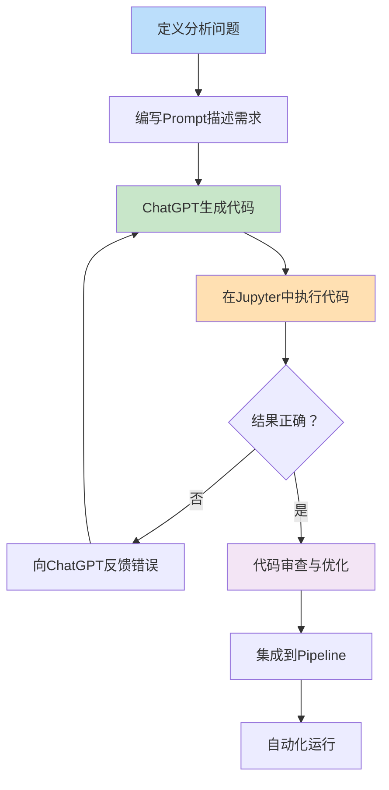
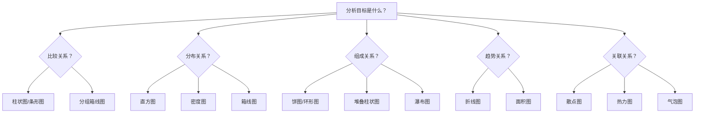
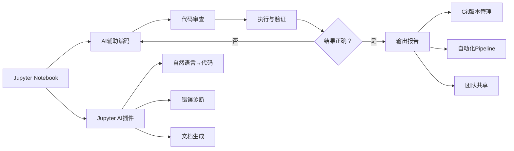
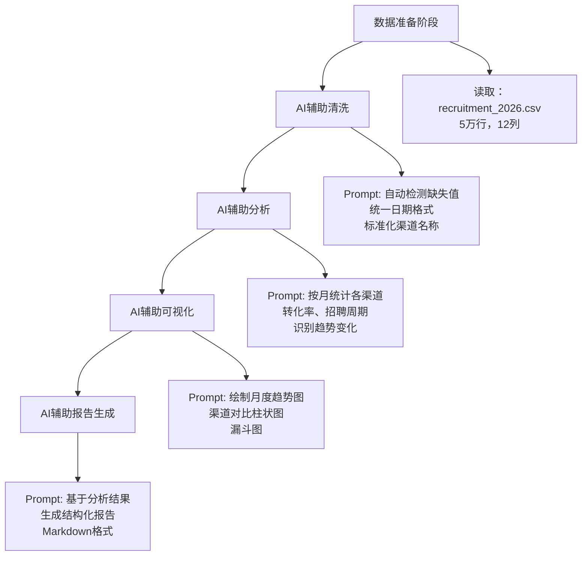

# 编程+AI辅助 — 数据分析的终极灵活方案

> 当数据量超过10万行、分析需求高度定制化、或需要构建自动化Pipeline时，通用AI助手和专业工具都无法满足需求。编程+AI辅助的组合方案提供了最大的灵活度：用AI辅助编写Python/R代码，用Pandas处理数据，用matplotlib/seaborn/plotly可视化，用Jupyter Notebook管理分析流程。这是数据科学家和分析师的核心工作模式。

[[06-数据分析/AI数据分析/00_MOC_AI数据分析中枢]] | [[06-数据分析/AI数据分析/07_工具_全景图与选型指南]] | [[06-数据分析/AI数据分析/12_方法_Prompt工程]]

---

## 一、编程+AI辅助的定位与价值

### 1.1 在整个工具生态中的位置

```mermaid
flowchart TD
    subgraph 工具生态
        A[通用AI助手<br>ChatGPT/Claude] --> B[快速探索]<br>数据量<10万行
        C[专业AI分析工具<br>AskTable/Julius AI] --> D[业务自助分析]<br>零代码门槛
        E[BI工具+AI<br>Power BI/Quick BI] --> F[企业级报表]<br>标准化看板
        G[编程+AI辅助<br>Python/R+AI] --> H[深度定制分析]<br>数据量>10万行
    end
    
    style G fill:#e8f5e9,stroke:#2e7d32
    style H fill:#e8f5e9,stroke:#2e7d32
```

### 1.2 核心能力矩阵

| 维度 | 编程+AI辅助 | 通用AI助手 | 专业AI工具 | BI工具+AI |
|------|------------|-----------|-----------|----------|
| 数据量上限 | 无上限（取决于硬件） | ~10万行 | ~50万行 | 取决于BI引擎 |
| 定制化程度 | 最高 | 低 | 中 | 中 |
| 自动化Pipeline | 完全支持 | 不支持 | 有限支持 | 有限支持 |
| 学习曲线 | 陡峭 | 平缓 | 平缓 | 中等 |
| 灵活性 | 最高 | 低 | 中 | 低 |
| 可复现性 | 强（代码即文档） | 弱 | 中 | 强 |
| 团队协作 | 需Git/版本控制 | 弱 | 中 | 强 |

### 1.3 适用场景边界

> [!tip] 编程+AI辅助的适用场景
> - 数据量超过10万行，通用AI工具无法处理
> - 分析逻辑高度定制化，需要自定义算法或模型
> - 需要构建可重复执行的自动化数据分析Pipeline
> - 需要将分析能力集成到产品/系统中
> - 分析师具备编程基础（Python或R）

> [!warning] 编程+AI辅助的不适用场景
> - 快速探索性分析，只需几分钟得到结论
> - 业务人员自助分析，无编程基础
> - 简单报表和看板制作
> - 一次性分析，不值得投入编码成本
> - 需要企业级权限管理和数据治理

---

## 二、ChatGPT辅助编写Python分析代码的工作流

### 2.1 工作流全景



### 2.2 Prompt编写技巧

**基础模板**：

```
请帮我编写一段Python数据分析代码，完成以下任务：

【任务描述】：
[详细描述你要做什么分析]

【数据说明】：
- 数据文件：[文件名]
- 列名：[列名1, 列名2, ...]
- 数据类型：[数值型/类别型/时间型]
- 数据量：[行数]

【期望输出】：
[描述你期望的结果形式：表格/图表/统计指标]

【约束条件】：
- 使用的库：[pandas/matplotlib/seaborn/plotly]
- 性能要求：[处理速度/内存限制]
- 输出格式：[CSV/PNG/HTML]
```

**进阶技巧** [$TRAE_REF](https://platform.openai.com/docs/guides/prompt-engineering)：

| 技巧 | 说明 | 示例 |
|------|------|------|
| 分步拆解 | 将复杂任务拆为多个小Prompt | 先"清洗数据"，再"做描述统计"，再"画图" |
| 提供示例数据 | 给5-10行示例数据让AI理解格式 | 直接粘贴CSV前几行 |
| 指定库版本 | 避免使用不兼容的API | "请使用pandas 2.0+的语法" |
| 要求注释 | 让AI生成带注释的代码 | "请为每段代码添加中文注释" |
| 要求错误处理 | 让AI加入try-except | "请加入数据缺失时的处理逻辑" |
| 多次迭代 | 先让AI生成骨架，再逐步完善 | 先"生成读取数据的代码"，再"添加分析逻辑" |

### 2.3 典型Prompt示例：批量分析招聘数据

```
你是一位数据分析师。请使用Python（pandas + matplotlib）完成以下招聘数据分析任务：

数据文件：recruitment_data.csv（包含列：投递时间、岗位名称、渠道来源、候选人学历、面试结果、offer状态、入职时间）

任务：
1. 读取CSV文件，显示前5行数据概览
2. 统计各渠道的投递量、简历通过率、面试到场率、offer接受率、入职率
3. 绘制各渠道的转化漏斗图（从投递到入职的5个阶段）
4. 按岗位类别分析招聘周期的中位数和均值
5. 输出结果：保存统计表为CSV，保存漏斗图为PNG

要求：
- 使用pandas 2.0+语法
- 添加中文注释
- 加入数据缺失值处理逻辑
- 图表使用matplotlib的Seaborn风格
- 输出格式为：统计表保存为channel_analysis.csv，漏斗图保存为funnel.png
```

---

## 三、Pandas + AI的自动数据处理

### 3.1 数据清洗的AI辅助

数据清洗是数据分析中最耗时（通常占60-80%时间）的环节，AI可以大幅提升效率 [$TRAE_REF](https://www.datacamp.com/tutorial/data-cleaning-python)：

| 清洗任务 | 传统方法 | AI辅助方法 | 效率提升 |
|---------|---------|-----------|---------|
| 缺失值处理 | 手动检查每列缺失情况，逐个决定策略 | Prompt："自动检测缺失值分布，并给出填充建议" | 3-5x |
| 异常值检测 | 画箱线图，手动设定阈值 | Prompt："使用IQR方法自动标记异常值" | 5-10x |
| 数据类型转换 | 逐列检查并转换类型 | Prompt："自动检测每列数据类型并修正" | 3-4x |
| 重复数据去重 | 手动编写去重逻辑 | Prompt："基于业务规则自动去重" | 2-3x |
| 数据标准化 | 编写归一化/标准化代码 | Prompt："对数值列进行z-score标准化" | 2-3x |

**AI辅助数据清洗的Prompt模板**：

```
请帮我清洗以下数据集。数据文件：[filename.csv]

清洗要求：
1. 自动检测并报告每列的缺失值比例
2. 对数值列：缺失值用中位数填充，异常值用IQR方法标记
3. 对类别列：缺失值用"未知"填充，合并同义类别
4. 对时间列：统一为YYYY-MM-DD格式
5. 检测并移除完全重复的行
6. 输出清洗报告（清洗前后的行数变化、每列处理情况）
7. 保存清洗后的数据为cleaned_data.csv

请生成完整的Python代码，添加中文注释。
```

### 3.2 数据转换与聚合

AI辅助的pandas操作可以大幅减少记忆API的负担：

| 操作类型 | 传统写法 | AI Prompt |
|---------|---------|-----------|
| 分组聚合 | `df.groupby('channel').agg({'salary': 'mean'})` | "按渠道分组，计算平均薪资" |
| 透视表 | `pd.pivot_table(df, values='salary', index='channel', columns='level')` | "生成渠道x级别的薪资透视表" |
| 窗口函数 | `df.groupby('channel')['salary'].transform(lambda x: x.rank())` | "在每个渠道内对薪资排名" |
| 条件筛选 | `df[(df['salary'] > 10000) & (df['channel'] == '猎聘')]` | "筛选薪资大于10000且渠道为猎聘的数据" |
| 多表合并 | `pd.merge(df1, df2, on='candidate_id', how='left')` | "以候选人ID为主键，左连接两个表" |

### 3.3 自动化数据处理Pipeline

```python
# AI辅助生成的自动化Pipeline示例
import pandas as pd
import numpy as np
from pathlib import Path

def data_pipeline(input_path, output_path):
    """招聘数据自动化处理Pipeline"""
    # 阶段1：数据读取
    df = pd.read_csv(input_path)
    
    # 阶段2：数据清洗
    df = clean_data(df)
    
    # 阶段3：特征工程
    df = feature_engineering(df)
    
    # 阶段4：聚合分析
    summary = aggregate_analysis(df)
    
    # 阶段5：输出
    df.to_csv(f"{output_path}/processed_data.csv", index=False)
    summary.to_csv(f"{output_path}/summary_report.csv", index=False)
    
    return df, summary

if __name__ == "__main__":
    data_pipeline("raw_data.csv", "output")
```

> 以上代码由AI辅助生成，分析师只需描述Pipeline的结构和每阶段的处理逻辑，AI即可生成完整的可执行代码。

---

## 四、AI辅助数据可视化：从数据到图表的Prompt方法

### 4.1 可视化工具选型

| 工具 | 定位 | 图表类型 | 交互性 | 适合场景 |
|------|------|---------|--------|---------|
| matplotlib | 基础绘图库 | 所有基础图表 | 静态 | 论文/报告、精确控制 |
| seaborn | 统计可视化 | 统计图（分布/回归/热力图） | 静态 | 探索性分析、统计展示 |
| plotly | 交互式可视化 | 所有图表+3D+地图 | 强交互 | 看板、在线报告、演示 |
| Altair | 声明式可视化 | 基于Vega-Lite | 交互 | 快速探索、数据故事 |

### 4.2 可视化Prompt模板

**通用模板**：

```
请使用[matplotlib/seaborn/plotly]绘制以下图表：

【数据说明】：
[数据描述，或直接粘贴数据框的前几行]

【图表要求】：
- 图表类型：[柱状图/折线图/散点图/热力图/箱线图/漏斗图]
- X轴：[字段名]
- Y轴：[字段名]
- 分组/颜色：[字段名]
- 标题：[图表标题]
- 图例说明：[需要/不需要]

【样式要求】：
- 配色方案：[公司色/学术风格/深色模式]
- 字体大小：[默认/大号/自定义]
- 是否需要标注数据点：[是/否]
- 输出格式：[PNG/HTML/SVG]
```

**示例：用plotly绘制交互式漏斗图**：

```
请使用plotly绘制招聘漏斗图：

数据：
| 阶段 | 人数 |
|------|-----|
| 投递 | 10000 |
| 简历筛选通过 | 3500 |
| 初试通过 | 1800 |
| 复试通过 | 900 |
| Offer | 450 |
| 入职 | 300 |

要求：
1. 使用plotly的funnel图表类型
2. 每个阶段显示人数和转化率（相对于上一阶段）
3. 颜色从深到浅渐变
4. 标题："招聘转化漏斗 - 2026年Q2"
5. 保存为HTML文件，支持鼠标悬停显示详情
```

### 4.3 从数据到图表的决策树



> 将此决策树嵌入Prompt中，让AI为你自动选择最合适的图表类型。

---

## 五、Jupyter Notebook + AI的最佳实践

### 5.1 Jupyter AI插件生态

| 工具/插件 | 功能 | 安装方式 |
|----------|------|---------|
| Jupyter AI | 原生AI助手，支持ChatGPT/Claude等 | `pip install jupyter-ai` |
| GitHub Copilot | 代码自动补全 | VS Code/Jupyter扩展 |
| Continue | 开源AI编码助手 | VS Code扩展 |
| ChatGPT | 通过API或Web界面辅助 | 独立使用 |

### 5.2 Jupyter Notebook的结构化组织 [$TRAE_REF](https://jupyter-ai.readthedocs.io/)

**推荐的组织结构**：

```
├── 1. 数据加载与概览
│   ├── 导入库
│   ├── 读取数据
│   └── 数据概览（head/info/describe）
│
├── 2. 数据清洗
│   ├── 缺失值处理
│   ├── 异常值处理
│   └── 数据类型修正
│
├── 3. 探索性数据分析
│   ├── 单变量分析
│   ├── 双变量分析
│   └── 多变量分析
│
├── 4. 深度分析
│   ├── 统计检验
│   ├── 模型构建
│   └── 结果解释
│
└── 5. 结论与可视化
    ├── 核心发现
    ├── 可视化图表
    └── 行动建议
```

**Jupyter AI使用技巧**：

| 技巧 | 说明 |
|------|------|
| 使用%%ai魔法命令 | 在cell开头用`%%ai chatgpt`直接与AI对话 |
| 上下文感知 | AI可以读取当前Notebook中的变量和数据 |
| 代码生成+执行 | 让AI生成代码，手动审查后再执行 |
| 错误自动修复 | 将错误信息粘贴给AI，自动生成修复方案 |
| 文档生成 | 让AI为每个cell自动生成Markdown说明 |

### 5.3 工作流集成



---

## 六、实战示例：用Python+AI批量分析招聘数据

### 6.1 场景描述

某招聘团队有12个月的招聘数据（约5万行），需要：
1. 月度招聘趋势分析
2. 渠道效果对比（8个渠道）
3. 招聘漏斗诊断（6个阶段）
4. 自动生成月度分析报告

### 6.2 AI辅助工作流



### 6.3 关键代码片段

**数据清洗**（AI生成）：
```python
import pandas as pd
import numpy as np

# 读取数据
df = pd.read_csv('recruitment_2026.csv')

# 统一日期格式
df['投递时间'] = pd.to_datetime(df['投递时间'], errors='coerce')

# 标准化渠道名称
channel_map = {
    '猎聘网': '猎聘', 'liepin': '猎聘',
    'Boss直聘': 'Boss', 'boss': 'Boss',
    '前程无忧': '51job', '51job': '51job'
}
df['渠道来源'] = df['渠道来源'].map(channel_map).fillna('其他')

# 缺失值处理
df['候选人学历'] = df['候选人学历'].fillna('未知')
df['面试结果'] = df['面试结果'].fillna('未安排面试')
```

**渠道分析**（AI生成）：
```python
# 按渠道计算各阶段转化率
channel_analysis = df.groupby('渠道来源').agg({
    '候选人ID': 'count',  # 投递量
    '简历通过标记': 'sum',  # 简历通过
    '面试到场标记': 'sum',  # 面试到场
    'offer标记': 'sum',     # offer
    '入职标记': 'sum'       # 入职
}).rename(columns={'候选人ID': '投递量'})

# 计算各阶段转化率
channel_analysis['简历通过率'] = channel_analysis['简历通过标记'] / channel_analysis['投递量']
channel_analysis['面试到场率'] = channel_analysis['面试到场标记'] / channel_analysis['简历通过标记']
channel_analysis['offer率'] = channel_analysis['offer标记'] / channel_analysis['面试到场标记']
channel_analysis['入职率'] = channel_analysis['入职标记'] / channel_analysis['offer标记']
```

### 6.4 输出结果

AI生成的报告模板：

```
# 招聘数据分析月报 - 2026年6月

## 一、核心指标
- 本月投递量：XX（环比+XX%，同比+XX%）
- 入职人数：XX（环比+XX%，同比+XX%）
- 平均招聘周期：XX天（环比+XX天）

## 二、渠道效果排名
1. 渠道A：入职率XX%，单入职成本XX元
2. 渠道B：入职率XX%，单入职成本XX元
...

## 三、漏斗诊断
- 瓶颈阶段：XX阶段（转化率从XX%下降到XX%）
- 建议：优化XX流程，预计可提升XX%转化率

## 四、数据说明
- 数据范围：2026年6月1日-6月30日
- 数据来源：ATS系统
- 分析工具：Python + AI辅助
- 生成时间：2026-07-01
```

---

## 七、编程+AI辅助的进阶技巧

### 7.1 性能优化

| 场景 | 问题 | AI优化方案 |
|------|------|-----------|
| 大数据集 | 读取太慢 | Prompt："请使用chunksize分块读取100万行数据" |
| 聚合计算 | 内存不足 | Prompt："请使用dask或polars代替pandas处理大数据" |
| 循环操作 | 运行太慢 | Prompt："请将for循环改为向量化操作" |
| 多表合并 | 耗时过长 | Prompt："请优化merge逻辑，先过滤再合并" |

### 7.2 代码质量

> [!important] AI生成代码的审查清单
> - [ ] 代码是否可读（有注释、变量命名清晰）
> - [ ] 是否有错误处理（try-except、边界条件）
> - [ ] 是否有效率问题（避免循环、善用向量化）
> - [ ] 是否有安全风险（SQL注入、路径遍历）
> - [ ] 是否可复现（随机种子、依赖版本）
> - [ ] 是否符合团队规范（命名风格、代码结构）

### 7.3 与专业工具的对比

| 对比维度 | 编程+AI辅助 | 专业AI分析工具 |
|---------|-----------|-------------|
| 学习成本 | 高（需编程基础） | 低（零代码） |
| 灵活度 | 极高（可做任何分析） | 中等（受限于工具功能） |
| 可定制性 | 完全可控 | 有限 |
| 自动化能力 | 强（可构建Pipeline） | 中（内置调度器） |
| 团队协作 | 需Git管理 | 内置协作功能 |
| 成本 | 低（开源库+AI订阅） | 中高（按席位收费） |

---

## 八、总结：编程+AI辅助的核心原则

> [!quote] 编程+AI辅助的四条原则
> 1. **AI是副驾驶，不是自动驾驶** — 代码必须审查，逻辑必须验证
> 2. **分而治之** — 复杂任务拆成小步骤，每一步让AI生成并验证
> 3. **代码即文档** — 用Jupyter Notebook组织分析流程，AI辅助生成文档
> 4. **从简单开始** — 先让AI生成基础版本，再逐步迭代优化

---

## 关联笔记

- [[06-数据分析/AI数据分析/07_工具_全景图与选型指南]] — 工具选型全景
- [[06-数据分析/AI数据分析/08_工具_通用AI助手]] — ChatGPT/Claude在分析中的使用
- [[06-数据分析/AI数据分析/12_方法_Prompt工程]] — Prompt编写方法论
- [[06-数据分析/AI数据分析/13_方法_多LLM协作架构]] — 多模型协作的分析架构
- [[06-数据分析/AI数据分析/17_实战_招聘运营数据分析]] — 招聘运营中的编程+AI实践
- [[06-数据分析/AI数据分析/00_MOC_AI数据分析中枢]] — 返回知识库中心