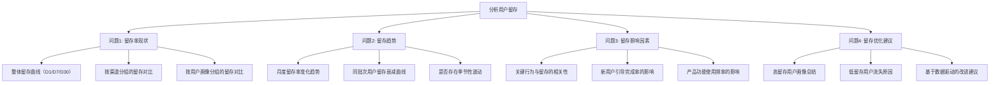
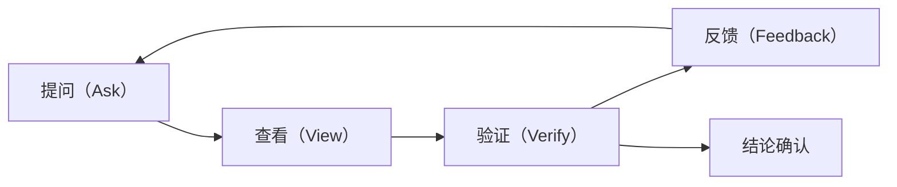

# Prompt工程 — 数据分析场景下的AI对话设计方法

> [!abstract] 核心观点
> 数据分析场景下的Prompt工程不同于通用Prompt。它要求**结构化、可验证、可迭代**，核心目标是让AI生成的代码和分析结论能被人类审查和信任。通用的"写一首诗"式的Prompt可以天马行空，但数据分析的Prompt必须严谨、可复现。

---

## 一、数据分析Prompt vs 通用Prompt

| 维度 | 通用Prompt | 数据分析Prompt |
|------|-----------|---------------|
| **目标** | 创意生成、信息获取 | 精确分析、可验证结论 |
| **输出要求** | 自然语言流畅即可 | 代码+结果+解释，缺一不可 |
| **错误容忍** | 高（"差不多"即可） | 低（数值错误不可接受） |
| **迭代方式** | 重新生成 | 基于中间结果逐步修正 |
| **上下文依赖** | 低（通常独立） | 高（依赖数据结构和业务背景） |
| **验证手段** | 主观判断 | 代码执行、统计检验 |

> [!warning] 关键区别
> 通用Prompt的"好"是主观感受，数据分析Prompt的"好"是客观可验证的。在数据分析中，一个Prompt是否成功，取决于它是否生成了**可执行、可复现、结果正确**的分析代码。

---

## 二、数据分析专用Prompt模板库

### 模板1：数据探索模板

```
请分析以下数据的分布特征、异常值、缺失情况：

数据背景：[描述数据来源、时间范围、记录数]
字段说明：[列出关键字段及含义]
分析要求：
1. 对每个数值字段进行分布描述（均值、中位数、标准差、四分位数）
2. 用箱线图或直方图识别异常值，说明异常值的判断标准
3. 统计各字段的缺失率，评估缺失模式（随机缺失/非随机缺失）
4. 输出可执行的Python代码，并附上关键结论
```

> [!tip] 使用场景
> 拿到新数据集后的第一步分析。此模板确保你不会遗漏数据质量检查的关键步骤。参考自AskTable转型指南 [$TRAE_REF](https://www.asktable.com/zh-CN/articles/2026-03-04/data-analyst-transformation-guide-sql-to-ai-prompt-engineer)

### 模板2：统计分析模板

```
请对以下数据进行描述性统计和假设检验：

数据：[粘贴数据或描述数据位置]
分析目标：[说明要验证的假设或要回答的问题]
变量类型：[自变量/因变量、连续/分类]
检验方法偏好：[如t检验、卡方检验、ANOVA等]
显著性水平：[默认0.05]
要求：
1. 先进行描述性统计，给出关键指标
2. 选择适合的假设检验方法，说明选择理由
3. 报告检验结果（统计量、p值、效应量）
4. 对结果给出业务解读
5. 输出完整可执行的Python代码
```

### 模板3：趋势分析模板

```
请分析以下时间序列数据的趋势、周期性和异常波动：

数据：[时间序列数据，含日期列和数值列]
时间粒度：[日/周/月/季/年]
分析周期：[如近12个月、近3年]
业务背景：[如销售数据、用户活跃度、转化率等]
要求：
1. 分解时间序列的趋势成分、季节成分和残差成分
2. 判断是否存在显著趋势（上升/下降/平稳）
3. 识别周期性模式（周周期/月周期/年周期）
4. 标注异常波动点，结合业务背景给出可能原因
5. 预测未来3个周期的走势（附置信区间）
6. 输出Python代码和可视化图表
```

### 模板4：对比分析模板

```
请对比以下两组数据，分析差异的统计显著性：

对照组：[数据A的描述或数据]
实验组：[数据B的描述或数据]
对比指标：[要对比的核心指标]
业务背景：[说明两组数据的业务含义]
要求：
1. 计算两组数据的描述性统计（均值、中位数、标准差）
2. 选择合适的统计检验方法（说明选择理由）
3. 报告p值和效应量（Cohen's d或类似指标）
4. 判断差异是否具有统计显著性
5. 给出业务层面的解读和建议
6. 输出完整可执行的Python代码
```

### 模板5：归因分析模板

```
请对以下指标的波动进行归因分析：

指标名称：[如DAU、GMV、转化率等]
当前值：[当前周期数值]
对比值：[上一周期或去年同期数值]
变动幅度：[绝对值或百分比变化]
数据维度：[可按地区/渠道/用户群/产品线等维度拆解]
业务背景：[说明指标定义和业务含义]
要求：
1. 对指标变化进行拆解，计算各维度贡献度
2. 识别主要驱动因素（贡献度排序）
3. 判断哪些因素是结构性变化，哪些是随机波动
4. 排除可能的"辛普森悖论"（即整体趋势与分组趋势相反）
5. 输出Python代码和归因分析结果
```

> [!note] 模板使用原则
> 以上模板不是"复制粘贴即可"，而是需要根据实际数据情况调整。关键是根据你的分析目标选择合适的模板，并根据中间结果进行迭代。

---

## 三、清晰表达需求的技巧：模糊到清晰

### 对比示例

| 模糊表达 | 问题 | 清晰表达 |
|---------|------|---------|
| "分析一下这些数据" | 目标不明确，AI不知道分析什么 | "分析这份用户活跃数据的日趋势和周末效应" |
| "看看有什么问题" | 问题定义模糊 | "检查数据中是否存在异常值，异常判断标准为超过均值3倍标准差" |
| "做个统计" | 统计方法不明确 | "对A/B两组数据进行独立样本t检验，显著性水平0.05" |
| "预测未来" | 预测范围和方法不明确 | "使用ARIMA模型预测未来30天的日活跃用户数，给出95%置信区间" |
| "对比一下" | 对比维度和指标缺失 | "对比实验组和对照组在7天留存率上的差异，计算p值和效应量" |

### 清晰表达四要素

1. **明确数据来源**：告诉AI数据是什么、从哪里来、结构如何
2. **定义分析目标**：用一句话说清楚你想回答什么问题
3. **指定输出格式**：代码、表格、图表、结论？要求什么就给什么
4. **提供业务上下文**：让AI理解数据背后的业务逻辑，避免"正确的废话"

> [!example] 从模糊到清晰实战
> - 模糊："分析用户数据"
> - 清晰："分析2026年6月新增注册用户的次日留存率，按渠道分组（iOS/Android/Web），计算每组留存率及95%置信区间，并检验渠道间留存率差异是否显著"
> - 前者AI可能输出一堆无关图表，后者AI能精确执行你的分析意图

---

## 四、复杂分析问题的分解策略

### 问题分解示例：从"分析用户留存"到可执行步骤



### 分解原则

1. **MECE原则**（Mutually Exclusive, Collectively Exhaustive）：子问题之间不重叠、不遗漏
2. **从宏观到微观**：先了解整体，再深入细节
3. **从描述到诊断**：先回答"是什么"，再回答"为什么"
4. **可执行性检查**：每个子问题都要能用数据回答

> [!tip] 与多LLM协作架构的关联
> 问题分解后的每个子问题可以分配给不同的LLM实例并行分析，再汇总结果。这正是 [[06-数据分析/AI数据分析/13_方法_多LLM协作架构]] 中提到的"生成+审阅+验证"模式的实践基础。

---

## 五、验证与纠正的迭代循环

### 迭代循环模型



### 各阶段要点

| 阶段 | 操作 | 示例 |
|------|------|------|
| **提问** | 明确需求，使用模板 | "请分析2026年Q2的销售数据趋势" |
| **查看** | 检查AI输出的代码和结果 | 代码是否可执行？逻辑是否合理？ |
| **验证** | 交叉验证关键数据点 | 用SQL或Excel验证AI计算的某个数值 |
| **反馈** | 指出错误，要求修正 | "这里的计算方法不正确，应该用加权平均而非简单平均" |
| **结论确认** | 确认最终结果可用 | "结果已验证，可以输出最终报告" |

> [!danger] 常见陷阱
> 不要跳过"验证"步骤直接信任AI的输出。数据分析中最危险的错误往往是看起来"很合理"的错误。详见 [[06-数据分析/AI数据分析/14_方法_AI幻觉检测与数据质量]]。

---

## 六、常见Prompt错误

### 错误1：过于模糊

> [!failure] 错误示例
> "分析一下销售数据"

> [!success] 正确示例
> "分析2026年1月至6月的月度销售数据，按产品线分组，计算各产品线的环比增长率、同比增长率，并识别增长最快的产品线"

### 错误2：缺少上下文

> [!failure] 错误示例
> "做t检验"

> [!success] 正确示例
> "对A/B测试数据做独立样本t检验。A组是旧版首页（n=5000），B组是新版首页（n=5000），指标是点击率。显著性水平0.05。请给出检验结果和业务解读"

### 错误3：一次问太多

> [!failure] 错误示例
> "分析这些数据，包括用户画像、留存率、转化率、收入、渠道效果、活动效果、竞品分析、市场趋势，还要做预测和归因分析"

> [!success] 正确示例
> "我们先分析用户画像和留存率，后续再分析转化率和收入。"（分步处理）

### 错误4：不提供反馈

> [!failure] 错误示例
> 第一次输出不满意，直接重新开始一个新对话

> [!success] 正确示例
> "你刚才的分析中，第3点的计算方法有误，应该使用同期群分析而非简单平均。请重新计算并修正"

### 错误5：忽略数据安全

> [!failure] 错误示例
> 将包含用户隐私的原始数据直接粘贴到AI对话中

> [!success] 正确示例
> 对数据脱敏后，只提供必要的统计摘要和字段定义

---

## 七、总结：数据分析Prompt工程的核心原则

1. **结构化胜过自由发挥**：使用模板确保不遗漏关键要素
2. **可验证是底线**：所有分析结果必须能被交叉验证
3. **迭代优于一次完成**：先做数据探索，再做深入分析
4. **上下文至关重要**：提供足够的业务背景和数据定义
5. **与多LLM架构配合**：Prompt工程与 [[06-数据分析/AI数据分析/13_方法_多LLM协作架构]] 结合，可以让一个模型生成分析方案，另一个模型审阅校验

> [!quote] 参考来源
> 本文Prompt模板和技巧部分参考自AskTable《数据分析师转型指南：从SQL到AI Prompt工程师》[$TRAE_REF](https://www.asktable.com/zh-CN/articles/2026-03-04/data-analyst-transformation-guide-sql-to-ai-prompt-engineer)