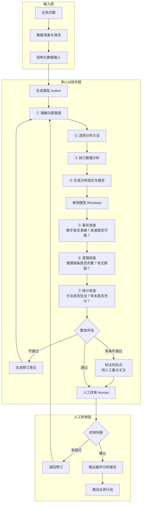

# 多LLM协作架构 — 生成+审阅+验证

> [!abstract] 核心观点
> 用AI做数据分析，最大的风险不是AI不够聪明，而是**你相信了AI的"一本正经胡说八道"**。多LLM协作架构的核心思路是：让一个模型负责生成分析方案，另一个独立的模型负责审阅和校验，再加上人工终审，形成三道防线。

---

## 一、为什么需要多LLM协作？

### 1.1 单一模型的固有问题

| 问题 | 表现 | 后果 |
|------|------|------|
| **自我验证偏差** | 模型不会质疑自己的输出 | 错误被当作正确，一路往下推演 |
| **知识盲区** | 模型在训练数据不足的领域自信胡说 | 编造统计数据、虚构案例 |
| **逻辑一致性差** | 长推理链条中容易断裂 | 看似合理的结论，中间步骤是错的 |
| **统计方法误用** | 模型可能选错分析方法 | 用相关性冒充因果性 |

### 1.2 多LLM协作的核心思想

> **一个模型写答案，另一个模型改作业。**

这不是简单的"多问几次取平均"，而是有明确分工的协作架构：

- **生成模型（Author）**：负责分析方案设计、数据探索、结论生成
- **审阅模型（Reviewer）**：负责事实核查、逻辑校验、统计方法验证
- **人工终审（Human）**：负责业务判断、价值取舍、最终决策

---

## 二、架构设计

### 2.1 整体架构



### 2.2 三轮校验机制

每一轮校验都有明确的检查清单：

**第一轮：事实核查**

| 检查项 | 说明 |
|--------|------|
| 数字准确性 | 报告中的统计数据与实际数据是否一致 |
| 来源可追溯 | 每个结论能否追溯到原始数据或计算过程 |
| 单位一致性 | 金额单位（万/亿）、时间单位（日/月/年）是否统一 |
| 异常值处理 | 是否识别并处理了异常值，而非直接忽略 |

**第二轮：逻辑核查**

| 检查项 | 说明 |
|--------|------|
| 推理链条完整性 | 从数据到结论的每一步推理是否合理 |
| 因果方向正确性 | 是否混淆了相关性和因果性 |
| 假设合理性 | 分析中隐含的假设是否成立 |
| 归因充分性 | 对变化的解释是否考虑了主要因素 |

**第三轮：统计核查**

| 检查项 | 说明 |
|--------|------|
| 方法选择恰当性 | 使用的统计方法是否适合当前数据类型和分布 |
| 样本量充足性 | 结论是否基于足够大的样本 |
| 置信区间表达 | 是否给出了不确定性范围 |
| 对比组合理性 | 对比分析中的对照组是否合理 |

---

## 三、实施方案

### 3.1 方案选择

| 方案 | 成本 | 保障程度 | 适用场景 | 说明 |
|------|------|---------|---------|------|
| **低成本方案** | 低 | 中等 | 日常分析、快速探索 | 同一个模型分角色，用不同Prompt区分Author和Reviewer角色 |
| **标准方案** | 中 | 较高 | 业务报告、常规决策 | 使用两个不同模型（如DeepSeek生成 + Claude审阅） |
| **高保障方案** | 高 | 最高 | 重要决策、合规分析 | 三个不同模型 + 人工终审 + 审计日志 |

### 3.2 低成本方案Prompt示例

**生成角色Prompt**：
```
你是一位资深数据分析师。请基于以下数据，完成分析任务：
1. 理解业务问题
2. 选择恰当的分析方法
3. 执行分析计算
4. 输出分析结论

数据：[粘贴数据]
问题：[描述业务问题]
```

**审阅角色Prompt**：
```
你是一位严格的数据分析审阅专家。请对以下分析报告进行三轮审查：
1. 事实核查：数字是否准确？来源是否可靠？
2. 逻辑核查：推理链条是否完整？有无断裂？
3. 统计核查：方法是否恰当？样本是否充分？

请在每项核查后给出：✅通过 / ⚠️有问题 / ❌不通过
如有问题，请给出具体修订建议。

分析报告：[粘贴生成模型的分析报告]
```

### 3.3 标准方案实施步骤

```
步骤1: 准备数据
  ├── 数据清洗与预处理
  └── 明确分析目标和问题

步骤2: 模型A（生成）
  ├── 输入：业务问题 + 数据
  ├── 输出：分析报告（含方法、过程、结论）
  └── 保存：分析过程日志

步骤3: 模型B（审阅）
  ├── 输入：模型A的分析报告
  ├── 三轮核查
  └── 输出：审阅意见（通过/修订）

步骤4: 迭代修订
  ├── 审阅不通过 → 反馈给模型A修订
  └── 审阅通过 → 进入人工终审

步骤5: 人工终审
  ├── 关注审阅模型标注的风险点
  ├── 结合业务背景做最终判断
  └── 确认输出或退回修订
```

---

## 四、与现有文档的整合

本文是对 [[06-数据分析/AI数据分析/00_AI数据分析方案总纲]] 中"多LLM协作架构"部分的深度扩展，将原来的架构图和工作流程做了更细化的拆解。

**两篇文档的关系**：

| 维度 | [[06-数据分析/AI数据分析/00_AI数据分析方案总纲]] | 本文 |
|------|------------------------|------|
| 定位 | 总纲，快速概览 | 方法篇，深度拆解 |
| 深度 | 架构图 + 简述 | 架构图 + 三轮校验清单 + 实施步骤 + Prompt示例 |
| 适用场景 | 快速了解 | 实际落地参考 |

---

## 五、常见陷阱与应对

### 陷阱1：两个模型用同一个供应商

**问题**：如果两个模型有相同的训练数据和相同的偏见，审阅就失去了意义。

**应对**：尽量使用不同供应商的模型（如DeepSeek + Claude），或者至少使用不同参数规模的版本。

### 陷阱2：审阅模型过于"礼貌"

**问题**：很多模型倾向于"同意"而不是"批评"，导致审阅流于形式。

**应对**：在审阅Prompt中强调"严格"、"挑剔"、"不要放过任何问题"，甚至可以要求审阅模型先找出3个问题再给出综合评价。

### 陷阱3：迭代次数过多

**问题**：生成→审阅→修订的循环可能无限进行下去。

**应对**：设定最大迭代次数（建议3轮），超过后自动升级到人工终审。

---

## 六、AI辅助建议

> [!tip] 实践建议
> 如果你是第一次尝试多LLM协作，建议从**低成本方案**开始：
> 1. 用同一个模型，先写生成Prompt，再写审阅Prompt
> 2. 跑一次完整流程，感受一下"写答案"和"改作业"的差异
> 3. 记录审阅模型发现的问题类型，积累经验
> 4. 熟练后升级到两个不同模型的标准方案

---

## 关联笔记

- [[06-数据分析/AI数据分析/00_AI数据分析方案总纲]] — 总纲文档，含原始架构图
- [[06-数据分析/AI数据分析/14_方法_AI幻觉检测与数据质量]] — AI幻觉的类型与检测方法
- [[06-数据分析/AI数据分析/15_方法_RAG在数据分析中的应用]] — RAG与多LLM协作的配合
- [[06-数据分析/AI数据分析/01_认知_为什么AI数据分析不是自动做报表]] — AI数据分析的本质认知
- [[06-数据分析/AI数据分析/00_MOC_AI数据分析中枢]] — 返回中枢索引