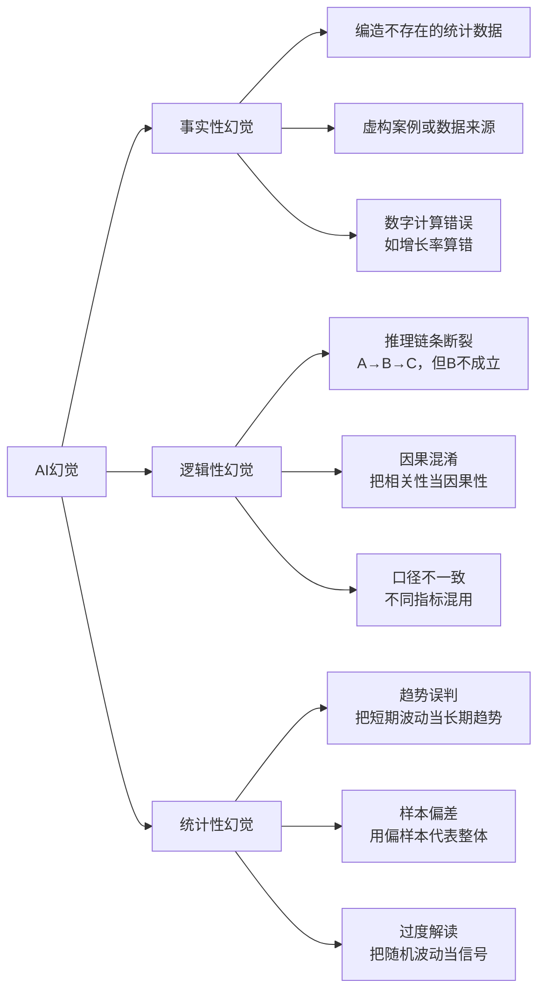
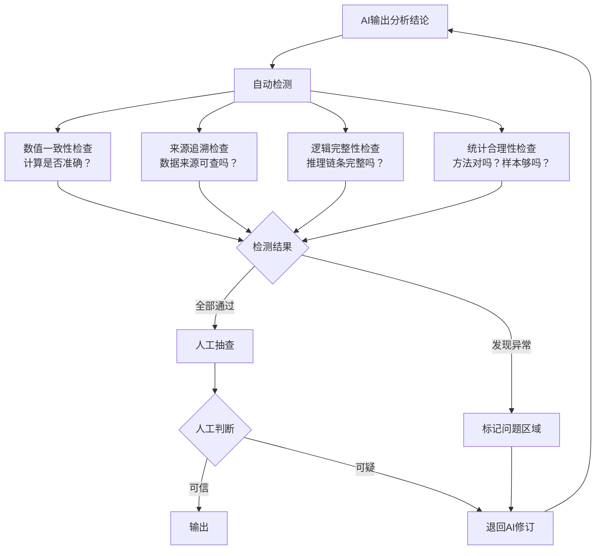
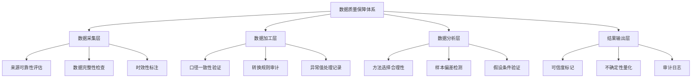

# AI幻觉检测与数据质量保障

> [!abstract] 核心观点
> AI的语言能力很强，但它能自信地解释错误数据。传统报表里，错误可能表现为一个数字不对；AI分析里，错误会扩展成一整套看似合理的叙事。**检测AI幻觉不是靠"感觉"，而是靠系统化的检查方法和数据质量保障体系。**

---

## 一、数据分析场景的AI幻觉类型

### 1.1 三大幻觉类型



### 1.2 各类型详解

**事实性幻觉** — 最常见的AI幻觉类型

| 场景 | 典型表现 | 案例 |
|------|---------|------|
| 编造数据 | AI说"某公司2025年营收增长35%"，实际数据是18% | 面试中AI可能编造候选人过去的工作数据 |
| 虚构来源 | AI引用"某研究显示"，但该研究不存在 | 招聘分析中编造行业薪酬报告数据 |
| 计算错误 | 增长率计算错误、占比加总不等于100% | 渠道转化率计算时分子分母用错 |

**逻辑性幻觉** — 最隐蔽的AI幻觉类型

| 场景 | 典型表现 | 案例 |
|------|---------|------|
| 推理断裂 | 前提A到结论B之间缺少关键步骤 | 从"面试通过率下降"直接跳到"招聘渠道有问题" |
| 因果混淆 | 把相关性当作因果性，忽略混淆变量 | "使用AI面试的企业离职率更低" → 可能是这些企业本身管理更好 |
| 口径混用 | 不同指标的口径不一致但被当作同一维度 | 把"简历筛选通过率"和"面试通过率"混在一起分析 |

**统计性幻觉** — 最容易被忽视的AI幻觉类型

| 场景 | 典型表现 | 案例 |
|------|---------|------|
| 趋势误判 | 把短期波动当成长期趋势 | 一个月的数据下降就说"持续下滑" |
| 样本偏差 | 忽略样本代表性的问题 | 用10个候选人的数据推断整体招聘效果 |
| 过度解读 | 把随机波动当作有意义的信号 | 渠道A转化率3.2%，渠道B转化率3.5%，说"B显著优于A"（实际可能只是随机波动） |

---

## 二、AI幻觉检测方法

### 2.1 检测流程



### 2.2 自动检测清单

**数值一致性检查**

```
□ 所有加总是否等于100%（占比类指标）
□ 增长率计算是否正确（(新-旧)/旧）
□ 平均值/中位数/众数是否合理
□ 极值是否被识别和标注
□ 不同报告中的同一数字是否一致
```

**来源追溯检查**

```
□ 每个数字是否标注了数据来源
□ 数据时间范围是否明确
□ 数据口径定义是否清晰
□ 是否区分了"实际数据"和"估算数据"
□ 估算数据是否标注了估算方法
```

**逻辑完整性检查**

```
□ 从数据到结论的推理步骤是否完整
□ 结论是否考虑了替代解释
□ 是否识别了可能的混淆变量
□ 归因分析是否考虑了多个因素
□ 是否标注了不确定性和局限性
```

**统计合理性检查**

```
□ 样本量是否足够支撑结论
□ 是否标注了置信区间或误差范围
□ 对比分析中对照组是否合理
□ 是否区分了统计显著性和实际显著性
□ 时间序列分析是否考虑了季节性
```

### 2.3 人工检测技巧

| 技巧 | 说明 | 例子 |
|------|------|------|
| **三角验证法** | 对同一个问题，用三种不同角度验证 | 问AI"这个月招聘数据如何"，再问"对比上个月有什么变化"，再问"哪个渠道表现最好"，看三个答案是否一致 |
| **反向提问法** | 让AI从结论反推数据 | "你说渠道A转化率最高，那你看看渠道A的原始数据是怎么样的" |
| **边界测试法** | 测试AI在极端情况下的表现 | "如果数据量只有10条，这个结论还成立吗？" |
| **交叉验证法** | 用不同模型验证同一个结论 | 分别用DeepSeek和Claude分析同一组数据，对比结果 |

---

## 三、数据质量保障体系

### 3.1 数据质量金字塔

AI 数据分析必须有比传统 BI 更强的数据治理，因为错误会通过AI的表达能力被放大。



### 3.2 数据质量检查清单

**分析前检查**：

```
□ 数据来源是否可靠（一手数据/二手数据/估算数据）
□ 数据时间范围是否明确标注
□ 数据是否存在缺失值，如何处理
□ 数据是否存在异常值，是否识别
□ 同一指标在不同数据源中的口径是否一致
□ 数据量是否足够支撑目标分析
```

**分析中检查**：

```
□ AI选择的分析方法是否适合数据类型
□ 分析假设是否合理（如正态分布假设）
□ 是否考虑了可能的混淆变量
□ 分组/分类的逻辑是否合理
□ 对比分析中的基准是否合理
```

**分析后检查**：

```
□ 结论是否有数据支撑
□ 是否给出了不确定性范围
□ 是否区分了相关性和因果性
□ 结果是否可复现
□ 分析过程是否可追溯
```

---

## 四、实战：AI数据分析的"沙箱"机制

### 4.1 什么是分析沙箱

在正式使用AI分析结果之前，先在一个隔离环境中进行验证。沙箱的核心原则是：

1. **隔离**：AI分析结果不直接进入决策流程
2. **验证**：在沙箱中完成所有检查后再输出
3. **可逆**：发现问题可以随时回退

### 4.2 沙箱工作流

```
步骤1: AI生成初步分析
  ↓
步骤2: 进入沙箱
  ├── 自动检查（数值/逻辑/统计）
  ├── 多LLM交叉验证
  └── 人工抽检
  ↓
步骤3: 沙箱输出
  ├── ✅ 可信 → 进入决策流程
  ├── ⚠️ 有条件 → 标注风险点后进入
  └── ❌ 不可信 → 退回修订
  ↓
步骤4: 存档
  ├── 审计日志（记录每一步）
  └── 分析过程文件（可追溯）
```

---

## 五、AI辅助建议

> [!tip] 实践建议
> 1. **从"小数据"开始**：先用小样本数据测试AI分析，验证其推理过程是否合理
> 2. **建立检查清单**：把本文的检查清单打印出来，每次用AI分析时对照检查
> 3. **保留原始数据**：AI的分析过程可能修改数据，始终保留一份原始数据备份
> 4. **记录错误模式**：记录AI经常犯的错误类型，形成自己的"AI错误模式库"
> 5. **不要相信"看起来很合理"**：AI的分析报告往往看起来很专业，但专业的外表下可能藏着严重的错误

---

## 关联笔记

- [[06-数据分析/AI数据分析/13_方法_多LLM协作架构]] — 生成+审阅+验证的协作架构
- [[06-数据分析/AI数据分析/00_AI数据分析方案总纲]] — 总纲中的AI幻觉相关章节
- [[06-数据分析/AI数据分析/15_方法_RAG在数据分析中的应用]] — RAG如何减少AI幻觉
- [[06-数据分析/AI数据分析/22_治理_可信度评估]] — 分析结果的可信度标记体系
- [[06-数据分析/AI数据分析/00_MOC_AI数据分析中枢]] — 返回中枢索引