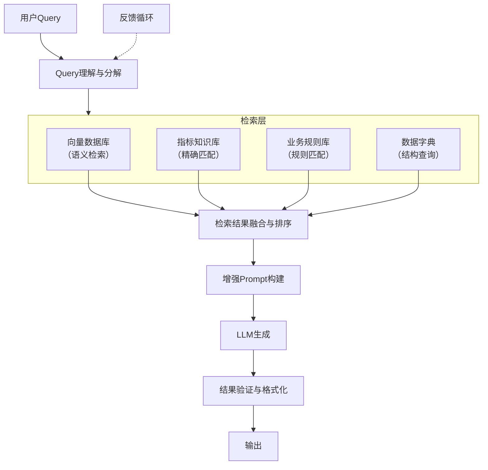
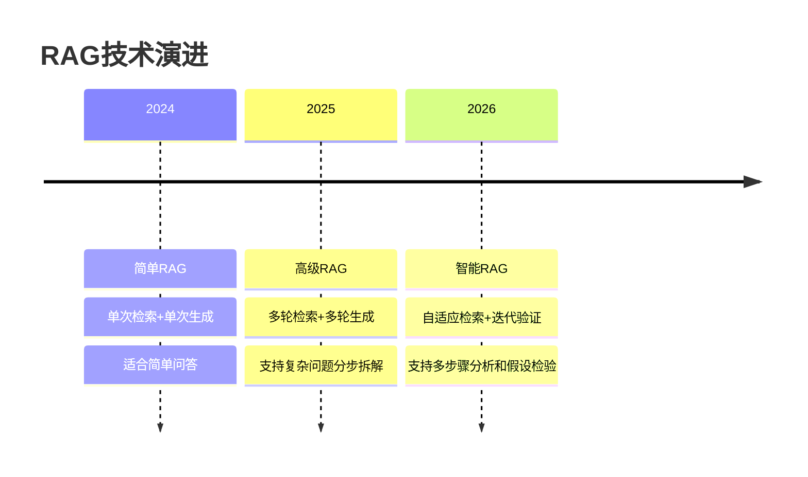

# RAG在数据分析中的应用 — 检索增强生成赋能数据驱动决策

> [!abstract] 核心观点
> RAG（Retrieval-Augmented Generation）让AI在数据分析中基于**真实数据源和业务知识库**来回答问题，而非仅依赖训练阶段的记忆。这大幅降低了AI幻觉风险，使分析结果可追溯、可验证。对于数据分析场景，RAG不是"锦上添花"，而是"雪中送炭"。

---

## 一、RAG在数据分析中的价值

### 传统LLM数据分析的痛点

| 痛点 | 表现 | 后果 |
|------|------|------|
| **知识截止日期** | 模型不知道最新数据 | 引用过时的指标定义或业务规则 |
| **数据幻觉** | 模型编造不存在的指标 | 汇报中使用了错误的数字 |
| **上下文窗口限制** | 无法一次性加载大量业务文档 | 遗漏关键的业务约束条件 |
| **缺乏领域知识** | 不理解行业特有的指标口径 | 给出通用的、不准确的建议 |

### RAG如何解决这些问题

RAG通过在LLM生成回答之前，从外部知识库中检索相关信息，将检索结果作为上下文注入Prompt，让AI基于**真实、最新、经过审核**的信息来生成分析结果。

> [!success] RAG在数据分析中的核心价值
> 从"AI凭记忆回答"转变为"AI带着资料回答"。每一个数据定义、每一个指标口径、每一条业务规则，都有据可查、有源可溯。

---

## 二、RAG架构设计

### 数据分析RAG架构图



### 架构说明

1. **Query理解与分解**：将用户的自然语言问题拆解为可检索的子问题，识别需要查询的指标、维度、时间范围
2. **多路检索**：同时从向量数据库、指标知识库、业务规则库、数据字典中检索相关信息
3. **结果融合与排序**：对多路检索结果进行去重、排序、相关性评分
4. **增强Prompt构建**：将检索结果作为上下文注入Prompt，指导LLM基于这些信息生成回答
5. **结果验证与格式化**：检查生成结果是否与检索到的知识一致，格式化输出

> [!tip] 与多LLM协作架构的结合
> 此架构中的"结果验证与格式化"环节可以与 [[06-数据分析/AI数据分析/13_方法_多LLM协作架构]] 中的"审阅模型"角色结合，由独立的LLM实例验证生成结果是否忠实于检索到的知识。

---

## 三、RAG技术进化：2025-2026

### 从简单RAG到高级RAG



### 高级RAG在数据分析中的关键能力

1. **多轮检索**：针对复杂分析问题，先检索指标定义，再检索数据，最后检索业务规则
2. **多轮生成**：先生成分析框架，再逐步填充数据，最后验证结论
3. **分步拆解与验证**：将"分析用户留存"拆解为"定义留存指标"、"查询留存数据"、"计算留存率"、"对比留存趋势"等步骤，每步检索相关信息并验证

> [!quote] 技术趋势参考
> 以上RAG技术演进趋势参考自行业技术分析报告 [$TRAE_REF](https://metb.box.lenovo.com/en/news/detail/c99864e3fb22d8a38cc2afafbf7ba058.html)

---

## 四、数据分析中的三个关键知识库

### 1. 指标知识库

| 指标名称 | 定义 | 计算公式 | 口径说明 |
|---------|------|---------|---------|
| 日活跃用户（DAU） | 每日至少访问一次产品的独立用户数 | COUNT(DISTINCT user_id) | 去重，同一用户多次访问计为1 |
| 用户留存率 | 新增用户在指定时间后仍活跃的比例 | D7留存 = 第7天活跃用户 / 第0天新增用户 | 按自然日计算，非按小时 |
| 转化率 | 完成目标转化的用户占比 | 转化用户数 / 总用户数 | 按用户级别，非按会话级别 |

> [!important] 指标知识库的作用
> 解决AI"不知道指标口径"的问题。同一指标在不同业务场景下口径可能完全不同，没有指标知识库，AI的分析结果就是"无根之木"。

### 2. 业务规则库

```
业务规则示例：
1. 季度末最后一周不做重大产品变更
2. 节假日期间用户活跃度低于平时，需做季节调整
3. 渠道投放的ROI计算周期为14天归因窗口
4. 用户等级划分标准：L0=未激活, L1=注册用户, L2=付费用户, L3=高活跃付费用户
5. 数据异常的定义：指标波动超过3倍标准差，或连续3天同向变化
```

### 3. 数据字典

| 字段名 | 类型 | 含义 | 所属表 | 关联关系 |
|--------|------|------|--------|---------|
| user_id | INT | 用户唯一标识 | user_profile | 主键 |
| reg_date | DATE | 注册日期 | user_profile | - |
| last_active | DATE | 最后活跃日期 | user_activity | 关联user_profile.user_id |
| payment_amount | DECIMAL | 支付金额 | user_payment | 关联user_profile.user_id |

---

## 五、RAG适合做什么与不适合做什么

### RAG适合做的事情

| 场景 | 说明 | 效果 |
|------|------|------|
| 数据查询与解释 | 基于数据字典回答字段含义 | 减少幻觉，回答准确 |
| 指标计算 | 基于指标口径计算指标值 | 口径一致，结果可复现 |
| 报告生成 | 基于实际数据生成分析报告 | 数据真实，结论可靠 |
| 异常检测 | 基于业务规则判断数据异常 | 规则一致，误报率低 |
| 知识问答 | 基于知识库回答业务问题 | 答案有据可查 |

### RAG不适合做的事情

| 场景 | 原因 | 替代方案 |
|------|------|---------|
| 因果推理 | RAG只能检索已有知识，无法进行反事实推理 | 人工设计实验 + [[06-数据分析/AI数据分析/16_方法_从描述到因果分析]] |
| 创造性分析 | RAG受限于检索到的知识，难以产生突破性洞察 | 人工主导 + AI辅助 |
| 价值判断 | 什么是"重要"的洞察，RAG无法判断 | 人工判断 |
| 假设提出 | RAG倾向于检索已有结论，难以提出新的假设 | 人工思考 + 数据探索 |

> [!warning] 警惕过度依赖RAG
> RAG是减少幻觉的工具，不是解决所有分析问题的万能钥匙。当分析需要因果推理、创造性思维或价值判断时，人工主导仍然是不可替代的。详见 [[06-数据分析/AI数据分析/01_认知_为什么AI数据分析不是自动做报表]]。

---

## 六、实践建议：如何构建数据分析的RAG知识库

### 构建步骤

1. **梳理现有知识资产**：整理已有的指标文档、业务规则、数据字典
2. **知识结构化**：将非结构化文档转为结构化格式（表格、键值对、JSON）
3. **向量化存储**：使用Embedding模型将知识转换为向量，存入向量数据库
4. **建立检索策略**：设计多路检索策略，配置语义检索和精确匹配的比例
5. **评估与迭代**：用测试集评估检索准确率，持续优化

### 知识库维护原则

- **版本管理**：每个知识文档都有版本号，记录变更历史
- **审核机制**：知识入库前需要业务负责人审核确认
- **定期更新**：业务规则变化时及时更新知识库
- **质量监控**：监控AI检索知识库的准确率和召回率

> [!tip] 与Prompt工程结合
> 构建好的RAG知识库需要与 [[06-数据分析/AI数据分析/12_方法_Prompt工程]] 中的模板配合使用。一个好的Prompt应该明确告诉AI"请先检索指标知识库获取指标口径，再基于口径计算指标值"。

---

## 七、总结

1. RAG让AI数据分析从"凭记忆回答"变为"带着资料回答"
2. 三个关键知识库（指标知识库、业务规则库、数据字典）是RAG在数据分析中落地的基础
3. 2025-2026年RAG技术已进化到支持多轮检索+多轮生成，能处理复杂分析问题
4. RAG擅长减少幻觉和提升准确性，但不适合因果推理和创造性分析
5. RAG与多LLM协作架构（[[06-数据分析/AI数据分析/13_方法_多LLM协作架构]]）结合，可以形成更强大的数据分析能力

> [!quote] 参考来源
> RAG技术趋势分析参考自相关技术报告 [$TRAE_REF](https://metb.box.lenovo.com/en/news/detail/c99864e3fb22d8a38cc2afafbf7ba058.html)