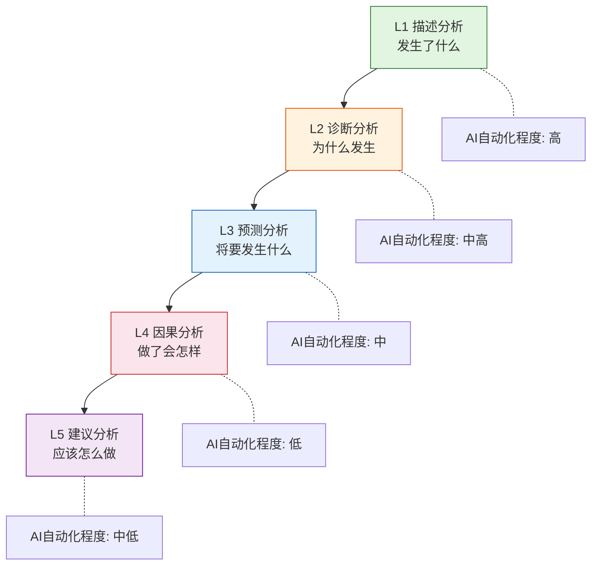
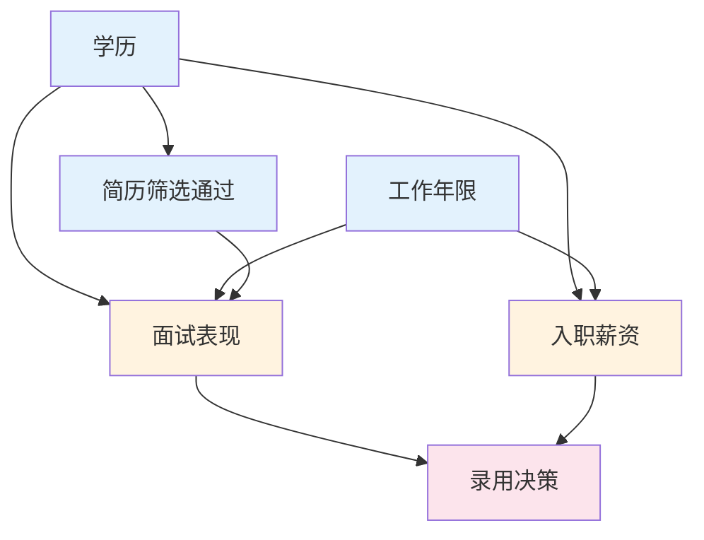
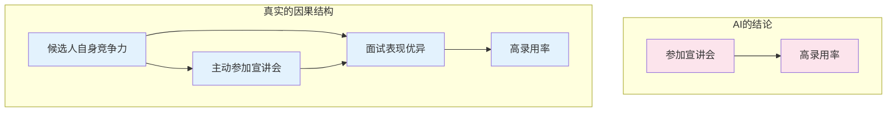
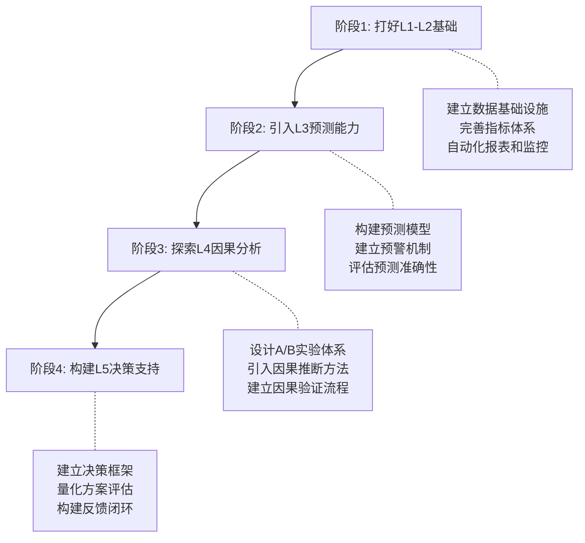

# 从描述到因果分析 — AI在数据分析中的能力边界与进阶路径

> [!abstract] 核心观点
> AI在数据分析中的能力呈现明显的层次结构：**描述分析**可高度自动化，**诊断分析**需人工辅助，**因果分析**必须人工主导。理解这个能力边界，才能正确使用AI，避免"用相关冒充因果"的常见陷阱。

---

## 一、分析深度五层模型

### 五层模型架构

### 各层详解

| 层级 | 核心问题 | AI能力 | 人工角色 | 自动化程度 |
|------|---------|--------|---------|-----------|
| L1 描述分析 | 发生了什么 | **强**：自动生成报表、数据可视化、异常检测 | 定义分析目标，解读结果 | 高 |
| L2 诊断分析 | 为什么发生 | **中强**：自动钻取、归因拆解、模式识别 | 验证因果假设，排除干扰因素 | 中高 |
| L3 预测分析 | 将要发生什么 | **中**：时序预测、回归建模、分类预测 | 选择模型，评估预测质量 | 中 |
| L4 因果分析 | 做了会怎样 | **弱**：辅助实验设计、结果解读 | 实验设计、反事实推理、业务判断 | 低 |
| L5 建议分析 | 应该怎么做 | **中低**：生成方案建议、利弊分析 | 做决策、承担后果 | 中低 |

---

## 二、AI在每层的能力与局限

### L1 描述分析：AI可高度自动化

> [!success] AI能力
> - 自动生成日报/周报/月报
> - 数据可视化（折线图、柱状图、热力图等）
> - 异常值检测和预警
> - 数据质量检查（缺失值、重复值、异常值）

> [!failure] AI局限
> - 无法判断"什么指标值得关注"——需要人工设定分析目标
> - 可能过度关注统计上的异常而忽略业务上的重要信号
> - 可视化风格选择可能不符合业务场景

### L2 诊断分析：AI辅助+人工确认

> [!success] AI能力
> - 自动钻取：按维度下钻分析
> - 归因拆解：计算各因素对指标变化的贡献度
> - 模式识别：发现数据中的关联模式
> - 自动生成诊断分析报告

> [!failure] AI局限
> - 识别的"原因"本质是相关性，不是因果性
> - 无法区分"真实原因"和"混杂因素"
> - 可能遗漏需要业务知识才能发现的深层原因

### L3 预测分析：AI建模+人工判断

> [!success] AI能力
> - 时间序列预测（ARIMA、Prophet、LSTM）
> - 回归分析和分类预测
> - 自动特征工程和模型选择
> - 预测区间和置信度估计

> [!failure] AI局限
> - 预测基于历史模式，无法预测"黑天鹅"事件
> - 对数据分布变化敏感（概念漂移问题）
> - 模型可解释性有限，难以解释预测依据

### L4 因果分析：AI辅助+人工设计

> [!success] AI能力
> - 辅助样本量计算和MDE（最小可检测效应）判断
> - A/B实验结果的统计分析
> - 提供因果推断的方法建议（DAG、工具变量等）
> - 辅助文献检索和因果证据整理

> [!failure] AI局限
> - **无法做反事实推理**：不能回答"如果不干预会怎样"
> - **无法设计实验**：实验设计需要领域知识和因果推理
> - **无法识别混杂变量**：哪些变量需要控制，AI无法判断
> - **无法验证因果假设**：因果关系的最终验证需要实验

### L5 建议分析：AI生成方案+人做决策

> [!success] AI能力
> - 基于数据生成行动建议
> - 列举各方案的利弊和风险
> - 生成决策框架和评估标准

> [!failure] AI局限
> - **无法承担决策责任**：方案选择需要人工判断
> - **无法权衡利益相关者**：不同方案的受益方和受损方需要人工评估
> - **建议可能脱离实际**：不考虑组织能力、资源约束、政治因素

> [!tip] 核心原则
> AI在分析中的角色是"助手"而非"替代者"。越是接近决策端的分析，越需要人工主导。这与 [[06-数据分析/AI数据分析/13_方法_多LLM协作架构]] 中"生成+审阅+验证"的理念一致。

---

## 三、为什么因果分析AI不能替代

### 因果分析的三个核心挑战

#### 1. 实验设计

因果推断的金标准是随机对照试验（RCT），但实验设计涉及大量人工判断：

- **如何定义干预**：什么是"处理组"和"对照组"
- **如何随机化**：个体层面还是集群层面随机化
- **如何控制**：哪些变量需要控制，哪些不能控制
- **样本量多大**：需要多少样本才能检测到预期效应

> [!example] 实验设计中的AI局限
> 问AI"要不要做A/B测试"，AI会回答"需要"。但问AI"这个业务场景下，实验组和对照组应该怎么划分，样本量需要多少，实验周期多长，核心指标是什么"，AI的答案需要人工逐一验证。

#### 2. 反事实推理

因果关系的核心是反事实：**"如果干预没有发生，结果会怎样？"**

- AI无法真正"想象"反事实场景
- AI只能基于已有数据做推断，但反事实本质上是"没有数据"的
- 高级因果推断方法（如DID、RDD、IV）需要人工判断假设是否满足

#### 3. 领域知识

因果推断离不开领域知识：

- 哪些变量是"因"、哪些是"果"——需要业务逻辑
- 哪些变量是"混杂变量"——需要行业经验
- 哪些变量是"中介变量"——需要理论支撑

> [!danger] AI的因果盲区
> AI可以告诉你"X和Y有显著相关性"，但无法告诉你"X是否导致Y"——因为相关性不等于因果性。AI也没有能力识别"辛普森悖论"在业务场景中的真实含义。

---

## 四、A/B实验评估的AI辅助

### AI在A/B实验中的辅助角色

- **绿色（AI可辅助）**：样本量计算、MDE判断、统计检验、结果可视化
- **橙色（AI辅助+人工确认）**：结果解读（p值、效应量、实际显著性）
- **红色（人工主导）**：决策建议（是否上线、是否有副作用）

### 关键统计概念

| 概念 | 说明 | AI能力 |
|------|------|--------|
| **样本量计算** | 需要多少样本才能检测到预期效应 | AI可自动计算 |
| **MDE（最小可检测效应）** | 给定样本量下能检测到的最小效应 | AI可自动计算 |
| **p值** | 结果由随机误差导致的概率 | AI可正确计算 |
| **效应量** | 实际差异的大小（Cohen's d等） | AI可正确计算 |
| **统计功效** | 在效应存在时正确检测到的概率 | AI可自动计算 |
| **实际显著性** | 统计上显著的效果是否业务上重要 | **需人工判断** |

---

## 五、相关性vs因果性的判断方法

### 常见因果推断方法

| 方法 | 适用场景 | 关键假设 | AI辅助程度 |
|------|---------|---------|-----------|
| **DAG（有向无环图）** | 理清变量间的因果关系结构 | 图的正确性由领域知识决定 | 低（AI无法判断变量间的关系方向） |
| **工具变量（IV）** | 存在不可观测的混杂变量 | 工具变量满足外生性和相关性条件 | 中（AI可辅助计算，但变量选择需人工） |
| **双重差分（DID）** | 政策评估、干预效果评估 | 平行趋势假设 | 中（AI可辅助计算，但假设验证需人工） |
| **断点回归（RDD）** | 阈值附近的干预效果 | 阈值附近随机化 | 中（AI可辅助分析，但断点选择需人工） |

### DAG示例：招聘数据中的因果关系

> [!note] DAG解读
> 上图展示了一个简单的招聘分析DAG。箭头表示因果关系方向。例如，学历影响面试表现（更优秀的学历可能对应更好的面试准备），同时也影响入职薪资。工作年限同样影响面试表现和薪资。面试表现和入职薪资共同影响录用决策。
>
> 如果我们要分析"学历对录用决策的影响"，就需要控制面试表现和入职薪资（中介变量），否则会得到有偏的估计。AI可以画出这个图，但**图的正确性**需要HR领域的专家确认。

---

## 六、AI在招聘分析中的因果误判案例

### 案例背景

某公司招聘运营团队发现：**"参加公司招聘宣讲会的候选人，最终录用率比未参加的候选人高30%"**。AI分析报告建议：加大招聘宣讲会投入。

### 因果误判分析

| 维度 | AI的误判 | 真实情况 |
|------|---------|---------|
| **结论** | 参加宣讲会提高录用率 | 高素质候选人更愿意参加宣讲会，而非宣讲会提升了素质 |
| **错误类型** | 混淆因果方向 | 自选择偏差（selection bias） |
| **纠正方法** | - | 需要控制候选人能力后，再比较参加与未参加的差异 |
| **数据需求** | 只看相关性 | 需要候选人能力测评数据、简历评分等 |

> [!warning] 误判的代价
> 如果基于这个误判加大宣讲会投入，实际上是"把钱花在了已经优秀的候选人身上"，而非"通过宣讲会提升了候选人质量"。这正是 [[06-数据分析/AI数据分析/17_实战_招聘运营数据分析]] 中要重点防范的分析陷阱。

---

## 七、从描述到因果的进阶路径

### 五层进阶路径

### 各阶段实践建议

| 阶段 | 实践重点 | AI角色 | 人工角色 | 预期产出 |
|------|---------|--------|---------|---------|
| **L1-L2 基础** | 搭建数据看板，建立指标监控 | 自动生成报表和异常预警 | 定义关键指标，设置预警阈值 | 日报/周报自动化 |
| **L3 预测** | 构建预测模型，建立预警机制 | 模型训练和预测 | 模型评估和调参 | 预测预警系统 |
| **L4 因果** | 设计A/B实验，引入因果推断 | 辅助实验设计和统计分析 | 实验设计、假设验证、因果判断 | 因果验证报告 |
| **L5 决策** | 建立决策支持系统 | 生成方案建议和利弊分析 | 做决策、承担后果 | 决策支持框架 |

> [!tip] 进阶路径的核心原则
> 不要跳过基础层直接做因果分析。**没有扎实的L1-L2能力，因果分析就是空中楼阁**。先让AI把描述分析做扎实，再逐步向上推进。同时，每一层的分析结果都可以作为 [[06-数据分析/AI数据分析/12_方法_Prompt工程]] 的输入，用于生成更高质量的分析报告。

---

## 八、总结

1. **分析深度五层模型**：L1描述（AI高自动化）到L5建议（人工主导），层层递进
2. **因果分析AI不能替代**：反事实推理、实验设计、领域知识是AI的三大盲区
3. **AI在因果分析中的正确角色**：辅助工具，而非替代者。辅助计算、辅助验证、辅助可视化
4. **相关性不等于因果性**：AI发现的"相关性"需要人工设计实验来验证因果关系
5. **进阶路径**：先做好L1-L2描述和诊断分析，再逐步推进L3-L5，每一步都打好基础
6. **与多LLM协作架构结合**：因果分析中的假设验证和结果审阅，可以借助 [[06-数据分析/AI数据分析/13_方法_多LLM协作架构]] 中的"审阅模型"角色来辅助检查逻辑一致性

> [!quote] 参考来源
> 本文分析深度模型和因果推断方法参考了统计学和数据分析领域的经典文献，欢迎通过 [[06-数据分析/AI数据分析/00_MOC_AI数据分析中枢]] 访问更多相关资源。