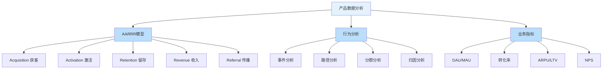
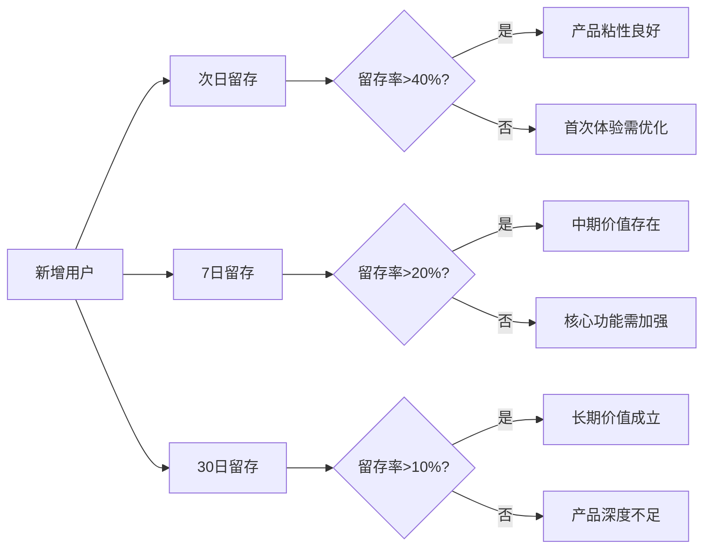
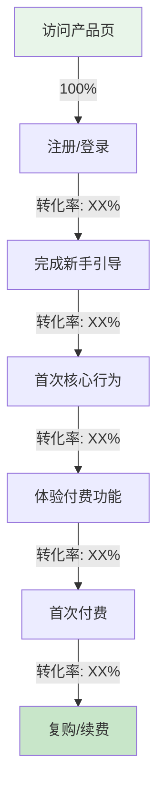
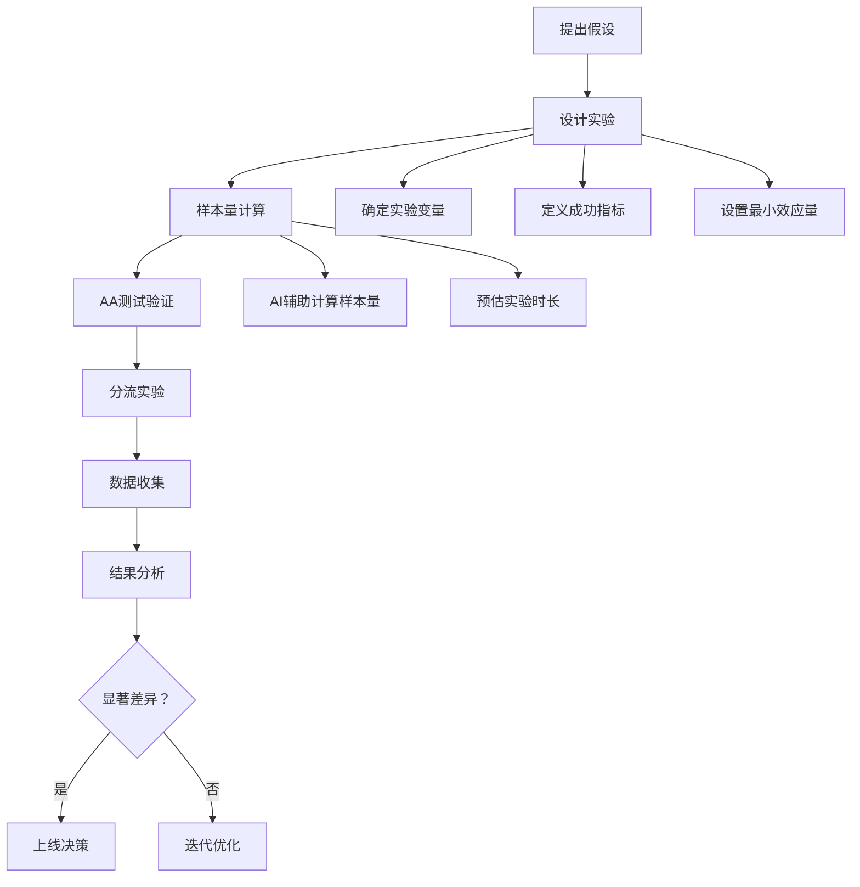
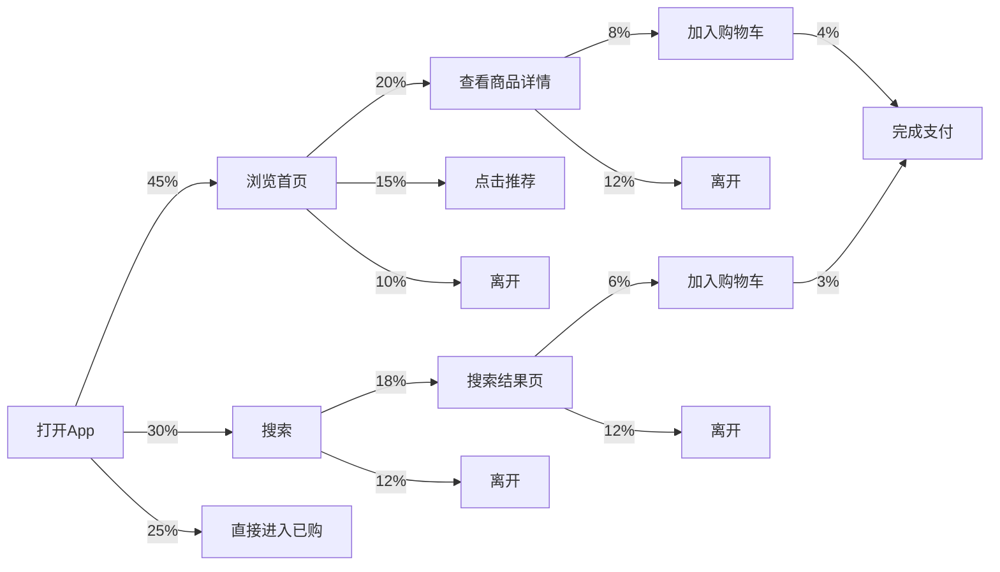
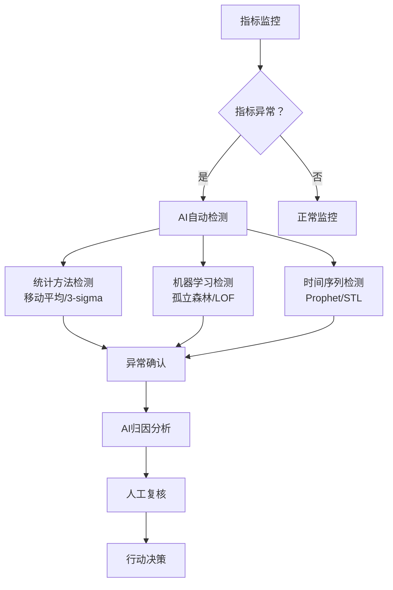

# 产品数据分析 — AI赋能的全流程实战指南

> 产品数据分析是连接用户行为与产品决策的桥梁。从AARRR模型到行为分析，从A/B测试到异常检测，AI可以大幅提升分析的深度和效率。但产品数据分析的核心挑战在于：指标定义的一致性、因果关系的识别、以及避免被数据误导。本文结合AI能力，系统梳理产品数据分析的框架、方法和实战技巧。

[[06-数据分析/AI数据分析/00_MOC_AI数据分析中枢]] | [[06-数据分析/AI数据分析/05_基础_分析方法论]] | [[06-数据分析/AI数据分析/06_基础_指标体系建设]]

---

## 一、产品数据分析框架

### 1.1 三大分析支柱



### 1.2 AARRR模型详解

| 阶段 | 核心指标 | AI分析重点 | 常见问题 |
|------|---------|-----------|---------|
| Acquisition 获客 | 新增用户数、获客成本（CAC）、渠道来源 | 渠道质量评估、获客成本分析 | 渠道归因偏差 |
| Activation 激活 | 激活率、首次核心行为完成率 | 激活路径优化、关键行为识别 | 激活定义不统一 |
| Retention 留存 | 次日/7日/30日留存率 | 留存曲线分析、流失预警 | 留存计算口径差异 |
| Revenue 收入 | ARPU、LTV、付费转化率 | 付费行为预测、定价优化 | 收入归因困难 |
| Referral 传播 | 邀请率、K因子、病毒系数 | 传播路径分析、KOL识别 | 传播数据采集困难 |

### 1.3 指标体系设计原则

> [!tip] 产品指标体系设计原则
> 1. **北极星指标**：找到唯一能反映产品长期价值的核心指标，所有分析围绕它展开
> 2. **分级指标**：北极星指标 → 一级指标（AARRR各阶段） → 二级指标（行为指标） → 三级指标（技术指标）
> 3. **可行动性**：每个指标必须有明确的行动导向，能回答"指标变了，我们该做什么"
> 4. **可对比性**：指标定义标准化，确保跨时间、跨版本、跨群组可比

---

## 二、留存分析

### 2.1 留存分析框架

留存是产品健康度的核心指标，比新增和活跃更能反映产品的长期价值 [$TRAE_REF](https://en.wikipedia.org/wiki/Cohort_analysis)：



**留存率参考基准**（行业经验值）：

| 产品类型 | 次日留存 | 7日留存 | 30日留存 |
|---------|---------|--------|---------|
| 社交/社区 | 40-50% | 20-30% | 10-20% |
| 工具类 | 30-40% | 15-25% | 8-15% |
| 电商 | 25-35% | 10-20% | 5-10% |
| 内容/资讯 | 30-40% | 15-25% | 8-12% |
| 游戏 | 35-50% | 20-35% | 10-20% |

### 2.2 AI辅助的留存曲线分析

**传统留存分析的痛点**：

1. 手动计算分群留存，耗时且容易出错
2. 难以发现留存曲线的细微变化
3. 无法自动识别留存率异常波动的原因
4. 缺乏对留存率变化的预测能力

**AI辅助留存分析的工作流**：

```
AI Prompt: 留存曲线分析
---
请分析以下留存数据，完成：

1. 计算每日新增用户的次日/7日/30日留存率
2. 绘制留存曲线，标注环比变化
3. 识别留存率显著下降的日期和可能原因
4. 对比不同渠道/地区/设备类型的留存差异
5. 预测未来30天的留存率趋势

数据范围：2026年6月1日-6月30日
数据格式：用户ID | 注册日期 | 活跃日期日志
```

**AI辅助的留存预测**：

```python
# AI生成的留存率预测代码示例
import pandas as pd
import numpy as np
from scipy.optimize import curve_fit

# 幂律留存模型：R(t) = a * t^(-b)
def retention_model(t, a, b):
    return a * np.power(t, -b)

# 拟合留存曲线
days = np.array([1, 7, 14, 21, 30])
retention = np.array([0.45, 0.22, 0.15, 0.12, 0.10])
params, _ = curve_fit(retention_model, days, retention)

# 预测未来留存
future_days = np.array([45, 60, 90])
predicted = retention_model(future_days, *params)
```

### 2.3 留存分析中的常见陷阱

> [!warning] 留存分析的常见陷阱
> 1. **幸存者偏差**：只分析留存用户的行为，忽略已流失用户
> 2. **分群粒度不足**：整体留存率掩盖了不同用户群的差异
> 3. **时间窗口选择偏差**：选择不同的时间窗口可能得出相反的结论
> 4. **版本混淆**：产品版本更新导致留存率变化，但分析时未区分版本
> 5. **季节性因素**：节假日、寒暑假等对留存的影响

---

## 三、转化分析

### 3.1 转化漏斗模型

从注册到付费的完整转化路径：



### 3.2 AI自动识别转化瓶颈

**传统方法**：手动计算各阶段转化率，凭经验判断瓶颈。

**AI辅助方法**：

```
AI Prompt: 转化漏斗分析
---
请分析以下转化漏斗数据，完成：

1. 计算各阶段转化率（从上一阶段到本阶段的转化）
2. 对比不同用户群（渠道/设备/地域）的转化差异
3. 识别转化率下降最显著的阶段（瓶颈环节）
4. 分析瓶颈环节的可能原因（多维度下钻）
5. 给出优化建议并预估提升空间

数据：
| 阶段 | 用户数 |
|------|-------|
| 访问产品页 | 100000 |
| 注册/登录 | 35000 |
| 完成新手引导 | 12000 |
| 首次核心行为 | 8000 |
| 体验付费功能 | 3000 |
| 首次付费 | 1200 |
| 复购/续费 | 400 |

注意：标注每个结论的置信度，区分相关性和因果性。
```

**AI自动识别瓶颈的算法逻辑**：

```python
# AI生成的瓶颈识别代码
import pandas as pd

funnel_data = pd.DataFrame({
    'stage': ['访问', '注册', '引导', '核心行为', '付费体验', '首次付费', '复购'],
    'users': [100000, 35000, 12000, 8000, 3000, 1200, 400]
})

# 计算各阶段转化率（相对于上一阶段）
funnel_data['prev_stage_users'] = funnel_data['users'].shift(1)
funnel_data['step_conversion'] = funnel_data['users'] / funnel_data['prev_stage_users']

# 识别瓶颈阶段（转化率最低的阶段）
bottleneck = funnel_data.loc[funnel_data['step_conversion'].idxmin()]
print(f"瓶颈阶段：{bottleneck['stage']}")
print(f"转化率：{bottleneck['step_conversion']:.1%}")
```

### 3.3 AI辅助的转化率优化

| 优化方向 | 传统方法 | AI辅助方法 | 预期提升 |
|---------|---------|-----------|---------|
| 注册转化 | A/B测试多个注册页变体 | AI分析用户行为，自动推荐最优设计 | 10-30% |
| 新手引导 | 固定引导流程 | AI分析用户行为，个性化引导路径 | 15-40% |
| 付费转化 | 统一定价策略 | AI预测用户付费意愿，动态定价 | 5-15% |
| 复购提升 | 人工运营推送 | AI预测复购周期，自动触发推送 | 10-25% |

---

## 四、实验分析：A/B测试与AI辅助

### 4.1 A/B测试完整流程



### 4.2 AI辅助的样本量计算

**样本量计算公式**：

```
n = (Z_alpha/2 + Z_beta)^2 * 2 * sigma^2 / delta^2

其中：
- Z_alpha/2: 显著性水平对应的Z值（alpha=0.05时取1.96）
- Z_beta: 统计功效对应的Z值（power=0.8时取0.84）
- sigma: 指标的标准差
- delta: 最小可检测效应量（MDE）
```

**AI辅助Prompt**：

```
请帮我计算A/B测试所需的样本量：

实验参数：
- 显著性水平（alpha）：0.05
- 统计功效（power）：0.8
- 核心指标：注册转化率
- 当前转化率（对照组）：5%
- 最小可检测提升（MDE）：10%（即提升到5.5%）
- 分流比例：50%/50%

请计算：
1. 每组所需的最小样本量
2. 建议的实验时长（基于日均流量）
3. 给出不同MDE假设下的样本量敏感性分析
```

### 4.3 AI辅助的结果评估

**A/B测试结果分析Prompt**：

```
请分析以下A/B测试结果：

实验描述：首页改版对注册转化率的影响
实验周期：2026年6月1日-6月14日（14天）

数据：
| 指标 | 对照组（A） | 实验组（B） |
|------|-----------|-----------|
| 用户数 | 50,000 | 50,000 |
| 注册数 | 2,500 | 2,750 |
| 注册转化率 | 5.00% | 5.50% |
| 转化率标准差 | 0.217% | 0.227% |

请完成：
1. 计算两组转化率的差异是否具有统计显著性
2. 计算置信区间（95%）
3. 给出p值和效应量
4. 判断：是否应该上线实验组版本？
5. 检查是否存在辛普森悖论（按设备类型/渠道分群查看）
```

### 4.4 A/B测试的常见陷阱

> [!important] A/B测试的核心陷阱
> 1. **过早停止实验**：看到早期显著结果就停止，可能产生假阳性 [$TRAE_REF](https://en.wikipedia.org/wiki/Peeking_problem)
> 2. **多重比较问题**：同时比较多个指标，必然有指标因随机性而显著
> 3. **样本污染**：实验组和对照组之间互相影响（如社交产品的网络效应）
> 4. **新奇效应**：用户对新功能的好奇心导致短期效果虚高
> 5. **选择偏差**：实验期间用户样本与总体用户存在系统差异
> 6. **AA测试未通过**：实验前未验证分流均匀性

---

## 五、用户行为分析

### 5.1 事件分析

事件是用户行为分析的基础单元，一个完整的事件包含：

```
事件 = 谁（Who） + 什么时间（When） + 在哪儿（Where） + 做了什么（What） + 怎么做（How）

示例：
- 用户A | 2026-06-15 14:30:00 | iOS 17.5 | 点击"立即购买"按钮 | 商品ID: 12345
```

**AI辅助的事件分析**：

| 分析类型 | 传统方法 | AI辅助方法 |
|---------|---------|-----------|
| 事件频率分布 | 手动统计各事件触发次数 | Prompt："统计用户事件触发频率，识别高频和低频事件" |
| 事件序列分析 | 编写复杂的SQL查询 | Prompt："分析用户完成付费前的行为序列模式" |
| 事件关联分析 | 手动计算相关系数 | Prompt："自动计算事件间的相关性，发现强关联事件对" |
| 异常事件检测 | 设定固定阈值 | Prompt："使用移动平均法自动检测事件指标的异常波动" |

### 5.2 路径分析

路径分析用于理解用户在产品中的行为轨迹：

**AI辅助的路径分析Prompt**：

```
请分析以下用户行为序列数据，完成路径分析：

数据格式：用户ID | 事件时间 | 事件名称

分析要求：
1. 识别用户在完成[核心行为]前的最常见路径（Top 5）
2. 识别用户在完成[核心行为]后的最常见路径（Top 5）
3. 发现路径中的主要流失点（用户在哪个步骤后流失最多）
4. 对比高留存用户和低留存用户的路径差异
5. 可视化输出Top 3路径

数据范围：最近30天的用户行为日志
```

**路径分析的可视化**：



### 5.3 分群分析

用户分群是精细化运营的基础：

| 分群方法 | 说明 | AI辅助 |
|---------|------|--------|
| 行为分群 | 基于用户行为模式分组 | Prompt："基于用户最近30天的行为，使用K-means聚类分群" |
| 价值分群 | 基于用户价值（RFM）分组 | Prompt："计算RFM分数，将用户分为高/中/低价值群" |
| 生命周期分群 | 基于用户所处生命周期阶段 | Prompt："识别用户处于新手/活跃/沉默/流失哪个阶段" |
| 预测性分群 | 基于模型预测的未来行为 | Prompt："使用逻辑回归预测用户流失概率，按风险等级分群" |

**AI辅助分群的Prompt模板**：

```
请对以下用户数据进行分群分析：

数据格式：用户ID | 注册天数 | 登录次数 | 核心行为完成次数 | 付费金额 | 最近活跃时间

分群要求：
1. 使用RFM模型进行用户价值分群（高/中/低价值）
2. 使用K-means聚类进行行为分群（自动确定最佳K值）
3. 输出每个分群的用户画像（特征均值）
4. 给出每个分群的运营建议
5. 可视化分群结果（PCA降维后的散点图）
```

---

## 六、AI辅助的异常检测和归因分析

### 6.1 异常检测框架



### 6.2 AI自动异常检测

**Prompt模板**：

```
请对以下时间序列数据进行异常检测：

数据格式：日期 | 指标值
指标名称：DAU（日活跃用户数）
数据范围：2026年1月1日-6月30日

检测要求：
1. 使用3-sigma方法标记统计异常点
2. 使用移动平均法识别趋势变化
3. 考虑季节性因素（周/月/年周期）
4. 输出所有异常点及异常程度
5. 排除已知的节假日/活动影响

数据：[粘贴时间序列数据]
```

### 6.3 AI归因分析

当异常被检测到后，AI可以辅助进行归因分析：

**归因分析Prompt**：

```
指标DAU在2026年6月15日下降了15%，请进行归因分析：

可能的归因维度：
1. 渠道维度：各渠道新增用户量变化
2. 版本维度：不同App版本的用户活跃变化
3. 地域维度：不同地区的用户活跃变化
4. 设备维度：不同设备类型的用户活跃变化
5. 事件维度：关键事件触发量的变化

分析要求：
1. 对每个维度进行下钻分析，找出变化最大的子维度
2. 计算每个维度对整体下降的贡献度
3. 排除预期波动（如周末效应）
4. 输出最可能的3个原因及置信度
5. 给出下一步验证建议

数据：[粘贴各维度的详细数据]
```

### 6.4 异常检测的常见误区

> [!warning] 异常检测的常见误区
> 1. **将正常波动误报为异常** — 业务指标天然有波动，需要区分正常波动和异常信号
> 2. **忽略外部因素** — 行业事件、竞争对手动作、政策变化都可能导致指标变化
> 3. **过度归因** — 归因分析找到的相关性不一定是因果关系
> 4. **延迟效应** — 原因和结果之间可能有时间差，即时归因可能错误
> 5. **指标间的相互影响** — 一个指标的优化可能导致另一个指标恶化

---

## 七、产品数据分析的常见陷阱

### 7.1 虚荣指标

> [!danger] 虚荣指标 vs 可行动指标
> 
> | 虚荣指标 | 可行动指标 |
> |---------|-----------|
> | 累计注册用户数 | 周活跃用户数 |
> | 页面浏览量（PV） | 核心行为完成率 |
> | 下载量 | 激活率 |
> | 总营收 | 人均付费（ARPU） |
> | 社交媒体粉丝数 | 粉丝互动率 |

**AI辅助识别虚荣指标**：在分析时，让AI自动标注"该指标是否可行动"，并建议替代指标。

### 7.2 采样偏差

采样偏差是产品数据分析中常见的系统性错误：

| 偏差类型 | 说明 | 示例 | AI应对 |
|---------|------|------|--------|
| 存活者偏差 | 只分析留存用户，忽略流失用户 | "用户很喜欢我们的功能"（但只看了留存用户数据） | 强制分群分析，对比留存和流失用户 |
| 选择偏差 | 分析样本不代表总体 | "App Store评分4.8分"（但只有极端用户才评分） | 计算评分偏差，建议加权校正 |
| 自选择偏差 | 用户主动选择参与导致偏差 | "参与调查的用户中有80%喜欢新功能" | 对比参与和未参与用户的行为差异 |
| 数据缺失偏差 | 数据缺失不是随机的 | "付费用户的平均使用时长更高"（但免费用户的数据缺失更多） | 检测缺失模式，评估缺失影响 |

### 7.3 因果混淆

这是产品数据分析中最常见也是最危险的错误 [$TRAE_REF](https://en.wikipedia.org/wiki/Correlation_does_not_imply_causation)：

```
错误示例：
❌ "用户完成了新手引导，所以留存率更高"
   实际情况：留存意愿强的用户才会完成新手引导（反向因果）

❌ "使用搜索功能的用户付费转化率更高"
   实际情况：购买意愿强的用户更倾向使用搜索（混杂因素）

❌ "改版后DAU提升了，说明改版成功"
   实际情况：同期有市场活动，DAU提升来自新增（混淆变量）
```

**AI辅助因果分析的策略**：

| 方法 | 说明 | 适用场景 |
|------|------|---------|
| 反事实推理 | 对比"实际发生"和"如果没有发生"的情况 | 评估功能上线效果 |
| 工具变量法 | 找到与处理变量相关、但与结果无关的变量 | 处理内生性问题 |
| 双重差分法 | 对比实验组和对照组在干预前后的变化差 | 政策/功能效果评估 |
| 断点回归 | 利用阈值附近的随机性进行因果推断 | 评分/排名对结果的影响 |

### 7.4 产品数据分析十诫

> [!quote] 产品数据分析十诫
> 1. 先定义问题，再找数据 — 不要拿着数据找故事
> 2. 指标要可行动 — 指标变了，你要知道做什么
> 3. 对比才有意义 — 绝对值是陷阱，对比是解药
> 4. 区分相关与因果 — 不要看到相关就假设因果
> 5. 关注分布，而非均值 — 均值掩盖了大部分真相
> 6. 验证你的假设 — 用A/B测试验证，不要拍脑袋
> 7. 承认不确定性 — 标注置信度，量化不确定性
> 8. 考虑外部因素 — 产品不是孤岛，行业在变化
> 9. 数据越好，回答越差 — 没有好的数据就没有好的分析
> 10. 工具是手段，不是目的 — AI是辅助，人的判断不可替代

---

## 八、AI辅助产品数据分析的落地建议

### 8.1 分阶段实施路线

```
第一阶段（1-2周）：基础指标体系建设
├── 统一核心指标定义（北极星指标+一级指标）
├── 搭建数据采集体系（事件埋点规范）
├── AI辅助生成指标看板
└── 建立日报/周报自动推送

第二阶段（3-4周）：分析能力建设
├── 留存分析自动化
├── 转化漏斗AI诊断
├── 用户行为分群分析
└── 异常检测与预警

第三阶段（5-8周）：深度分析能力
├── A/B测试全流程AI辅助
├── 因果推断与归因分析
├── 用户流失预测与预警
└── AI辅助的产品决策建议
```

### 8.2 团队能力要求

| 角色 | 核心能力 | AI辅助范围 |
|------|---------|-----------|
| 产品经理 | 业务理解、需求定义、决策判断 | 数据分析、报告生成、异常检测 |
| 数据分析师 | 分析框架、统计方法、数据解读 | 代码生成、模型训练、自动化报表 |
| 数据工程师 | 数据采集、Pipeline搭建、质量保障 | 代码生成、错误排查、文档生成 |
| 数据科学家 | 算法设计、模型开发、因果推断 | 模型调优、特征工程、实验设计 |

---

## 关联笔记

- [[06-数据分析/AI数据分析/05_基础_分析方法论]] — 分析方法论基础
- [[06-数据分析/AI数据分析/06_基础_指标体系建设]] — 指标体系设计方法
- [[06-数据分析/AI数据分析/16_方法_从描述到因果分析]] — 因果推断方法论
- [[06-数据分析/AI数据分析/19_实战_用户增长数据分析]] — 增长分析中的产品应用
- [[06-数据分析/AI数据分析/20_实战_业务决策分析]] — 产品数据分析的决策落地
- [[06-数据分析/AI数据分析/00_MOC_AI数据分析中枢]] — 返回知识库中心