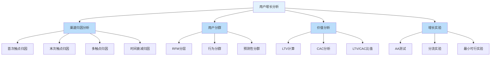
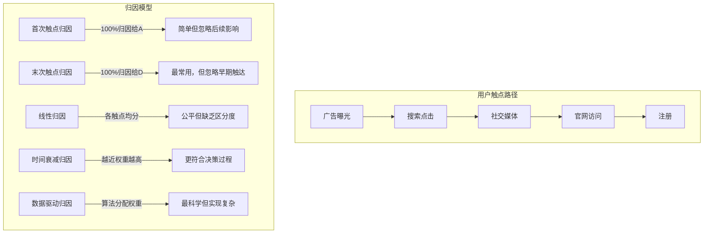
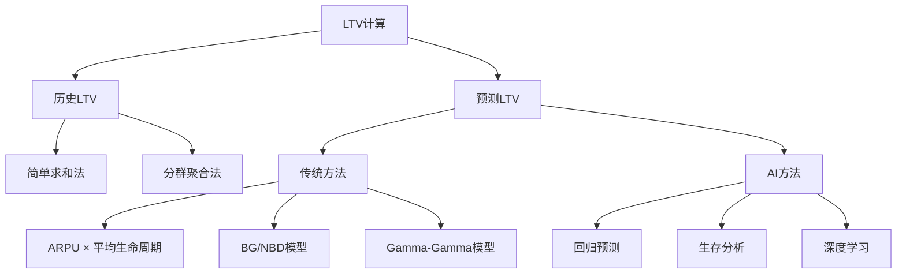
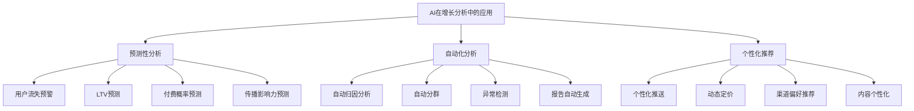
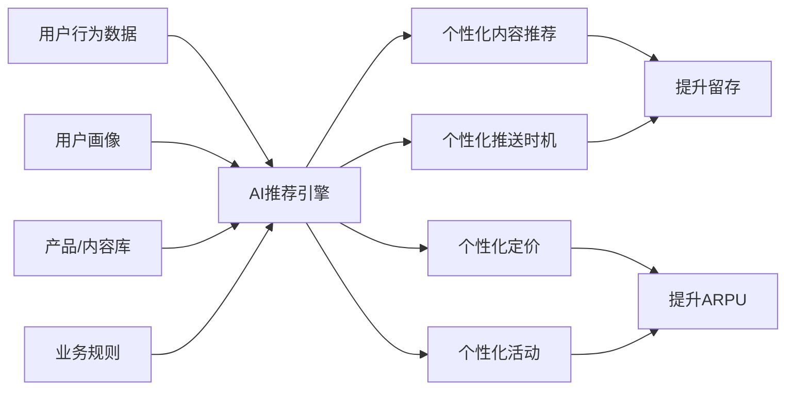
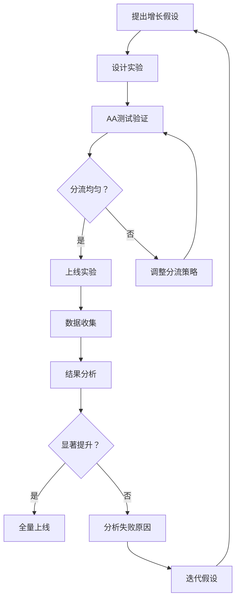

# 用户增长数据分析 — AI驱动增长的全流程实战指南

> 用户增长是数据驱动决策最密集的领域之一。从渠道归因到用户分群，从LTV计算到增长实验，每个环节都依赖准确的数据分析。AI可以在增长分析中发挥巨大作用：自动化的渠道归因、预测性的用户分群、智能化的流失预警。但增长分析也充满陷阱：归因偏差、幸存者偏差、过度优化短期指标。本文系统梳理增长分析的核心框架和方法，以及AI如何在其中赋能。

[[06-数据分析/AI数据分析/00_MOC_AI数据分析中枢]] | [[06-数据分析/AI数据分析/05_基础_分析方法论]] | [[06-数据分析/AI数据分析/06_基础_指标体系建设]]

---

## 一、增长分析框架

### 1.1 增长分析全景



### 1.2 增长分析的核心指标

| 指标类别 | 核心指标 | 说明 | AI分析价值 |
|---------|---------|------|-----------|
| 获客指标 | CAC（获客成本） | 获取一个新用户的总成本 | 自动分渠道计算、趋势监控 |
| 激活指标 | 激活率 | 用户完成首次核心行为的比例 | 识别激活瓶颈、优化激活路径 |
| 留存指标 | 留存率 | 用户持续使用产品的比例 | 留存曲线预测、流失预警 |
| 收入指标 | LTV（生命周期价值） | 用户在其生命周期内创造的总收入 | 预测性LTV建模、分群价值分析 |
| 传播指标 | K因子 | 每个用户带来的新用户数 | 传播路径分析、种子用户识别 |

---

## 二、渠道归因模型

### 2.1 归因模型全景

渠道归因是增长分析中最复杂也最关键的环节之一 [$TRAE_REF](https://en.wikipedia.org/wiki/Attribution_(marketing))：



### 2.2 各归因模型对比

| 模型 | 分配逻辑 | 优点 | 缺点 | 适用场景 |
|------|---------|------|------|---------|
| 首次触点 | 100%给第一个触点 | 简单，反映"首次认知" | 忽略后续触点的作用 | 品牌认知类渠道评估 |
| 末次触点 | 100%给最后一个触点 | 简单，反映"临门一脚" | 忽略早期培养 | 效果类渠道评估 |
| 线性 | 各触点均分 | 简单公平 | 无法区分不同触点的重要性 | 所有触点同等重要的场景 |
| 时间衰减 | 离转化越近权重越高 | 反映决策过程 | 衰减函数的参数选择主观 | 销售周期较长的场景 |
| 多触点（U型） | 首次和末次各40%，中间20% | 兼顾首次和末次 | 比例固定，不灵活 | 品牌+效果兼顾的场景 |
| 数据驱动 | 算法自动分配权重 | 最科学，数据驱动 | 实现复杂，需要大量数据 | 数据充足、预算大的场景 |

### 2.3 AI辅助的归因分析

**AI辅助归因的Prompt模板**：

```
请帮我分析以下渠道归因数据，完成多触点归因分析：

数据格式：用户ID | 触点时间 | 触点渠道 | 是否转化

渠道列表：搜索广告、社交媒体、信息流、邮件营销、直接访问

分析要求：
1. 分别使用首次触点、末次触点、线性、时间衰减四种模型计算各渠道的归因贡献
2. 对比不同模型下各渠道的贡献差异
3. 计算各渠道的ROI（归因收入/渠道成本）
4. 推荐最优的归因模型，并说明理由
5. 给出渠道预算分配建议

数据范围：最近3个月的触点数据
渠道成本数据：[各渠道投入成本]
```

**数据驱动归因的算法原理**：

```python
# AI辅助生成的数据驱动归因示例（Shapley Value方法）
import pandas as pd
import numpy as np
from itertools import combinations

def shapley_value_attribution(channels, conversion_data):
    """
    使用Shapley值进行多触点归因
    channels: 渠道列表
    conversion_data: 各渠道组合的转化数据
    """
    n = len(channels)
    shapley_values = {ch: 0 for ch in channels}
    
    for ch in channels:
        value = 0
        for subset in combinations([c for c in channels if c != ch], 
                                   range(n)):
            subset_without = set(subset)
            subset_with = set(subset) | {ch}
            
            # 计算边际贡献
            marginal = (conversion_data.get(frozenset(subset_with), 0) - 
                       conversion_data.get(frozenset(subset_without), 0))
            
            # 权重
            weight = (len(subset_without)) * (n - len(subset_without) - 1) / np.math.factorial(n)
            value += marginal * weight
        
        shapley_values[ch] = value
    
    return shapley_values
```

### 2.4 归因分析的常见陷阱

> [!warning] 归因分析的常见陷阱
> 1. **归因偏差** — 任何归因模型都是对现实的简化，没有完美的归因
> 2. **跨设备归因困难** — 用户在不同设备上的行为难以关联
> 3. **线下触点缺失** — 线下广告、口碑传播等难以追踪
> 4. **时间窗口选择** — 归因窗口太长或太短都会影响结果
> 5. **辅助渠道被低估** — 早期触达但未直接导致转化的渠道容易被低估

---

## 三、用户分群方法

### 3.1 RFM分层模型

RFM是用户价值分析最经典的模型，AI可以大幅提升其效率 [$TRAE_REF](https://en.wikipedia.org/wiki/RFM_(market_research))：

| 维度 | 说明 | 计算方式 | AI优化 |
|------|------|---------|--------|
| R（Recency） | 最近一次消费时间 | 距离今天的天数 | 自动计算，动态更新 |
| F（Frequency） | 消费频率 | 一定周期内的消费次数 | 自适应周期选择 |
| M（Monetary） | 消费金额 | 一定周期内的总消费金额 | 排除异常值，自动分箱 |

**AI辅助的RFM分析Prompt**：

```
请对以下用户数据进行RFM分析：

数据格式：用户ID | 最近消费日期 | 消费次数 | 总消费金额 | 注册日期
数据范围：最近12个月

分析要求：
1. 计算每个用户的R（距今天数）、F（消费次数）、M（总金额）
2. 对R/F/M分别进行五分位数评分（1-5分）
3. 计算RFM总分，将用户分为以下层级：
   - 高价值用户（7-15分）
   - 中价值用户（4-6分）
   - 低价值用户（1-3分）
4. 输出每个分群的用户数量和消费占比
5. 给出每个分群的运营策略建议
6. 可视化RFM分布（3D散点图或热力图）
```

### 3.2 行为分群

基于用户行为模式的分群，比RFM更精细：

| 分群类型 | 维度 | 典型分群 | AI辅助方法 |
|---------|------|---------|-----------|
| 活跃度分群 | 登录频率、使用时长 | 高频/中频/低频/沉默用户 | K-means聚类自动分群 |
| 功能偏好分群 | 功能使用频率 | 搜索型/浏览型/社交型/交易型 | 用户行为向量聚类 |
| 生命周期分群 | 注册时长+活跃度 | 新手/成长/成熟/衰退/流失 | 行为序列模型识别 |
| 价值分群 | 消费+互动+传播 | 付费用户/KOL/普通用户 | 多维度加权评分 |

**AI辅助行为分群的Prompt模板**：

```
请对以下用户行为数据进行聚类分群：

数据格式：用户ID | 周登录次数 | 日均使用时长(分钟) | 搜索次数 | 收藏次数 | 分享次数 | 付费金额

分析要求：
1. 使用K-means聚类算法，自动确定最佳K值（使用肘部法则）
2. 输出每个分群的用户画像（各维度均值）
3. 为每个分群命名（如"重度付费用户"、"活跃分享者"等）
4. 统计每个分群的规模和占比
5. 给出每个分群的运营策略建议
6. 可视化分群结果（PCA降维后的散点图）

注意：先对数据进行标准化处理，排除异常值。
```

### 3.3 预测性分群

AI的核心价值在于预测性分析，将用户分群从"描述过去"升级到"预测未来"：

| 预测目标 | 方法 | 输入特征 | 输出 |
|---------|------|---------|------|
| 流失概率 | 逻辑回归/XGBoost | 登录频率、使用时长、最近活跃时间 | 0-1的流失概率 |
| 付费概率 | 梯度提升树 | 浏览行为、收藏、试用记录 | 0-1的付费概率 |
| LTV预测 | 回归模型/深度学习 | 注册来源、首周行为、用户画像 | 预测LTV数值 |
| 传播影响力 | 图算法/社交网络分析 | 邀请次数、互动频率、影响力分 | 传播力评分 |

**AI辅助流失预警Prompt**：

```
请构建用户流失预警模型：

数据说明：
- 训练数据：过去6个月的活跃用户，标记了是否在最近30天流失
- 特征维度：登录频率、使用时长、功能使用数、最近活跃天数、付费金额、客诉次数、邀请次数
- 目标：预测用户在未来30天内流失的概率

分析要求：
1. 数据预处理：处理缺失值、异常值，标准化数值特征
2. 特征选择：使用特征重要性排序，选择Top 10特征
3. 模型训练：比较逻辑回归、随机森林、XGBoost的效果
4. 模型评估：输出准确率、召回率、精确率、F1分数、AUC
5. 输出用户流失概率排名（Top 100高流失风险用户）
6. 给出每个高流失风险用户的挽留建议

数据：[粘贴训练数据]
```

---

## 四、生命周期价值（LTV）计算与预测

### 4.1 LTV计算框架

LTV是用户增长分析的终极指标，它回答了"一个用户值多少钱"这个核心问题 [$TRAE_REF](https://en.wikipedia.org/wiki/Customer_lifetime_value)：



### 4.2 LTV计算方法

| 方法 | 说明 | 公式 | 适用场景 | AI辅助 |
|------|------|------|---------|--------|
| 简单求和 | 直接加总用户历史收入 | LTV = Sum(收入) | 历史数据完整 | 自动计算 |
| ARPU推演 | 平均收入×生命周期 | LTV = ARPU × Avg Lifetime | 数据有限 | 自动计算ARPU和生命周期 |
| 分群聚合 | 按分群分别计算LTV | LTV = Sum(分群LTV × 占比) | 用户异质性高 | 自动分群+分群计算 |
| BG/NBD | 预测购买次数和流失 | LTV = E(购买次数) × 平均客单价 | 非契约型业务 | 自动拟合模型参数 |
| 机器学习 | 用特征预测LTV | LTV = f(特征) | 数据充足 | 自动特征工程和模型训练 |

### 4.3 AI辅助的LTV预测

**LTV预测Prompt**：

```
请构建用户LTV预测模型：

数据格式：用户ID | 注册渠道 | 注册日期 | 首周登录天数 | 首周核心行为次数 | 首月付费金额 | 6个月总付费金额 | 是否活跃

目标：基于用户注册后30天的数据，预测该用户6个月的总LTV

分析要求：
1. 数据探索：分析各特征与LTV的相关性
2. 特征工程：构建衍生特征（如首周行为密度、活跃天数占比等）
3. 模型训练：比较线性回归、随机森林回归、XGBoost回归的效果
4. 模型评估：R²、MAE、MAPE（平均绝对百分比误差）
5. 特征重要性排序：识别对LTV影响最大的Top 5特征
6. 输出预测结果：每个用户的预测LTV置信区间

数据：[粘贴训练数据，包含用户ID及所有特征列]
```

### 4.4 LTV/CAC分析

**LTV/CAC > 3 是行业公认的健康指标** [$TRAE_REF](https://www.investopedia.com/terms/c/cac.asp)：

| LTV/CAC比值 | 健康度 | 说明 |
|------------|-------|------|
| < 1 | 危险 | 获客成本高于用户价值，业务不可持续 |
| 1-3 | 临界 | 基本健康，但需要优化获客效率或提升用户价值 |
| 3-5 | 健康 | 行业公认的健康范围，具有良好的增长潜力 |
| 5+ | 优秀 | 高价值业务，但需注意是否获客投入不足 |

**LTV/CAC分析Prompt**：

```
请分析以下LTV和CAC数据，评估增长健康状况：

数据：
| 渠道 | CAC | 平均LTV | 用户数 |
|------|-----|---------|-------|
| 搜索广告 | 150 | 520 | 5000 |
| 社交媒体 | 80 | 280 | 8000 |
| 信息流 | 120 | 450 | 3000 |
| 邮件营销 | 40 | 160 | 2000 |
| 自然流量 | 0 | 380 | 12000 |

分析要求：
1. 计算每个渠道的LTV/CAC比值
2. 评估各渠道的健康度（危险/临界/健康/优秀）
3. 给出渠道预算调整建议
4. 计算整体加权LTV/CAC
5. 如果整体LTV/CAC < 3，给出改善建议
```

---

## 五、AI在增长分析中的应用

### 5.1 AI应用全景



### 5.2 预测性用户分群

传统分群是"回顾过去"，AI分群是"预测未来"：

| 分析类型 | 传统方法 | AI方法 | 优势 |
|---------|---------|--------|------|
| 流失预警 | 基于固定阈值（如30天未登录） | 机器学习模型预测流失概率 | 提前预警，准确率更高 |
| 高价值用户识别 | 基于历史消费金额 | 预测未来LTV | 早期识别潜力用户 |
| 付费转化预测 | 基于用户行为规则 | 用户行为序列建模 | 识别微妙的转化信号 |
| 传播影响力 | 基于邀请数量 | 社交网络分析+影响力建模 | 识别真正的KOL |

### 5.3 流失预警系统

**AI流失预警的完整流程**：

```
阶段1：数据准备
├── 提取用户行为特征（登录、使用、付费、互动）
├── 提取用户画像特征（注册渠道、设备、地域）
├── 提取时间特征（活跃周期、使用时段）
└── 标记流失标签（通常定义为30天未活跃）

阶段2：模型训练
├── 特征选择（相关性分析+特征重要性排序）
├── 模型选择（XGBoost通常最优）
├── 超参数调优（网格搜索/贝叶斯优化）
└── 模型评估（AUC、召回率、精确率）

阶段3：预警与行动
├── 每日输出高流失风险用户列表
├── 自动生成挽留策略建议
├── 触发个性化推送/优惠
└── 跟踪挽留效果，持续优化模型
```

**流失预警Prompt**：

```
请构建一个用户流失预警系统：

数据说明：
- 训练集：10,000名用户，包含最近90天的行为数据
- 特征列：登录天数、日均使用时长、功能使用数、收藏数、分享数、客诉次数、优惠券使用次数、最近活跃距今天数
- 目标列：是否流失（30天未活跃=1，否则=0）

要求：
1. 使用XGBoost构建分类模型
2. 输出Top 15的特征重要性排序
3. 模型评估：AUC、召回率、精确率、F1
4. 设定最优分类阈值（基于召回率-精确率曲线）
5. 输出高流失风险用户（Top 100）的详细特征和风险评分
6. 给出针对每个高流失风险用户的挽留策略建议
```

### 5.4 AI驱动的推荐策略



---

## 六、增长实验设计

### 6.1 增长实验流程



### 6.2 AA测试

AA测试是增长实验的"质量门禁"，用于验证分流系统是否正常工作：

> [!important] AA测试的核心要点
> - AA测试是让两个组都接受相同的处理（对照组方案），验证分流是否均匀
> - 好的AA测试应该得到"无显著差异"的结果
> - 如果AA测试出现显著差异，说明分流系统有问题，需要修复后再进行实验
> - 建议每次实验前都做AA测试

**AA测试的AI辅助分析**：

```
请分析以下AA测试结果：

数据：
| 指标 | 组A | 组B |
|------|-----|-----|
| 用户数 | 10,000 | 10,000 |
| 注册转化率 | 5.12% | 5.08% |
| 次日留存率 | 32.5% | 32.8% |
| 周活跃天数 | 3.2 | 3.1 |
| 人均付费 | 45.2 | 44.9 |

分析要求：
1. 对每个指标进行显著性检验（t检验或卡方检验）
2. 输出p值和效应量
3. 判断分流是否均匀
4. 如果发现显著差异，给出排查建议
```

### 6.3 分流方法

| 分流方法 | 说明 | 优点 | 缺点 | 适用场景 |
|---------|------|------|------|---------|
| 用户ID哈希 | 按用户ID哈希值分流 | 简单、稳定 | 无法处理用户ID变化 | 大多数场景 |
| 分层分流 | 先分层再在各层内分流 | 减少组间差异 | 实现复杂 | 用户异质性高 |
| 时间段分流 | 按时间段切换实验组 | 实现简单 | 容易受时间因素影响 | 测试周期短 |
| 自适应分流 | 根据实时结果动态调整分流比例 | 效率高 | 统计复杂 | 大规模实验 |

### 6.4 最小可行实验

> [!tip] 最小可行实验原则
> 1. **最小样本量**：用AI计算所需的最小样本量，避免过度实验
> 2. **最短时间**：覆盖一个完整的业务周期（通常至少7天，包含周末）
> 3. **最小改动**：每次只测试一个变量，避免混淆
> 4. **最小风险**：先在小流量上验证，再逐步放量

**AI辅助的最小可行实验设计**：

```
请帮我设计一个最小可行增长实验：

实验假设：在注册流程中增加"社交登录"选项，可以将注册转化率从当前的5%提升到6%

约束条件：
- 日均新增用户：5,000
- 可接受的最大实验时长：14天
- 显著性水平：0.05
- 统计功效：0.8

请完成：
1. 计算每组所需的最小样本量
2. 计算最小实验时长
3. 建议分流比例（实验组/对照组）
4. 识别需要监控的辅助指标（防止负向影响）
5. 给出实验停止规则（什么时候可以提前停止？）
```

---

## 七、增长分析的常见陷阱

### 7.1 归因偏差

归因偏差是增长分析中最普遍的系统性错误 [$TRAE_REF](https://en.wikipedia.org/wiki/Attribution_bias)：

| 偏差类型 | 说明 | 示例 | 应对策略 |
|---------|------|------|---------|
| 首次触点高估 | 过度强调第一个渠道的作用 | "用户都是通过搜索广告来的" | 使用多触点归因模型 |
| 末次触点高估 | 过度强调最后一个渠道的作用 | "邮件营销转化率最高" | 考虑辅助渠道的贡献 |
| 渠道互斥假设 | 假设渠道之间互不影响 | "各渠道独立贡献用户" | 分析渠道间的协同效应 |
| 时间窗口偏差 | 选择不同的归因窗口导致不同结论 | 7天vs30天归因结果不同 | 基于业务周期选择窗口 |

### 7.2 幸存者偏差

幸存者偏差在增长分析中极为常见：

```
错误示例：

"我们给活跃用户推送了优惠券，转化率提升了30%"
--> 问题：只推送给了活跃用户，活跃用户本来就更容易转化
--> 正确做法：随机分组，实验组和对照组都包含活跃和非活跃用户

"老用户的LTV是新用户的3倍，我们应该重点运营老用户"
--> 问题：老用户是"幸存者"，本身就经历了筛选
--> 正确做法：对比同期的不同用户群，而非跨越时间的对比

"我们的付费用户平均使用时长是免费用户的2倍"
--> 问题：可能只是付费用户更投入，而非付费导致使用时长增加
--> 正确做法：控制用户基础特征，进行因果推断
```

**AI辅助识别幸存者偏差**：

```
请检查以下分析结论是否存在幸存者偏差：

分析结论：[粘贴分析结论和数据来源]

检查要点：
1. 分析样本是否经过筛选？筛选条件是什么？
2. 是否存在"被分析的用户"和"未被分析的用户"的系统性差异？
3. 结论是否只适用于特定子群体？
4. 是否存在"反向因果"的可能？
5. 如果存在幸存者偏差，请给出修正建议和正确的分析方案。
```

### 7.3 过度优化短期指标

这是增长分析中最危险的陷阱之一：

| 短期指标 | 长期危害 | 典型案例 |
|---------|---------|---------|
| 新增用户数 | 质量下降、留存差 | 花钱买量，来的都是低质量用户 |
| 日活跃用户（DAU） | 运营过度、用户疲劳 | 频繁推送提高DAU，导致用户卸载 |
| 转化率 | 用户体验下降 | 强制弹窗提高转化率，增加用户反感 |
| 收入 | 透支未来价值 | 过度促销，用户形成"不促不买"的预期 |
| 分享率 | 骚扰式传播 | 强制分享机制损害用户体验 |

> [!danger] 短期指标的"毒药效应"
> 过度优化单一指标，往往是以牺牲其他指标为代价的。AI的自动化优化能力越强，越容易陷入"指标陷阱"——模型会发现某个短期指标的优化捷径，但长期来看这种"捷径"可能损害产品价值。

**AI辅助的指标平衡分析**：

```
请分析以下指标优化方案是否存在"短期指标过度优化"的风险：

当前优化目标：提升DAU（日活跃用户数）
计划方案：增加每日推送频次（从1次/天增加到3次/天）

请完成：
1. 分析该方案对相关指标的影响（正面和负面）
2. 评估短期收益（DAU预计提升多少）
3. 评估长期风险（留存率、卸载率、用户满意度变化）
4. 给出"北极星指标"建议——应该关注什么指标来平衡短期和长期
5. 如果必须优化DAU，请给出更健康的方法建议
```

### 7.4 增长分析的十大原则

> [!quote] 增长分析的十大原则
> 1. **LTV/CAC > 3 是底线** — 低于这个值，增长不可持续
> 2. **没有完美的归因模型** — 接受模型局限性，用多种模型交叉验证
> 3. **用户分群是分析的起点** — 不分群的分析往往掩盖真相
> 4. **短期指标有毒** — 每个短期指标优化都要评估长期影响
> 5. **实验是增长的引擎** — 没有实验验证的增长假设只是猜测
> 6. **AA测试是质量门禁** — 不做AA测试的实验结果不可信
> 7. **幸存者偏差无处不在** — 时刻问自己"我漏掉了谁"
> 8. **相关性不是因果性** — AI发现的相关关系需要实验验证
> 9. **渠道归因要谨慎** — 归因结果受模型选择影响很大
> 10. **增长是系统工程** — 单一指标的优化往往带来系统性风险

---

## 八、AI辅助增长分析的落地建议

### 8.1 分阶段实施路线

```
第一阶段（1-2周）：基础数据体系
├── 统一核心指标定义（CAC、LTV、留存率）
├── 搭建渠道归因数据采集体系
├── AI辅助生成增长看板
└── 建立日报/周报自动推送

第二阶段（3-4周）：分析能力建设
├── 渠道归因自动化分析
├── RFM用户分群自动化
├── LTV/CAC分析自动化
└── 增长实验设计辅助

第三阶段（5-8周）：AI驱动增长
├── 用户流失预警模型
├── LTV预测模型
├── 个性化推荐策略
└── 增长实验自动化分析
```

### 8.2 团队能力要求

| 角色 | 核心能力 | AI辅助范围 |
|------|---------|-----------|
| 增长经理 | 增长策略、实验设计、业务理解 | 数据分析、报告生成、归因分析 |
| 数据分析师 | 统计方法、数据解读、指标体系 | 代码生成、模型训练、自动报表 |
| 增长工程师 | 数据采集、实验平台、Pipeline | 代码生成、测试自动化、数据质量 |
| 数据科学家 | 预测模型、因果推断、算法设计 | 模型调优、特征工程、实验设计 |

### 8.3 核心工具链

| 工具 | 用途 | 在增长分析中的角色 |
|------|------|------------------|
| Python + AI | 数据处理、建模、分析 | 核心分析引擎 |
| SQL | 数据提取 | 数据基础 |
| GrowthBook | 实验管理平台 | 实验设计与管理 |
| Amplitude/Mixpanel | 用户行为分析 | 行为事件追踪 |
| Airflow | 任务调度 | 自动化Pipeline |

---

## 关联笔记

- [[06-数据分析/AI数据分析/05_基础_分析方法论]] — 分析方法论基础
- [[06-数据分析/AI数据分析/06_基础_指标体系建设]] — 指标体系设计方法
- [[06-数据分析/AI数据分析/16_方法_从描述到因果分析]] — 因果推断方法论
- [[06-数据分析/AI数据分析/18_实战_产品数据分析]] — 产品数据分析中的增长应用
- [[06-数据分析/AI数据分析/20_实战_业务决策分析]] — 增长分析的决策落地
- [[06-数据分析/AI数据分析/00_MOC_AI数据分析中枢]] — 返回知识库中心