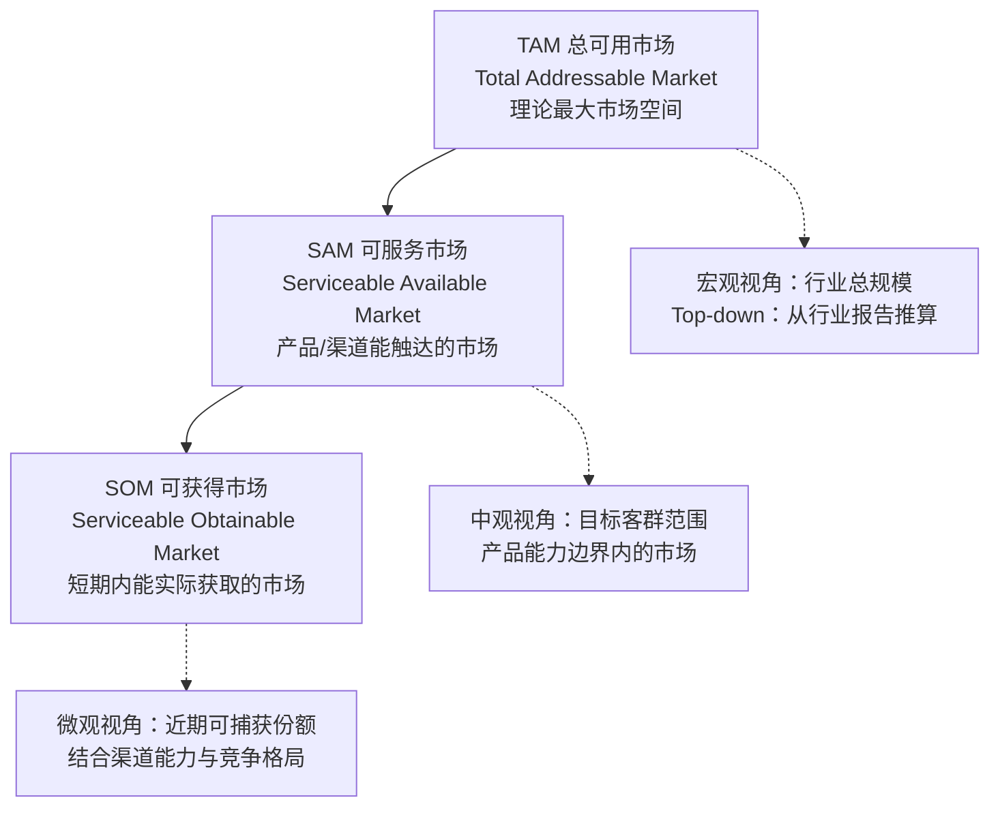
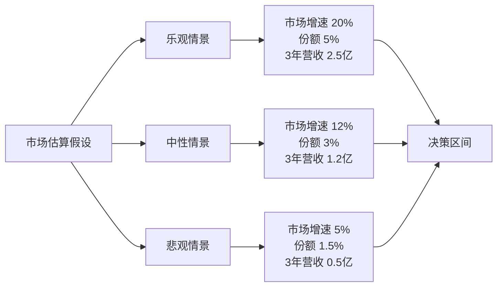
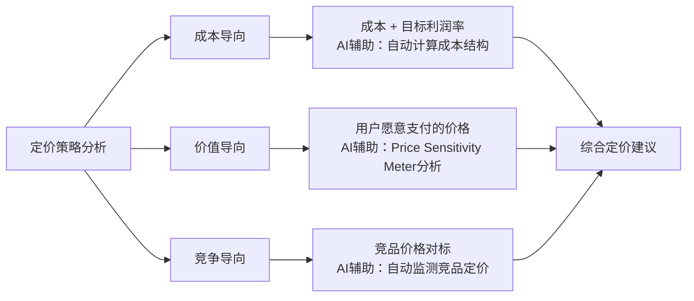
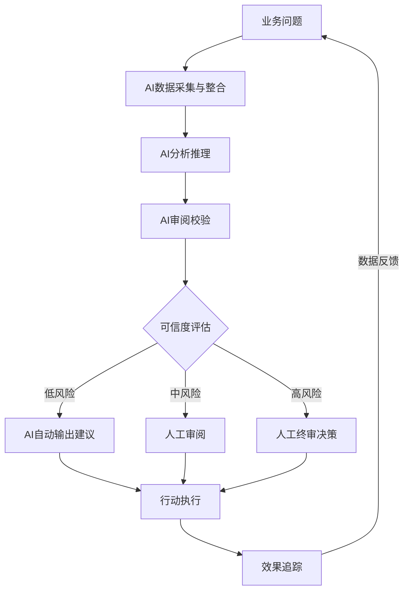

# 业务决策分析 — AI辅助的市场规模、竞争分析与定价策略

> 业务决策是数据分析最高价值的应用场景。从市场规模估算到竞争格局分析，从定价策略优化到行动方案推荐，AI正在从"辅助分析"走向"决策智能体"。本文聚焦AI如何赋能业务决策的全链路分析，以及如何规避"AI自信地给出错误建议"的风险。

---

## 一、市场规模估算方法：TAM / SAM / SOM

### 1.1 三层市场模型

市场规模估算是业务决策的起点。经典的TAM-SAM-SOM模型将市场分为三个层次：



| 层级 | 定义 | 典型计算方法 | AI辅助方式 |
|------|------|-------------|-----------|
| TAM | 产品或服务在理想条件下的最大市场收入 | 行业报告 + 宏观数据聚合 | AI自动搜索行业报告、提取关键数据、交叉验证多源数据一致性 |
| SAM | 在产品/渠道/区域能力范围内能触达的市场 | 从TAM中按客群/地域/渠道过滤 | AI根据产品定位自动筛选目标客群，计算可触达比例 |
| SOM | 短期内（通常1-3年）可实际获取的市场份额 | 从SAM中按竞争能力/渠道上限/增长曲线推算 | AI结合竞争格局、渠道能力、历史增速进行推演 |

### 1.2 AI辅助市场规模估算的流程

> [!tip] 关键原则
> 市场规模的估算不是精确计算，而是基于假设的推演。AI的价值在于：快速处理多源数据、自动检测假设间的矛盾、生成多情景分析。但**所有假设必须由人确认**，AI不能替人决定"市场有多大"。

**AI辅助估算流程**：

```
步骤1：数据收集（AI自动 + 人工确认来源）
  ├── 行业报告（IDC / Gartner / 艾瑞 / 36氪）
  ├── 上市公司财报（竞品营收数据）
  ├── 宏观数据（统计局 / 海关 / 行业协会）
  └── 内部数据（历史销售、客户画像）

步骤2：TAM估算（AI生成）
  ├── Top-down方法：从行业总规模 × 细分占比
  ├── Bottom-up方法：从目标用户数 × 单用户价值
  └── AI自动标注：数据来源、假设条件、置信度

步骤3：SAM推算（AI + 人确认）
  ├── 按产品能力范围过滤
  ├── 按渠道覆盖范围过滤
  └── 按地域/客群优先级过滤

步骤4：SOM预测（AI + 人终审）
  ├── 基于竞争格局的份额假设
  ├── 基于渠道能力上限的测算
  └── 多情景分析（乐观/中性/悲观）
```

### 1.3 多情景分析示例



> [!warning] 常见误区
> 不要只给一个"数字"——AI很容易给出一个看似精确、实则完全没有依据的单一估值。**一定要做多情景分析，并标注每个情景的关键假设。** 参考来源：AI知识库场景化智能推理趋势 [$TRAE_REF](https://caifuhao.eastmoney.com/news/20260707094018435433230)

---

## 二、竞争分析的数据支撑

### 2.1 市场份额计算

市场份额是竞争分析的核心指标，但不同口径计算出的结论可能完全不同：

| 口径 | 计算公式 | 数据来源 | 适用场景 |
|------|---------|---------|---------|
| 营收份额 | 公司营收 / 行业总营收 | 年报/行业报告 | 成熟行业 |
| 用户份额 | 活跃用户数 / 行业总用户数 | 第三方监测/内部数据 | 互联网产品 |
| 搜索份额 | 品牌搜索量 / 品类搜索总量 | 搜索引擎/电商平台 | 消费品/品牌评估 |
| 心智份额 | 用户首选率 / 调研总样本 | 用户调研 | 品牌健康度评估 |

### 2.2 AI辅助竞争分析维度

> [!note] 核心能力
> AI在竞争分析中的最大价值不是"计算市场份额"（这个Excel就能做），而是**自动从海量信息中提取竞品动态、识别竞争格局变化信号、生成结构化的竞争对比矩阵。**

**AI自动分析维度**：

```
竞品基本信息
  ├── 产品定位、目标客群、核心功能
  ├── 定价策略、商业模式
  └── 融资阶段、估值、团队规模

竞品市场表现
  ├── 营收规模与增长趋势
  ├── 用户规模与活跃度
  ├── 市场份额变化
  └── 关键客户/合作伙伴

竞品动态追踪
  ├── 产品发布/更新节奏
  ├── 营销活动/品牌动作
  ├── 组织架构调整
  └── 媒体/投资人评价

差异化分析
  ├── 功能对比矩阵
  ├── 价格对比
  ├── 用户体验对比
  └── 品牌认知对比
```

### 2.3 数据来源与可信度评估

| 数据来源类型 | 可信度 | 更新频率 | AI可获取性 | 建议用途 |
|------------|-------|---------|-----------|---------|
| 上市公司年报/季报 | 高 | 季度 | 可直接搜索 | 核心数据支撑 |
| 第三方行业报告 | 中-高 | 年/半年 | 需付费或摘要 | 行业趋势参考 |
| 媒体/新闻/自媒体 | 中 | 实时 | 可自动抓取 | 动态信号监测 |
| 社交媒体/用户评论 | 中-低 | 实时 | 可自动抓取 | 用户认知分析 |
| 竞品官网/产品页面 | 高 | 不定期 | 可自动抓取 | 产品信息对比 |
| 招聘网站/招聘信息 | 中 | 实时 | 可自动抓取 | 团队规模/方向判断 |

> [!important] 数据源交叉验证
> AI在做竞争分析时，必须交叉验证多个数据来源。单一来源的数据可能过时或有偏。建议AI在每次分析中都标注"数据来源"和"可信度"。

---

## 三、定价策略的AI辅助分析

### 3.1 价格弹性分析

价格弹性 = 需求量变化百分比 / 价格变化百分比。AI可以辅助：

1. **历史数据分析**：从历史交易数据中计算价格与销量的关系
2. **竞品价格对标**：自动爬取竞品定价，生成价格带分布图
3. **敏感度测试**：模拟不同定价下的营收、利润、市场份额变化



### 3.2 竞品对标定价的AI流程

```
1. 竞品定价数据收集（AI自动）
   ├── 官网/产品页面价格信息
   ├── 第三方价格监测数据
   └── 用户调研/付费意愿数据

2. 价格带分布分析（AI生成）
   ├── 按功能/服务等级划分价格带
   ├── 识别价格空白区间
   └── 标注竞品定价策略（高价/平价/低价）

3. 定价建议生成（AI + 人终审）
   ├── 基于成本 + 价值 + 竞争的三维模型
   ├── 多方案对比（高价策略/渗透策略/跟随策略）
   └── 标注每种策略的风险和前提条件
```

### 3.3 敏感度测试

> [!example] 敏感度测试框架
> AI可以自动生成一个定价敏感度测试矩阵，模拟不同变量变化下的财务影响：
> - 价格变化：-20% / -10% / 0% / +10% / +20%
> - 销量变化：-30% / -15% / 0% / +15% / +30%
> - 成本变化：-10% / 0% / +10%
> - 综合输出：营收变化、毛利率变化、净利润变化、回本周期

---

## 四、场景化智能推理：从"知识调用"到"分析-行动建议"的闭环

### 4.1 传统分析 vs AI场景化智能推理

| 维度 | 传统分析 | AI场景化智能推理 |
|------|---------|----------------|
| 输出形态 | 数据报表、图表 | 结论 + 证据 + 建议 + 预期影响 |
| 分析起点 | 人提出问题 | AI主动识别业务问题信号 |
| 决策角色 | 人看报表做决策 | AI给出建议，人做终审 |
| 闭环方式 | 分析结束后，人负责行动 | AI推荐行动方案，追踪执行效果 |
| 迭代速度 | 周/月级 | 实时/天级 |

参考来源：AI知识库场景化智能推理趋势 [$TRAE_REF](https://caifuhao.eastmoney.com/news/20260707094018435433230)

### 4.2 闭环架构



### 4.3 AI辅助决策的"三线"原则

> [!tip] 三线原则
> 1. **底线**：AI不能做最终决策，决策权在人
> 2. **中线**：AI必须标注每个建议的置信度和数据来源
> 3. **高线**：AI应该主动识别自己不知道的领域，而不是强行分析

---

## 五、AI辅助决策实战案例：招聘产品定价决策分析

### 5.1 背景与问题

某招聘SaaS平台计划推出新版本，需要确定定价方案。产品分为三个版本：基础版（小型企业）、专业版（中型企业）、旗舰版（大型企业）。

### 5.2 AI分析过程

**第一步：市场规模估算（TAM/SAM/SOM）**

```
TAM：中国HR SaaS市场规模 2026年约150亿
  ├── 数据来源：艾瑞咨询、IDC报告
  ├── 假设：HR SaaS年增速 25%-30%
  └── 置信度：中（行业报告口径不完全一致）

SAM：招聘SaaS子市场约 45亿
  ├── 从HR SaaS中按"招聘模块占比"过滤
  ├── 按中国中小企业数量 × 付费意愿调整
  └── 置信度：中

SOM（3年目标）：约 1.5亿
  ├── 基于当前产品能力、渠道覆盖、竞争格局
  ├── 乐观情景 2.5亿 / 中性情景 1.5亿 / 悲观情景 0.8亿
  └── 置信度：中-低（取决于市场拓展速度）
```

**第二步：竞争对标分析**

| 维度 | 竞品A | 竞品B | 竞品C | 本产品 |
|------|-------|-------|-------|--------|
| 基础版定价 | 免费 | 99元/月 | 199元/月 | 待定 |
| 专业版定价 | 299元/月 | 499元/月 | 599元/月 | 待定 |
| 旗舰版定价 | 999元/月 | 1999元/月 | 2999元/月 | 待定 |
| 核心差异化 | 免费基础功能 | AI面试 | 一体化HR | AI招聘分析 |
| 目标客户 | 小型企业 | 成长型企业 | 大型企业 | 中大型企业 |
| 数据来源 | 官网 | 官网 | 官网 | - |

**第三步：定价敏感度分析**

```
假设：专业版目标定价范围 399-599元/月

方案A（渗透定价）：399元/月
  ├── 预期年销量：约 5000 客户
  ├── 预期年营收：约 2400万
  └── 风险：利润空间小，可能被竞品价格战压制

方案B（适中定价）：499元/月
  ├── 预期年销量：约 3500 客户
  ├── 预期年营收：约 2100万
  └── 风险：与竞品A专业版持平，差异化需突出

方案C（高价策略）：599元/月
  ├── 预期年销量：约 2000 客户
  ├── 预期年营收：约 1440万
  └── 风险：销量可能低于预期，需强品牌支撑

AI建议：方案B（499元/月）为推荐方案
  ├── 理由：定价处于市场中间带，与竞品A持平但功能更优
  ├── 置信度：中（销量预测基于假设，实际可能偏差 ±30%）
  └── 建议：上线前做A/B测试验证
```

### 5.3 决策输出

```
┌─────────────────────────────────────────────────────────┐
│ AI辅助决策报告 — 招聘SaaS产品定价方案                    │
├─────────────────────────────────────────────────────────┤
│                                                         │
│ 结论：建议采用方案B（专业版499元/月）                    │
│                                                         │
│ 证据：                                                   │
│ 1. 市场规模TAM 150亿，SAM 45亿，3年SOM目标 1.5亿         │
│ 2. 竞品价格带分布在299-2999元/月，499元/月处于中位        │
│ 3. 价格弹性分析显示，499-599元区间销量下降约43%           │
│                                                         │
│ 原因：                                                   │
│ - 499元/月在竞品对标的"合理溢价"范围内                   │
│ - 留下足够的利润空间支撑后续市场推广                     │
│ - 为未来涨价预留空间（可先低价获客后提价）               │
│                                                         │
│ 置信度：中（高不确定性因素：竞品可能降价、市场增速变化）  │
│                                                         │
│ 建议：                                                   │
│ 1. 上线前进行A/B测试（399/499/599三组）                  │
│ 2. 设置3个月后复盘点，根据数据调整定价                   │
│ 3. 准备价格调整预案（如竞品降价时的应对策略）             │
│                                                         │
│ 预期影响：                                               │
│ - 首年营收预计 1800-2500万                               │
│ - 毛利率预计 65-75%                                      │
│ - 市场份额预计 3-5%                                      │
│                                                         │
│ 追踪指标：                                               │
│ - 首月转化率、平均客单价、客户留存率、NPS                │
│ - 竞品价格变动、市场反馈                                 │
└─────────────────────────────────────────────────────────┘
```

---

## 六、业务决策分析的常见陷阱

### 陷阱1：数据滞后

> [!danger] 数据滞后陷阱
> 市场数据天然具有滞后性——行业报告反映的是6-12个月前的市场状况。AI如果基于过时的数据做决策分析，可能给出完全错误的建议。**决策分析中，数据的"时效性"比"精确度"更重要。**

**应对方案**：
- 给AI设定"数据时效性标签"：实时 > 1周内 > 1月内 > 季度内 > 年度
- 要求AI在分析中标注"数据截止日期"
- 建立"数据新鲜度检查"：过期的数据自动标红

### 陷阱2：样本偏差

```
典型场景：
- 只分析了头部客户的需求，忽略了长尾市场
- 只用了线上渠道数据，忽略了线下渠道
- 只看了新客户的反馈，忽略了老客户流失
- 竞品数据只来自公开渠道，忽略了未公开的竞品信息

AI应对方案：
- 强制AI在分析中标注"数据覆盖范围"
- 让AI识别"数据可能遗漏的群体"
- 使用[[06-数据分析/AI数据分析/14_方法_AI幻觉检测与数据质量]]中的样本偏差检测方法
```

### 陷阱3：确认偏误

> [!warning] 确认偏误
> 这是AI做决策分析时最隐蔽的陷阱。AI的"讨好倾向"会让它倾向于生成符合用户预期（或看似合理）的结论，而不是最接近事实的结论。同样，人类决策者也倾向于接受支持自己观点的分析，忽略反面证据。

**应对方案**：
- 使用多LLM协作模式：生成模型 + 审阅模型独立分析 [[06-数据分析/AI数据分析/13_方法_多LLM协作架构]]
- 要求AI在生成分析时，必须同时列出"支持"和"反对"的证据
- 设立"红队角色"：让AI专门扮演反对者，质疑自己的分析结论
- 建立结论的"可信度评估"机制 [[06-数据分析/AI数据分析/22_治理_可信度评估]]

---

## 七、总结：AI辅助业务决策的"四步法"

```
第一步：数据准备
  ├── 收集多源数据（内部 + 外部）
  ├── 标注数据时效性和可信度
  └── 明确分析假设

第二步：AI分析生成
  ├── 市场规模估算（TAM/SAM/SOM）
  ├── 竞争格局分析
  ├── 定价敏感度分析
  └── 多情景推演

第三步：AI审阅 + 人工复核
  ├── 审阅模型检查数据来源和逻辑链
  ├── 人工确认关键假设
  ├── 标注置信度
  └── 识别潜在陷阱

第四步：决策输出
  ├── 结论 + 证据 + 原因 + 置信度
  ├── 建议 + 预期影响 + 追踪指标
  └── 决策权在人类，AI只是辅助
```

---

## 关联笔记

- [[06-数据分析/AI数据分析/00_MOC_AI数据分析中枢]] — 返回中枢索引
- [[06-数据分析/AI数据分析/17_实战_招聘运营数据分析]] — 招聘运营场景的AI分析实战
- [[06-数据分析/AI数据分析/13_方法_多LLM协作架构]] — 多LLM协作的方法论基础
- [[06-数据分析/AI数据分析/14_方法_AI幻觉检测与数据质量]] — AI幻觉检测与数据质量保障
- [[06-数据分析/AI数据分析/22_治理_可信度评估]] — AI分析结果的可信度评估体系