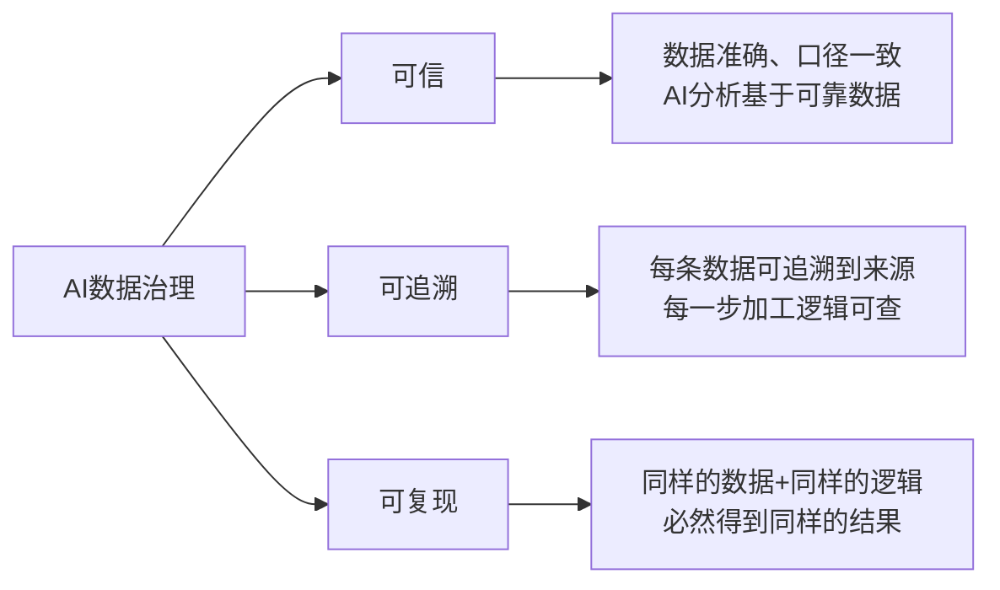
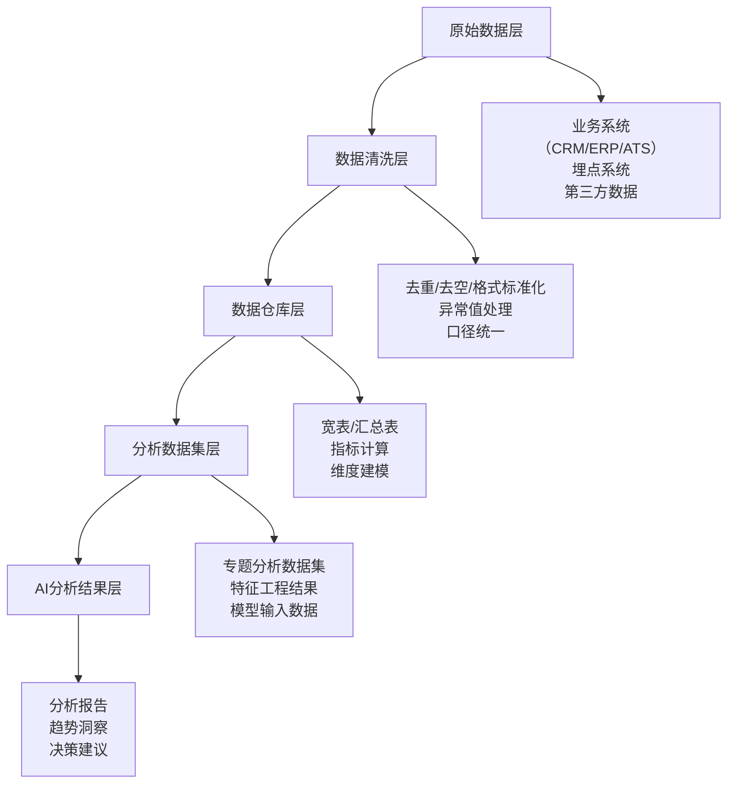
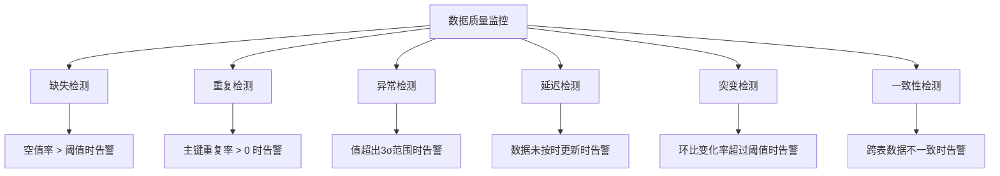
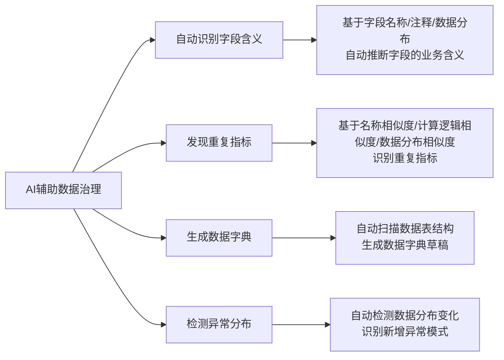
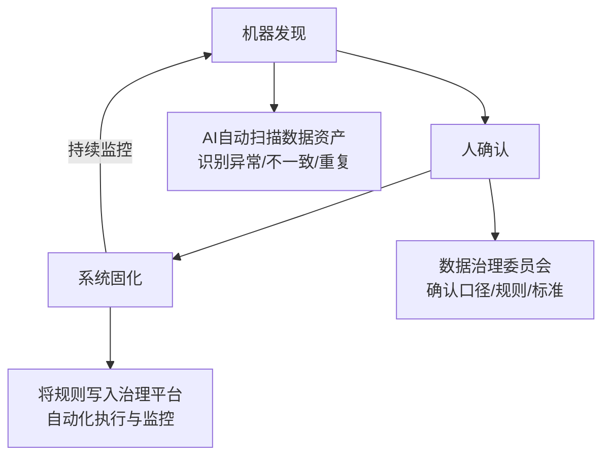

# 数据治理 — AI数据分析的基石与质量保障体系

> 数据治理不是数据团队的"家务事"，而是AI数据分析能否可信的**生死线**。AI会放大数据错误——一个口径不一致的指标，在传统报表里可能只是一个数字偏差；在AI分析中，会扩展成一整套看似合理的错误叙事。数据治理的目的不是"管数据"，而是"让AI分析的结果可信"。

---

## 一、数据治理在AI数据分析中的重要性

### 1.1 AI会放大数据错误

传统数据分析中，数据质量问题通常表现为"某个数字不对"，影响范围有限。但在AI驱动的数据分析中，数据错误会被层层放大：

```
数据错误放大路径：

原始数据错误（-5%偏差）
  → AI在数据清洗时"合理修复"（偏差被固化）
    → AI统计分析时基于错误数据计算（偏差扩大）
      → AI生成分析结论和业务建议（错误被包装成合理叙事）
        → 决策者基于AI分析做出业务决策（错误决策落地）

结果：一个微小的数据偏差，最终可能导致百万级别的错误决策
```

> [!danger] 核心观点
> AI的语言能力极强，它能自信地解释错误数据，生成一套"听起来完全正确"的错误分析报告。**数据质量在AI时代的重要性，比传统分析时代高出至少一个数量级。**

### 1.2 数据治理的三大目标



| 目标 | 定义 | 对AI分析的意义 |
|------|------|--------------|
| 可信 | 数据准确、完整、一致，反映真实业务 | 确保AI分析的输入是正确的 |
| 可追溯 | 每条数据、每个加工步骤都有来源记录 | 当AI分析结果异常时，能快速定位问题 |
| 可复现 | 同样的数据 + 同样的逻辑 = 同样的结果 | 确保AI分析的输出是可验证的 |

参考来源：腾讯云AI分析框架中的数据治理部分 [$TRAE_REF](https://cloud.tencent.com.cn/developer/article/2695219)

---

## 二、指标口径治理

### 2.1 口径不一致是AI分析的最大杀手

> [!warning] 核心原则
> **同一指标只能有一个权威定义。** 这是数据治理的"第一性原理"。如果"活跃用户"在A部门定义为"登录用户"，在B部门定义为"有操作行为的用户"，AI分析时就会产生"同一个词，不同含义"的混乱。

**常见口径不一致场景**：

| 指标名称 | 定义A | 定义B | 偏差影响 |
|---------|-------|-------|---------|
| "月活跃用户" | 当月登录至少1次 | 当月有操作行为至少1次 | 差异可达20-40% |
| "转化率" | 下单用户/访客数 | 支付用户/访客数 | 差异可达5-15% |
| "留存率" | 次日登录用户/新增用户 | 次日有操作用户/新增用户 | 差异可达10-30% |
| "客单价" | 总营收/订单数 | 总营收/客户数 | 差异可达2-5倍 |
| "毛利率" | (营收-成本)/营收 | (营收-变动成本)/营收 | 差异可达10-20% |

### 2.2 指标口径治理的"三步骤"

```
步骤1：指标梳理（AI辅助 + 人工确认）
  ├── 盘点所有正在使用的指标
  ├── 识别"同名不同义"和"同义不同名"的指标
  ├── AI自动检测：基于指标名称、计算逻辑、数据来源的相似度分析
  └── 输出：指标清单 + 重复指标识别报告

步骤2：口径标准化（人工主导，AI辅助）
  ├── 为每个指标确定唯一的权威定义
  ├── 明确：指标名称、计算公式、数据来源、统计范围、更新频率
  ├── AI自动生成指标定义书草稿
  └── 输出：指标口径标准文档

步骤3：口径固化（系统执行）
  ├── 将标准定义写入数据治理平台
  ├── 所有分析工具统一引用标准定义
  ├── AI自动检查：新分析任务是否使用了标准口径
  └── 输出：指标口径治理完成报告
```

### 2.3 与指标体系建设的关系

指标口径治理与[[06-数据分析/AI数据分析/06_基础_指标体系建设]]紧密相关。指标体系建设定义了"应该看什么指标"，而指标口径治理保证了"同一个指标在不同地方的含义一致"。

---

## 三、数据血缘

### 3.1 什么是数据血缘

数据血缘是指数据从产生到最终使用的全链路追踪——每个结果都可以追溯到来源表、加工逻辑和更新时间。

> [!tip] 数据血缘对AI分析的价值
> 当AI分析输出一个结论时，数据血缘让AI（和人）能够回答三个问题：
> 1. **这个结论用的数据从哪来？**（来源追溯）
> 2. **数据经过了哪些加工？**（过程追溯）
> 3. **数据是什么时候更新的？**（时效性判断）

### 3.2 数据血缘的层级



### 3.3 数据血缘的自动追踪

AI可以辅助自动建立和维护数据血缘：

| 功能 | 传统方式 | AI辅助方式 |
|------|---------|-----------|
| 字段映射识别 | 人工阅读ETL代码 | AI自动解析SQL/ETL逻辑，识别字段映射关系 |
| 血缘可视化 | 手动绘制流程图 | AI自动生成数据流向图 |
| 影响分析 | 人工排查 | AI自动识别"如果某个源表字段变更，会影响哪些下游分析" |
| 异常定位 | 逐层排查 | AI自动定位"数据异常发生在哪个加工环节" |

---

## 四、数据质量监控

### 4.1 六大监控维度



### 4.2 各维度的自动检测方法

| 维度 | 检测方法 | AI辅助能力 | 告警阈值建议 |
|------|---------|-----------|------------|
| 缺失 | 统计字段空值率 | AI自动识别"字段是否应该为空"（如"性别"字段空值率突然升高可能是采集故障） | 核心字段空值率 > 5% |
| 重复 | 按主键统计重复记录数 | AI自动识别"哪些重复是合理的"（如日志类数据允许重复） | 非重复主键 > 0 |
| 异常 | 3σ法则 / IQR / 机器学习 | AI自动识别异常类型（离群点 vs 系统性偏差） | 视指标而定 |
| 延迟 | 数据时间戳 vs 当前时间 | AI自动判断"延迟是否合理"（如T+1报表延迟1天正常） | 超过约定时间 > 30分钟 |
| 突变 | 环比/同比变化率 | AI自动判断"突变是否合理"（如双11期间数据暴涨正常） | 环比变化 > 50% |
| 一致性 | 跨表/跨系统数据对比 | AI自动识别"不同系统中同一指标的值是否一致" | 差异 > 0.5% |

### 4.3 AI辅助的智能监控

> [!note] 智能监控的关键能力
> 传统数据质量监控依赖固定规则（如"空值率 > 10% 告警"），但业务场景是动态的。AI辅助的监控可以：
> 1. **自动学习正常范围**：基于历史数据，自动计算出每个字段的"正常波动区间"
> 2. **识别合理异常**：如大促期间数据暴涨，AI能识别为"合理异常"而非"数据质量问题"
> 3. **自动分级告警**：根据数据质量问题的影响范围，自动决定告警级别和通知对象

---

## 五、AI辅助治理

### 5.1 AI在数据治理中的四大能力



### 5.2 各能力详解

**自动识别字段含义**：
```
输入：原始数据表（字段名：col1, col2, col3...）
AI处理：
  ├── 分析字段名称（如"user_id" → 用户ID）
  ├── 分析字段数据分布（如值范围 0-100 → 可能是百分比）
  ├── 分析字段关联关系（如与"order_amount"相关的可能是"price"）
  └── 参考同行业数据字典
输出：字段含义建议 + 置信度 + 建议的数据类型
```

**发现重复指标**：
```
输入：指标清单（含名称、计算公式、数据来源）
AI处理：
  ├── 名称相似度匹配（如"月活" vs "MAU"）
  ├── 计算公式逻辑等价性分析
  ├── 数据来源和统计口径对比
  └── 历史输出值相关性分析
输出：疑似重复指标列表 + 相似度评分 + 建议保留的指标
```

### 5.3 AI辅助治理的局限性

> [!important] 重要提醒
> AI在数据治理中只能做"发现"和"建议"，不能做"决策"。最终的口径定义、指标合并、规则设定，必须由懂业务的人来做。AI的建议只是"加速人工决策"的手段，不是替代人工决策的方案。

---

## 六、数据治理流程：机器发现 → 人确认 → 系统固化

### 6.1 三阶段闭环



### 6.2 各阶段职责

| 阶段 | 执行者 | 核心任务 | 输出物 |
|------|-------|---------|-------|
| 机器发现 | AI自动执行 | 扫描数据资产、识别异常和重复、生成建议 | 异常报告、重复指标建议、数据字典草稿 |
| 人确认 | 数据治理委员会（业务+数据+技术） | 确认AI建议、决策口径标准、审批治理规则 | 治理决策记录、口径标准文档 |
| 系统固化 | 数据治理平台 | 将规则写入系统、自动化执行监控、持续追踪 | 治理规则库、监控告警配置、治理报告 |

### 6.3 治理流程的迭代机制

```
治理迭代周期（建议按月执行）：

第1周：机器发现
  └── AI自动扫描所有数据资产，输出异常报告

第2周：人确认
  └── 数据治理委员会评审AI建议，做出决策

第3周：系统固化
  └── 将确认的规则写入治理平台

第4周：效果评估
  └── 评估治理效果，识别新问题，进入下一轮
```

---

## 七、实操清单：分析前/分析中/分析后的数据质量检查

### 7.1 分析前检查清单

> [!tip] 分析前检查
> 在让AI开始分析之前，先确认数据本身是可靠的。这是最容易被跳过、也最重要的一步。

```
[ ] 数据完整性检查
    ├── 所有必需字段是否有数据？
    ├── 数据覆盖的时间范围是否完整？
    └── 是否有数据缺失的时段？

[ ] 数据一致性检查
    ├── 同一指标在不同系统中的值是否一致？
    ├── 数据格式是否统一？
    └── 编码映射是否正确？

[ ] 数据时效性检查
    ├── 数据是否是最新的？
    ├── 数据更新频率是否符合分析需求？
    └── 是否有过期数据混入？

[ ] 指标口径确认
    ├── 分析中使用的指标是否有标准定义？
    ├── AI是否理解指标的准确含义？
    └── 不同口径的指标是否已明确标注？
```

### 7.2 分析中检查清单

```
[ ] 数据加工过程检查
    ├── AI是否标注了数据清洗和过滤条件？
    ├── 异常值处理方式是否合理？
    └── 数据聚合逻辑是否正确？

[ ] 分析逻辑检查
    ├── AI的统计方法是否适用于数据特征？
    ├── 样本量是否满足统计要求？
    └── 是否有混淆变量未被考虑？

[ ] 中间结果检查
    ├── 关键中间结果是否有异常？
    ├── 数据分布是否合理？
    └── 趋势判断是否有足够数据支撑？
```

### 7.3 分析后检查清单

```
[ ] 结果验证
    ├── AI分析结果是否与业务感知一致？
    ├── 关键结论是否有数据支撑？
    └── 异常结论是否有合理解释？

[ ] 可追溯性检查
    ├── 每个结论是否能追溯到数据来源？
    ├── 分析逻辑是否可复现？
    └── 数据加工步骤是否记录完整？

[ ] 输出质量检查
    ├── 置信度是否已标注？
    ├── 数据来源是否已标注？
    ├── 假设条件是否已明确列出？
    └── 局限性是否已说明？

[ ] 审计准备
    ├── 分析过程是否有日志记录？
    ├── AI的生成和审阅记录是否保存？
    └── 人工确认记录是否完整？
```

---

## 八、总结：数据治理的"四项基本原则"

```
1. 一个指标一个定义
   └── 同一指标只能有一个权威定义，所有分析统一引用

2. 每份数据都可追溯
   └── 从分析结果到原始数据，每一步都有记录

3. 质量监控自动化
   └── 缺失、重复、异常、延迟、突变——全部自动检测

4. 治理流程闭环化
   └── 机器发现 → 人确认 → 系统固化 → 持续监控
```

---

## 关联笔记

- [[06-数据分析/AI数据分析/00_MOC_AI数据分析中枢]] — 返回中枢索引
- [[06-数据分析/AI数据分析/22_治理_可信度评估]] — AI分析结果的可信度评估体系
- [[06-数据分析/AI数据分析/14_方法_AI幻觉检测与数据质量]] — AI幻觉检测与数据质量保障
- [[06-数据分析/AI数据分析/06_基础_指标体系建设]] — 指标体系建设的理论基础
- [[06-数据分析/AI数据分析/23_治理_安全与合规]] — 数据安全与合规治理
- [[06-数据分析/AI数据分析/24_治理_分析资产沉淀]] — 分析资产的管理与沉淀