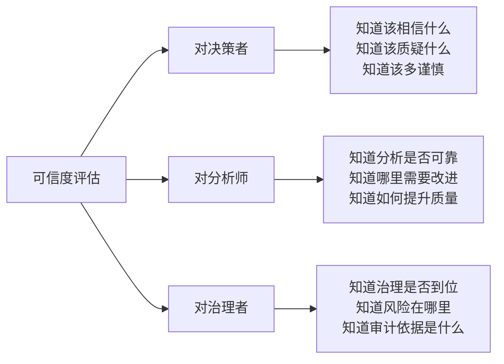
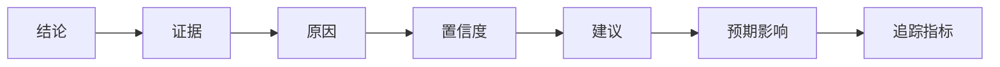
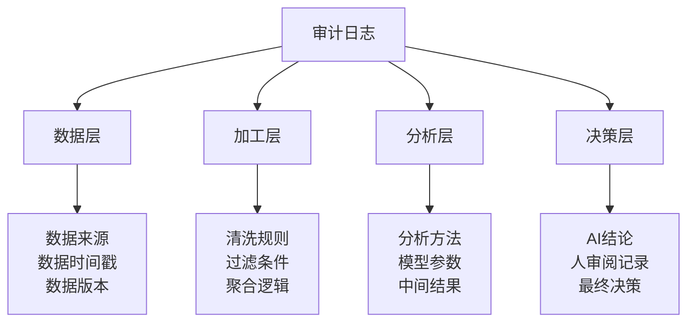
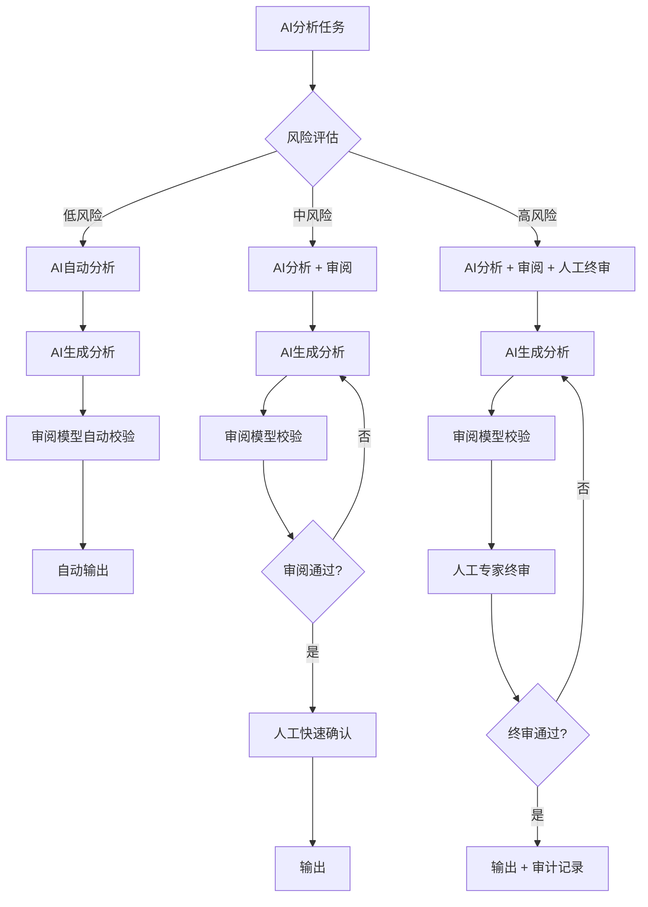
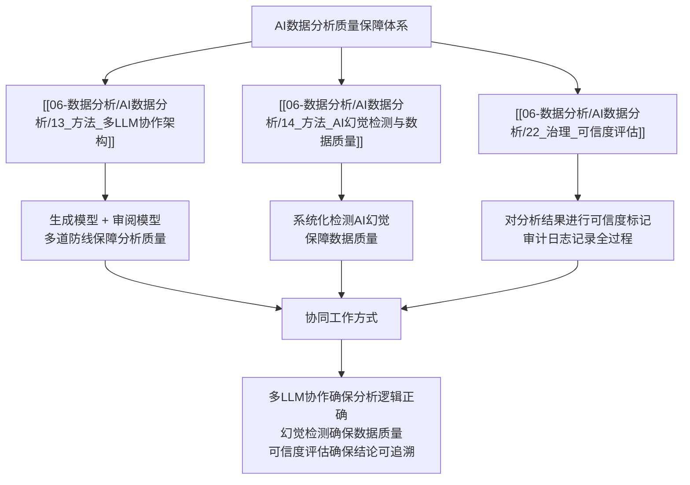

# 可信度评估 — 让AI分析结果可信、可用、可追责

> AI能自信地解释错误数据，这恰恰是它最危险的地方。可信度评估不是"不信任AI"，而是**建立一套系统化的机制，让每个AI分析结果都能被衡量、被追溯、被质疑**。没有可信度评估的AI分析，本质上就是"自动生成观点，而非自动生成洞察"。

---

## 一、为什么AI分析结果需要可信度评估

### 1.1 AI的"自信"是最大的风险

传统数据分析中，错误是容易被发现的——一个数字明显不对，或者一个图表和业务感知不符。但在AI分析中，AI的语言能力会"包装"错误：

```
传统报表错误：
  报表上显示"营收 1000万"
  → 人觉得不对
  → 检查原始数据
  → 发现计算错误
  → 修复

AI分析错误：
  AI生成分析报告："本季度营收1000万，同比下降15%，主要原因是...建议..."
  → AI为每个结论提供了"合理"的解释
  → 语言流畅、逻辑严密
  → 错误的结论被包装成"可信的叙事"
  → 决策者可能直接采纳
  → 错误决策落地
```

> [!danger] 核心风险
> AI的"一本正经胡说八道"能力，让错误从"明显可见"变成了"深藏不露"。**可信度评估的本质，是让AI分析结果具备"可被质疑"的能力。**

### 1.2 可信度评估的三大价值



---

## 二、可信度标记体系

### 2.1 四维标记

每个AI分析结论都要从四个维度进行可信度标记：

| 维度 | 标记 | 评估标准 | 示例 |
|------|------|---------|------|
| 数据完整性 | 完整 / 基本完整 / 不完整 | 数据覆盖的时间范围、字段完整性、缺失率 | "数据完整（覆盖24个月，缺失率<1%）" |
| 样本规模 | 充足 / 一般 / 不足 | 样本量是否满足统计要求、是否达到最小样本量阈值 | "样本不足（仅12条记录，建议至少50条）" |
| 更新时间 | 实时 / 近期 / 过时 | 数据截止时间与分析时间的间隔 | "数据过时（截止2025年Q1，已过时1年）" |
| 置信程度 | 高 / 中 / 低 | 综合以上三维 + 分析方法的可靠性 | "置信度：中（数据完整但样本一般）" |

### 2.2 标记规则

```
综合置信度 = f(数据完整性, 样本规模, 更新时间, 分析方法可靠性)

置信度 - 高：
  条件：数据完整 + 样本充足 + 数据实时 + 方法可靠
  含义：结论可信度高，可直接用于决策参考

置信度 - 中：
  条件：以上任一维度为"一般"或"近期"
  含义：结论可作为参考，但决策时需谨慎

置信度 - 低：
  条件：任一维度为"不足"、"过时"或"方法不可靠"
  含义：结论仅供参考，不能作为决策依据
```

### 2.3 标记的展示方式

在AI分析报告中，每个结论都应附带可信度标记：

```
结论：本季度营收同比下降15%，主要是由于XX渠道客户流失所致
  [数据完整性: 完整 | 样本规模: 充足 | 更新时间: 实时 | 综合置信度: 高]
  [数据来源: ATS系统 + 财务系统，截止2026年7月31日]
  [分析方法: 同比分析 + 渠道下钻 + 客户流失归因]

建议：建议增加XX渠道客户留存投入，预计可挽回5-8%的营收下降
  [置信度: 中 — 建议基于历史数据，未来效果受市场变化影响]
  [参考数据: 历史留存提升活动平均ROI 1:3.5]
  [风险提示: 市场下行期，留存投入效果可能低于历史均值]
```

---

## 三、输出格式规范

### 3.1 标准输出格式

每个AI分析结论的完整输出格式应包括以下七个要素：



### 3.2 各要素详解

| 要素 | 定义 | 示例 | 必填/选填 |
|------|------|------|----------|
| 结论 | 分析得出的核心发现 | "本季度营收同比下降15%" | 必填 |
| 证据 | 支撑结论的数据 | "营收数据：Q2 2026: 850万 vs Q2 2025: 1000万" | 必填 |
| 原因 | 导致结论的原因分析 | "主要原因是XX渠道客户流失，该渠道客户贡献占比从35%降至22%" | 必填 |
| 置信度 | 结论的可信程度 | "高 — 数据完整、样本充足、数据实时" | 必填 |
| 建议 | 基于结论的行动建议 | "建议增加XX渠道客户留存投入" | 选填（决策场景必填） |
| 预期影响 | 建议执行后的预期效果 | "预计可挽回5-8%的营收下降" | 选填（决策场景必填） |
| 追踪指标 | 建议执行后的效果追踪指标 | "XX渠道客户留存率、季度营收变化" | 选填（决策场景必填） |

### 3.3 输出格式模板

```
┌─────────────────────────────────────────────────────────────────┐
│ 结论：[核心发现，一句话概括]                                    │
│                                                                 │
│ 证据：                                                          │
│ [数据来源]：[数据值]（[时间范围]）                               │
│ [数据来源]：[数据值]（[时间范围]）                               │
│                                                                 │
│ 原因：                                                          │
│ [主要原因分析，2-3点]                                           │
│                                                                 │
│ 置信度：[高/中/低] — [置信度说明]                               │
│ 数据完整性：[完整/基本完整/不完整] — [说明]                      │
│ 样本规模：[充足/一般/不足] — [说明]                              │
│ 更新时间：[实时/近期/过时] — [说明]                              │
│                                                                 │
│ 建议：[行动建议]（选填，决策场景必填）                           │
│                                                                 │
│ 预期影响：[建议执行后的预期效果]（选填，决策场景必填）           │
│                                                                 │
│ 追踪指标：[用于追踪效果的关键指标]（选填，决策场景必填）         │
│                                                                 │
│ 审计ID：[唯一审计追踪ID]                                        │
│ 生成模型：[模型名称 + 版本]                                      │
│ 审阅模型：[模型名称 + 版本]                                      │
│ 人工终审：[姓名/角色]（如适用）                                  │
└─────────────────────────────────────────────────────────────────┘
```

---

## 四、审计日志

### 4.1 审计日志的核心作用

> [!tip] 审计日志的价值
> 审计日志记录AI分析的每一步路径，确保：
> 1. **可追溯**：从最终结论到原始数据，每一步都有记录
> 2. **可复现**：同样的输入 + 同样的逻辑 = 同样的输出
> 3. **可问责**：每个环节的执行者（AI或人）都有记录

### 4.2 审计日志记录内容



### 4.3 审计日志格式

```
审计ID: AUDIT-20260802-001
分析任务: 招聘SaaS产品定价决策分析
生成时间: 2026-08-02 14:30:00

[数据层]
  ├── 数据来源1: 艾瑞咨询《2026年中国HR SaaS市场报告》
  │   ├── 获取时间: 2026-08-01
  │   ├── 数据范围: 2025年度
  │   └── 可信度: 中（第三方报告，需交叉验证）
  ├── 数据来源2: 竞品A官网定价页面
  │   ├── 获取时间: 2026-08-01
  │   ├── 数据范围: 当前定价
  │   └── 可信度: 高（官网数据，实时准确）
  └── 数据来源3: 内部销售数据（2025-2026）
      ├── 获取时间: 2026-08-01
      ├── 数据范围: 2025年1月-2026年7月
      └── 可信度: 高（内部系统数据）

[加工层]
  ├── 清洗规则: 去重、去空、格式标准化
  ├── 过滤条件: 删除测试数据、删除异常订单
  └── 聚合逻辑: 按季度汇总营收数据

[分析层]
  ├── 分析方法: 同比分析、竞品对标分析、价格弹性分析
  ├── AI模型: GPT-4（分析模型）+ Claude（审阅模型）
  ├── 关键假设1: HR SaaS市场年增速25-30%（基于行业报告）
  ├── 关键假设2: 价格弹性系数约-0.8（基于历史数据）
  └── 中间结果: 见附件 analysis_intermediate_20260802.json

[决策层]
  ├── AI结论: 建议采用方案B（专业版499元/月）
  ├── 置信度: 中
  ├── 审阅模型确认: 通过（Claude, 2026-08-02 14:35:00）
  ├── 人工终审: 待确认
  └── 最终决策: 待定
```

### 4.4 审计日志的管理

| 管理维度 | 要求 | 说明 |
|---------|------|------|
| 存储 | 持久化存储，不可篡改 | 建议使用数据库或区块链存储 |
| 保留期限 | 至少2年 | 满足合规要求和审计追溯 |
| 访问权限 | 仅限治理团队和审计人员 | 保护数据隐私和安全 |
| 查询能力 | 支持按审计ID/时间/任务类型查询 | 方便快速定位和追溯 |

---

## 五、三档分级机制

### 5.1 分级原则

根据分析结果的风险等级，采用不同的输出和控制策略：

| 风险等级 | 定义 | 适用场景 | 输出方式 | 控制要求 |
|---------|------|---------|---------|---------|
| 低风险 | 错误后果轻微，不影响业务决策 | 常规报表、趋势统计、基础指标 | AI自动输出 | 仅AI审阅即可 |
| 中风险 | 错误可能导致中等程度的影响 | 趋势洞察、异常预警、渠道分析 | AI+审阅 | AI生成 + 审阅模型确认 |
| 高风险 | 错误可能导致重大业务决策失误 | 定价策略、市场进入、投资决策 | AI+终审 | AI生成 + 审阅模型 + 人工终审 |

### 5.2 分级流程



### 5.3 分级应用场景示例

| 场景 | 风险等级 | 分析内容 | 输出方式 |
|------|---------|---------|---------|
| 月度营收报表 | 低风险 | 按产品线/区域统计营收数据 | AI自动生成，审阅模型校验 |
| 渠道效果分析 | 低风险 | 各渠道流量、转化率、成本 | AI自动生成，审阅模型校验 |
| 招聘漏斗诊断 | 中风险 | 识别招聘瓶颈、给出优化建议 | AI生成 + 审阅模型 + 人工确认 |
| 产品定价分析 | 高风险 | 定价方案、市场预测、竞争分析 | AI生成 + 审阅模型 + 人工终审 |
| 市场进入策略 | 高风险 | 市场规模估算、竞争格局、投资建议 | AI生成 + 审阅模型 + 人工终审 |
| 投资决策分析 | 高风险 | 投资回报率、风险评估、建议 | AI生成 + 审阅模型 + 人工终审 |

---

## 六、可信度评估检查清单

### 6.1 数据层面检查

```
[ ] 数据来源是否可靠？
    ├── 数据来源是否经过验证？
    ├── 是否有多个数据源交叉验证？
    └── 数据源的权威性如何？

[ ] 数据是否完整？
    ├── 数据覆盖的时间范围是否完整？
    ├── 是否有数据缺失的时段？
    └── 关键字段的缺失率是否在可接受范围内？

[ ] 数据是否过时？
    ├── 数据截止时间是什么时候？
    ├── 数据时效性是否满足分析需求？
    └── 是否有更及时的数据可用？
```

### 6.2 分析层面检查

```
[ ] 分析方法是否合适？
    ├── 统计方法是否适用于数据特征？
    ├── 样本量是否满足统计要求？
    └── 是否有更合适的分析方法？

[ ] 分析逻辑是否严谨？
    ├── 结论是否有充分的数据支撑？
    ├── 是否考虑了混淆变量？
    ├── 是否区分了相关关系和因果关系？
    └── 是否有替代解释被排除？

[ ] 假设条件是否合理？
    ├── 关键假设是否明确列出？
    ├── 假设是否基于事实或合理的推断？
    └── 假设变化对结论的影响有多大？
```

### 6.3 输出层面检查

```
[ ] 结论是否清晰？
    ├── 结论是否明确、无歧义？
    ├── 结论是否回答了业务问题？
    └── 结论是否有可操作性？

[ ] 置信度是否标注？
    ├── 每个结论是否都有置信度标注？
    ├── 置信度评估是否合理？
    └── 置信度低时是否有风险提示？

[ ] 建议是否可行？
    ├── 建议是否具体、可执行？
    ├── 建议是否有预期效果说明？
    └── 建议是否有风险提示？
```

### 6.4 审计层面检查

```
[ ] 审计日志是否完整？
    ├── 数据来源是否记录？
    ├── 加工逻辑是否记录？
    ├── 分析方法是否记录？
    └── 所有人工确认记录是否保存？

[ ] 是否可复现？
    ├── 同样的数据 + 同样的逻辑能否得到同样的结果？
    ├── AI模型版本是否固定？
    └── 随机数种子是否固定（如适用）？
```

---

## 七、与多LLM协作架构和AI幻觉检测的协同

### 7.1 三者的关系



### 7.2 生命周期中的协同

| 阶段 | 多LLM协作架构 | AI幻觉检测与数据质量 | 可信度评估 |
|------|-------------|-------------------|----------|
| 数据准备 | 审阅模型检查数据口径 | 检测数据质量异常 | 标注数据完整性和时效性 |
| 分析执行 | 生成模型 + 审阅模型双轨运行 | 检测分析过程中的幻觉 | 记录分析路径到审计日志 |
| 结果输出 | 审阅模型确认结论合理性 | 检测结论中的事实性错误 | 标注综合置信度，输出标准格式 |
| 决策支持 | 多模型交叉验证建议 | 检测建议的可行性 | 三档分级控制输出方式 |

### 7.3 实战中的协同流程

```
1. 数据准备阶段
   ├── 数据治理系统（21_治理_数据治理）确保数据质量
   ├── AI幻觉检测（14_方法_AI幻觉检测与数据质量）扫描数据异常
   └── 可信度评估标记数据完整性和时效性

2. 分析执行阶段
   ├── 多LLM协作（13_方法_多LLM协作架构）生成+审阅
   ├── 幻觉检测持续监控分析过程中的错误
   └── 可信度评估记录分析路径到审计日志

3. 结果输出阶段
   ├── 多LLM确认结论合理性
   ├── 幻觉检测做最终的事实性检查
   └── 可信度评估输出标准格式 + 置信度标注

4. 决策执行阶段
   ├── 根据风险等级选择输出方式（三档分级）
   ├── 人工终审确认
   └── 审计日志归档
```

---

## 八、实战示例：招聘分析报告的可信度标注

### 8.1 示例背景

某招聘运营团队使用AI分析渠道效果，生成了以下报告。以下是可信度标注的完整示例：

### 8.2 可信度标注示例

```
┌─────────────────────────────────────────────────────────────────┐
│ 结论：智联招聘渠道的候选人入职率最高，建议增加该渠道预算        │
│                                                                 │
│ 证据：                                                          │
│ 智联招聘渠道：投递量 1200份，简历通过率 35%，面试到场率 68%，   │
│    offer接受率 45%，入职率 8.5%                                 │
│ 猎聘渠道：投递量 800份，简历通过率 42%，面试到场率 72%，        │
│    offer接受率 38%，入职率 7.2%                                 │
│ BOSS直聘渠道：投递量 2000份，简历通过率 28%，面试到场率 65%，   │
│    offer接受率 40%，入职率 5.6%                                 │
│                                                                 │
│ 原因：                                                          │
│ 智联招聘渠道的候选人画像与岗位要求匹配度最高，各阶段转化率均     │
│ 处于领先水平，特别是offer接受率（45%）显著高于其他渠道           │
│                                                                 │
│ 置信度：中 — 数据完整但样本量有限（仅3个月数据）                │
│ 数据完整性：完整 — 覆盖3个渠道、3个月数据、无缺失记录           │
│ 样本规模：一般 — 3个月数据，部分岗位样本量不足30人              │
│ 更新时间：实时 — 数据截止2026年7月31日                           │
│ 局限性：未考虑岗位类型差异（不同渠道主推岗位不同）               │
│                                                                 │
│ 建议：增加智联招聘渠道预算20%，同时持续监控入职率变化            │
│                                                                 │
│ 预期影响：预计入职人数提升10-15%，但需注意渠道成本变化           │
│                                                                 │
│ 追踪指标：各渠道入职率、单入职成本、渠道ROI                      │
│                                                                 │
│ 审计ID: AUDIT-20260802-002                                      │
│ 生成模型: GPT-4 (分析模型)                                      │
│ 审阅模型: Claude (审阅模型)                                     │
│ 人工终审: 招聘运营负责人（待确认）                              │
└─────────────────────────────────────────────────────────────────┘
```

### 8.3 可信度评估的实际应用效果

| 场景 | 无可信度评估 | 有可信度评估 |
|------|------------|------------|
| 决策者看到结论 | 直接采纳建议，增加预算 | 看到"置信度：中"和"样本规模：一般"，谨慎决策 |
| 分析师复查 | 需从头追溯数据和分析过程 | 通过审计ID快速定位问题 |
| 治理团队监督 | 无法评估分析质量 | 通过置信度分布评估整体分析质量 |
| 业务方理解 | 不知结论可靠程度 | 清晰看到每个结论的可信度 |

---

## 九、总结：可信度评估的"五步法"

```
第一步：数据可信度评估
  ├── 检查数据完整性、样本规模、更新时间
  └── 标注数据层面的可信度

第二步：分析过程可信度评估
  ├── 检查分析方法合理性、逻辑严谨性
  └── 记录分析路径到审计日志

第三步：结论可信度标注
  ├── 综合评估并标注置信度
  └── 输出标准格式（结论+证据+原因+置信度+建议+预期影响+追踪指标）

第四步：风险分级输出
  ├── 低风险：AI自动输出
  ├── 中风险：AI+审阅
  └── 高风险：AI+人工终审

第五步：审计归档
  ├── 保存完整的审计日志
  └── 确保可追溯、可复现、可问责
```

---

## 关联笔记

- [[06-数据分析/AI数据分析/00_MOC_AI数据分析中枢]] — 返回中枢索引
- [[06-数据分析/AI数据分析/21_治理_数据治理]] — 数据治理是可信度评估的基础
- [[06-数据分析/AI数据分析/13_方法_多LLM协作架构]] — 多LLM协作架构提供可信度保障
- [[06-数据分析/AI数据分析/14_方法_AI幻觉检测与数据质量]] — AI幻觉检测与数据质量保障
- [[06-数据分析/AI数据分析/24_治理_分析资产沉淀]] — 分析资产的管理与沉淀