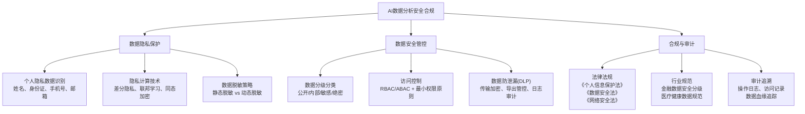
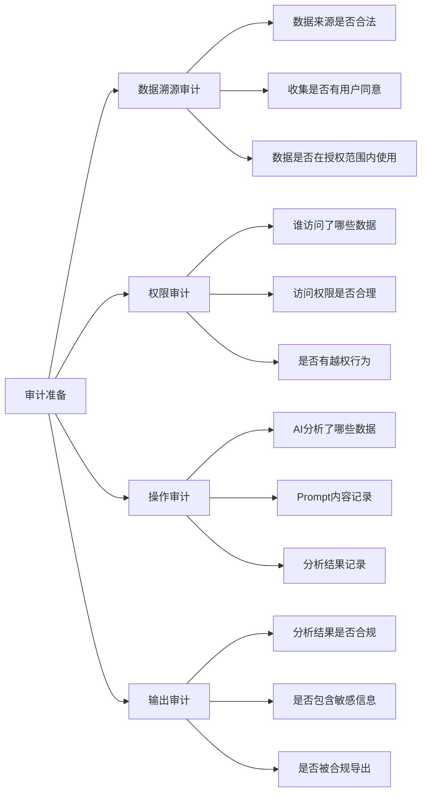

# 安全与合规 — AI数据分析中的数据隐私、数据安全与合规管理

> [!abstract] 核心观点
> 用AI做数据分析，数据安全与合规不是"加分项"，而是"门票"。在AI时代，数据一旦被泄露或被滥用，不仅是法律风险，更是品牌信任的灭顶之灾。本章覆盖从数据分级、隐私保护到合规审计的完整链路。

---

## 一、AI数据分析面临的安全合规挑战

### 1.1 AI带来的新风险

传统数据分析的安全风险主要来自"人"——权限管理不到位、数据不当导出、内部人员泄密等。AI数据分析在此基础上增加了新的风险维度：

| 风险维度 | 传统分析 | AI数据分析 | 风险等级 |
|---------|---------|-----------|---------|
| **数据泄露路径** | 人工导出、文件分享 | AI模型可能"记住"训练数据、API调用日志 | 🔴 更高 |
| **数据跨境** | 物理存储位置可控 | 云端LLM API调用可能涉及数据出境 | 🔴 新风险 |
| **Prompt注入** | 不适用 | 恶意Prompt可能诱导AI输出敏感数据 | 🔴 新风险 |
| **数据脱敏** | 手动脱敏，有遗漏 | 自动脱敏，但AI可能"推理"出脱敏前的信息 | 🟡 中风险 |
| **合规审计** | 流程清晰，可追溯 | AI"黑盒"决策，审计困难 | 🟡 中风险 |

### 1.2 数据安全合规的"三座大山"



---

## 二、数据隐私保护

### 2.1 个人隐私数据识别

在AI数据分析中，首先要解决的是"哪些数据是敏感数据"的问题。

**HR/招聘场景中的敏感数据清单：**

| 数据类型 | 典型字段 | 合规要求 | 风险等级 |
|---------|---------|---------|---------|
| 个人身份信息 | 姓名、身份证号、手机号、邮箱 | 收集需同意，处理需授权 | 🔴 极高 |
| 敏感个人信息 | 政治面貌、宗教信仰、健康信息 | 单独同意，限制处理 | 🔴 极高 |
| 教育背景 | 学校、学历、专业 | 必要性原则，仅收集相关 | 🟡 中 |
| 工作经历 | 公司、职位、薪资 | 薪资属敏感，需脱敏处理 | 🟡 中 |
| 测评数据 | 性格测评、能力测评 | 需评估是否构成"分析个人特征" | 🔴 高 |
| 生物特征 | 面试视频、语音 | 属敏感个人信息，需单独授权 | 🔴 极高 |

### 2.2 AI数据分析中的数据脱敏策略

> [!warning] AI脱敏的特殊风险
> 传统脱敏把身份证号变成`********`就安全了。但AI分析时，可能通过"姓名+出生日期+学校"的组合推理出脱敏前的信息。**脱敏不是打码，而是消除关联关系。**

**分层脱敏策略：**

| 脱敏级别 | 适用场景 | 方法 | 示例 |
|---------|---------|------|------|
| **L1 - 基本脱敏** | 日常统计分析 | 掩码、截断 | 手机号: 138****1234 |
| **L2 - 增强脱敏** | 交叉分析、模型训练 | 泛化、k-匿名 | 年龄: 具体值→区间(25-30) |
| **L3 - 高级脱敏** | 高敏感数据、外部共享 | 差分隐私、合成数据 | 添加噪声，统计结果真实但个体不可追溯 |

**AI数据分析中的脱敏最佳实践：**

```
┌──────────────────────────────────────────────────┐
│ 数据脱敏工作流                                    │
├──────────────────────────────────────────────────┤
│ ① 数据接入时自动识别敏感字段                      │
│   └── 正则匹配 + AI模型辅助识别                   │
│                                                    │
│ ② 根据数据分级自动应用脱敏策略                     │
│   └── L1级字段自动脱敏，L2/L3级需人工确认          │
│                                                    │
│ ③ AI分析前验证脱敏有效性                          │
│   └── 用审阅模型检查：是否还存在可识别个体信息      │
│                                                    │
│ ④ AI分析输出时二次脱敏                            │
│   └── 分析报告中如果出现了个体数据，自动脱敏后输出  │
└──────────────────────────────────────────────────┘
```

### 2.3 隐私计算技术选型

当需要在保护隐私的前提下进行数据分析时，可以考虑以下技术：

| 技术 | 原理 | 适用场景 | 性能影响 | 实施难度 |
|------|------|---------|---------|---------|
| **差分隐私** | 在查询结果中添加噪声 | 统计分析、趋势分析 | 低 | 低 |
| **联邦学习** | 数据不动模型动 | 跨组织联合建模 | 中 | 高 |
| **同态加密** | 在加密数据上直接计算 | 高安全需求场景 | 高（慢100-1000倍） | 极高 |
| **安全多方计算** | 多方协同计算，不暴露各自数据 | 多方数据联合分析 | 高 | 高 |
| **合成数据** | 生成与原始数据分布相似的假数据 | 测试、模型训练、共享 | 低 | 中 |

> [!tip] 实际建议
> 对于大多数HR/招聘数据分析场景，**差分隐私 + 数据脱敏**已经足够。联邦学习和同态加密更多用于跨组织数据共享场景，实施成本高，不建议一开始就上。

---

## 三、数据安全管控

### 3.1 数据分级分类

> 数据分级是安全管控的基础。没有分级，就谈不上"差异化保护"。

**五级数据分级模型：**

| 级别 | 定义 | 示例 | 保护要求 | 是否允许AI分析 |
|------|------|------|---------|---------------|
| L0 - 公开 | 可对外公开 | 公司简介、岗位名称 | 无特殊要求 | ✅ 完全允许 |
| L1 - 内部 | 内部使用，对外不公开 | 部门架构、报表模板 | 不得公开传播 | ✅ 允许，需脱敏 |
| L2 - 敏感 | 泄露有负面影响 | 员工薪资、绩效数据 | 加密存储、严格权限 | ⚠️ 需脱敏+审批 |
| L3 - 机密 | 泄露有重大影响 | 战略规划、未公开财报 | 加密+审计+最小权限 | ❌ 禁止AI直接分析 |
| L4 - 绝密 | 泄露有毁灭性影响 | 核心算法、涉密数据 | 物理隔离、专人管理 | ❌ 禁止 |

### 3.2 访问控制

**AI数据分析的权限管理原则：**

```
最小权限原则
├── AI只能访问完成任务所需的最小数据集
├── 不能访问原始数据，只能访问脱敏后的数据视图
└── 分析结果也需权限控制，不能随意导出

角色分离原则
├── 数据管理员：负责数据接入和权限分配
├── 数据分析师：使用AI工具分析数据
├── AI系统管理员：管理LLM API和模型配置
└── 审计员：监视所有操作日志

动态权限原则
├── 基于场景的临时权限（如"仅此一次分析"）
├── 基于风险的动态管控（如检测到异常访问自动降权）
└── 定期权限复审（每季度一次）
```

### 3.3 数据防泄漏（DLP）在AI场景的特殊要求

传统DLP关注的是"文件被导出"、"邮件发错人"等问题。AI数据分析中，DLP需要额外关注：

| 风险场景 | 说明 | 防护措施 |
|---------|------|---------|
| **Prompt泄露** | 用户将敏感数据写在Prompt中发送给LLM | Prompt内容自动扫描，拦截敏感信息 |
| **模型记忆** | LLM记住训练数据中的敏感信息 | 使用不存储数据的API模式，禁止模型微调 |
| **API日志** | API调用日志中可能包含敏感数据 | 日志自动脱敏，缩短日志保留期 |
| **输出泄露** | AI分析结果中包含了不应输出的敏感信息 | 输出内容二次过滤，自动脱敏 |
| **侧信道攻击** | 通过分析模型的响应时间、token数量推断信息 | 统一响应时间，限制输出长度 |

---

## 四、合规与审计

### 4.1 核心法律法规

| 法规 | 核心要求 | 对AI数据分析的影响 |
|------|---------|------------------|
| **《个人信息保护法》** | 最小必要、告知同意、目的限制、数据主体权利 | 必须明确分析目的，不得过度收集，用户有权删除其数据 |
| **《数据安全法》** | 数据分类分级、数据安全保护义务、数据出境安全评估 | 建立数据分级制度，重要数据出境需评估 |
| **《网络安全法》** | 网络安全等级保护、关键信息基础设施保护 | AI分析系统需通过等保测评 |
| **《生成式AI管理办法》** | 内容合规、数据来源合法、防歧视 | AI分析结果需审核，不得有偏见性输出 |

### 4.2 AI数据分析的合规审计要点



**审计日志应包含的内容：**

| 审计项 | 记录内容 | 保留期限 |
|-------|---------|---------|
| 数据访问日志 | 谁、什么时间、访问了哪些数据、操作类型 | 不少于6个月 |
| AI分析日志 | 输入数据摘要、Prompt摘要、输出摘要 | 不少于3个月 |
| 权限变更日志 | 权限授予/撤销记录、审批人 | 不少于12个月 |
| 数据导出日志 | 导出内容、接收方、用途 | 不少于12个月 |
| 脱敏操作日志 | 脱敏时间、脱敏方法、操作人 | 不少于6个月 |

### 4.3 AI数据出境的合规要求

使用海外LLM API（如OpenAI、Claude等）时，数据出境是必须关注的问题：

> [!warning] 数据出境红线
> 根据《数据安全法》和《个人信息保护法》，**个人信息和重要数据出境需经过安全评估或认证**。简单来说：把中国员工的简历发给OpenAI做分析，可能已经涉及数据出境。

**合规方案对比：**

| 方案 | 说明 | 合规风险 | 成本 | 推荐度 |
|------|------|---------|------|-------|
| **使用国内LLM** | DeepSeek、通义千问、文心一言等 | 低 | 低 | ⭐⭐⭐⭐⭐ |
| **数据脱敏后出境** | 脱敏后调用海外API | 中（需评估） | 中 | ⭐⭐⭐ |
| **本地部署LLM** | 私有化部署开源模型 | 低 | 高 | ⭐⭐⭐⭐ |
| **通过安全评估** | 正式申请数据出境安全评估 | 中（流程长） | 高 | ⭐⭐ |
| **海外独立部署** | 数据不出境，在海外部署分析系统 | 低（但数据需在海外收集） | 高 | ⭐⭐⭐ |

> [!tip] 实际建议
> 对于大多数国内企业，**优先选择国内LLM + 本地部署开源模型**的组合方案，既能满足数据分析需求，又规避了数据出境风险。

---

## 五、AI数据分析安全合规最佳实践清单

### 5.1 组织层面

```
□ 指定数据安全负责人（DPO）
□ 建立数据分级分类制度
□ 定期开展数据安全培训（至少每季度一次）
□ 制定AI数据分析安全使用规范
□ 建立数据安全事件应急响应机制
```

### 5.2 技术层面

```
□ 数据脱敏：AI分析前强制脱敏，分析后二次过滤
□ 访问控制：最小权限原则 + 角色分离 + 动态权限
□ 日志审计：全链路操作日志，定期审计
□ 加密传输：TLS/SSL + 数据加密存储
□ Prompt安全：敏感词过滤 + 内容安全检测
□ 输出审查：AI分析结果二次审核，防止敏感信息泄露
```

### 5.3 合规层面

```
□ 明确数据收集目的和范围（最小必要原则）
□ 获取用户同意（收集+处理+分析的完整授权链）
□ 建立数据主体权利响应机制（查询/更正/删除/撤回同意）
□ 数据出境合规评估（如适用）
□ 定期合规审计（至少每年一次）
□ 第三方供应商安全评估（LLM API提供商、云服务商）
```

### 5.4 安全合规检查清单（月度）

| 检查项 | 频率 | 责任人 | 状态 |
|-------|------|-------|------|
| 权限复审 | 月度 | 数据管理员 | □ |
| 操作日志审计 | 月度 | 审计员 | □ |
| 脱敏策略有效性验证 | 月度 | 数据分析师 | □ |
| LLM API使用合规检查 | 月度 | AI系统管理员 | □ |
| 数据安全事件报告 | 即时 | 全员 | □ |
| 第三方安全评估 | 年度 | 安全负责人 | □ |

---

## 六、总结：AI数据分析安全合规的"三要三不要"

### 三要

```
✅ 要先分级再保护
   └── 数据分类分级是安全管控的基础，没有分级就没有差异化保护

✅ 要先脱敏再分析
   └── AI分析前必须脱敏，且要考虑AI的"推理还原"风险

✅ 要先审计再上线
   └── AI数据分析系统上线前，必须通过安全合规审计
```

### 三不要

```
❌ 不要将敏感数据直接发送给LLM API
   └── 尤其是海外API，必须脱敏或使用本地部署

❌ 不要忽视Prompt注入风险
   └── 恶意Prompt可能诱导AI输出敏感数据

❌ 不要认为"加密了"就安全了
   └── 加密只是安全链的一环，权限、审计、脱敏缺一不可
```

---

## 关联笔记

- [[06-数据分析/AI数据分析/21_治理_数据治理]] — 数据治理整体框架
- [[06-数据分析/AI数据分析/22_治理_可信度评估]] — AI分析结果可信度评估
- [[06-数据分析/AI数据分析/24_治理_分析资产沉淀]] — 分析资产沉淀与复用
- [[06-数据分析/AI数据分析/00_MOC_AI数据分析中枢]] — 返回中枢索引