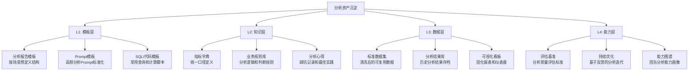
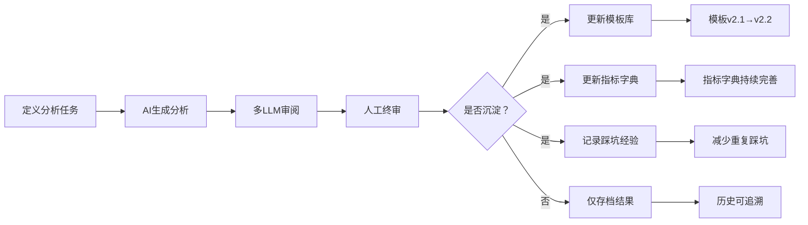

# 分析资产沉淀 — AI数据分析的知识复用、模板化与持续积累

> [!abstract] 核心观点
> 每做一次数据分析，都在产生可复用的资产。但大部分团队的问题是：**分析完了就完了，下次做类似分析时又从零开始。** AI数据分析的真正价值增量，不仅在于单次分析的质量，更在于能否把每次分析沉淀为可复用的模板、知识和能力。

---

## 一、为什么要做分析资产沉淀？

### 1.1 不沉淀的代价

| 场景 | 不沉淀 | 沉淀后 |
|------|-------|-------|
| 新同事入职 | 花2周熟悉业务和分析逻辑 | 直接看模板库，1天上手 |
| 季度招聘分析 | 重新写SQL、重新调Prompt | 调出模板，改参数即可 |
| 管理层问"去年Q3同比" | 查各份邮件和报表 | 直接看指标库，2分钟回答 |
| 换工具/换平台 | 所有分析流程重做 | 只需迁移模板和知识库 |
| 分析师离职 | 经验全部带走，新人从零开始 | 知识留在库中，交接成本低 |

### 1.2 分析资产沉淀的四个层次



---

## 二、模板层：让分析可复制

### 2.1 分析报告模板

**报告模板的通用结构：**

```
┌──────────────────────────────────────────────────┐
│ 分析报告模板                                     │
├──────────────────────────────────────────────────┤
│ 一、分析背景与目的                                │
│   - 谁要的？为什么要做？用来做什么决策？          │
│   - 数据时间范围、分析精度要求                    │
│                                                    │
│ 二、核心发现（摘要）                              │
│   - 3-5个关键结论，每条结论标注置信度             │
│   - 如果只有1分钟，看这里就够了                   │
│                                                    │
│ 三、数据说明                                      │
│   - 数据来源、时间范围、统计口径                  │
│   - 数据质量评估（完整性、准确性、时效性）         │
│                                                    │
│ 四、详细分析                                      │
│   - 按分析维度展开，每个维度包含：                 │
│     · 数据呈现（图表/表格）                       │
│     · 数据解读（趋势/异常/对比）                  │
│     · 业务洞察（这意味着什么？）                  │
│     · 置信度标注（高/中/低）                      │
│                                                    │
│ 五、结论与建议                                    │
│   - 基于分析的 actionable 建议                    │
│   - 每个建议标注：预期效果、风险、实施难度         │
│                                                    │
│ 六、附录                                          │
│   - 分析方法、数据源、参考文档                    │
│   - 多LLM协作审阅记录                             │
└──────────────────────────────────────────────────┘
```

### 2.2 Prompt模板

**高频分析场景的Prompt模板：**

> [!tip] Prompt模板化原则
> 把"怎么写Prompt"交给模板，让分析师专注于业务问题。每个模板包含：角色设定、分析目标、数据说明、输出格式、质量要求。

| 场景 | Prompt模板要点 | 复用频率 |
|------|--------------|---------|
| **渠道效果分析** | 给定渠道-成本-转化数据，自动计算ROI、效率排名、趋势对比 | 每周 |
| **招聘漏斗诊断** | 给定各阶段转化数据，识别瓶颈、对比基准、建议优化方向 | 每周 |
| **异常数据预警** | 给定时间序列数据，自动标记异常点、分析可能原因 | 每日 |
| **趋势分析** | 给定历史数据，分析趋势方向、变化幅度、季节性因素 | 月度 |
| **对比分析** | 给定两组数据，统计显著性检验、效果量计算、业务解读 | 按需 |

**Prompt模板示例 —— 招聘漏斗诊断：**

```
角色：你是招聘运营数据分析专家，有10年招聘数据分析经验。

分析目标：诊断当前招聘漏斗的健康状况，识别瓶颈环节，给出优化建议。

数据输入：
- 各阶段转化率（简历筛选→初面→复试→终面→offer→入职）
- 各阶段平均耗时（天）
- 对比基准：行业平均水平 / 历史同期水平

输出要求：
1. 漏斗全景图（当前各阶段转化率）
2. 瓶颈识别（与基准偏差最大的环节）
3. 原因分析（结合耗时数据，给出可能的瓶颈原因）
4. 优化建议（每个建议标注预期效果和实施难度）

置信度要求：
- 每个结论标注高/中/低
- 高置信度：有明确数据支撑，统计显著
- 中置信度：有数据支持但样本不足
- 低置信度：基于经验推测，需要进一步验证
```

### 2.3 SQL/代码模板

**常用分析场景的代码模板库：**

| 模板类型 | 用途 | 技术栈 |
|---------|------|-------|
| 招聘漏斗SQL | 从ATS系统提取各阶段转化数据 | SQL |
| 渠道归因分析 | 计算各渠道的贡献度和ROI | SQL + Python |
| 留存率计算 | 按周/月计算用户留存曲线 | SQL |
| 同比环比分析 | 自动计算同比、环比、累计值 | SQL |
| 异常检测 | 基于标准差的方法检测异常值 | Python |
| 趋势分解 | 分解趋势、季节性和残差 | Python |

---

## 三、知识层：让经验可传承

### 3.1 指标字典

> 指标字典是分析资产沉淀中最基础、最重要的资产。**没有统一的指标字典，每一份分析报告都可能用不同的口径——结果不可比，不可累计。**

**指标字典模板：**

| 指标名称 | 定义 | 计算公式 | 数据来源 | 统计口径 | 更新频率 | 负责人 |
|---------|------|---------|---------|---------|---------|-------|
| 简历筛选通过率 | 通过初筛的简历占比 | 初筛通过数/简历投递总数 | ATS系统 | 含所有渠道 | 实时 | 招聘运营 |
| 面试到场率 | 实际到场面试的候选人占比 | 到场人数/邀约面试人数 | ATS系统 | 不含线上面试迟到 | 周度 | 招聘运营 |
| offer接受率 | 接受offer的候选人占比 | offer接受数/发出offer数 | ATS系统 | 不包含撤回offer | 月度 | HRBP |
| 招聘周期 | 从JD发布到入职的平均天数 | 平均(入职日期 - JD发布日期) | ATS系统 | 分岗位级别 | 月度 | 招聘运营 |
| 单入职成本 | 平均每个入职员工的招聘成本 | 总招聘成本/入职人数 | 财务系统+ATS | 含渠道费+人力成本 | 季度 | 招聘负责人 |

### 3.2 业务规则库

**常见分析规则和业务判断逻辑：**

```
规则1：最小样本量阈值
├── 当样本量 < 30 时，不计算百分比，仅展示绝对值
├── 当样本量 30-100 时，标注"小样本，仅供参考"
└── 当样本量 > 100 时，可以正常计算和统计

规则2：异常值判定标准
├── 超过均值±3个标准差 → 标注"异常值"
├── 超过均值±2个标准差 → 标注"需关注"
└── 连续3个月趋势异常 → 触发预警

规则3：置信度判定
├── 高置信度：数据完整、样本充足、统计显著
├── 中置信度：数据基本完整但样本有限
└── 低置信度：数据不完整或仅基于经验推测

规则4：同比环比优先级
├── 有同期数据：优先看同比（消除季节性影响）
├── 无同期数据：看环比（需标注季节性因素）
└── 两者都有：同时展示，以同比为主
```

### 3.3 分析心得与踩坑记录

> 经验沉淀是团队最容易被忽视的资产。每次分析踩坑、每次发现AI幻觉、每次发现数据口径问题——记录下来，就是团队的"护城河"。

**踩坑记录模板：**

```
┌──────────────────────────────────────────────────┐
│ 踩坑记录 #001                                     │
├──────────────────────────────────────────────────┤
│ 场景：招聘渠道效果分析                             │
│ 问题：AI报告显示"渠道A的ROI最高，建议加大投入"    │
│ 实际：渠道A只投了2周，样本量不足，统计不可靠       │
│ 根因：Prompt中未设定最小样本量阈值                 │
│ 修复：在Prompt模板中加入最小样本量规则              │
│ 教训：AI不会主动告诉你"样本不足"，必须明确要求     │
│ 日期：2026-03-15                                   │
└──────────────────────────────────────────────────┘
```

---

## 四、数据层：让分析可追溯

### 4.1 标准数据集

**需要沉淀的标准数据集类型：**

| 数据集类型 | 内容 | 更新频率 | 用途 |
|-----------|------|---------|------|
| **招聘基础数据集** | 脱敏后的候选人、岗位、渠道、阶段数据 | 实时同步 | 所有招聘分析的基础 |
| **渠道效果数据集** | 按渠道汇总的投递、转化、成本数据 | 周度 | 渠道效果分析 |
| **招聘漏斗数据集** | 按月/周/岗位的漏斗转化数据 | 周度 | 漏斗诊断 |
| **薪酬对标数据集** | 外部薪酬调研数据 | 季度 | 薪酬分析 |
| **历史分析结果库** | 过去所有分析报告的关键数据和结论 | 持续追加 | 趋势对比、历史回溯 |

### 4.2 分析结果库

> 把每次分析的结果存档，形成"分析历史"。这样下次分析时，可以直接对比历史数据，而不需要重新提取。

**分析结果存档结构：**

```
┌──────────────────────────────────────────────────┐
│ 分析结果存档                                      │
├──────────────────────────────────────────────────┤
│ 分析ID：A2026-001                                 │
│ 分析主题：2026年Q1招聘渠道效果分析                │
│ 分析日期：2026-04-05                              │
│ 分析人：张三                                      │
│ 使用模板：渠道效果分析模板 v2.1                   │
│ 数据范围：2026-01-01 ~ 2026-03-31                │
│                                                    │
│ 关键数据：                                        │
│ - 总投递量：12,345（同比+15%，环比+8%）            │
│ - 渠道A ROI：3.2（最高）                           │
│ - 渠道B ROI：1.8                                   │
│ - 渠道C ROI：2.5                                   │
│                                                    │
│ 关键结论：                                        │
│ - 渠道A效率最高，但成本也在上升[高置信度]          │
│ - 渠道B性价比下降，建议减少投入[中置信度]          │
│                                                    │
│ 后续行动：                                        │
│ - 渠道A预算增加20%（已执行）                      │
│ - 渠道B重新谈判价格（进行中）                     │
│ - 下季度复查（已设置提醒）                        │
└──────────────────────────────────────────────────┘
```

### 4.3 可视化看板

**固化报表和仪表盘：**

| 看板名称 | 核心指标 | 更新频率 | 受众 |
|---------|---------|---------|------|
| 招聘运营总览 | 投递量、面试量、offer量、入职量 | 实时 | 招聘团队 |
| 渠道效果周报 | 各渠道投递量、转化率、成本、ROI | 周度 | 招聘运营 |
| 招聘漏斗月报 | 各阶段转化率、瓶颈诊断、趋势变化 | 月度 | 招聘负责人 |
| 薪酬分析看板 | 岗位薪资分布、行业对标、offer薪资 | 季度 | HRBP |
| 招聘预测看板 | 招聘需求预测、周期预估、风险预警 | 月度 | 管理层 |

---

## 五、能力层：让分析可持续进化

### 5.1 分析质量评估基准

**如何评估一次AI数据分析的质量：**

| 评估维度 | 权重 | 评估标准 | 评分方式 |
|---------|------|---------|---------|
| **数据准确性** | 25% | 数字是否与原始数据一致？有无AI幻觉？ | 审阅模型交叉验证 |
| **逻辑严谨性** | 20% | 推理链条是否完整？有无跳跃式结论？ | 人工审核 |
| **业务相关性** | 20% | 分析是否回答了业务问题？结论是否可用？ | 业务方反馈 |
| **可操作性** | 15% | 建议是否具体、可执行？有无预期效果？ | 业务方反馈 |
| **可追溯性** | 10% | 每项数据有无来源？结论有无置信度标注？ | 审计检查 |
| **可复用性** | 10% | 分析框架能否沉淀为模板？ | 知识库管理员 |

### 5.2 持续优化机制



**优化反馈循环：**

| 反馈来源 | 触发条件 | 优化动作 |
|---------|---------|---------|
| 审阅模型发现逻辑错误 | 每次审阅 | 更新Prompt模板中的约束条件 |
| 业务方反馈"结论不可用" | 报告交付后 | 更新分析框架，明确业务需求 |
| 发现重复问题 | 第3次遇到同类问题 | 新增标准分析模板 |
| 新人问"这个指标怎么算" | 入职培训 | 更新指标字典，补充说明 |
| 工具升级/平台变更 | 平台切换 | 更新代码模板，验证兼容性 |

### 5.3 团队能力图谱

**数据分析团队的能力积累路径：**

| 阶段 | 能力要求 | 资产沉淀重点 | 里程碑 |
|------|---------|------------|-------|
| **L1 - 基础期** | 能用AI做基础报表 | 建立指标字典、基础报告模板 | 第一份AI分析报告通过审阅 |
| **L2 - 规范期** | 能规范使用AI分析 | Prompt模板库、分析流程标准化 | 模板覆盖80%高频场景 |
| **L3 - 优化期** | 能评估和改进AI分析 | 质量评估体系、踩坑记录库 | 分析质量评分稳定在80分+ |
| **L4 - 沉淀期** | 能系统沉淀分析资产 | 完整资产沉淀体系、持续优化机制 | 新人上手时间缩短50% |
| **L5 - 赋能期** | 能通过资产赋能团队 | 能力图谱、培训体系、自动推荐 | 分析资产成为团队核心竞争力 |

---

## 六、分析资产沉淀的落地建议

### 6.1 分阶段实施路线

```
第一阶段（1-2周）——基础建设
├── 建立指标字典（至少覆盖20个核心指标）
├── 创建3-5个高频报告模板
├── 建立分析结果存档机制
└── 确定资产沉淀的责任人

第二阶段（3-4周）——模板覆盖
├── 覆盖80%高频分析场景的Prompt模板
├── 建立踩坑记录机制
├── 创建标准数据集
└── 团队培训：如何使用模板

第三阶段（5-8周）——持续优化
├── 建立分析质量评估机制
├── 建立反馈闭环
├── 定期复盘和优化
└── 沉淀能力图谱
```

### 6.2 工具推荐

| 工具类型 | 推荐工具 | 用途 |
|---------|---------|------|
| **知识管理** | Obsidian、Notion、飞书文档 | 指标字典、规则库、踩坑记录 |
| **模板管理** | Git仓库、企业内部Wiki | Prompt模板、代码模板、报告模板 |
| **数据管理** | 数据仓库（如ClickHouse、Doris）、BI工具 | 标准数据集、分析结果库 |
| **协作工具** | 飞书、Slack、钉钉 | 分析需求流转、反馈收集 |

### 6.3 日常习惯

```
✅ 每次分析前：检查模板库，看有没有现成的可用
✅ 每次分析后：补充踩坑记录，更新模板（如有改进）
✅ 每周：抽出30分钟，整理本周分析资产
✅ 每月：复盘模板使用情况，淘汰低频模板，优化高频模板
✅ 每季度：指标字典全面复审，清理过时指标
✅ 新人入职：安排半天学习资产沉淀库的使用
```

---

## 七、总结：分析资产沉淀的"三要三不要"

### 三要

```
✅ 要先沉淀再复用
   └── 每次分析都是资产积累的机会，不要浪费

✅ 要模板化再标准化
   └── 先做出可用的模板，再逐步优化为标准

✅ 要持续迭代
   └── 资产沉淀不是一次性的，需要持续维护和优化
```

### 三不要

```
❌ 不要追求完美才开始
   └── 先有能用，再有好用，最后才有完美

❌ 不要只存不用
   └── 沉淀的资产要定期审视和使用，否则就是"知识垃圾"

❌ 不要忽视维护成本
   └── 资产需要维护，更新不及时的模板比没有模板更糟糕
```

---

## 关联笔记

- [[06-数据分析/AI数据分析/21_治理_数据治理]] — 数据治理整体框架
- [[06-数据分析/AI数据分析/22_治理_可信度评估]] — AI分析结果可信度评估
- [[06-数据分析/AI数据分析/23_治理_安全与合规]] — 数据安全与合规管理
- [[06-数据分析/AI数据分析/12_方法_Prompt工程]] — Prompt工程方法论
- [[06-数据分析/AI数据分析/00_MOC_AI数据分析中枢]] — 返回中枢索引