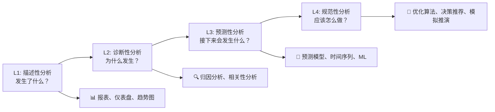
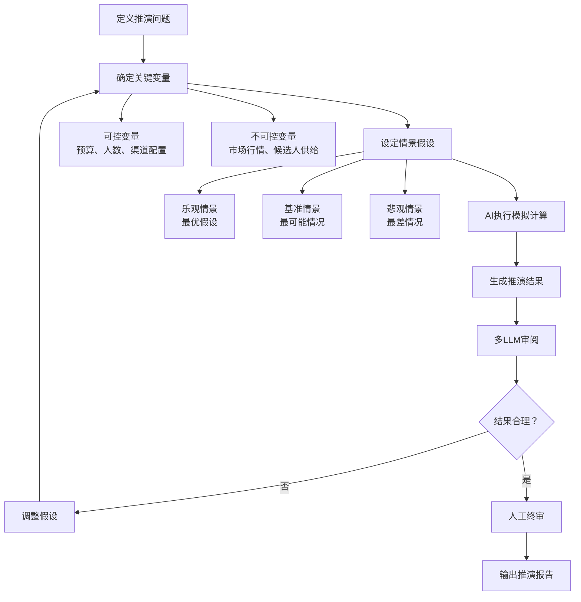
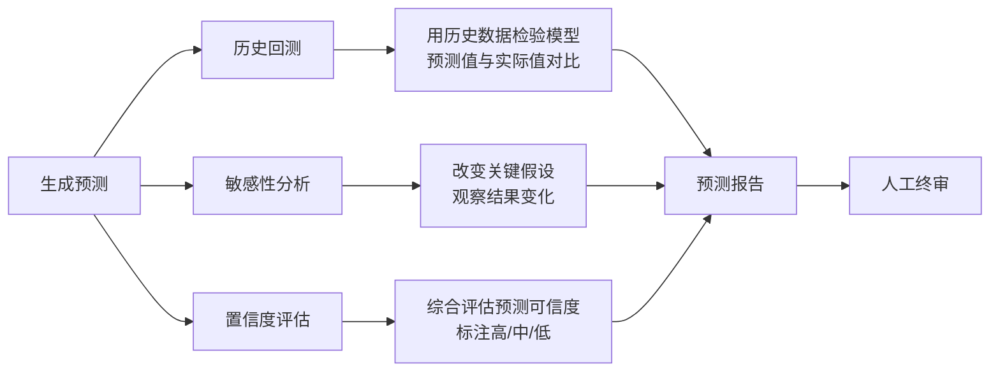

# 预测分析与模拟推演 — AI驱动的预测建模、情景模拟与决策推演

> [!abstract] 核心观点
> 数据分析的最高境界不是"告诉你发生了什么"，而是"告诉你接下来会发生什么，以及如果做了不同的选择会怎样"。预测分析让数据从"后视镜"变成"前照灯"，而模拟推演让你能在虚拟世界中试错，不要在真实世界中交学费。

---

## 一、从描述到预测：数据分析的四个层次



| 层次 | 核心问题 | 常用方法 | AI能力 | 对业务的价值 |
|------|---------|---------|--------|------------|
| **描述性** | 发生了什么？ | 报表、数据可视化 | 自动化生成 | 知情 |
| **诊断性** | 为什么发生？ | 下钻分析、归因 | 多LLM因果推理 | 理解 |
| **预测性** | 接下来会发生什么？ | 时间序列、ML模型 | AI辅助建模+解释 | 预见 |
| **规范性** | 应该怎么做？ | 优化、模拟推演 | AI模拟+决策建议 | 行动 |

---

## 二、AI时代的预测分析

### 2.1 传统预测 vs AI预测

| 对比维度 | 传统预测分析 | AI辅助预测分析 |
|---------|------------|---------------|
| **建模门槛** | 需要专业的统计/ML背景 | 用自然语言描述需求，AI辅助建模 |
| **特征工程** | 手动提取和选择特征 | AI自动探索特征，但需人工验证 |
| **模型选择** | 凭借经验选择算法 | AI提供多种模型对比+推荐 |
| **调参优化** | 手工调参，耗时 | AI辅助自动调参（需谨慎） |
| **结果解释** | 需要专业解读 | AI生成自然语言解释 |
| **迭代速度** | 慢，每次修改费时 | 快，但需注意AI幻觉 |
| **适用场景** | 数据量大、关系明确 | 中等数据量、复杂度高 |

### 2.2 AI预测分析的核心风险

> [!warning] 预测分析中的AI幻觉尤为危险
> 描述性分析中AI编造一个数字，你还能发现。预测分析中AI编造一个趋势，你可能直接做出错误的战略决策。

| 风险类型 | 表现 | 后果 | 防范措施 |
|---------|------|------|---------|
| **过度拟合** | AI在历史数据上"学得太好"，预测未来不准 | 预测结果不可靠 | 交叉验证 + 样本外测试 |
| **忽略外部因素** | AI只基于历史数据，不考虑市场变化 | 预测与实际偏差大 | 标注"假设条件"，明确预测边界 |
| **因果混淆** | 把相关性当因果性来预测 | 预测方向完全错误 | 多LLM审阅 + 因果检验 |
| **置信度虚高** | AI给出精确数字但没有置信区间 | 决策者过度自信 | 强制要求预测结果必须带置信区间 |
| **黑盒风险** | 复杂模型不可解释 | 无法验证预测逻辑 | 优先使用可解释模型（如Prophet） |

---

## 三、预测分析的核心方法

### 3.1 时间序列预测

**适用场景：** 有历史数据，需要预测未来趋势

**常用方法对比：**

| 方法 | 适用场景 | 数据要求 | 解释性 | AI辅助价值 |
|------|---------|---------|-------|-----------|
| **移动平均/指数平滑** | 短期预测，趋势稳定 | 少量数据即可 | 高 | 自动选择最优参数 |
| **ARIMA/SARIMA** | 有趋势和季节性的数据 | 需要50+数据点 | 中 | 自动定阶+残差诊断 |
| **Prophet（Facebook）** | 有节假日效应的数据 | 灵活，可处理缺失值 | 高 | 自动检测变点+季节成分 |
| **LightGBM/XGBoost** | 多特征、复杂关系 | 需要大量数据 | 低 | 自动特征工程+调参 |
| **深度学习（LSTM/Transformer）** | 超大规模、复杂模式 | 需要海量数据 | 极低 | 架构搜索+自动调参 |

> [!tip] 实际建议
> 对于大多数HR/招聘场景的预测分析，**Prophet** 是最推荐的起点：
> - 对数据量要求不高（几十个数据点就能跑）
> - 自动处理缺失值、异常值
> - 输出天然带置信区间
> - 可直接解释趋势、季节性、节假日效应
> - AI可以辅助自动调参和结果解读

### 3.2 回归预测

**适用场景：** 需要理解"是什么因素影响预测结果"

**AI辅助回归分析的流程：**

```
┌──────────────────────────────────────────────────┐
│ AI辅助回归预测工作流                              │
├──────────────────────────────────────────────────┤
│ ① 问题定义：预测什么？用什么特征？                │
│   └── AI辅助：识别可用特征，初步筛选              │
│                                                    │
│ ② 数据准备：清洗、处理缺失值、特征工程            │
│   └── AI辅助：自动处理缺失值、编码分类变量        │
│   └── ⚠️ 人工确认：特征是否有业务含义             │
│                                                    │
│ ③ 模型选择：线性回归？决策树？神经网络？          │
│   └── AI辅助：推荐模型类型，解释选择理由          │
│   └── ⚠️ 多模型对比：至少跑3种模型，选择最优      │
│                                                    │
│ ④ 模型训练与验证：交叉验证、评估指标              │
│   └── AI辅助：自动训练，输出评估结果              │
│   └── ⚠️ 审阅模型检查：评估指标是否合理           │
│                                                    │
│ ⑤ 结果解读：哪些特征最重要？预测值多少？          │
│   └── AI辅助：生成自然语言解读                    │
│   └── ⚠️ 人工终审：解读是否有逻辑问题             │
└──────────────────────────────────────────────────┘
```

### 3.3 分类预测

**适用场景：** 预测某个事件"是/否"会发生

**HR/招聘场景中的常见分类预测：**

| 预测目标 | 二分类问题 | 可用特征 | 数据量要求 |
|---------|-----------|---------|-----------|
| **候选人是否会接受offer** | 接受/拒绝 | 薪资、公司规模、岗位匹配度、地理位置 | 100+历史数据 |
| **候选人是否会入职** | 入职/放弃 | 同上 + 面试体验、沟通频率 | 100+历史数据 |
| **员工是否会主动离职** | 离职/留任 | 工作年限、绩效、晋升、薪资 | 500+历史数据 |
| **面试通过可能性** | 通过/不通过 | 简历匹配度、测评分数、岗位要求 | 200+历史数据 |
| **渠道是否高效** | 高效/低效 | 成本、转化率、质量、速度 | 50+渠道周期 |

---

## 四、模拟推演：在虚拟世界中试错

### 4.1 什么是模拟推演？

> 模拟推演（Simulation & Scenario Analysis）是预测分析的进阶：不是预测"一个"未来，而是探索"多种可能的未来"。

**核心思想：**
- 改变一个或多个输入变量（假设条件）
- 观察输出结果如何变化
- 找出"如果...会怎样"的答案

### 4.2 AI辅助的模拟推演流程



### 4.3 招聘场景中的模拟推演案例

**场景：招聘预算分配优化**

```
问题：现有100万招聘预算，如何在3个渠道之间分配，使入职人数最大化？

关键变量：
├── 可控：渠道A预算、渠道B预算、渠道C预算
├── 不可控：各渠道的候选人质量、市场人才供给量
└── 约束条件：总预算100万，每个渠道最低30万

AI模拟推演过程：
┌──────────────────────────────────────────────────┐
│ 情景1：均衡分配（33/33/34）                      │
│   → 预测入职人数：45人                           │
│   → 置信区间：[38, 52]                           │
│                                                    │
│ 情景2：主攻渠道A（50/25/25）                     │
│   → 预测入职人数：52人                           │
│   → 置信区间：[44, 60]                           │
│   → 风险：渠道A如果质量下降，整体风险高           │
│                                                    │
│ 情景3：优化分配（40/30/30）                      │
│   → 预测入职人数：50人                           │
│   → 置信区间：[43, 57]                           │
│   → 平衡了风险和效率                             │
│                                                    │
│ 情景4：保守分配（35/35/30）                      │
│   → 预测入职人数：47人                           │
│   → 置信区间：[41, 53]                           │
│   → 最稳健，但效率最低                           │
└──────────────────────────────────────────────────┘

AI建议：情景3（40/30/30）在效率和风险之间最佳平衡
⚠️ 注意：预测基于历史数据，市场变化可能导致预测偏差
```

### 4.4 蒙特卡洛模拟

**什么是蒙特卡洛模拟？**

蒙特卡洛模拟是一种通过大量随机抽样来模拟不确定性的方法。在AI数据分析中，AI可以辅助自动执行模拟，但需要人工设定参数和解读结果。

**在招聘预测中的应用：**

| 应用场景 | 不确定性来源 | 模拟方式 | 输出结果 |
|---------|------------|---------|---------|
| 招聘周期预测 | 各阶段时长波动 | 对每个阶段时长随机抽样 | 招聘周期"概率分布" |
| 招聘成本预测 | 渠道成本波动、入职人数变化 | 同时随机化多个变量 | 成本范围和概率 |
| 入职人数预测 | 各阶段转化率波动 | 对转化率随机抽样 | 入职人数"最可能范围" |
| 渠道效果评估 | 样本量小、波动大 | Bootstrap重抽样 | 渠道效果的置信区间 |

---

## 五、预测分析在HR/招聘场景的应用

### 5.1 招聘需求预测

**预测对象：** 未来N个月各岗位的招聘需求

**可用数据：**
- 历史招聘需求（过去2-3年）
- 业务增长计划（如有）
- 离职率预测（历史离职率）
- 季节性因素（金三银四、金九银十）

**AI预测流程：**

```
输入：过去24个月的招聘需求数据
      + 业务增长目标（如有）
      + 季节性因素标记

AI处理：
1. 检测时间序列的组成部分（趋势、季节性、周期性）
2. 选择合适的预测模型（推荐Prophet）
3. 生成预测结果（含置信区间）
4. 生成自然语言解读

输出：
┌──────────────────────────────────────────────────┐
│ 2026年Q3招聘需求预测                             │
│                                                   │
│ 预测结果：                                        │
│ - 7月：45-55人（中位数50人）                     │
│ - 8月：50-62人（中位数56人） ⚠️ 需求高峰        │
│ - 9月：40-50人（中位数45人）                     │
│                                                   │
│ 关键发现：                                        │
│ - 8月为招聘高峰期，建议提前1个月开始准备          │
│ - 技术岗位需求同比增长15%，需提前储备             │
│ - 后端开发需求最大，占比35%                       │
│                                                   │
│ 置信度：中                                       │
│ - 数据基础：24个月历史数据，充足                  │
│ - 不确定性：未考虑业务线调整可能                   │
│ - 建议：每月更新预测，对比实际校准                │
└──────────────────────────────────────────────────┘
```

### 5.2 候选人流失预警

**预测对象：** 正在面试流程中的候选人，哪些可能流失

**可用特征：**
- 面试流程时长（超过平均时长越久，流失风险越高）
- 沟通频率（最近一次沟通距今越久，风险越高）
- 竞品公司也在招聘（外部因素）
- 候选人主动询问的信息（薪资、岗位细节）

**预警模型输出：**

| 候选人 | 当前阶段 | 流失风险 | 关键风险因素 | 建议行动 |
|-------|---------|---------|------------|---------|
| 张三 | 终面结束 | 🔴 高（85%） | 流程已2周无反馈，猜测已offer其他公司 | 今天联系，24小时内给反馈 |
| 李四 | 初面通过 | 🟡 中（45%） | 流程正常，但竞品也在联系 | 保持沟通，控制流程在1周内 |
| 王五 | 简历筛选 | 🟢 低（15%） | 刚投递，流程正常 | 正常跟进 |

### 5.3 offer接受率预测

**预测对象：** 发出offer后，候选人接受的概率

**关键预测因子：**
- 薪资竞争力（与候选人期望/市场水平的对比）
- 流程体验（面试到offer的时长、沟通质量）
- 候选人动机（主动投递 vs 被动接触）
- 竞品竞争（同行业是否有类似岗位在招）

---

## 六、预测分析的质量保障

### 6.1 预测结果验证框架



### 6.2 预测结果标注规范

| 置信度 | 条件 | 展示方式 | 决策建议 |
|-------|------|---------|---------|
| **高** | 数据充足+模型稳定+外部因素可控 | 明确数值+置信区间 | 可作为决策参考 |
| **中** | 数据基本充足/有不确定性 | 范围预测+风险提示 | 可作为参考，需人工判断 |
| **低** | 数据不足/外部因素变化大 | 仅给出方向性判断 | 仅作参考，不建议据此决策 |

### 6.3 多LLM协作在预测分析中的应用

| 职责 | 模型 | 任务 |
|------|------|------|
| **分析模型** | 推理型模型（如GPT-4、DeepSeek） | 选择预测方法、生成预测、解读结果 |
| **审阅模型** | 严谨型模型（如Claude） | 检查预测方法是否合理、假设是否明确、置信区间是否合理 |
| **验证模型** | 统计型工具（如Python脚本） | 执行历史回测、计算评估指标 |

---

## 七、总结：预测分析的"三要三不要"

### 三要

```
✅ 要明确预测假设
   └── 每个预测都要标注"依据什么假设"，假设变了预测就不成立

✅ 要带置信区间
   └── 没有置信区间的预测是"算命"，不是数据分析

✅ 要持续验证校准
   └── 预测的价值在于不断对比实际、修正模型
```

### 三不要

```
❌ 不要把预测当事实
   └── 预测是"最可能的未来"，不是"确定的未来"

❌ 不要用单一模型决策
   └── 至少对比3种模型，选择最稳健的

❌ 不要忽视外部因素
   └── 历史数据不包含"黑天鹅"事件，预测永远有盲区
```

---

## 关联笔记

- [[06-数据分析/AI数据分析/26_进阶_因果推断与实验设计]] — 从预测到因果推断
- [[06-数据分析/AI数据分析/27_进阶_决策智能体]] — 基于预测的自动决策系统
- [[06-数据分析/AI数据分析/16_方法_从描述到因果分析]] — 数据分析的方法论进阶
- [[06-数据分析/AI数据分析/13_方法_多LLM协作架构]] — 多LLM在预测分析中的审阅机制
- [[06-数据分析/AI数据分析/00_MOC_AI数据分析中枢]] — 返回中枢索引