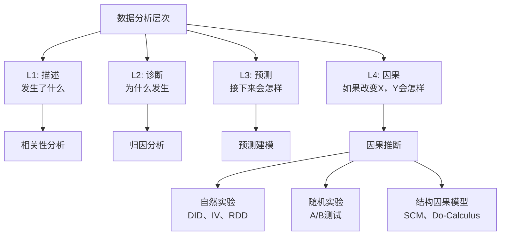
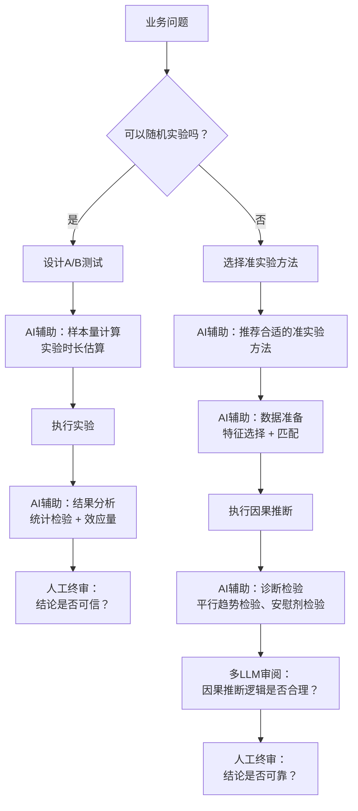

# 因果推断与实验设计 — AI时代如何从"知道什么"到"知道为什么"

> [!abstract] 核心观点
> 数据分析中最常见的错误就是"把相关当成因果"。AI时代这个问题变得更严重——因为AI可以轻易发现成千上万的相关关系，但绝大多数都是虚假相关。因果推断不是"锦上添花"，而是"避免AI胡说八道"的关键能力。

---

## 一、相关 vs 因果：为什么这很重要？

### 1.1 经典陷阱

> 冰淇淋销量与溺水人数高度相关。但没有人会认为"多吃冰淇淋导致溺水"——因为两者都受"夏天"这个隐藏变量驱动。

在AI数据分析中，类似的陷阱比比皆是：

| 伪相关发现 | 看起来的结论 | 隐藏变量 | 真实关系 |
|-----------|------------|---------|---------|
| 面试通过率下降 = 招聘标准变严了 | 面试通过率下降因为标准变严 | 岗位类型变了（高端岗位占比增加） | 是岗位结构变化，不是标准变化 |
| 渠道A入职率低 = 渠道A质量差 | 渠道A来的候选人质量不行 | 渠道A主要推送的是难招的冷门岗位 | 是岗位难度问题，不是渠道质量问题 |
| offer接受率上升 = 公司品牌提升了 | 公司品牌变强了所以更多人愿意来 | 市场行情变了（竞品缩招） | 是市场供需变化，不是品牌提升 |
| 培训参与度高 = 绩效好 | 多参加培训的人绩效更好 | 本来就更积极的人又爱培训又爱干活 | 是个体差异，不是培训效果 |

### 1.2 因果推断的层次



| 层次 | 回答的问题 | 决策价值 | AI能力 |
|------|-----------|---------|--------|
| **描述** | 发生了什么？ | 知情 | ✅ 强（自动化报表） |
| **诊断** | 为什么发生？ | 理解 | ⚠️ 中（需要人工验证） |
| **预测** | 接下来会怎样？ | 预见 | ⚠️ 中（需谨慎） |
| **因果** | 如果改变X，Y会怎样？ | 决策 | ❌ 弱（AI最容易被误导） |

---

## 二、AI时代的因果推断挑战

### 2.1 AI为什么"天然不擅长"因果推断？

| 原因 | 说明 | 后果 |
|------|------|------|
| **训练数据本质是相关的** | LLM训练数据来自互联网，其中充满了相关关系 | AI天然倾向于"看到相关就说因果" |
| **没有"干预"能力** | AI无法做实验，只能分析已有数据 | 无法区分"选择效应"和"处理效应" |
| **混淆变量难以识别** | AI不知道哪些变量是"因"、哪些是"果"、哪些是"混淆" | 因果方向可能完全搞反 |
| **反事实推理困难** | "如果当时没做A，结果会怎样？"——AI没有对应的数据 | 无法进行真正的因果推理 |

### 2.2 AI因果推断的"幻觉"高发区

> [!warning] 因果推断中的AI幻觉尤其危险
> 预测分析的幻觉只是"预测不准"，因果推断的幻觉会导致**错误的决策**——你认为A导致了B，于是花大钱去改变A，结果B根本不变。

| 高发场景 | AI典型错误 | 真实情况 | 决策后果 |
|---------|-----------|---------|---------|
| **渠道效果分析** | "渠道A转化率高，建议加大投入" | 渠道A只是吸引了更多优质候选人（选择效应） | 浪费预算，其他渠道被忽视 |
| **培训效果分析** | "参加培训的员工绩效提升15%" | 积极的人既参加培训又努力干活（自选择偏差） | 错误评估培训ROI |
| **薪酬调整分析** | "加薪10%后离职率下降20%" | 加薪同时市场行情变差（混淆变量） | 过度依赖加薪留人 |
| **面试流程优化** | "缩短面试流程后offer接受率提升" | 缩短流程的同时市场变冷（时间效应） | 归因错误，优化方向错了 |

---

## 三、因果推断的核心方法

### 3.1 随机实验（A/B测试）

**黄金标准。** 随机实验是因果推断中最可靠的方法，因为它通过随机化消除了所有混淆变量——无论是已知的还是未知的。

**AI可以做什么：**
- 辅助设计实验（样本量计算、实验时长估算）
- 监控实验过程（检测样本不平衡、早期效应）
- 分析实验结果（统计检验、效应量计算）
- 生成实验报告（自然语言解读）

**AI不能做什么：**
- 不能替代随机化（必须由人确保随机分配）
- 不能替代实验设计（由人定义实验假设、指标）
- 不能替代业务判断（由人决定是否放量）

**A/B测试在HR场景的应用：**

| 实验场景 | 实验组 | 对照组 | 关键指标 | 最小样本量 |
|---------|-------|-------|---------|-----------|
| 面试邀约文案优化 | 新文案 | 原文案 | 面试到场率 | 每组200+ |
| 招聘渠道效果验证 | 新渠道投入 | 旧渠道配置 | 入职转化率、成本 | 每组100+ |
| 培训方案效果 | 新培训方案 | 原方案 | 绩效提升、培训满意度 | 每组50+ |
| 薪酬结构调整 | 新薪酬方案 | 原方案 | offer接受率、留存率 | 每组100+ |
| 面试流程优化 | 简化流程 | 原流程 | 候选人体验分、流程时长 | 每组150+ |

### 3.2 准实验方法

当随机实验不可行时（大部分HR场景如此），使用准实验方法。

**常见准实验方法对比：**

| 方法 | 原理 | 适用场景 | 数据要求 | 可信度 |
|------|------|---------|---------|-------|
| **DID（双重差分）** | 比较实验组和对照组在政策前后的变化差 | 有政策前后数据 + 合适的对照组 | 面板数据 | ⭐⭐⭐⭐ |
| **PSM（倾向得分匹配）** | 根据特征匹配实验组和对照组的相似个体 | 有选择偏差，但可观测变量充分 | 大样本 | ⭐⭐⭐ |
| **IV（工具变量）** | 用一个不影响结果但影响处理变量的"工具" | 有合适的工具变量 | 面板数据 | ⭐⭐⭐⭐ |
| **RDD（断点回归）** | 利用某个"临界值"附近的随机性 | 有明确的分配规则（如分数线） | 临界值附近有足够样本 | ⭐⭐⭐⭐⭐ |
| **固定效应模型** | 控制个体不随时间变化的特征 | 面板数据 | 面板数据 | ⭐⭐⭐ |

### 3.3 AI辅助的因果推断工作流



---

## 四、HR场景中的因果推断实战

### 4.1 案例：培训效果评估

**问题：** 参加领导力培训的员工，是否真的绩效更好？

**陷阱：** 参加培训的人本身就更积极、更有上进心——即使不参加培训，他们的绩效也可能更好（自选择偏差）。

**解决方案：**

```
方法：倾向得分匹配（PSM）

步骤1：识别可能影响"参加培训"和"绩效"的变量
├── 年龄、工龄、岗位级别、前一年绩效评分
├── 部门、学历、性别
└── 注意：不能匹配"培训后"的变量

步骤2：计算每个员工参加培训的"倾向得分"
├── 使用Logistic回归
├── AI辅助：自动选择特征、检查模型
└── ⚠️ 人工确认：特征是否合理

步骤3：匹配参加和未参加培训的员工
├── 1:1最近邻匹配
├── 检查匹配后特征是否平衡
└── AI辅助：自动生成平衡性检验表

步骤4：比较匹配后的绩效差异
├── 处理效应（ATT）：培训对绩效的影响
├── AI辅助：统计检验 + 效应量计算
└── ⚠️ 人工终审：结论是否合理

结果示例：
┌──────────────────────────────────────────────────┐
│ 培训效果评估结果                                  │
│                                                   │
│ 匹配前：参加培训组绩效平均高出15%                 │
│ 匹配后：参加培训组绩效平均高出3.2%               │
│ 差异：12.8%的"效果"实际上是自选择偏差             │
│                                                   │
│ 结论：培训对绩效有正面影响，但效果远小于表面数据   │
│ 培训效果：绩效提升3.2%（p<0.05，统计显著）        │
│ 效应量：Cohen's d = 0.21（小效应）                │
│                                                   │
│ 建议：培训有效但效果有限，建议结合其他措施         │
│ 注意：匹配仅基于可观测变量，可能存在未观测混淆    │
└──────────────────────────────────────────────────┘
```

### 4.2 案例：薪酬调整对离职率的影响

**问题：** 加薪真的能降低离职率吗？

**陷阱：** 加薪的时机往往和市场行情、公司业绩相关——"加薪的同时离职率下降"可能只是因为市场变差了，而不是加薪的效果。

**解决方案：**

```
方法：双重差分（DID）

场景：A部门在2025年Q3进行了薪酬调整（实验组）
      B部门没有调整（对照组）

数据：2025年Q1-Q4各月的离职率数据

DID分析：
┌──────────────────────────────────────────────────┐
│ 离职率变化对比                                    │
│                   实验组(A)   对照组(B)   差值     │
│ 调整前（Q1-Q2）    8.5%        8.2%      0.3%    │
│ 调整后（Q3-Q4）    6.1%        7.8%      1.7%    │
│ 变化               -2.4%       -0.4%     2.0%    │
│                                                   │
│ 因果效应：离职率下降2.0%（扣除市场因素后的净效果）  │
│ 平行趋势检验：通过（Q1-Q2两组趋势一致）           │
│ 安慰剂检验：通过（假想调整时间没有显著效果）       │
│                                                   │
│ 结论：薪酬调整确实降低了离职率，净效果约2个百分点  │
│ 置信度：高（DID+平行趋势+安慰剂检验均通过）        │
└──────────────────────────────────────────────────┘
```

### 4.3 案例：面试流程优化效果

**问题：** 缩短面试流程（从3轮改为2轮）是否影响候选人质量？

**方法：** 断点回归（RDD）

**思路：** 不是所有岗位都同时改流程——利用"某个时间点突然切换"带来的自然断点，比较切换前后候选人质量的变化。

---

## 五、AI辅助因果推断的注意事项

### 5.1 因果推断的"七宗罪"

| 常见错误 | 说明 | 如何避免 |
|---------|------|---------|
| **忽略混淆变量** | 没有控制影响"处理"和"结果"的第三方变量 | 列出所有可能的混淆变量，用DAG表示 |
| **自选择偏差** | "处理组"不是随机分配的 | 使用PSM、DID等方法 |
| **幸存者偏差** | 只分析了"幸存下来"的样本 | 检查样本选择过程 |
| **反向因果** | 因果方向搞反了 | 使用时间滞后、Granger因果检验 |
| **多重比较** | 找太多变量，总有一个"显著" | 校正多重比较（Bonferroni、FDR） |
| **p值滥用** | 把p<0.05当作"确定"的证据 | 报告效应量+置信区间，不只是p值 |
| **外部有效性** | 在这个场景有效，换个场景不一定 | 明确结论的适用范围 |

### 5.2 多LLM协作在因果推断中的应用

| 角色 | 模型类型 | 任务 |
|------|---------|------|
| **分析模型** | 推理型（如GPT-4、DeepSeek） | 提出因果假设、选择分析方法、执行分析 |
| **审阅模型** | 严谨型（如Claude） | 检查因果方向是否合理、混淆变量是否遗漏、方法选择是否恰当 |
| **对抗模型** | 批判型（如Claude） | 故意找茬：提出替代解释、挑战因果假设 |
| **人工终审** | 人类 | 综合各方意见，基于业务知识做出最终判断 |

### 5.3 因果推断的质量评估

| 评估维度 | 评估标准 | 评估方法 |
|---------|---------|---------|
| **内部有效性** | 因果推断是否合理？混淆变量是否控制？ | 多LLM审阅 + 诊断检验 |
| **外部有效性** | 结论能否推广到其他场景？ | 明确适用范围和限制条件 |
| **机制合理性** | 因果链条是否合理？中间机制是否成立？ | 人工业务判断 |
| **统计可靠性** | 统计方法是否恰当？样本量是否充足？ | 统计检验 + 敏感性分析 |
| **可复现性** | 换了数据是否还能得到相同结论？ | 重复抽样验证 |

---

## 六、总结：因果推断的"三要三不要"

### 三要

```
✅ 要先画因果图（DAG）
   └── 分析前画出变量之间的关系图，明确哪些是"因"、哪些是"果"、哪些是"混淆"
   └── AI可以辅助画图，但人工必须确认逻辑

✅ 要用多种方法交叉验证
   └── 不要只依赖一种方法，至少用2-3种方法，看结果是否一致
   └── 结果一致 → 可信度高；结果不一致 → 需要进一步分析

✅ 要明确假设和限制条件
   └── 每个因果推断都要标注"有效的前提条件"
   └── 条件变了，结论可能就不成立了
```

### 三不要

```
❌ 不要把相关当因果
   └── 如果可能，做实验；如果不可能，用准实验方法
   └── 如果只能用观测数据，至少用DAG明确假设

❌ 不要过度依赖AI做因果推断
   └── AI擅长发现"相关"，但不擅长判断"因果"
   └── 因果推断必须有"人"的参与

❌ 不要忽视反事实
   └── "如果当时没做A，结果会怎样？"——这是因果推断的核心问题
   └── 没有反事实思维，就没有真正的因果推断
```

---

## 关联笔记

- [[06-数据分析/AI数据分析/25_进阶_预测分析与模拟推演]] — 从预测到因果推断
- [[06-数据分析/AI数据分析/27_进阶_决策智能体]] — 基于因果推断的决策系统
- [[06-数据分析/AI数据分析/16_方法_从描述到因果分析]] — 数据分析的方法论进阶
- [[06-数据分析/AI数据分析/14_方法_AI幻觉检测与数据质量]] — AI幻觉检测的因果视角
- [[06-数据分析/AI数据分析/00_MOC_AI数据分析中枢]] — 返回中枢索引