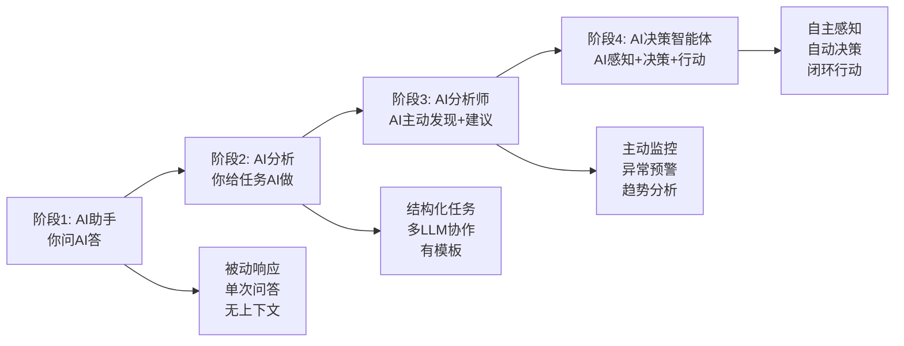
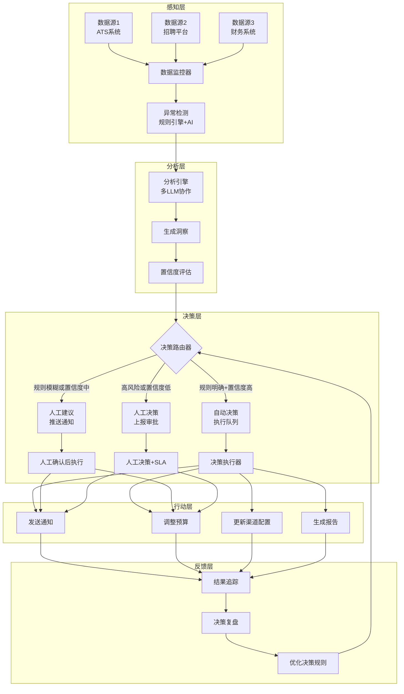

# 决策智能体 — AI数据分析的最高形态：从"辅助分析"到"智能决策"

> [!abstract] 核心观点
> 决策智能体（Decision Agent）是AI数据分析的最高形态——它不再是"你问AI答"的被动工具，而是能够主动感知数据变化、自主分析、给出建议、甚至自动执行部分决策的智能系统。但这也意味着风险最高，**必须建立"人在回路中"（Human-in-the-Loop）的严格管控机制。**

---

## 一、从工具到智能体：数据分析的进化

### 1.1 数据分析AI的四个阶段



| 阶段 | 能力 | AI角色 | 人参与度 | 风险等级 |
|------|------|--------|---------|---------|
| **1 - AI助手** | 回答问题、生成报表 | 工具 | 全程参与 | 🟢 低 |
| **2 - AI分析** | 按任务执行分析流程 | 执行者 | 任务指派+结果确认 | 🟡 中 |
| **3 - AI分析师** | 主动发现异常、生成洞察 | 建议者 | 审核+决策 | 🟠 中高 |
| **4 - AI决策智能体** | 自主感知、分析、决策、行动 | 协作者 | 规则制定+例外处理 | 🔴 高 |

### 1.2 什么是决策智能体？

> 决策智能体（Decision Agent）是一个能够**自主感知环境变化、分析数据、做出决策并采取行动**的AI系统。它不是单一模型，而是由多个模型、工具、规则和人工审核节点组成的"智能体系统"。

**核心特征：**
- **感知能力**：持续监控数据变化，自动发现异常和机会
- **分析能力**：调用多LLM协作分析，生成洞察和建议
- **决策能力**：在规则范围内自动做出决策，超出范围时上报
- **行动能力**：自动执行已批准的决策，或推送建议给决策者
- **学习能力**：从决策结果中学习，持续优化决策策略

---

## 二、决策智能体的架构设计

### 2.1 整体架构



### 2.2 各模块职责

| 层次 | 模块 | 职责 | 技术实现 |
|------|------|------|---------|
| **感知层** | 数据监控器 | 定时拉取各系统数据，检测数据更新 | 定时任务 + API |
| **感知层** | 异常检测 | 发现数据异常变化（如转化率骤降） | 规则引擎 + AI异常检测 |
| **分析层** | 分析引擎 | 多LLM协作分析，生成洞察和建议 | 多LLM协作架构 |
| **分析层** | 置信度评估 | 评估分析结果的可靠性 | 审阅模型 + 统计校验 |
| **决策层** | 决策路由器 | 根据规则和置信度，路由到自动/人工/上报 | 决策树 + 规则引擎 |
| **决策层** | 决策执行器 | 执行已批准的决策 | API调用 + 自动化脚本 |
| **反馈层** | 结果追踪 | 追踪决策执行后的效果 | 数据看板 + 对比分析 |
| **反馈层** | 决策复盘 | 定期复盘决策效果，优化规则 | AI复盘报告 + 人工评审 |

### 2.3 决策分级与路由规则

> 不是所有决策都适合让AI自动执行。决策智能体的核心设计原则是：**简单决策自动执行，复杂决策人工确认，高风险决策人工决策。**

| 决策等级 | 定义 | 示例 | 决策方式 | 审批要求 |
|---------|------|------|---------|---------|
| **L1 - 自动执行** | 规则明确、风险极低 | 自动生成周报、发送常规提醒 | AI自动执行 | 无需审批 |
| **L2 - 建议确认** | 有明确规则但需确认 | 渠道预算微调（<10%）、自动标记异常 | AI建议+一键确认 | 简单确认 |
| **L3 - 人工决策** | 需要业务判断 | 渠道策略调整、预算分配方案 | AI提供选项+人工选 | 负责人审批 |
| **L4 - 上报决策** | 高风险或影响重大 | 业务线调整、大规模预算调整 | AI提供分析+管理层决策 | 多级审批 |

---

## 三、HR/招聘场景中的决策智能体应用

### 3.1 招聘渠道优化智能体

**目标：** 自动监控各渠道效果，优化预算分配

```
智能体工作流：

🔄 感知（每天凌晨2点）
├── 拉取各渠道昨天的投递量、转化率、成本数据
├── 检测是否有异常变化（如某个渠道转化率突然下降）
└── 更新渠道效果排名

🔍 分析（每天凌晨3点）
├── 对比各渠道的ROI、效率、质量
├── 识别需要调整的渠道
├── 生成优化建议（含置信度标注）
└── 多LLM审阅通过

🤖 决策（每天上午9点前）
├── L1决策：自动生成渠道效果日报，发送给招聘团队
├── L2建议：渠道预算微调建议（<10%），推送一键确认
├── L3决策：渠道策略调整建议，推送给负责人审批
└── L4上报：重大渠道变化，上报管理层

📊 反馈（每周复盘）
├── 追踪本周预算调整的实际效果
├── 对比预测值和实际值
├── 调整决策规则
└── 生成每周渠道效果复盘报告
```

### 3.2 招聘预警智能体

**目标：** 实时监控招聘流程中的异常，提前预警

| 预警场景 | 监控指标 | 触发条件 | 自动动作 | 上报方式 |
|---------|---------|---------|---------|---------|
| **面试到场率下降** | 到场率 | 连续3天低于阈值20% | 自动标记+分析原因 | 推送预警通知 |
| **候选人流失预警** | 流程时长 | 超过平均时长2倍 | 自动标记候选人 | 推送给对应HR |
| **渠道质量下降** | 简历有效率 | 连续2周下降超过15% | 自动标记渠道 | 推送给招聘运营 |
| **招聘需求积压** | 未填补岗位数 | 超过招聘周期1.5倍 | 自动标记+分析瓶颈 | 推送给招聘负责人 |
| **预算超支预警** | 实际花费vs预算 | 超过预算80% | 自动标记+建议调整 | 推送给财务 |

### 3.3 候选人体验智能体

**目标：** 自动监控和优化候选人体验

```
候选人体验监控：
├── 面试反馈收集（AI自动发送问卷+分析）
├── 流程时长监控（AI自动检测过长流程）
├── 沟通频率监控（AI自动检测候选人是否被"冷落"）
└── 体验评分预警（AI自动识别体验差的候选人）

自动干预：
├── L1：自动发送流程更新邮件给候选人
├── L2：建议HR联系"冷落"候选人（超过3天无沟通）
├── L3：面试流程过长时，建议HR优化流程
└── L4：候选人体验评分骤降时，上报管理层
```

---

## 四、决策智能体的风险管控

### 4.1 风险分级矩阵

| 风险等级 | 可能后果 | 管控措施 | 示例 |
|---------|---------|---------|------|
| **🔴 极高** | 法律/合规风险、重大财务损失 | 人工决策+多级审批 | 薪酬调整、大规模裁员 |
| **🟠 高** | 业务影响较大、品牌风险 | 人工决策+AI建议 | 渠道策略调整、预算分配 |
| **🟡 中** | 有一定影响、可逆 | AI建议+一键确认 | 预算微调、渠道优化 |
| **🟢 低** | 影响较小、可逆 | AI自动执行 | 自动报表、常规提醒 |

### 4.2 人在回路中（Human-in-the-Loop）

> 决策智能体不是"取代人"，而是"扩大人的能力边界"。关键决策必须由人做出，AI只提供数据和分析支持。

**人在回路中的三种模式：**

| 模式 | 描述 | 适用场景 | AI自由度 |
|------|------|---------|---------|
| **人在回路中** | AI生成建议，人确认后执行 | L2决策 | 中 |
| **人在回路上** | AI自动执行，人定期审核 | L1决策 | 高 |
| **人在回路外** | AI仅提供分析，人做决策 | L3/L4决策 | 低 |

### 4.3 决策智能体的"刹车机制"

```
刹车机制清单：
├── 1. 决策上限：AI自动决策的金额/影响范围上限
│   └── 如：预算调整不超过10%，超过则上报
│
├── 2. 紧急停止：人工一键暂停所有AI决策
│   └── 如：发现AI决策异常，一键切换到"只读模式"
│
├── 3. 决策审计：所有AI决策必须有完整记录
│   └── 如：谁做的决策？依据什么？效果如何？
│
├── 4. 回滚能力：AI决策必须可逆
│   └── 如：预算调整后，如果效果不好，可以回滚
│
├── 5. 灰度发布：逐步扩大AI决策范围
│   └── 如：先在一个渠道试点，效果好的再推广
│
└── 6. 定期复审：所有AI决策规则定期复审
    └── 如：每月复盘AI决策效果，更新规则
```

---

## 五、决策智能体的建设路径

### 5.1 分阶段实施路线

```
第一阶段（2-4周）——基础感知能力
├── 建立数据监控体系（定时拉取各系统数据）
├── 实现基础异常检测（规则引擎+简单AI检测）
├── 建立预警通知机制
└── L1决策：自动报表和常规提醒

第二阶段（4-8周）——分析建议能力
├── 接入多LLM协作分析引擎
├── 实现自动生成洞察和建议
├── 建立置信度评估体系
└── L2决策：AI建议+一键确认

第三阶段（8-12周）——有限决策能力
├── 建立决策路由规则引擎
├── 实现L1自动决策（低风险场景）
├── 建立决策追踪和反馈机制
└── 灰度试点：选择1-2个低风险场景

第四阶段（12周+）——持续优化
├── 扩大决策范围（逐步增加场景）
├── 建立决策复盘机制
├── 基于反馈优化决策规则
└── 持续监控决策质量
```

### 5.2 团队能力要求

| 角色 | 职责 | 技能要求 |
|------|------|---------|
| **业务专家** | 定义决策规则、审核决策质量 | 业务理解、决策经验 |
| **数据分析师** | 设计分析框架、评估决策效果 | 数据分析、因果推断 |
| **AI工程师** | 搭建智能体架构、优化模型 | LLM、Agent架构、API开发 |
| **安全合规** | 确保决策合规、管控风险 | 数据安全、合规知识 |
| **决策监控员** | 监控AI决策质量、处理异常 | 运营经验、应急处理 |

### 5.3 决策智能体成熟度评估

| 成熟度 | 感知能力 | 分析能力 | 决策能力 | 反馈能力 | 自动化比例 |
|-------|---------|---------|---------|---------|----------|
| **L1 - 初始** | 手动拉取数据 | 人工分析 | 人工决策 | 无 | 0% |
| **L2 - 基础** | 自动数据监控 | AI辅助分析 | AI建议+人工决策 | 手动复盘 | <20% |
| **L3 - 规范** | 实时异常检测 | 多LLM协作分析 | AI建议+一键确认 | 自动复盘 | 20-50% |
| **L4 - 先进** | 主动感知+预测 | 自主分析+洞察 | 有限自动决策 | 持续优化 | 50-80% |
| **L5 - 领先** | 全场景感知 | 深度分析+因果推断 | 自主决策+例外上报 | 自我进化 | >80% |

---

## 六、总结：决策智能体的"三要三不要"

### 三要

```
✅ 要渐进式推进
   └── 从L1决策开始，逐步提升到L4
   └── 每提升一级，都要有足够的数据验证和风险控制

✅ 要保留"刹车机制"
   └── AI决策必须有上限、可暂停、可回滚
   └── 任何时候人都可以一键接管

✅ 要持续追踪决策效果
   └── 每个AI决策都要追踪结果
   └── 定期复盘，更新决策规则
```

### 三不要

```
❌ 不要让AI做高风险决策
   └── 涉及法律、财务、人员的关键决策，必须由人做出
   └── AI只提供数据和分析支持

❌ 不要追求100%自动化
   └── 有些场景天生不适合自动化
   └── AI做它擅长的，人做人擅长的

❌ 不要忽视"例外情况"
   └── 规则总是有例外
   └── 决策智能体必须能识别"不知道"并上报
```

---

## 关联笔记

- [[06-数据分析/AI数据分析/25_进阶_预测分析与模拟推演]] — 决策智能体的预测能力基础
- [[06-数据分析/AI数据分析/26_进阶_因果推断与实验设计]] — 决策智能体的因果推断能力
- [[06-数据分析/AI数据分析/13_方法_多LLM协作架构]] — 决策智能体的分析引擎核心
- [[06-数据分析/AI数据分析/14_方法_AI幻觉检测与数据质量]] — 决策智能体的质量保障
- [[01-AI技术/AI Agent开发实战/00_MOC_AI Agent开发实战中枢]] — Agent开发实战
- [[06-数据分析/AI数据分析/00_MOC_AI数据分析中枢]] — 返回中枢索引