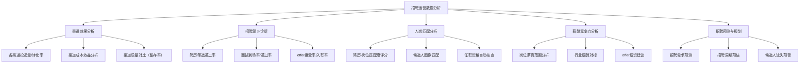
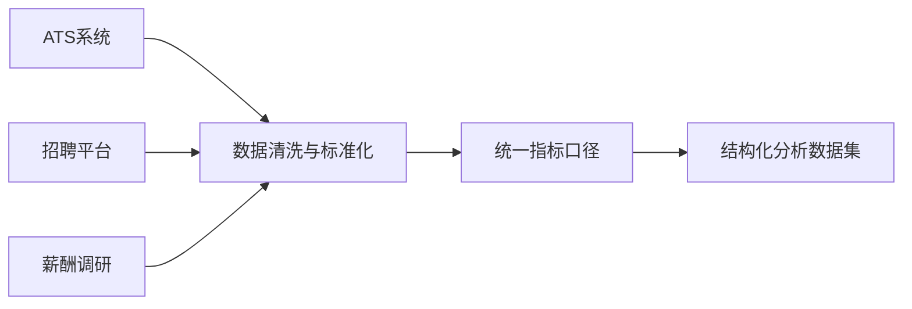

# 招聘运营中的AI数据分析实战

> 招聘运营是HR领域中数据量最大、分析需求最频繁的模块之一。从渠道效果分析到招聘漏斗诊断，从人岗匹配度评估到offer预测，AI可以极大地提升分析效率，但也伴随着AI幻觉和数据质量风险。

---

## 一、招聘运营中AI数据分析的典型场景

### 1.1 场景全景图



### 1.2 各场景价值评估

| 场景 | 分析频率 | 数据复杂度 | AI价值 | 幻觉风险 | 推荐优先级 |
|------|---------|-----------|--------|---------|----------|
| 渠道效果分析 | 周/月 | 低 | 自动化报表 | 低 | P0 |
| 招聘漏斗诊断 | 周/月 | 中 | 趋势洞察+异常预警 | 中 | P0 |
| 人岗匹配分析 | 实时 | 高 | 大幅提升效率 | 高 | P1 |
| 薪酬竞争力分析 | 季度/年度 | 中 | 数据对标 | 中 | P1 |
| 招聘预测与规划 | 季度/年度 | 高 | 辅助决策 | 高 | P2 |

---

## 二、招聘运营数据分析的常见陷阱

### 陷阱1：数据口径不一致

招聘运营中，不同系统对同一个指标的定义可能完全不同：

| 指标 | ATS系统定义 | 业务部门理解 | 问题 |
|------|-----------|------------|------|
| "面试通过率" | 通过面试人数/面试总人数 | 发offer人数/初面人数 | 口径相差20%+ |
| "招聘周期" | 从JD发布到入职 | 从简历筛选到入职 | 少了JD发布到筛选的时间 |
| "渠道成本" | 直接支付给平台的费用 | 总成本含人力成本 | 可能差3-5倍 |

**AI应对方案**：在分析前，先让AI输出一份"指标定义书"，由人工确认后再分析。使用多LLM审阅模式，让审阅模型核查指标定义是否一致。

### 陷阱2：小样本导致的统计偏差

招聘运营中很多分析面临样本量不足的问题：

- 某个冷门岗位全年只有5个候选人，谈"通过率"没有意义
- 某个新渠道只试了2周，谈"渠道效果"为时过早
- 月度数据波动大，单月数据不能代表趋势

**AI应对方案**：给AI设定"最小样本量阈值"，不足时自动标注"样本不足，仅供参考"。

### 陷阱3：AI混淆相关与因果

这是AI做招聘数据分析时最容易犯的"幻觉"之一：

- ❌ "面试通过率下降是因为薪酬竞争力不足"（可能只是岗位类型变了）
- ❌ "某个渠道来的候选人入职率低，所以这个渠道质量差"（可能只是该渠道主要推的是难招的岗位）
- ❌ "offer接受率上升是因为公司品牌提升了"（可能只是市场行情变了）

**AI应对方案**：
- 强制AI在分析中标注"相关关系"和"因果关系"的区别
- 使用审阅模型检查逻辑链：是否有「A→B→C」的完整推理
- 标注"可能存在的混淆变量"

### 陷阱4：时间序列分析的季节性忽视

招聘有明显的季节性：金三银四、金九银十、年底淡季。如果AI忽略了季节性因素，趋势判断会完全错误。

**AI应对方案**：要求AI在分析时间序列数据时，必须考虑"同比"（去年同期对比）而非仅看"环比"。

---

## 三、招聘运营AI数据分析的完整流程

### 3.1 数据准备：招聘数据标准化



**招聘数据清洗清单**：

| 数据项 | 常见问题 | 清洗规则 |
|--------|---------|---------|
| 岗位名称 | 同一岗位多个名称（"Java开发"vs"Java工程师"） | 统一岗位名称映射表 |
| 渠道来源 | 同一渠道不同名称（"猎聘"vs"猎聘网"） | 统一渠道名称 |
| 面试结果 | 不同阶段记录不同（初试/复试/终面） | 标准化面试阶段 |
| 候选人状态 | 人为录入错误（"已入职"vs"已入職"） | 状态字段标准化 |
| 时间字段 | 格式不统一（2026/01/01 vs 2026-01-01） | 统一日期格式 |

### 3.2 分析执行：多LLM协作模式

**第一阶段：基础数据报表（AI自动化生成）**

这个阶段风险最低，可以完全由AI自动化完成，但需要多LLM审阅：

```
分析模型任务：
- 按渠道统计投递量、简历筛选通过率、面试到场率
- 按岗位统计招聘周期、各阶段转化率
- 生成周报/月报数据表

审阅模型任务：
- 核对每个数字是否与原始数据一致
- 检查是否有异常值或明显错误
- 确认统计口径是否与定义一致
```

**第二阶段：趋势洞察与异常预警（AI+人工）**

这个阶段中等风险，AI生成洞察后需要人工确认：

```
分析模型任务：
- 识别招聘漏斗中的瓶颈环节（哪个阶段转化率下降最明显）
- 发现渠道质量变化趋势
- 标记异常数据点（如某月面试通过率突然下降20%）

审阅模型任务：
- 核查异常标记是否合理
- 检查趋势判断的数据基础是否充分
- 排除季节性因素干扰

人工终审：
- 确认关键洞察是否与业务感知一致
- 判断是否需要进一步深挖
```

**第三阶段：预测与决策建议（AI辅助，人做决策）**

这个阶段风险最高，AI只提供参考，不能直接输出决策：

```
分析模型任务：
- 基于历史数据预测下季度招聘需求
- 预测offer接受率
- 建议渠道资源分配方案

审阅模型任务：
- 检查预测模型的方法是否合理
- 核查预测假设是否明确标注
- 检查建议是否基于充分的数据支撑

人工终审：
- 必须人工确认，AI建议仅供参考
- 结合业务经验判断预测是否合理
- 决策由人做出，AI只提供数据支撑
```

### 3.3 结果输出：招聘运营分析报告模板

```
┌───────────────────────────────────────────────┐
│ 招聘运营月报 - 2026年X月                      │
├───────────────────────────────────────────────┤
│ 一、本月核心指标                              │
│   - 简历投递量: XX (+XX% vs 上月)             │
│   - 面试到场率: XX% (+XX% vs 上月)            │
│   - 入职人数: XX (+XX% vs 上月)               │
│                                               │
│ 二、渠道效果分析                              │
│   - 渠道A: 投递量XX, 转化率XX%, 成本XX        │
│   - 渠道B: 投递量XX, 转化率XX%, 成本XX        │
│   - 推荐调整: 建议增加XX渠道预算              │
│     [置信度: 高 - 基于3个月数据]               │
│                                               │
│ 三、招聘漏斗诊断                              │
│   - 筛选通过率: XX% [正常范围: XX%-XX%]       │
│   - 面试到场率: XX% ⚠️低于阈值                │
│   - 建议: 优化面试邀约流程，缩短等待时间       │
│     [置信度: 中 - 需结合候选人反馈进一步确认]  │
│                                               │
│ 四、招聘预测（下季度）                        │
│   - 预计招聘需求: XX人                        │
│   - 预计招聘周期: XX天                        │
│   - ⚠️ 注意: 预测基于历史数据，未考虑业务变化  │
│     [置信度: 中 - 仅供参考]                    │
│                                               │
│ 五、数据说明                                  │
│   - 数据来源: ATS系统 + 招聘平台报表           │
│   - 数据范围: 2026年X月1日-X月X日             │
│   - 统计口径: 见附件《指标定义书》              │
│   - 生成方式: AI生成 + 多模型审阅 + 人工复核   │
└───────────────────────────────────────────────┘
```

---

## 四、招聘运营关键指标分析指南

### 4.1 招聘效率指标

| 指标 | 计算公式 | AI分析要点 | 常见幻觉 |
|------|---------|-----------|---------|
| 招聘周期 | 平均JD发布到入职天数 | 分岗位/分渠道对比 | 忽略岗位级别差异 |
| 岗位填补率 | 入职人数/招聘需求 | 有需求的岗位才统计 | 把已关闭的岗位也算进去 |
| 面试转化率 | 各阶段面试通过人数/进入该阶段人数 | 按阶段分层分析 | 混淆初试和终面通过率 |

### 4.2 招聘质量指标

| 指标 | 说明 | AI分析建议 |
|------|------|-----------|
| 试用期通过率 | 候选人通过试用期的比例 | 分渠道、分岗位、分面试官交叉分析 |
| 留存率 | 入职6个月/12个月留存率 | 对比不同渠道来源的候选人 |
| 绩效达标率 | 入职后绩效评估达标情况 | 需要对接绩效系统数据 |

### 4.3 渠道效果指标

| 指标 | 说明 | 分析维度 |
|------|------|---------|
| 投递量 | 各渠道收到的简历数 | 按岗位/时间/地域 |
| 简历有效率 | 通过初筛的简历占比 | 区分主动投递和主动寻访 |
| 单入职成本 | 总渠道成本/入职人数 | 考虑隐性成本（HR时间、系统费用） |
| 渠道质量分 | 综合效率+质量+成本的评分 | 建议加权评分，而非单一指标 |

---

## 五、招聘运营AI数据分析的落地建议

### 5.1 分阶段实施路线

```
第一阶段（1-2周）——基础报表自动化
├── 实现渠道效果分析报表自动化
├── 实现招聘漏斗基础指标统计
├── 使用多LLM审阅确保数据准确
└── 人工终审确认，建立信任

第二阶段（3-4周）——洞察与异常预警
├── 招聘漏斗瓶颈自动诊断
├── 渠道效果趋势变化预警
├── 异常数据自动标记
└── 建立置信度标注体系

第三阶段（5-8周）——预测与决策辅助
├── 招聘需求预测模型
├── offer接受率预测
├── 候选人流失预警
└── 渠道资源优化建议
```

### 5.2 团队能力要求

| 角色 | 职责 | 技能要求 |
|------|------|---------|
| **招聘运营** | 定义分析需求，复核结果 | 招聘业务理解，基础数据分析能力 |
| **数据分析师** | 设计分析框架，训练模型 | 统计分析，SQL/Python |
| **AI/ML工程师** | 搭建多LLM协作流程 | LLM API调用，Prompt Engineering |
| **HRBP/业务方** | 提供业务反馈，确认决策 | 业务理解，数据驱动决策意识 |

### 5.3 多LLM协作在招聘分析中的具体配置

| 场景 | 分析模型 | 审阅模型 | 人工复核重点 |
|------|---------|---------|------------|
| 渠道效果月报 | 通用模型（如DeepSeek） | 严谨模型（如Claude） | 数据准确性、口径一致性 |
| 招聘漏斗诊断 | 推理模型（如GPT-4） | 批判性模型（如Claude） | 异常标记合理性、趋势判断 |
| 薪酬对标分析 | 专业模型（如GPT-4） | 严谨模型（如Claude） | 数据来源可靠性、市场对标方法 |
| 招聘预测 | 推理模型（如GPT-4） | 测试多个模型对比 | 预测假设、置信度评估 |

---

## 六、总结：招聘运营AI数据分析的「三要三不要」

### 三要

```
✅ 要建立多LLM审阅机制
   └── 分析模型生成 + 审阅模型校验，确保数据准确

✅ 要标注置信度
   └── 每个结论标注"高/中/低"，让决策者知道可靠程度

✅ 要追溯数据来源
   └── 每个数字都要标注来源，每个结论要有数据支撑
```

### 三不要

```
❌ 不要用AI做最终决策
   └── AI提供数据和分析，决策权在招聘负责人手中

❌ 不要忽略数据口径
   └── 分析前先统一指标定义，否则结果不可比

❌ 不要混淆相关与因果
   └── 两个指标相关≠一个导致另一个，审阅模型重点检查
```

---

## 关联笔记

- [[06-数据分析/AI数据分析/00_AI数据分析方案总纲]] — AI数据分析注意事项总方案
- [[03-HR人事/校招测评/00_MOC_校招测评中枢]] — 校招测评中枢索引
- [[03-HR人事/校招测评/备战/备战_每日训练计划]] — 每日训练安排
- [[03-HR人事/校招测评/行测/行测_冲刺要点汇总]] — 行测冲刺要点