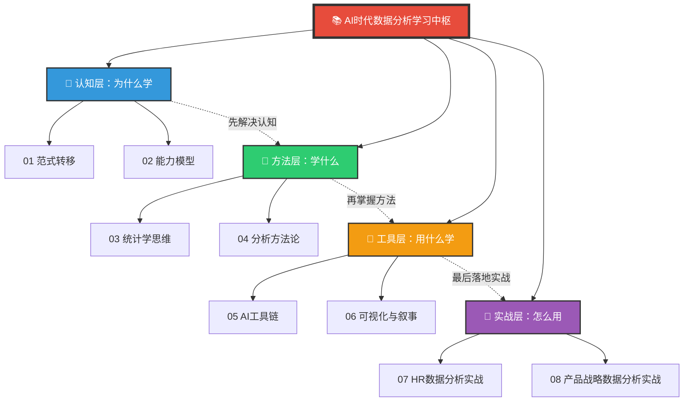

# AI时代数据分析学习 — 知识库中枢

> [!abstract] 核心命题
> AI时代，数据分析还用学吗？学什么？怎么学？本知识库的回答是：**从"学工具"变成"学思维"。** AI帮你做执行（写SQL、画图表、跑统计），你来做判断（定义问题、解读洞察、讲好故事）。这是非技术人员在AI时代构建数据分析能力的最优路径。

---

## 一、知识体系全景



---

## 二、文档索引

### 模块一：🧠 认知层（2篇）

| 编号 | 文档 | 核心问题 | 阅读时间 |
|------|------|---------|---------|
| 01 | [[06-数据分析/AI时代数据分析学习/01_范式转移：AI如何改变数据分析的学与做]] | AI时代，数据分析"学"与"做"的方式发生了什么根本变化？ | 15分钟 |
| 02 | [[06-数据分析/AI时代数据分析学习/02_能力模型：非技术人员的数据分析能力金字塔]] | 我不做数据分析师，我需要学什么？学到什么程度？ | 12分钟 |

### 模块二：📐 方法层（2篇）

| 编号 | 文档 | 核心问题 | 阅读时间 |
|------|------|---------|---------|
| 03 | [[06-数据分析/AI时代数据分析学习/03_统计学思维：AI时代最保值的能力]] | 不学公式，学什么？统计直觉怎么建立？ | 20分钟 |
| 04 | [[06-数据分析/AI时代数据分析学习/04_分析方法论：从问题定义到洞察输出]] | 拿到一个分析需求，从哪开始？到哪结束？ | 18分钟 |

### 模块三：🔧 工具层（2篇）

| 编号 | 文档 | 核心问题 | 阅读时间 |
|------|------|---------|---------|
| 05 | [[06-数据分析/AI时代数据分析学习/05_AI辅助数据分析工具链]] | 有哪些工具？什么场景用什么？怎么用AI辅助？ | 15分钟 |
| 06 | [[06-数据分析/AI时代数据分析学习/06_数据可视化与叙事：让数据自己说话]] | AI生成图表很厉害，但怎么让它"讲对故事"？ | 15分钟 |

### 模块四：🎯 实战层（2篇）

| 编号 | 文档 | 核心问题 | 阅读时间 |
|------|------|---------|---------|
| 07 | [[06-数据分析/AI时代数据分析学习/07_HR数据分析实战：招聘漏斗、离职预测、绩效校准]] | 作为HR从业者，我最常见的数据分析场景怎么做？ | 25分钟 |
| 08 | [[06-数据分析/AI时代数据分析学习/08_产品与战略数据分析实战：留存、实验、市场规模]] | 产品/战略相关场景，怎么用AI辅助做分析？ | 25分钟 |

---

## 三、推荐学习路径

### 路径一：快速入门（2-3天）
> 适合：零基础、想快速上手、先建立信心

```
01_范式转移 → 02_能力模型 → 07_HR数据分析实战 → 05_AI工具链
```

### 路径二：系统学习（1-2周）
> 适合：有一定基础、想建立完整体系

```
01_范式转移 → 02_能力模型 → 03_统计学思维 → 04_分析方法论 → 05_AI工具链 → 06_可视化与叙事 → 07_HR数据分析实战 → 08_产品战略数据分析实战
```

### 路径三：场景驱动（按需）
> 适合：有具体问题要解决，从实战切入

```
从 07 或 08 开始 → 遇到概念问题回溯到 03/04 → 需要工具时查阅 05
```

---

## 四、核心洞察（先读这个）

> [!important] 三条核心定律
> 1. **AI做执行，人做判断。** AI可以写SQL、画图表、跑回归，但你得定义问题、设计框架、解读洞察。
> 2. **统计学思维 > 编程技能。** 工具会变，Python可能被取代，但理解"相关≠因果""辛普森悖论""置信区间"的能力永不过时。
> 3. **Learning by Doing 效率提升10倍。** 不需要先学3个月Python，可以直接用AI辅助分析第一个真实问题。

> [!tip] 一句话记住这个知识库
> 传统路径：学SQL → 学Python → 学统计 → 学可视化 → 做分析（6-12个月，大部分人在SQL阶段放弃）
> AI时代路径：定义问题 → AI辅助分析 → 人做判断（1-2周，直接产出洞察）

---

## 五、与已有知识库的关联

| 已有知识库 | 关联文档 | 关联方式 |
|-----------|---------|---------|
| [[02-AI趋势与素养/AI时代能力要求/00_MOC_AI时代能力要求中枢|AI时代能力要求]] | 02_能力模型 | 数据分析是AI时代核心能力，本知识库是专项深化 |
| [[05-产品与开发/AI产品经理方法论/00_MOC_AI产品经理方法论中枢|AI产品经理方法论]] | 05_评估与度量 | AI产品的数据评估与A/B测试直接关联 |
| [[04-商业与战略/战略分析工具与框架/00_MOC_战略分析工具与框架中枢|战略分析工具与框架]] | 08_产品战略实战 | 战略分析依赖数据支撑，本知识库提供"如何获取和分析数据" |
| [[05-产品与开发/用户研究与需求洞察/00_MOC_用户研究与需求洞察中枢|用户研究与需求洞察]] | 04_分析方法论 | A/B测试、问卷分析等方法论互补 |
| [[04-商业与战略/增长与运营方法论/00_MOC_增长与运营方法论中枢|增长与运营方法论]] | 08_产品战略实战 | 数据驱动增长、留存分析直接关联 |
| [[03-HR人事/培训与人才发展/00_MOC_培训与人才发展中枢|培训与人才发展]] | 07_HR数据分析实战 | 培训ROI分析、培训数据分析直接关联 |
| [[03-HR人事/招聘与面试体系/00_MOC_招聘与面试体系中枢|招聘与面试体系]] | 07_HR数据分析实战 | 招聘漏斗分析、招聘效能衡量互补 |
| [[03-HR人事/绩效管理/00_MOC_绩效管理中枢|绩效管理]] | 07_HR数据分析实战 | 绩效数据分析、校准逻辑直接关联 |

---

## 六、版本信息

| 维度 | 内容 |
|------|------|
| 创建日期 | 2026-07-31 |
| 文档总数 | 1 MOC + 8 内容篇 |
| 总阅读时间 | 约 2.5 小时 |
| 更新频率 | 工具层文档每季度更新（工具变化快），其余按需更新 |
| 适用人群 | 非技术背景的HR、产品、战略、运营从业者 |

---

> [!quote] 最后一句
> AI时代，数据分析不再是"会不会写代码"的问题，而是"会不会想问题"的问题。这个知识库，就是帮你建立"想问题"的能力。