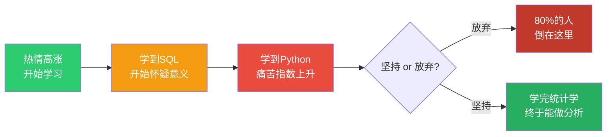
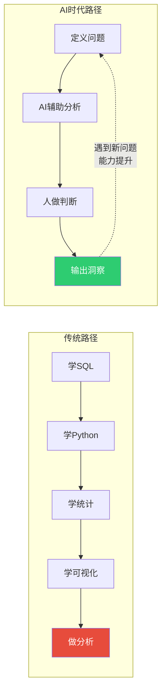

# 01_范式转移：AI如何改变数据分析的学与做

> [!abstract] 一句话总结
> AI彻底改变了数据分析的学习方式和执行方式。**传统的"先学工具再做事"路径被颠覆，取而代之的是"先定义问题，AI辅助执行，人做判断"的新范式。** 这意味着你的学习重点从"记住SQL语法"转向"建立分析思维"。

---

## 一、传统路径为什么走不通了

### 1.1 传统数据分析学习路径

绝大多数人在学数据分析时，走的是这样一条路：

```
学SQL（2周）→ 学Python/Pandas（1个月）→ 学统计学（1个月）
→ 学可视化（2周）→ 学机器学习（1个月）→ 做第一个分析项目
```

这条路径有三个致命问题：

**问题一：周期太长，流失率极高。** 从零基础到能独立做分析，通常需要6-12个月。大部分人在SQL阶段就放弃了——不是因为学不会，而是因为看不到"我学的这些东西和我的业务有什么关系"。

**问题二：工具导向，不是问题导向。** 你学的是"怎么用Python画散点图"，而不是"什么时候该用散点图、散点图能告诉我什么"。结果是：学会了工具，但不会分析。

**问题三：面向考试，不是面向业务。** 统计学教材教你算t检验的公式，但不会教你"招聘转化率从40%降到35%，这是随机波动还是真实下降？该怎么判断？"

### 1.2 传统路径的"死亡之谷"



> [!warning] 残酷的事实
> 在传统学习路径上，**约80%的非技术人员会在SQL/Python阶段放弃**。不是因为不够聪明，而是因为学习路径设计本身就有问题——它把"工具学习"放在了"问题解决"之前。

---

## 二、AI时代的新范式

### 2.1 AI改变了什么？

AI时代，数据分析的"学"与"做"发生了三个根本性变化：

| 维度 | 传统模式 | AI时代模式 |
|------|---------|-----------|
| **SQL编写** | 需要记住SELECT、JOIN、GROUP BY语法 | 用自然语言描述需求，AI生成SQL |
| **数据清洗** | 需要写Python代码处理缺失值、异常值 | 描述清洗规则，AI执行 |
| **图表绘制** | 需要知道matplotlib/ggplot2的参数 | 描述"我想看什么"，AI生成图表 |
| **统计分析** | 需要手动跑t检验、回归、方差分析 | 告诉AI"帮我检验这两个变量是否相关"，AI执行并解释 |
| **报告撰写** | 从空白页开始写 | AI生成初稿，人做判断和润色 |

**但以下能力AI无法替代：**

| 维度 | 为什么AI无法替代 |
|------|-----------------|
| **问题定义** | "我们应该分析什么？"——这需要业务理解和战略判断 |
| **框架选择** | "这个分析应该用什么方法论？"——需要方法论素养 |
| **因果判断** | "这个相关性是因果关系还是混淆？"——需要领域知识和逻辑推理 |
| **洞察解读** | "这个数据告诉我们什么？接下来该怎么做？"——需要商业判断力 |
| **数据叙事** | "怎么把这个分析讲给老板听，让他做决策？"——需要沟通和影响力 |

### 2.2 新学习路径

```
定义问题 → AI辅助分析 → 人做判断 → 输出洞察
    ↑                                      |
    └──────────── 螺旋上升 ─────────────────┘
```

**新路径的核心特征：**

1. **问题驱动，不是工具驱动。** 你的第一课不是"学SQL"，而是"我有一个HR问题要解决——招聘漏斗的转化率在下降，为什么？"
2. **即时反馈，不是延迟满足。** 你不需要等3个月才能做第一个分析。第一天就能用AI辅助分析真实数据，立即看到结果。
3. **螺旋上升，不是线性递进。** 每解决一个问题，你的分析能力就提升一层。下次遇到更复杂的问题，你会自然想学更深的方法。

### 2.3 新旧路径对比



---

## 三、什么不用学了，什么反而更重要了

### 3.1 可以少学/不学的

| 技能 | 传统重要度 | AI时代重要度 | 原因 |
|------|-----------|-------------|------|
| SQL语法记忆 | ⭐⭐⭐⭐⭐ | ⭐ | AI可以完美生成SQL，你只需要验证逻辑 |
| Python数据处理库 | ⭐⭐⭐⭐ | ⭐⭐ | AI帮你写pandas/numpy代码 |
| 可视化库参数 | ⭐⭐⭐ | ⭐ | AI生成图表，你只需要描述需求 |
| 统计公式推导 | ⭐⭐⭐ | ⭐ | AI帮你算，你需要理解何时用、怎么解读 |
| 机器学习算法实现 | ⭐⭐⭐ | ⭐ | AI帮你调参，你需要理解业务场景 |

### 3.2 反而更重要的

| 能力 | 传统重要度 | AI时代重要度 | 原因 |
|------|-----------|-------------|------|
| **问题定义能力** | ⭐⭐⭐ | ⭐⭐⭐⭐⭐ | AI不知道自己该分析什么，你来定义 |
| **统计直觉** | ⭐⭐⭐ | ⭐⭐⭐⭐⭐ | AI能跑回归，但判断"这个回归结果合理吗"需要你 |
| **业务理解** | ⭐⭐⭐ | ⭐⭐⭐⭐⭐ | AI不懂你的行业，不懂你的业务逻辑 |
| **批判性思维** | ⭐⭐ | ⭐⭐⭐⭐⭐ | AI可能"看起来很对但实际错了"，你需要识别 |
| **数据叙事** | ⭐⭐ | ⭐⭐⭐⭐⭐ | AI写报告干巴巴，有洞察力的叙事需要人 |
| **实验设计** | ⭐⭐⭐ | ⭐⭐⭐⭐ | A/B测试怎么设计、怎么解读，AI只能辅助 |

> [!important] 核心洞察
> AI时代，**"会写代码"不再是数据分析的壁垒，"会想问题"才是。** 这对非技术人员来说，反而是利好——你的业务理解力，终于成为你最大的优势，而不是你的短板。

---

## 四、非技术人员的独特优势

过去，非技术人员学数据分析有一个天然劣势：**不会写代码。** 这导致你永远被技术人员"卡脖子"——你想要一个分析，得等数据团队排期。

AI时代，这个劣势消失了。而且，非技术人员有三个技术人员不具备的优势：

### 4.1 业务理解力

你知道"招聘转化率下降"意味着什么——可能意味着渠道质量下降、JD吸引力不足、薪资竞争力不够。技术人员只会告诉你"转化率下降了15%"，但你能告诉你老板"下降的原因可能是竞品涨薪了，建议调整薪资策略"。

**这是AI永远无法替代的能力。** AI可以分析数据，但AI不知道你的行业发生了什么、不知道你的竞争对手在做什么、不知道你的业务优先级是什么。

### 4.2 问题定义能力

"分析什么"比"怎么分析"重要100倍。技术人员可能擅长"怎么分析"，但"分析什么"需要业务判断。你是最了解业务的人，你定义的"好问题"比技术人员的"好方法"更有价值。

### 4.3 沟通与影响力

数据分析的最终目的是"让人做决策"。你比技术人员更懂你的老板、你的同事——你知道怎么讲这个故事、用什么语言、强调什么角度，才能让决策者采取行动。

---

## 五、三种角色变化

AI时代，数据分析相关角色会发生以下变化：

| 角色 | 传统定位 | AI时代定位 | 能力要求变化 |
|------|---------|-----------|-------------|
| **数据分析师** | 写SQL、画图表、出报告 | 业务伙伴 + 分析架构师 | 技术能力要求降低，业务理解力要求大幅提升 |
| **业务人员** | 提需求、等报告 | 自助分析者 | 从"被动等数据"变成"主动做分析" |
| **管理者** | 看报告、做决策 | 数据驱动决策者 | 需要建立"数据直觉"——什么数据值得看、什么数据会误导 |

**本文的目标读者是"业务人员"和"管理者"**——你不需要成为数据分析师，但你需要具备"用AI辅助自己做分析"的能力。这恰恰是AI时代最值钱的能力组合：**业务判断力 + AI杠杆 = 10倍输出。**

---

## 六、下一步

读完本文，你应该已经理解了"为什么传统路径走不通"和"AI时代的新路径是什么"。

下一步，请阅读 [[06-数据分析/AI时代数据分析学习/02_能力模型：非技术人员的数据分析能力金字塔]]，了解你具体需要学习什么能力，以及每种能力需要学到什么程度。

> [!tip] 关联阅读
> - [[02-AI趋势与素养/AI时代能力要求/00_MOC_AI时代能力要求中枢|AI时代能力要求]] —— 了解AI时代对个人能力的整体要求
> - [[01-AI技术/Skill制作痛点/00_MOC_Skill制作痛点中枢|非技术人员与技术边界]] —— 理解非技术人员与技术分工的边界
> - [[02-AI趋势与素养/人机协作阶段演进/00_MOC_人机协作阶段演进中枢|人机协作阶段演进]] —— 理解人与AI协作的五个阶段