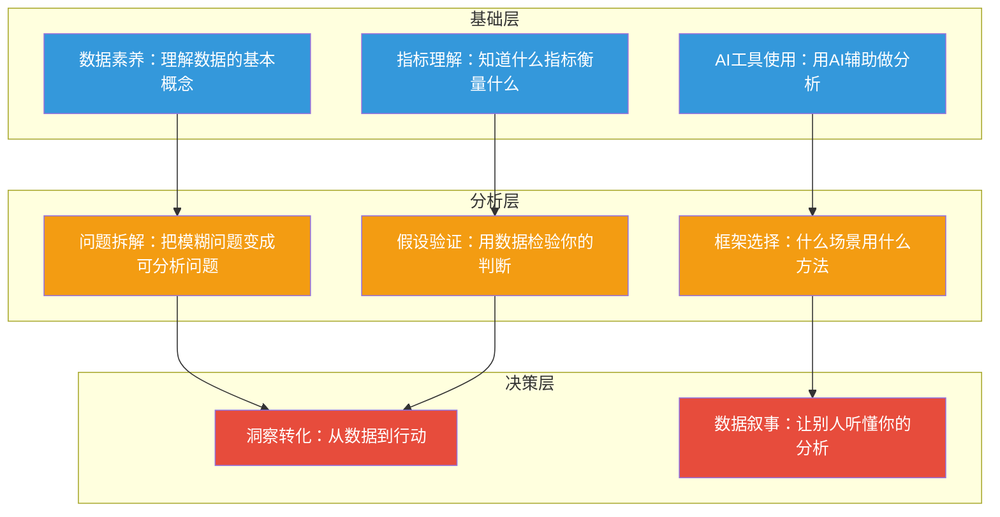

# 02_能力模型：非技术人员的数据分析能力金字塔

> [!abstract] 一句话总结
> 你不是数据分析师，不需要学所有东西。你的目标是：**建立"用AI辅助自己做分析"的核心能力**——从基础数据素养，到分析方法论，再到决策驱动。这需要一个分层的能力模型来指导你"学什么、学到什么程度"。

---

## 一、能力金字塔总览

非技术人员的数据分析能力，可以分为三层：



---

## 二、基础层：数据素养（必学，2-3天）

> 目标：能看懂数据，能用AI工具做基础分析

### 2.1 数据素养（B1）

**你需要理解的概念：**

| 概念 | 为什么重要 | 学到什么程度 |
|------|-----------|-------------|
| 数据类型 | 分类数据、数值数据、时间序列数据——不同数据用不同分析方法 | 能识别数据类型，知道什么数据用什么方法 |
| 数据结构 | 行=记录，列=字段——理解数据表的基本结构 | 能看懂一个表格，知道每行每列代表什么 |
| 数据质量 | 缺失值、异常值、重复值——脏数据会导致错误结论 | 能识别常见数据质量问题，知道怎么跟AI描述清洗需求 |
| 样本与总体 | 你的数据是"全部"还是"抽样"——决定分析结论的适用范围 | 理解抽样的概念，知道"样本结论不一定代表总体" |

**实践检验标准：** 给你一份员工数据表（Excel），你能用AI工具回答以下问题：
- 这个表有多少员工？各部门多少人？
- 平均薪资是多少？中位数薪资是多少？哪个更有代表性？
- 数据有没有明显的问题（缺失、异常、重复）？

### 2.2 指标理解（B2）

**你需要理解的核心指标：**

| 领域 | 核心指标 | 含义 |
|------|---------|------|
| **HR** | 招聘转化率 | 从投递→面试→Offer→入职，各环节的转化比例 |
| **HR** | 离职率 | 主动离职 / 总人数，反映人才保留情况 |
| **HR** | 人均产出 | 营收 / 员工数，衡量人力效率 |
| **产品** | 留存率 | 第N天仍在使用产品的用户比例 |
| **产品** | 转化率 | 完成目标动作的用户比例 |
| **产品** | NPS | 净推荐值，用户忠诚度指标 |
| **通用** | 同比/环比 | 与去年同期比 / 与上个月比 |
| **通用** | 均值 vs 中位数 | 均值容易被极端值拉偏，中位数更稳健 |
| **通用** | 方差/标准差 | 数据波动程度，判断"稳定"还是"剧烈变化" |

**实践检验标准：** 你能解释"为什么招聘转化率下降了但Offer接受率上升了"意味着什么（渠道质量提升了，但薪资竞争力可能下降了）。

### 2.3 AI工具使用（B3）

**你需要掌握的操作：**

| 操作 | 用AI怎么做 | 示例提示词 |
|------|-----------|-----------|
| 上传数据 | 把Excel/CSV文件上传给AI | "这是我公司的员工数据，请帮我分析" |
| 描述分析需求 | 用自然语言告诉AI你要什么 | "帮我算一下各部门的平均薪资，按降序排列" |
| 要求AI画图 | 描述你想要的图表 | "用柱状图展示各部门人数，按人数从多到少排序" |
| 验证AI输出 | 让AI解释它的分析逻辑 | "你是怎么得出这个结论的？请展示你的分析步骤" |

> [!tip] 提示词技巧
> 好的数据分析提示词 = 数据描述 + 分析目标 + 输出格式要求
> 示例："这是一份2024年全年的招聘数据，包含投递量、面试量、Offer量、入职量四列。请帮我分析各月招聘漏斗的转化率变化趋势，用折线图展示，并标注转化率最低的月份。"

---

## 三、分析层：分析思维（核心，1-2周）

> 目标：能把模糊的业务问题拆解成可分析的问题，用数据检验假设

### 3.1 问题拆解（A1）

**核心技能：** 把"老板说：招聘效率太低了"变成可分析的问题。

**拆解方法：**

```
"招聘效率低" → 拆解为三个子问题：
1. 是渠道不行？（哪个渠道的转化率低？）
2. 是流程有问题？（哪个环节流失最严重？）
3. 是薪资没竞争力？（Offer拒绝率是否上升？）
```

**拆解框架：**

| 拆解方法 | 适用场景 | 示例 |
|---------|---------|------|
| **MECE原则** | 任何问题 | 把"员工离职原因"拆为：薪酬因素、发展因素、文化因素、个人因素 |
| **漏斗拆解** | 流程类问题 | 把"招聘效率"拆为：投递→筛选→面试→Offer→入职 各环节 |
| **维度拆解** | 多维度问题 | 把"销售业绩"拆为：按区域、按产品线、按时间段、按客户类型 |
| **对比拆解** | 趋势/对比问题 | 把"绩效下降"拆为：与去年同期比、与上季度比、各团队之间比 |

**实践检验标准：** 给你一个模糊的业务问题（如"最近员工满意度下降了"），你能拆解出3-5个可分析的具体问题。

### 3.2 假设验证（A2）

**核心技能：** 用数据检验你的直觉判断，区分"我以为"和"数据说"。

**假设验证的标准流程：**

```
1. 提出假设："我觉得老员工离职率比新员工高"
2. 定义验证标准："老员工=入职3年以上，新员工=入职1年以内"
3. 获取数据，AI辅助分析
4. 得出结论：假设成立/不成立，以及为什么
5. 转化为行动建议
```

**常见陷阱：**

| 陷阱 | 说明 | 如何避免 |
|------|------|---------|
| **确认偏误** | 只看到支持自己假设的数据 | 主动让AI找"反对你假设"的证据 |
| **幸存者偏差** | 只看到成功案例，忽略失败案例 | 确保数据包含所有样本，不只是"活下来的" |
| **相关≠因果** | 夏天冰淇淋销量和溺水率相关，但买冰淇淋不会导致溺水 | 问自己"有没有第三个变量同时影响两者" |

### 3.3 框架选择（A3）

**核心技能：** 知道什么分析方法适合什么场景。详见 [[06-数据分析/AI时代数据分析学习/04_分析方法论：从问题定义到洞察输出]]。

**快速决策表：**

| 你想知道什么 | 用什么方法 | 适用场景 |
|-------------|-----------|---------|
| 数据长什么样？ | 描述统计 | 刚拿到一份新数据 |
| A和B有关系吗？ | 相关性分析 | 分析薪资和离职率的关系 |
| 两组人有差异吗？ | 对比分析 | 比较不同部门的绩效 |
| 什么因素影响结果？ | 回归分析 | 分析什么因素影响员工离职 |
| 未来会怎样？ | 趋势分析 | 预测下季度招聘需求 |
| 改了会有效果吗？ | A/B测试 | 测试新JD的转化率 |

---

## 四、决策层：影响力（进阶，持续积累）

> 目标：让你的分析被听见、被理解、被采纳

### 4.1 洞察转化（D1）

**核心技能：** 从"数据说了什么"到"我们应该做什么"。

**洞察转化的三层追问：**

```
数据层："6月招聘转化率从40%降到35%"（发生了什么）
    ↓
归因层："主要原因是BOSS直聘渠道的转化率从45%降到30%"（为什么发生）
    ↓
行动层："建议优化BOSS直聘的JD描述，增加薪资范围，同时测试拉勾网的渠道效果"（我们应该做什么）
```

**好洞察的三个标准：**

1. **有数据支撑，不是拍脑袋。** "我觉得"不如"数据显示"。
2. **有行动建议，不是只描述问题。** "转化率下降了"不如"建议启动A/B测试优化JD"。
3. **有优先级判断，不是列一堆。** "三个建议中，优先做X，因为影响最大、成本最低。"

### 4.2 数据叙事（D2）

**核心技能：** 让你的分析被理解、被记住、被采纳。

**数据叙事框架（SCR）：**

```
S (Situation) 情境：我们面临什么挑战？
"过去3个月，我们的招聘周期从30天延长到45天，业务部门反馈严重影响了项目进度。"

C (Complication) 冲突：问题的核心是什么？
"深入分析后发现，问题不在简历量（简历量增长了20%），而在面试到Offer环节的转化率下降了40%。"

R (Resolution) 解决：我们应该怎么做？
"建议两个方向：一是优化面试流程，将三轮面试精简为两轮；二是调整薪资策略，对标市场75分位。预估可将招聘周期缩短至35天。"
```

> [!tip] 数据叙事黄金法则
> 1. **结论先行**：先说结论，再说分析过程
> 2. **一个图表一个观点**：不要在一个图表里塞太多信息
> 3. **用对比制造冲击**："这个数字是去年的3倍"比"这个数字增长了200%"更有冲击力
> 4. **站在听众角度**：老板关心成本，业务关心效率，HR关心人效——同一种分析，不同听众讲法不同

---

## 五、不同岗位的差异化需求

| 岗位 | 基础层要求 | 分析层要求 | 决策层要求 | 重点场景 |
|------|-----------|-----------|-----------|---------|
| **HR** | 必须掌握 | 必须掌握 | 必须掌握 | 招聘漏斗、离职分析、绩效校准、培训ROI |
| **产品经理** | 必须掌握 | 必须掌握 | 必须掌握 | 用户行为分析、A/B测试、留存分析、功能评估 |
| **战略/运营** | 必须掌握 | 必须掌握 | 必须掌握 | 市场规模估算、竞品分析、趋势判断、业务诊断 |
| **销售** | 掌握基础层即可 | 了解即可 | 了解即可 | 销售漏斗、客户分层、转化率分析 |
| **市场** | 掌握基础层即可 | 建议掌握 | 建议掌握 | 渠道ROI、用户画像、Campaign效果分析 |

---

## 六、你的学习地图

基于以上能力模型，推荐的阅读和学习路径：

| 阶段 | 阅读内容 | 时间 | 检验标准 |
|------|---------|------|---------|
| 1 | [[06-数据分析/AI时代数据分析学习/01_范式转移：AI如何改变数据分析的学与做]] | 15分钟 | 理解"为什么" |
| 2 | 本文 | 12分钟 | 理解"学什么" |
| 3 | [[06-数据分析/AI时代数据分析学习/03_统计学思维：AI时代最保值的能力]] | 20分钟 | 建立统计直觉 |
| 4 | [[06-数据分析/AI时代数据分析学习/04_分析方法论：从问题定义到洞察输出]] | 18分钟 | 掌握分析流程 |
| 5 | [[06-数据分析/AI时代数据分析学习/05_AI辅助数据分析工具链]] | 15分钟 | 会用AI工具 |
| 6 | [[06-数据分析/AI时代数据分析学习/07_HR数据分析实战：招聘漏斗、离职预测、绩效校准]] | 25分钟 | 能独立分析HR数据 |
| 7 | [[06-数据分析/AI时代数据分析学习/06_数据可视化与叙事：让数据自己说话]] | 15分钟 | 会讲数据故事 |
| 8 | [[06-数据分析/AI时代数据分析学习/08_产品与战略数据分析实战：留存、实验、市场规模]] | 25分钟 | 拓展到产品/战略场景 |

> [!quote] 记住
> 你不需要成为数据分析师，你只需要比昨天的自己更善于用数据思考。**AI是你最好的分析师，你的大脑才是最好的决策者。**

---

> [!tip] 关联阅读
> - [[02-AI趋势与素养/AI时代能力要求/00_MOC_AI时代能力要求中枢|AI时代能力要求]] —— 数据分析是AI时代核心能力之一
> - [[01-AI技术/Skill制作痛点/00_MOC_Skill制作痛点中枢|非技术人员与技术边界]] —— 理解你与技术人员的分工边界
> - [[05-产品与开发/AI产品经理方法论/00_MOC_AI产品经理方法论中枢|AI产品经理方法论]] —— 产品经理的数据分析能力要求