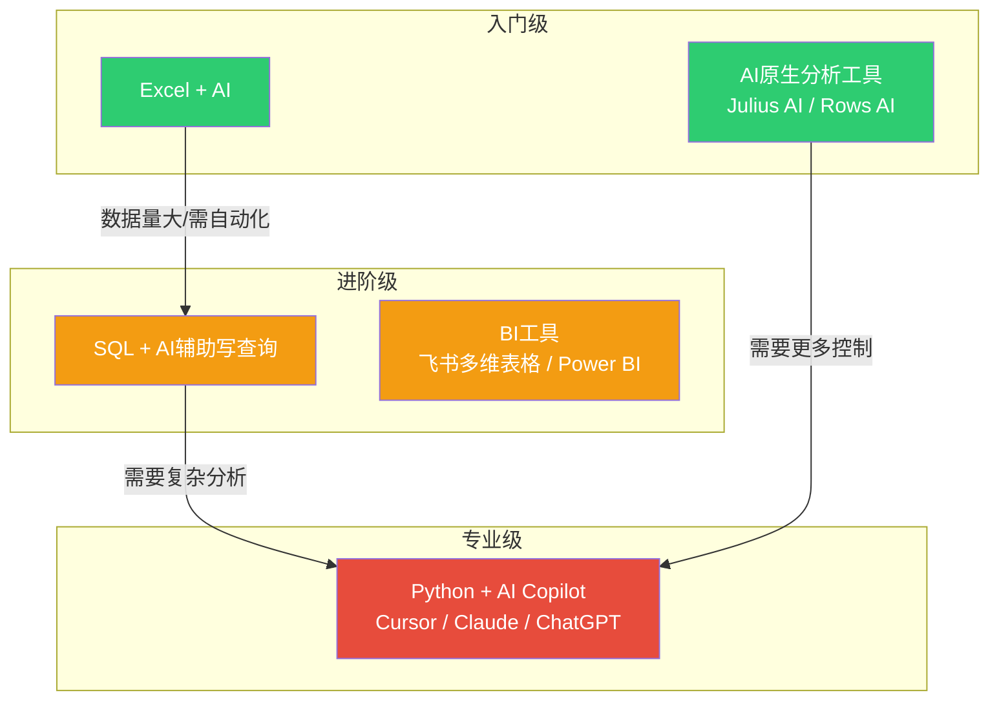

# 05_AI辅助数据分析工具链

> [!abstract] 一句话总结
> 你不需要成为工具专家，你只需要知道"什么场景用什么工具"和"怎么用AI操作这些工具"。本文按照"数据量级"和"分析复杂度"两个维度，为你梳理一条从入门到进阶的工具链。

---

## 一、工具选择矩阵



**快速决策：**

| 你的情况 | 推荐工具 | 原因 |
|---------|---------|------|
| 数据在Excel里，<10万行，分析不复杂 | Excel + AI | 零学习成本，AI直接辅助 |
| 数据在Excel里，想快速出图出分析 | AI原生分析工具 | 上传数据→自然语言提问→自动出图 |
| 数据在数据库里，需要定期取数 | SQL + AI | AI帮你写查询，你验证逻辑 |
| 需要做看板，持续监控 | BI工具（飞书多维表格等） | 一次配置，持续更新 |
| 需要复杂分析（回归、聚类、NLP） | Python + AI | AI帮你写代码，你控制方向 |
| 完全零基础，想最快上手 | AI原生分析工具 | 最友好的入门方式 |

---

## 二、入门级：Excel + AI

### 2.1 为什么Excel依然重要

- **你的数据90%都在Excel里**（HR报表、业务数据、调查问卷）
- AI可以直接帮你操作Excel，不需要学VBA
- 数据透视表 + AI解读 = 快速洞察

### 2.2 AI辅助Excel的核心场景

| 场景 | AI提示词示例 |
|------|-------------|
| 数据清洗 | "这份Excel中，薪资列有文本格式的数字，请帮我转为数值格式" |
| 公式生成 | "帮我写一个Excel公式：如果绩效评分>4.5且入职年限>2年，标记为'高潜'" |
| 数据透视表 | "帮我生成数据透视表的说明：行=部门，列=绩效等级，值=人数" |
| 图表生成 | "用这份数据生成一个柱状图，展示各部门平均薪资对比" |
| 异常检测 | "帮我检查这份数据，找出薪资、绩效、入职日期中的异常值" |

### 2.3 实操：上传Excel给AI做分析

```
第一步：把Excel文件导出为CSV（或直接上传Excel）
第二步：告诉AI你的分析目标
第三步：让AI输出分析结果和图表
第四步：验证AI的结论

提示词模板：
"这是我们的招聘数据，包含以下列：投递日期、渠道、岗位、投递量、面试量、Offer量、入职量。
请帮我：
1. 计算各渠道的招聘漏斗转化率（投递→面试→Offer→入职）
2. 找出转化率最低的渠道和环节
3. 用折线图展示各月整体转化率变化趋势
4. 给出3个优化建议"
```

---

## 三、AI原生分析工具（零基础最佳选择）

### 3.1 什么是AI原生分析工具

这些工具专为"非技术人员用AI做分析"设计，你只需要：
1. 上传数据（CSV/Excel/Google Sheets）
2. 用自然语言描述你的问题
3. AI自动分析、出图、生成报告

### 3.2 主流工具对比

| 工具 | 特点 | 适合场景 | 价格 |
|------|------|---------|------|
| **Julius AI** | 上传数据→自然语言提问→自动出图出分析 | 快速探索分析，适合零基础 | 有免费额度 |
| **Rows AI** | 在线表格 + AI分析，类似AI增强版Excel | 在线协作分析，实时更新 | 有免费额度 |
| **ChatGPT + 数据分析模式** | 上传文件后ChatGPT直接分析 | 已有ChatGPT订阅的用户 | 需Plus订阅 |
| **Claude + 文件上传** | 上传文件后Claude分析，长文本优势 | 数据量大、需要深度分析 | 需Pro订阅 |

### 3.3 实操示例

```
场景：你想分析员工离职数据，但完全不会写代码

用Julius AI：
1. 上传 employee_data.csv
2. 输入："分析离职员工的共同特征，按部门、入职年限、绩效评分分组"
3. AI自动输出：描述统计、分组对比图表、关键发现
4. 追问："哪些因素最能预测离职？"
5. AI自动输出：相关性分析、回归分析结果

整个过程不超过10分钟，而你不需要写一行代码。
```

---

## 四、进阶级：SQL + AI

### 4.1 什么时候需要SQL

- 数据在数据库里（MySQL、PostgreSQL等），不在Excel里
- 数据量太大（>10万行），Excel处理不了
- 需要定期从数据库取数，不是一次性分析

### 4.2 AI辅助写SQL的核心技巧

**你不需要记住SQL语法，但你需要知道：**

| 你需要知道的 | 为什么 | AI帮你做什么 |
|-------------|--------|-------------|
| 你的数据库有哪些表 | 不知道表名，AI无法帮你写查询 | 生成具体的SELECT语句 |
| 每张表有哪些字段 | 不知道字段名，AI无法正确引用 | 生成JOIN、WHERE、GROUP BY逻辑 |
| 表之间的关系 | 不知道表怎么关联，AI无法正确JOIN | 生成多表关联查询 |
| 你想要什么结果 | 这是最重要的——你定义问题 | 将你的需求翻译成SQL |

### 4.3 AI辅助SQL的标准流程

```
步骤1：获取表结构（DESCRIBE table_name 或问DBA要表结构文档）
步骤2：把表结构发给AI
步骤3：用自然语言描述你的查询需求
步骤4：AI生成SQL，你复制到数据库执行
步骤5：验证结果是否正确（尤其是数据量、关键数字）

提示词模板：
"我有一个MySQL数据库，包含以下表：
- employees (id, name, department, hire_date, salary, manager_id)
- performance (id, employee_id, year, quarter, score, grade)
- turnover (id, employee_id, leave_date, leave_reason, leave_type)

请帮我写一个SQL查询：计算2025年各部门的离职率（离职人数/年初在职人数），按离职率从高到低排序。"
```

---

## 五、专业级：Python + AI Copilot

### 5.1 什么时候需要Python

- 需要做复杂分析（回归、聚类、时间序列预测、文本分析）
- 需要自动化重复分析流程
- 数据清洗逻辑复杂，Excel和SQL搞不定
- 需要做机器学习预测模型

### 5.2 AI时代，Python怎么学

**传统方式：** 先学Python语法（2周）→ 再学Pandas（2周）→ 再学Matplotlib（1周）→ 然后才能做分析。

**AI时代方式：** 用AI写代码，你学会"读代码"和"改代码"。

| 你需要的能力 | 传统要求 | AI时代要求 |
|-------------|---------|-----------|
| 写代码 | ⭐⭐⭐⭐⭐ | ⭐⭐（AI写，你改） |
| 读代码 | ⭐⭐⭐ | ⭐⭐⭐⭐（你需要能看懂AI写了什么） |
| 调试代码 | ⭐⭐⭐⭐ | ⭐⭐⭐（把错误信息丢给AI） |
| 环境配置 | ⭐⭐⭐ | ⭐⭐（AI帮你配置） |

### 5.3 AI辅助Python分析的标准流程

```
步骤1：告诉AI你最想分析什么
步骤2：AI生成Python代码
步骤3：你复制代码到Jupyter Notebook或Cursor运行
步骤4：如果报错，把错误信息丢给AI让它修复
步骤5：验证输出结果

提示词模板：
"请帮我写一个Python脚本，分析这份招聘数据（CSV文件路径：recruitment_2025.csv）：
1. 加载数据并做基本清洗
2. 计算各渠道的招聘漏斗转化率
3. 用matplotlib生成漏斗图
4. 用文本分析（NLP）分析'离职原因'列的常见主题
5. 输出一份包含所有发现的Markdown报告"
```

### 5.4 Python环境配置（AI辅助版）

```
如果你完全没用过Python：
1. 安装Anaconda（一键安装Python+Jupyter+常用库）
2. 打开Jupyter Notebook
3. 把AI生成的代码粘贴到单元格中
4. 按Shift+Enter运行

如果遇到环境问题：
把错误信息复制给AI，让AI帮你解决。大多数环境问题AI都能解决。
```

---

## 六、BI工具：飞书多维表格等

### 6.1 什么时候用BI工具

- 需要持续监控关键指标（不是一次性分析）
- 需要多人协作看同一个数据看板
- 数据需要定期更新
- 不需要很复杂的分析，主要是"看数据"

### 6.2 飞书多维表格在数据分析中的应用

飞书多维表格是HR人群最友好的BI工具，因为：
- 本来就是飞书用户，零学习成本
- 支持公式、图表、仪表盘
- 支持数据联动和自动化更新
- 可以直接在飞书群分享

**典型场景：**

| 场景 | 怎么做 |
|------|--------|
| 招聘进展看板 | 创建多维表格，列出各岗位的招聘进度，自动计算各环节转化率 |
| 离职监控 | 自动统计月度离职率，按部门分组，异常波动自动预警 |
| 绩效校准 | 导入各部门绩效评分，自动计算分布，支持校准会讨论 |
| 培训跟踪 | 记录培训参与情况，自动计算完成率、满意度 |

---

## 七、工具选择决策树

```
你有一份数据要分析
    ↓
数据在哪？
    ├── Excel/CSV文件 → 数据量大吗？
    │   ├── <1万行 → 用 Excel + AI 或 AI原生分析工具
    │   └── >1万行 → 用 Python + AI 或 AI原生分析工具
    │
    ├── 数据库 → 用 SQL + AI
    │
    └── 需要定期更新的看板 → 用 BI工具（飞书多维表格等）

分析复杂吗？
    ├── 简单（描述统计、分组对比） → Excel + AI 或 AI原生分析工具
    ├── 中等（相关性、回归、漏斗） → SQL + AI 或 Python + AI
    └── 复杂（机器学习、NLP、预测） → Python + AI
```

---

## 八、你的工具学习路径

| 阶段 | 学习内容 | 时间 | 检验标准 |
|------|---------|------|---------|
| 入门 | Excel + AI、AI原生分析工具 | 1-2天 | 能上传数据，用自然语言让AI分析并出图 |
| 进阶 | SQL + AI | 3-5天 | 能描述需求，让AI生成SQL并正确执行 |
| 专业 | Python + AI | 1-2周 | 能运行AI生成的Python代码，能读懂和修改 |

> [!tip] 重要提醒
> 工具是手段，不是目的。**不要为了学工具而学工具。** 从你最常遇到的场景出发，先用Excel+AI解决90%的问题，当遇到瓶颈时再升级到SQL或Python。AI时代，工具切换的成本极低。

> [!tip] 关联阅读
> - [[06-数据分析/AI时代数据分析学习/06_数据可视化与叙事：让数据自己说话]] —— 学会"讲数据故事"
> - [[06-数据分析/AI时代数据分析学习/04_分析方法论：从问题定义到洞察输出]] —— 工具服务于分析流程