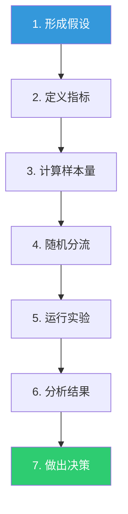

# 08_产品与战略数据分析实战：留存、实验、市场规模

> [!abstract] 一句话总结
> 本文针对产品经理和战略/运营从业者最常遇到的三个数据分析场景：用户留存分析、A/B测试、市场规模估算，每个场景都提供"AI辅助分析→人做判断"的完整流程。附带7个即用提示词模板。

---

## 一、场景一：用户留存分析

### 1.1 问题定义

**典型场景：** "用户来了又走了，我们不知道他们为什么走、什么时候走、怎么留住他们。"

**转化为可分析的问题：**
- 用户留存率是多少？在什么时间节点流失最严重？
- 不同用户群的留存表现有什么差异？
- 留存用户和流失用户的行为有什么不同？
- 什么因素最能预测用户是否留存？

### 1.2 指标定义

| 指标 | 计算公式 | 含义 |
|------|---------|------|
| 次日留存率 | Day1活跃用户 / Day0新增用户 | 首日体验吸引力 |
| 7日留存率 | Day7活跃用户 / Day0新增用户 | 短期价值感知 |
| 30日留存率 | Day30活跃用户 / Day0新增用户 | 中长期习惯养成 |
| 留存曲线 | 横轴=天数，纵轴=留存率 | 整体留存模式 |
| 分群留存率 | 按渠道/版本/用户画像分组 | 识别高留存和低留存用户群 |

### 1.3 AI辅助分析

```
提示词：
"这是我们的用户行为数据，包含字段：用户ID、注册日期、最后活跃日期、注册渠道、用户类型、功能使用次数、内容消费次数。

请帮我做留存分析：
1. 绘制整体留存曲线（次日、7日、30日留存率）
2. 按注册渠道分组，对比各渠道的留存率差异
3. 按用户类型分组（如免费用户 vs 付费用户），对比留存差异
4. 分析'死亡之谷'：哪个时间段的流失率最高？
5. 分析留存用户和流失用户的行为差异：他们在注册后前3天做了什么不同的事？
6. 给出3个提升留存的具体建议"
```

### 1.4 洞察输出示例

```
核心发现：用户流失的"死亡之谷"在Day3-Day7，70%的流失发生在这个窗口。

数据证据：
- 次日留存率65%，7日留存率仅20%，30日留存率12%
- Day3-Day7的流失率（45个百分点）远高于Day1-Day3（10个百分点）
- 留存用户 vs 流失用户的关键差异：留存的用户在注册后24小时内完成了"核心功能体验"（使用率85% vs 12%）

行动建议：
P0：优化新用户引导流程，确保80%的新用户在注册后24小时内完成核心功能体验
P0：在Day3发送"你还没试过XX功能"的推送提醒
P1：设计"7天挑战"活动，引导用户连续7天使用产品
P2：建立"用户激活"指标体系，实时监控新用户的激活率
```

---

## 二、场景二：A/B测试

### 2.1 问题定义

**典型场景：** "我们想改版JD页面，但不确定新版本是否真的能提高投递转化率。"

**关键前提：** A/B测试不是"随便试试"，需要严格的实验设计和正确的统计解读。

### 2.2 A/B测试的标准流程



### 2.3 每一步的AI辅助

**步骤1-2：形成假设 + 定义指标**

```
提示词：
"我们想改版JD页面，主要改动是：1）增加薪资范围显示 2）精简JD内容为3个要点 3）增加'团队介绍'板块。

请帮我：
1. 设计一个清晰的假设：'如果改版，XX指标会提升XX%，因为XX'
2. 定义核心指标和辅助指标
3. 列出需要监控的'护栏指标'（不能因为改版而变差的指标）"
```

**步骤3：计算样本量**

```
提示词：
"请帮我计算A/B测试所需的最小样本量：
- 当前转化率（基准线）：5%
- 期望提升幅度：1个百分点（从5%到6%）
- 显著性水平：0.05
- 统计功效：0.8
- 分流比例：50/50"
```

**步骤6-7：分析结果 + 做出决策**

```
提示词：
"这是A/B测试的结果数据：
- 对照组：10,000人，转化率5.0%
- 实验组：10,000人，转化率5.8%

请帮我分析：
1. 这个提升是否统计显著？（计算p值和置信区间）
2. 这个提升是否业务显著？（如果只提升了0.8个百分点，值得上线吗？）
3. 有没有可能的分流问题？（如实验组和对照组的用户画像是否有差异）
4. 给出'上线/不上线/继续测试'的建议"
```

### 2.4 A/B测试常见陷阱

| 陷阱 | 说明 | 如何避免 |
|------|------|---------|
| **过早停止** | 看到"显著"就停止实验，可能只是随机波动 | 提前确定样本量和实验时长，不中途停止 |
| **多重比较** | 同时看10个指标，总有一个"显著" | 预设核心指标，其他指标仅供参考 |
| **新奇效应** | 新东西总是看起来更好，但效果会衰减 | 实验至少跑2周，排除新奇效应 |
| **样本污染** | 同一个用户可能同时看到实验组和对照组 | 确保用户级别的随机分流，且不跨设备 |

### 2.5 AI辅助判断A/B测试结果

```
提示词模板：
"分析A/B测试结果时，请用以下框架回答：
1. 证据质量：样本量够吗？实验时长够吗？分流随机吗？
2. 统计显著：p值和置信区间是什么？
3. 业务显著：提升幅度多大？值得上线吗？
4. 代价分析：如果上线，有什么风险？如果不上线，错过了什么？
5. 建议：上线/不上线/继续测试，以及理由"
```

---

## 三、场景三：市场规模估算

### 3.1 问题定义

**典型场景：** "老板问我们这个市场有多大，我需要一个靠谱的估算方法。"

**TAM-SAM-SOM框架：**

| 概念 | 含义 | 示例（AI招聘市场） |
|------|------|-------------------|
| **TAM**（总市场） | 全球/全国所有可能的市场 | 中国所有企业的招聘支出 |
| **SAM**（可服务市场） | 你的产品/服务能覆盖的部分 | 中国使用AI招聘工具的企业 |
| **SOM**（可获得市场） | 你在SAM中实际能拿到的份额 | 你的AI招聘产品在中国市场的实际收入 |

### 3.2 市场规模估算方法

| 方法 | 怎么做 | 适用场景 |
|------|--------|---------|
| **自上而下** | 从宏观数据出发，逐层缩小 | 有可靠的行业报告和宏观数据 |
| **自下而上** | 从基本单元出发，逐层累加 | 能估算单个客户价值和目标客户数量 |
| **类比法** | 找类似市场/产品的数据做参考 | 新兴市场，缺少直接数据 |
| **价值链分析** | 从整个产业链的价值分配中推算 | 需要理解产业链各环节的价值分配 |

### 3.3 AI辅助估算

```
提示词：
"请帮我估算中国AI招聘工具的市场规模（SAM），使用自上而下法：
1. 中国有XX万家企业（来源：国家统计局2025年数据）
2. 其中XX%的企业使用招聘管理系统（来源：行业报告）
3. 其中XX%有AI招聘需求（请帮我估算，或提供估算逻辑）
4. 平均每家企业的AI招聘工具年支出约为XX万元（请帮我估算）

请提供：详细的估算过程、每步假设的依据、可能的误差范围，以及最终的市场规模范围（保守/基准/乐观三种情景）。"
```

### 3.4 市场规模估算的注意事项

- [ ] **说明假设。** 每个数字的来源和假设都要说清楚，而不是给出一个"精确"的数字
- [ ] **给出范围。** 不要只说"市场规模500亿"，要说"市场规模在300-700亿之间，基准估算是500亿"
- [ ] **交叉验证。** 用两种不同的方法估算，如果结果差异很大，说明假设有问题
- [ ] **标注不确定性。** 哪些数据是可靠的（公开数据），哪些是估算的（假设），哪些是推测的（基于趋势判断）

---

## 四、产品与战略分析的AI提示词库

### 4.1 通用分析模板

```
"我有一个产品/业务问题：[描述你的问题]

请用以下结构帮我分析：
1. 问题拆解：把这个问题拆成3-5个可分析的子问题
2. 指标选择：每个子问题用什么指标衡量
3. 分析方法：每个子问题用什么分析方法
4. 数据需求：需要什么数据（列出具体字段）
5. 预期洞察：如果假设成立，我们会看到什么数据模式"
```

### 4.2 场景化提示词

| 场景 | 提示词关键句 |
|------|-------------|
| 用户分群 | "基于用户行为数据，用RFM模型对用户分群，描述每类用户的特征" |
| 功能评估 | "分析XX功能的使用率和用户留存的关系，判断这个功能是否值得继续投入" |
| 竞品分析 | "对比我们和竞品的XX指标，找出我们的优势和劣势" |
| 定价分析 | "分析不同价格区间的用户转化率和留存率，给出最优定价建议" |
| 增长诊断 | "用AARRR模型分析我们的增长瓶颈在哪一步" |
| 趋势预测 | "基于过去12个月的数据，预测未来3个月的XX指标趋势" |
| 用户路径分析 | "分析用户从注册到核心行为的路径，找出流失最多的节点" |

### 4.3 战略分析专用模板

```
提示词：
"我正在分析[XX行业/市场]，请帮我：
1. 市场规模估算：用TAM-SAM-SOM框架估算市场规模
2. 竞争格局：列出Top 5竞争对手，按市场份额、核心优势、目标用户对比
3. 趋势判断：找出3个最关键的行业趋势，评估对我们的影响
4. 机会识别：基于以上分析，推荐3个最值得投入的方向

请对每个结论标注数据来源和置信度（高/中/低）。"
```

---

## 五、总结：产品与战略分析的核心思维

> [!important] 产品与战略数据分析的三个层次
> 1. **描述层：** 发生了什么？（留存率、转化率、市场份额）
> 2. **诊断层：** 为什么发生？（用户行为分析、A/B测试、竞品对比）
> 3. **预测与决策层：** 接下来会发生什么？我们应该做什么？（趋势预测、市场规模、机会判断）

> [!tip] 关键提醒
> 产品分析的核心是"用户行为"，战略分析的核心是"市场机会"。两者都需要数据支撑，但最终的判断——"这个功能值得做吗""这个市场值得进吗"——永远需要人的战略判断。**AI帮你算，你来决定。**

> [!tip] 关联阅读
> - [[06-数据分析/AI时代数据分析学习/04_分析方法论：从问题定义到洞察输出]] —— 完整的六步分析流程
> - [[06-数据分析/AI时代数据分析学习/06_数据可视化与叙事：让数据自己说话]] —— 把分析结果讲成故事
> - [[04-商业与战略/战略分析工具与框架/00_MOC_战略分析工具与框架中枢|战略分析工具与框架]] —— 战略分析中的定量分析框架
> - [[05-产品与开发/用户研究与需求洞察/00_MOC_用户研究与需求洞察中枢|用户研究与需求洞察]] —— A/B测试、用户行为分析
> - [[04-商业与战略/增长与运营方法论/00_MOC_增长与运营方法论中枢|增长与运营方法论]] —— 数据驱动增长、留存优化