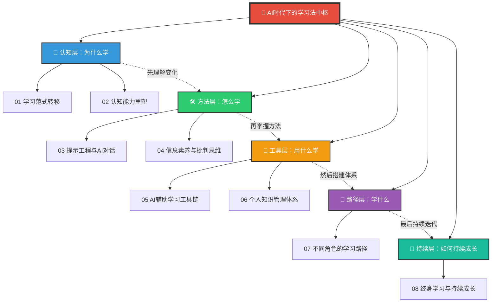
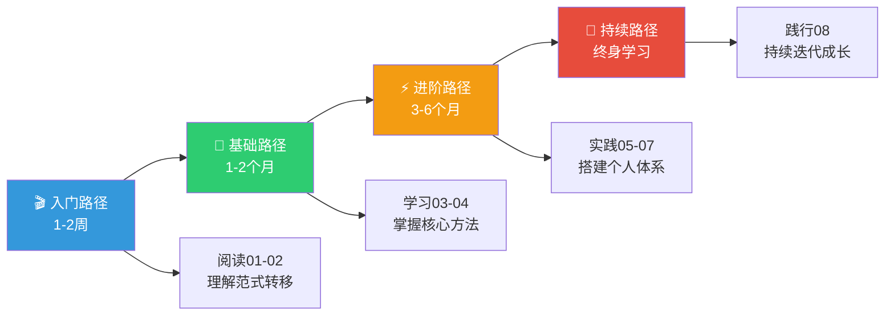

# 📚 AI时代下的学习法中枢

> 当AI可以瞬间回答任何知识性问题，学习的本质就不再是"记住知识"，而是"学会如何与AI协作、如何提出好问题、如何判断信息真伪、如何建立自己的认知体系"。这套知识库，就是为这个全新的学习时代而建。

---

## 知识体系全景

---

## 文档索引

| 层级 | 编号 | 文档名称 | 核心主题 |
|------|------|----------|----------|
| 🧠 认知层 | 01 | [[07-学习成长/AI时代下的学习法/01_学习范式转移：AI如何重塑学习的本质]] | AI如何改变"学习"这件事本身 |
| 🧠 认知层 | 02 | [[07-学习成长/AI时代下的学习法/02_认知能力重塑：从记忆到判断]] | 什么能力在升值，什么在贬值 |
| 🛠 方法层 | 03 | [[07-学习成长/AI时代下的学习法/03_提示工程：与AI对话的核心技能]] | 提问是新时代的元技能 |
| 🛠 方法层 | 04 | [[07-学习成长/AI时代下的学习法/04_信息素养与批判思维：AI时代的分水岭]] | 在海量信息中辨别真伪 |
| 🔧 工具层 | 05 | [[07-学习成长/AI时代下的学习法/05_AI辅助学习工具链与方法]] | 用AI加速学习的实战工具 |
| 🔧 工具层 | 06 | [[07-学习成长/AI时代下的学习法/06_个人知识管理体系：建立你的第二大脑]] | 系统的知识管理方法论 |
| 🎯 路径层 | 07 | [[07-学习成长/AI时代下的学习法/07_不同角色的AI学习路径]] | HR、PM、开发者的专属学习方案 |
| 🚀 持续层 | 08 | [[07-学习成长/AI时代下的学习法/08_终身学习：AI时代的持续成长策略]] | 如何持续保持竞争力 |

---

## 核心洞察

### 1. 学习的本质正在改变

| 传统学习 | AI时代的学习 |
|----------|-------------|
| 记忆知识是核心 | 提问能力是核心 |
| 输入→存储→输出 | 提问→筛选→整合→创造 |
| 知识越多越强 | 判断力越强越强 |
| 学完再用 | 边学边用，即时实践 |
| 单一学科深度 | 跨学科整合能力 |
| 考试验证成果 | 项目验证成果 |

### 2. 最保值的三种能力

> [!tip] AI时代的学习三角
> 1. **提问力** — 提出好问题的能力，比回答问题更重要
> 2. **判断力** — 辨别信息真伪、评估AI输出质量的能力
> 3. **整合力** — 跨领域知识整合、建立个人认知体系的能力

### 3. 学习的"三不原则"

- **不硬记** — 凡是AI能瞬间回答的，不值得花时间记忆
- **不盲信** — 对所有AI输出保持批判性审视
- **不被动** — 不要等AI教你，主动设定学习方向和目标

---

## 推荐学习路径

---

## 与相关知识库的链接

- [[06-数据分析/AI时代数据分析学习/00_MOC_AI时代数据分析学习中枢|AI时代数据分析学习]] — 数据分析能力的学习路径，与本知识库的"学习法"互补
- [[02-AI趋势与素养/AI时代能力要求/00_MOC_AI时代能力要求中枢|AI时代能力要求]] — 了解AI时代需要什么能力，再回来学习如何培养这些能力
- [[05-产品与开发/AI产品经理方法论/00_MOC_AI产品经理方法论中枢|AI产品经理方法论]] — 如果你是产品经理，这是你的专属学习路径

---

> [!quote]
> "在AI时代，学习的终极目标不是装满知识，而是学会如何学习本身。"
>
> — 本知识库的核心信条

---

*最后更新：2026-07-31*