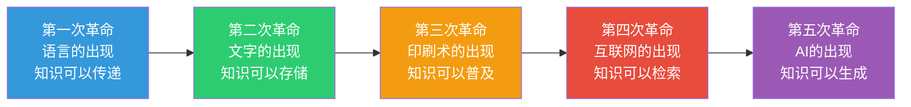
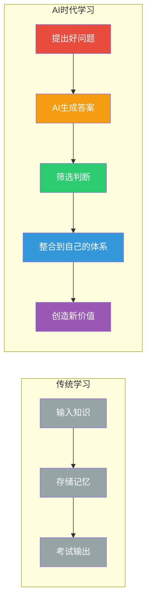

# 学习范式转移：AI如何重塑学习的本质

> 当AI可以瞬间回答任何知识性问题，学习的本质就不再是"记住知识"，而是"学会如何与AI协作、如何提出好问题、如何判断信息真伪、如何建立自己的认知体系"。

---

## 一、从"知识稀缺"到"知识过剩"

### 1.1 人类学习史的三次革命



每次革命都改变了"学习"的定义：

| 革命 | 核心变化 | 学习的重心 |
|------|----------|-----------|
| 语言 | 知识可以传递 | 记住口述内容 |
| 文字 | 知识可以存储 | 学会读写文字 |
| 印刷术 | 知识可以普及 | 阅读和理解 |
| 互联网 | 知识可以检索 | 搜索和筛选 |
| **AI** | **知识可以生成** | **提问和判断** |

### 1.2 AI时代的学习悖论

> [!warning] 核心悖论
> AI让知识获取变得前所未有的容易，但同时也让"真正学会"变得前所未有的困难。

**为什么？**

1. **虚假的"学会了"感** — 看着AI输出答案，大脑会产生"我懂了"的错觉，但实际上只是被动接收
2. **信息茧房加剧** — AI推荐算法让你只看到想看的，而不是需要看的
3. **深度思考被侵蚀** — 遇到问题立刻问AI，而不是先自己思考
4. **知识碎片化** — AI的片段式回答破坏了系统学习的连续性

---

## 二、学习范式的五大转变

### 2.1 从"记忆"到"提问"

| 传统范式 | AI时代范式 |
|----------|-----------|
| 核心能力：记住答案 | 核心能力：提出好问题 |
| 考试考记忆 | 考试考提问和判断 |
| 知识量决定竞争力 | 提问质量决定竞争力 |
| 学得越多越好 | 问得越好越好 |

> [!tip] 提问能力的三层进阶
> 1. **初级**：能问出AI能理解的问题
> 2. **中级**：能问出AI给出高质量回答的问题
> 3. **高级**：能问出AI回答不了、需要人类判断的问题

### 2.2 从"输入存储"到"筛选整合"



### 2.3 从"延迟应用"到"即时实践"

**传统学习路径**：
```
学完一门课 → 记笔记 → 考试 → 项目应用（可能几个月后）
```

**AI时代学习路径**：
```
有疑问 → 问AI → 理解 → 立刻实践 → 反馈 → 再提问 → 再实践
```

> [!example] 即时学习的实战场景
> - 学Python：不用先看书，直接让AI生成代码，边改边学
> - 学数据分析：不用先学统计学，直接让AI分析数据，边看边问
> - 学商业分析：不用先读MBA，直接让AI拆解案例，边讨论边学

### 2.4 从"学科纵深"到"跨领域整合"

AI时代，单一学科的深度不再是壁垒——AI可以补充任何领域的专业知识。真正的壁垒变成了**跨领域整合能力**：

| 传统优势 | AI时代的新优势 |
|----------|--------------|
| 精通一门学科 | 整合多学科视角 |
| 专业深度 | 跨界思维 |
| 一个领域的专家 | 多个领域的"翻译官" |
| 知道答案 | 知道如何连接不同领域的知识 |

### 2.5 从"终点式学习"到"持续迭代"

> [!key] 关键认知
> 过去的模型：**学习 → 工作 → 不再学习**
> AI时代的模型：**学习 → 实践 → 反馈 → 再学习 → 再实践 → 持续循环**

这不是简单的"终身学习"，而是学习节奏的根本变化——学习不再是阶段性的，而是嵌入到日常工作的每一个环节。

---

## 三、对学习者的实际影响

### 3.1 什么值得学，什么不值得学

**不值得花时间学的（AI已经做得很好）**：
- 事实性知识（历史年份、地理名称、公式记忆）
- 基础编程语法（AI可以生成代码）
- 标准化的流程操作（文档阅读、模板填写）
- 简单翻译和摘要

**值得花时间学的（AI还做不好）**：
- 批判性思维和判断力
- 跨领域知识整合
- 复杂问题的定义和分解
- 创造性思维和原创想法
- 人际沟通和协作能力
- 自我认知和元认知能力

### 3.2 学习者的新角色

| 角色 | 传统 | AI时代 |
|------|------|--------|
| 学生 | 知识的接收者 | 学习的主导者 |
| 教师 | 知识的传授者 | 学习的引导者和教练 |
| 课程 | 预设的固定内容 | 动态生成的个性化路径 |
| 评价 | 标准化考试 | 项目成果和实践能力 |

### 3.3 警惕"AI依赖症"

> [!warning] 常见陷阱
> 1. **搜索替代思考**：遇到问题第一反应是问AI，而不是自己先想
> 2. **答案替代理解**：拿到AI答案就满足，不追问"为什么"
> 3. **生成替代创造**：让AI写一切，自己失去创作能力
> 4. **推荐替代探索**：只看AI推荐的内容，错过偶然发现

**健康的AI使用原则**：
- 先自己思考，再问AI验证
- 不仅要答案，更要理解推理过程
- 把AI的输出当作"素材"，而不是"成品"
- 定期做"无AI日"练习

---

## 四、给学习者的行动建议

### 4.1 立即可以做的

1. **重新定义你的学习目标** — 从"学会什么知识"转变为"能解决什么问题"
2. **建立"提问日志"** — 记录每天提出的好问题，而不是学到的知识点
3. **实践"先想后问"** — 遇到问题先自己思考3分钟，再问AI
4. **做"AI盲测"** — 定期在不使用AI的情况下完成一项任务

### 4.2 需要长期培养的

1. **元认知能力** — 反思自己的学习过程，不断优化学习方法
2. **知识体系构建** — 将碎片化的AI输出整合成自己的知识体系（详见 [[07-学习成长/AI时代下的学习法/06_个人知识管理体系：建立你的第二大脑]]）
3. **判断力训练** — 持续练习评估AI输出的质量和可靠性（详见 [[07-学习成长/AI时代下的学习法/04_信息素养与批判思维：AI时代的分水岭]]）
4. **提问能力** — 把提问当作一门技能来刻意练习（详见 [[07-学习成长/AI时代下的学习法/03_提示工程：与AI对话的核心技能]]）

---

## 五、延伸阅读

- [[07-学习成长/AI时代下的学习法/00_MOC_AI时代下的学习法中枢]] — 知识库总览
- [[07-学习成长/AI时代下的学习法/02_认知能力重塑：从记忆到判断]] — 什么能力在升值
- [[07-学习成长/AI时代下的学习法/03_提示工程：与AI对话的核心技能]] — 提问是新时代的元技能
- [[07-学习成长/AI时代下的学习法/04_信息素养与批判思维：AI时代的分水岭]] — 在海量信息中辨别真伪
- [[02-AI趋势与素养/AI时代能力要求/00_MOC_AI时代能力要求中枢|AI时代能力要求]] — 了解AI时代需要什么能力

---

> [!quote]
> "AI不会取代学习者，但会学习的学习者将取代不会学习的学习者。"
>
> — 改编自《Human Compatible》Stuart Russell

---

*最后更新：2026-07-31*