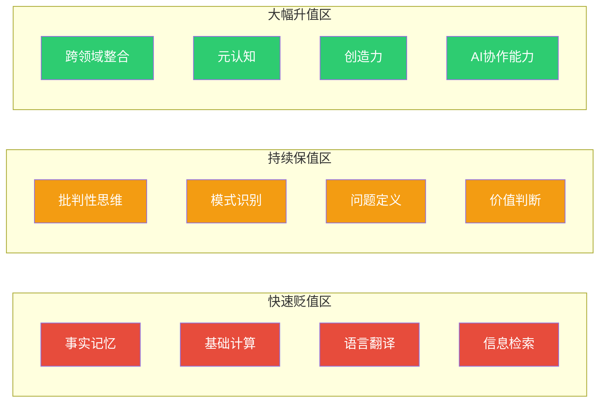
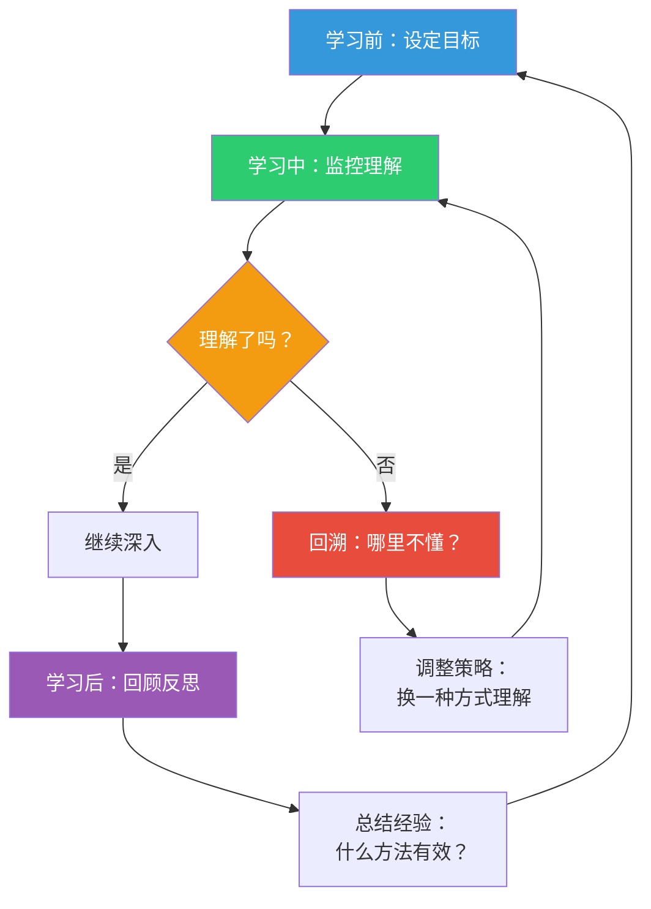
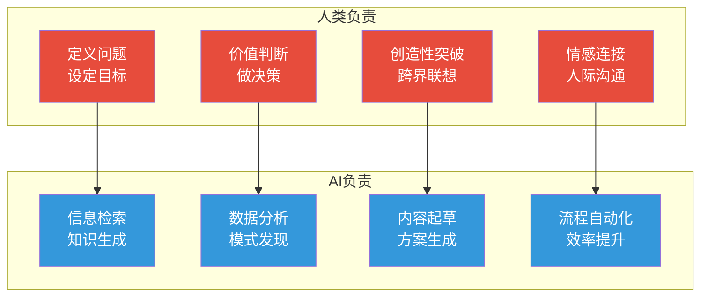

# 认知能力重塑：从记忆到判断

> AI时代，最保值的不是你知道多少，而是你能判断什么是对的、什么是重要的、什么是值得做的。

---

## 一、认知能力的"价值迁移"

### 1.1 认知能力贬值曲线

AI对不同认知能力的影响不是均匀的，有些能力飞速贬值，有些能力反而升值：

### 1.2 为什么记忆不再重要

| 因素 | 过去 | 现在 |
|------|------|------|
| 知识获取成本 | 高（需要买书、上课） | 近乎零（AI随时回答） |
| 知识更新速度 | 慢（几年更新一次） | 快（AI模型持续更新） |
| 记忆的ROI | 高（记住就是优势） | 低（记住不如会问） |
| 知识的稀缺性 | 稀缺 | 过剩 |

> [!tip] 记忆的新定位
> 不是完全不需要记忆，而是**选择性记忆**——只记住那些：
> 1. 经常使用的基础概念（如经济学原理、编程思维）
> 2. 只有你自己知道的东西（个人经验、独特洞察）
> 3. 连接不同领域的"桥梁知识"

---

## 二、最值得培养的认知能力

### 2.1 判断力，AI时代的第一能力

> [!key] 核心观点
> 判断力是AI时代最稀缺、最值钱的能力。因为AI可以生成大量内容，但判断"什么是对的、什么是好的、什么是重要的"只能靠人。

**判断力的四个层次**：

| 层次 | 能力 | 应用场景 | AI可替代性 |
|------|------|----------|-----------|
| L1 | 事实判断 | 这个数据对吗？ | 高 |
| L2 | 质量判断 | 这个方案好吗？ | 中 |
| L3 | 优先级判断 | 什么最重要？ | 低 |
| L4 | 价值判断 | 什么是对的？ | 极低 |

**如何训练判断力**：
1. **对比法**：让AI生成多个方案，训练自己判断哪个更好
2. **预测法**：对AI的结论做预测，然后验证
3. **复盘法**：回顾自己的判断，分析对错原因
4. **逆向法**：主动寻找反例，挑战自己的判断

### 2.2 元认知，学习的学习

> [!defn] 元认知
> 对自己思考过程的认知和监控。简单说就是"对自己思考的思考"。

元认知能力决定了你能否：
- 意识到自己不懂什么
- 知道自己最适合的学习方式
- 发现自己的思维盲点
- 及时调整学习策略

**元认知训练方法**：

### 2.3 跨领域整合能力

AI时代，单一领域的"专家"价值在下降，"翻译官"价值在上升。

**跨领域整合的三种模式**：

| 模式 | 描述 | 案例 |
|------|------|------|
| 方法迁移 | 将一个领域的方法应用到另一个领域 | 用产品经理的MVP思维做个人学习 |
| 视角融合 | 从多个学科视角看同一个问题 | 用心理学+经济学+生物学理解消费行为 |
| 知识重组 | 将不同领域的知识组合成新东西 | 把"游戏化"+"学习"+"AI"组合成新学习产品 |

### 2.4 AI协作能力

> [!tip] 核心能力
> 与AI协作的能力，本质上是一种"人机沟通能力"——知道AI擅长什么、不擅长什么，如何让AI发挥最大价值，如何补充AI的不足。

**AI协作能力的三要素**：

| 要素 | 核心问题 | 训练方法 |
|------|----------|----------|
| 认知边界 | 我知道AI能做什么、不能做什么吗？ | 不断测试AI的极限 |
| 任务分解 | 我能把问题拆解成AI能处理的部分吗？ | 练习将复杂问题结构化 |
| 输出评估 | 我能判断AI输出的质量吗？ | 每次都用多个角度评估 |

---

## 三、认知能力的"新搭配"

### 3.1 人机协同的认知分工

### 3.2 能力组合的新范式

> [!tip] 三合一能力模型
> 在AI时代，最值钱的是**判断力 × 整合力 × 协作力**的乘积，而不是单一能力的最大化。

**错误的组合**：
- 记忆大师 + 不会提问 = 被AI替代
- 技术大牛 + 没有判断力 = AI的"高级工具人"
- 创意天才 + 不会协作 = 孤岛

**正确的组合**：
- 判断力 + 提问力 = 能驾驭AI的决策者
- 整合力 + 创造力 = 能创造新价值的创新者
- 协作力 + 元认知 = 能持续进化的学习者

---

## 四、认知能力训练计划

### 4.1 每日练习

| 练习 | 时长 | 目的 | 方法 |
|------|------|------|------|
| 判断力日记 | 10分钟 | 训练判断力 | 记录今天3个判断，分析对错 |
| 无AI时段 | 30分钟 | 防依赖 | 每天固定时间不碰AI |
| 跨界阅读 | 15分钟 | 训练整合力 | 读一个完全不熟悉的领域 |
| 提问练习 | 10分钟 | 训练提问力 | 针对一个话题，提出10个问题 |

### 4.2 每周项目

- **判断挑战**：找一篇AI生成的文章，找出所有错误和不合理之处
- **整合练习**：用三个不同学科解释同一个现象
- **协作实验**：用AI完成一个之前不会的任务，复盘协作过程

### 4.3 每月复盘

1. 这个月我的判断力有没有进步？（什么判断对了、什么错了）
2. 我有没有形成新的认知连接？
3. 我与AI的协作效率有没有提升？
4. 下次可以做哪些调整？

---

## 五、延伸阅读

- [[07-学习成长/AI时代下的学习法/00_MOC_AI时代下的学习法中枢]] — 知识库总览
- [[07-学习成长/AI时代下的学习法/01_学习范式转移：AI如何重塑学习的本质]] — 理解为什么要重塑认知能力
- [[07-学习成长/AI时代下的学习法/03_提示工程：与AI对话的核心技能]] — 提问是新时代的元技能
- [[07-学习成长/AI时代下的学习法/04_信息素养与批判思维：AI时代的分水岭]] — 判断力的核心训练
- [[02-AI趋势与素养/AI时代能力要求/00_MOC_AI时代能力要求中枢|AI时代能力要求]] — 更全面的能力模型

---

> [!quote]
> "在AI时代，知道什么是对的，比知道很多知识重要得多。"
>
> — 认知科学家 Daniel Kahneman 的启发

---

*最后更新：2026-07-31*