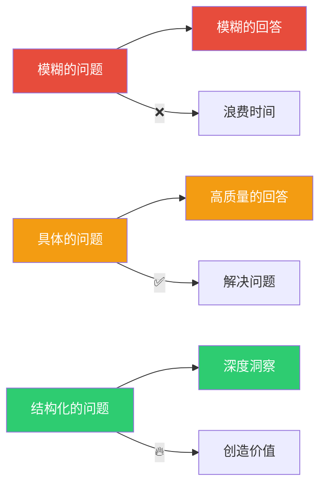
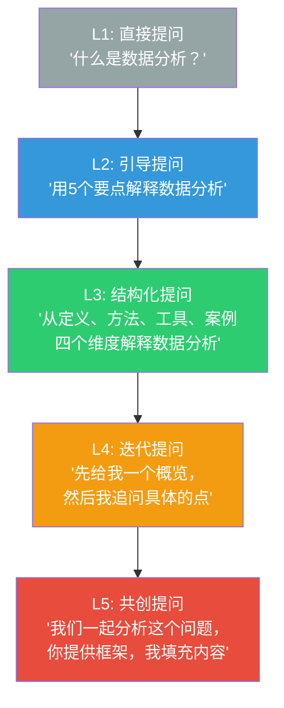

# 提示工程：与AI对话的核心技能

> 在AI时代，提问能力是最重要的元技能。你提问的质量，决定了你从AI那里获得的价值。

---

## 一、为什么提示工程是核心技能

### 1.1 提问质量决定AI输出质量



**同样的AI，不同的人用，效果天差地别**。区别不在于AI，而在于提问的能力。

### 1.2 提示工程的本质

> [!tip] 本质理解
> 提示工程不是"写咒语"，而是**用AI能理解的方式，清晰表达你的需求**。它和沟通能力本质相同——只是沟通对象是AI。

**提示工程的三层理解**：

| 层次 | 理解 | 对应能力 |
|------|------|----------|
| L1 操作层 | 知道怎么写Prompt | 记住模板和格式 |
| L2 策略层 | 理解AI如何理解Prompt | 设计提示策略 |
| L3 思维层 | 把提问当作思考方式 | 用提问引导思考 |

---

## 二、提示工程的核心理念

### 2.1 好Prompt的五要素

| 要素 | 说明 | 示例 |
|------|------|------|
| 角色 | 告诉AI它是谁 | "你是一位资深HR专家" |
| 任务 | 清晰描述要做什么 | "请分析这份简历的优缺点" |
| 上下文 | 提供背景信息 | "这是一家电商公司的招聘" |
| 格式 | 指定输出格式 | "用表格呈现，分优点和缺点两列" |
| 约束 | 明确限制条件 | "控制在500字以内，不要使用专业术语" |

### 2.2 Prompt的"三问法"

> [!example] 提问的黄金框架
> **一问角色**：你希望AI以什么身份回答？
> **二问对象**：你的回答是给谁看的？
> **三问目的**：你希望达到什么效果？

### 2.3 提问的层次进阶



---

## 三、实战Prompt模板

### 3.1 学习场景

**1. 快速入门新领域**
```
你是一位[领域]专家。我在[领域]方面是零基础。
请用最通俗的语言，用5个层次帮我理解[领域]：
1. 一句话定义
2. 核心概念（3-5个）
3. 为什么要学（3个理由）
4. 学习路径（从入门到精通）
5. 推荐资源（书籍/课程/工具）
每个层次控制在100字以内。
```

**2. 深入理解概念**
```
请用"费曼学习法"解释[概念]：
1. 用最简单的语言解释（像教给一个完全不懂的人）
2. 用一个日常生活中的类比
3. 用一个真实案例说明
4. 指出常见的误解
5. 推荐3个延伸问题，帮助我进一步理解
```

**3. 对比分析**
```
请对比[概念A]和[概念B]：
对比维度：定义、适用场景、优缺点、典型案例
请用表格呈现，并给出结论：什么情况下选A，什么情况下选B。
```

### 3.2 工作场景

**1. 方案咨询**
```
你是一位[角色]。我正在面临[问题描述]。
请帮我：
1. 分析这个问题的本质
2. 给出3个解决方案
3. 每个方案的优缺点
4. 推荐一个方案并说明理由
5. 给出实施步骤
```

**2. 内容创作**
```
请帮我写一篇关于[主题]的文章。
目标读者：[描述]
风格：[正式/轻松/专业/通俗]
结构：
- 开头：吸引注意
- 正文：3-4个核心观点，每个200字
- 结尾：总结和行动呼吁
字数：控制在[字数]以内
```

**3. 数据分析**
```
请分析以下数据：[粘贴数据]
分析要求：
1. 关键发现（Top 3）
2. 趋势分析
3. 异常值识别
4. 建议下一步行动
请用可视化的语言描述，不要图表。
```

### 3.3 学习复盘场景

```
我今天学习了[主题]，我的理解是：[你的理解]
请帮我：
1. 检查我的理解是否正确
2. 补充我遗漏的重要点
3. 指出我理解有偏差的地方
4. 推荐3个延伸问题，帮我深入思考
5. 给我一个"测验"来检验我的掌握程度
```

---

## 四、高级技巧

### 4.1 链式提问

不要试图一次问完所有问题，而是像对话一样逐步深入：

```
第一轮："给我一个关于[主题]的概览"
第二轮："关于你提到的[具体点]，能展开说说吗？"
第三轮："这个[具体点]和[另一个概念]有什么关系？"
第四轮："基于我们讨论的，你能给我一个总结吗？"
```

### 4.2 角色扮演

让AI扮演特定角色，可以获得不同视角的洞察：

| 角色 | 适用场景 |
|------|----------|
| 苏格拉底式导师 | 通过提问引导你自己思考 |
| 杠精（魔鬼代言人） | 挑战你的观点，发现盲点 |
| 五年级学生 | 用最简单的语言解释复杂概念 |
| 资深顾问 | 给出专业、结构化的建议 |
| 面试官 | 模拟面试，检验你的理解 |

### 4.3 反馈循环

> [!tip] 关键技巧
> 不要接受AI的第一次回答。通过反馈不断迭代：
> 1. "这个回答太笼统了，能更具体吗？"
> 2. "这个部分我不太理解，换个角度解释"
> 3. "这个方案有个问题，[指出问题]，能调整吗？"
> 4. "给我3个版本，让我选一个"

### 4.4 防幻觉技巧

AI有时候会"编造"事实，以下技巧可以降低风险：

| 技巧 | 方法 | 示例 |
|------|------|------|
| 要求引用 | 让AI给出信息来源 | "请提供数据来源" |
| 要求确认 | 让AI表示不确定的地方 | "如果不确定，请明确说明" |
| 交叉验证 | 让AI从多个角度回答 | "从正反两个角度分析" |
| 限制范围 | 缩小AI的回答范围 | "只回答你确定知道的" |

---

## 五、常见误区

### 5.1 新手误区

| 误区 | 正确做法 |
|------|----------|
| 问题太模糊 | 明确角色、任务、格式 |
| 一次问太多 | 分步提问，逐步深入 |
| 接受第一次回答 | 迭代反馈，持续优化 |
| 忽略上下文 | 提供足够的背景信息 |
| 不指定格式 | 明确输出格式要求 |

### 5.2 过度依赖

> [!warning] 警钟
> 提示工程是工具，不是目的。不要陷入"优化Prompt"的陷阱，而忘记了真正的学习目标。
>
> **好的Prompt + 没有思考 = 漂亮的垃圾**

---

## 六、练习计划

### 6.1 21天提示工程练习

| 周 | 主题 | 每日练习 |
|----|------|----------|
| 第一周 | 基础提问 | 每天用"五要素"写3个Prompt |
| 第二周 | 高级技巧 | 每天做一次"链式提问"练习 |
| 第三周 | 实战应用 | 每天用AI完成一个实际任务 |

### 6.2 每日自检

1. 我今天的提问比昨天好了吗？
2. 我有没有得到让我惊喜的回答？
3. 我有没有通过迭代得到更好的结果？
4. 我有没有发现了AI的局限性？

---

## 七、延伸阅读

- [[07-学习成长/AI时代下的学习法/00_MOC_AI时代下的学习法中枢]] — 知识库总览
- [[07-学习成长/AI时代下的学习法/01_学习范式转移：AI如何重塑学习的本质]] — 理解为什么要学提示工程
- [[07-学习成长/AI时代下的学习法/05_AI辅助学习工具链与方法]] — 更全面的AI学习工具
- [[07-学习成长/AI时代下的学习法/04_信息素养与批判思维：AI时代的分水岭]] — 评估AI输出的质量
- [[05-产品与开发/AI产品经理方法论/00_MOC_AI产品经理方法论中枢|AI产品经理方法论]] — 如果你是PM，看这个

---

> [!quote]
> "你提问的质量，决定了你思考的质量。而在AI时代，你思考的质量，决定了你存在的价值。"
>
> — 改编自 Warren Berger《A More Beautiful Question》

---

*最后更新：2026-07-31*