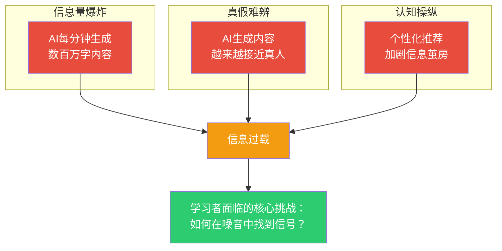
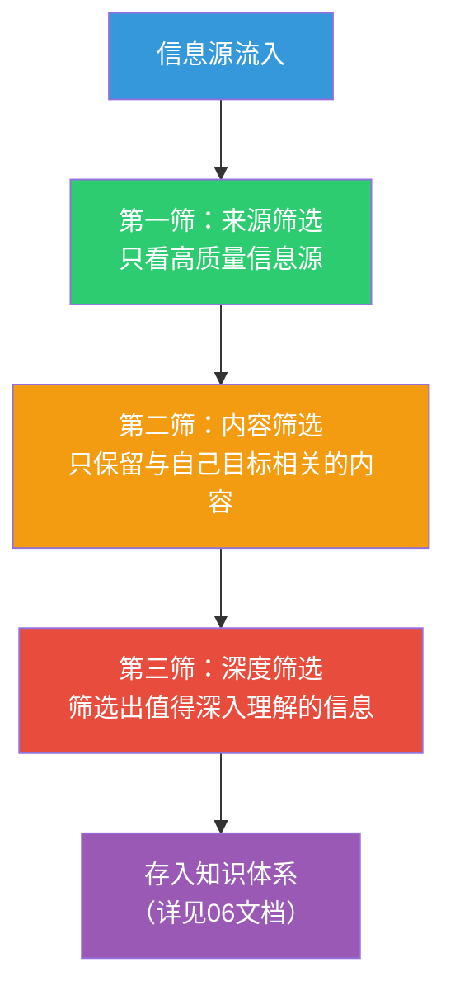

# 信息素养与批判思维：AI时代的分水岭

> AI生成的内容看起来越来越"真实"，但真假越来越难分辨。信息素养和批判思维，正在成为AI时代最重要的"护栏"。

---

## 一、AI时代的信息危机

### 1.1 信息环境的三重变化

### 1.2 AI幻觉：不可忽视的隐患

> [!warning] AI幻觉
> AI有时候会"自信地胡说八道"——用非常确定的语气给出完全错误的信息。这不是bug，而是AI工作方式的固有特征。

**AI常见的"说谎"模式**：

| 模式 | 表现 | 示例 |
|------|------|------|
| 编造事实 | 无中生有地编造数据 | "某研究显示80%的用户..."（实际没这个研究） |
| 张冠李戴 | 混淆不同概念 | 把A公司的数据说成B公司的 |
| 过度自信 | 用确定语气说错误内容 | "毫无疑问，这是最有效的方法" |
| 时代混淆 | 过时信息被当作最新 | 引用2022年的数据，但表现得像是最新的 |

---

## 二、信息素养的核心能力

### 2.1 信息素养的四个层次

| 层次 | 能力 | 说明 |
|------|------|------|
| L1 获取 | 能找到信息 | 知道用什么工具、关键词 |
| L2 评估 | 能判断信息质量 | 能辨别真假、优劣 |
| L3 整合 | 能连接不同信息 | 能建立知识之间的关联 |
| L4 创造 | 能基于信息创造新价值 | 能用信息解决问题、产生洞察 |

**AI时代，L2（评估）比L1（获取）重要得多，因为获取太容易了。**

### 2.2 AI输出的"四步验证法"

> [!tip] 验证框架
> 每次收到AI的输出，不要急着相信，按以下四个步骤验证：

**第一步：来源验证**
- AI引用了数据吗？来源是什么？
- 这个来源是否可信？
- AI能找到具体出处吗？

**第二步：逻辑验证**
- AI的推理过程是否自洽？
- 有没有逻辑跳跃？
- 结论是否真的从前提推导出来的？

**第三步：交叉验证**
- 换一个AI问同样的问题，答案一致吗？
- 用搜索引擎查一下核心事实
- 找权威资料对比

**第四步：常识验证**
- 这个结果符合你的基本认知吗？
- 有没有什么明显不合理的地方？
- 如果觉得不对，相信你的直觉

### 2.3 信息质量的"红黄绿灯"

| 等级 | 信号 | 判断标准 | 应对策略 |
|------|------|----------|----------|
| 🟢 绿灯 | 可信 | 有明确来源、逻辑自洽、多方验证 | 可以使用 |
| 🟡 黄灯 | 需谨慎 | 来源模糊、逻辑有跳跃、无法验证 | 进一步核实 |
| 🔴 红灯 | 不可信 | 明显错误、编造事实、逻辑矛盾 | 丢弃或标记 |

---

## 三、批判思维的实战应用

### 3.1 批判性阅读AI输出

> [!key] 核心原则
> 对AI的输出保持"健康的怀疑"——既不全信，也不全不信，而是用理性来判断。

**阅读AI输出时的七个问题**：

1. **这个回答回答了我的问题吗？**（还是答非所问？）
2. **这个回答有具体的论据吗？**（还是只有空洞的断言？）
3. **这个回答考虑了不同的视角吗？**（还是片面？）
4. **这个回答的假设是什么？**（这些假设合理吗？）
5. **这个回答有什么遗漏？**（什么重要信息没提到？）
6. **这个回答的结论有什么局限性？**（在什么条件下不成立？）
7. **如果换一种方式问，会得到不同的答案吗？**（提示偏差？）

### 3.2 批判思维的"六顶思考帽"

这个框架可以帮你从多个角度审视AI的输出：

| 思考帽 | 视角 | 问题示例 |
|--------|------|----------|
| 白帽 事实 | 客观数据 | "AI说的数据来源是什么？" |
| 红帽 直觉 | 情感判断 | "我的直觉告诉我，这个结论对吗？" |
| 黑帽 谨慎 | 风险评估 | "这个方案有什么风险？" |
| 黄帽 积极 | 价值判断 | "这个方案有什么价值？" |
| 绿帽 创造 | 新可能性 | "有没有其他可能性？" |
| 蓝帽 过程 | 元认知 | "我的思考过程全面吗？" |

### 3.3 AI vs 人类：什么该信谁

| 判断类型 | 更信AI | 更信自己 |
|----------|--------|----------|
| 事实性知识 | ✅（AI知识库更全） | ❌（人记不住） |
| 逻辑推理 | ✅（AI逻辑更严谨） | ⚠️（但AI可能遗漏关键前提） |
| 价值判断 | ❌（AI没有价值观） | ✅（这是人的核心能力） |
| 创新突破 | ❌（AI倾向于主流） | ✅（人的直觉和创造力） |
| 情绪判断 | ❌（AI不懂情绪） | ✅（人的共情能力） |
| 经验判断 | ⚠️（AI有广度） | ✅（人有深度） |

---

## 四、信息管理的实战方法

### 4.1 信息摄入的"三筛法"

### 4.2 高质量信息源判断标准

| 维度 | 好信息源 | 差信息源 |
|------|----------|----------|
| 来源 | 知名机构、权威专家 | 匿名、来源不明 |
| 时效 | 标注日期、定期更新 | 无日期、过时内容 |
| 论证 | 有数据、有逻辑、有引用 | 断言多、论证少 |
| 立场 | 客观中立、承认局限性 | 偏激、立场先行 |
| 质量 | 编辑审核、同行评议 | 无审核、质量参差不齐 |

### 4.3 信息洁癖 vs 信息开放

> [!tip] 平衡之道
> 既要避免**信息洁癖**（只相信少数几个来源，错失有价值的视角），也要避免**信息开放**（来者不拒，被垃圾信息淹没）。
>
> **好的策略**：对外保持开放，对内严格筛选。广泛摄入，深度筛选。

---

## 五、常见陷阱与应对

### 5.1 AI时代的认知陷阱

| 陷阱 | 表现 | 应对 |
|------|------|------|
| 确认偏误 | 只接受符合自己观点的AI输出 | 主动让AI挑战自己的观点 |
| 权威偏误 | 因为AI的语气"自信"就相信 | 永远看论据，不看语气 |
| 可得性偏误 | 因为AI回答得快就觉得正确 | 放慢速度，认真验证 |
| 锚定效应 | 被AI的第一个答案锚定 | 让AI生成多个版本再做判断 |
| 从众偏误 | "AI都这么说" | 自己独立判断 |

### 5.2 保持独立思考的"三不"原则

1. **不盲从** — AI说"毫无疑问"时，反而要怀疑
2. **不偷懒** — 即使AI给了答案，也要自己走一遍推理过程
3. **不放弃** — 即使AI很强大，也要保持自己的判断力

---

## 六、训练计划

### 6.1 每日练习

| 练习 | 时长 | 方法 |
|------|------|------|
| 找茬练习 | 10分钟 | 每天找一篇AI生成的内容，找出3个问题 |
| 验证练习 | 15分钟 | 选AI的一个核心论断，去权威来源验证 |
| 反思练习 | 5分钟 | 记录今天有没有"盲信"AI的情况 |

### 6.2 每周挑战

- **偏见挑战**：让AI从完全相反的角度论证同一个问题
- **幻觉狩猎**：用各种方法诱导AI犯错，找它的弱点
- **信息断食**：每周选一天，完全不用AI，只用自己的判断

---

## 七、延伸阅读

- [[07-学习成长/AI时代下的学习法/00_MOC_AI时代下的学习法中枢]] — 知识库总览
- [[07-学习成长/AI时代下的学习法/02_认知能力重塑：从记忆到判断]] — 判断力的本质
- [[07-学习成长/AI时代下的学习法/03_提示工程：与AI对话的核心技能]] — 如何更好地提问
- [[07-学习成长/AI时代下的学习法/06_个人知识管理体系：建立你的第二大脑]] — 如何管理信息
- [[02-AI趋势与素养/AI伦理与治理/00_MOC_AI伦理与治理中枢|AI伦理与治理]] — AI的伦理问题

---

> [!quote]
> "AI的输出是起点，不是终点。你的判断才是价值所在。"
>
> — 信息素养的核心信条

---

*最后更新：2026-07-31*