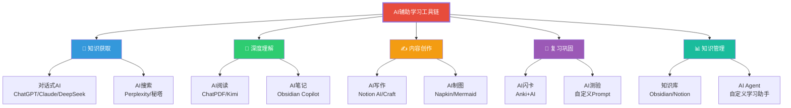
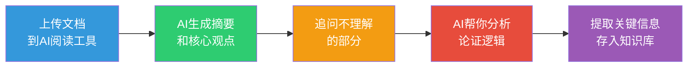
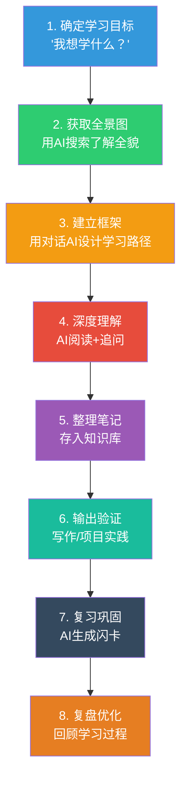

# AI辅助学习工具链与方法

> 工具不是学习的核心，但好的工具可以十倍加速学习。关键在于：知道用什么工具、在什么场景用、怎么用。

---

## 一、AI辅助学习的工具全景

### 1.1 工具分类



### 1.2 核心工具推荐

| 类别 | 工具 | 核心用途 | 推荐理由 |
|------|------|----------|----------|
| 对话AI | ChatGPT | 通用学习助手 | 生态最完善，插件丰富 |
| 对话AI | Claude | 深度分析、长文处理 | 上下文窗口大，逻辑清晰 |
| 对话AI | DeepSeek | 中文场景、编程 | 中文理解最好，免费 |
| AI搜索 | Perplexity | 研究型搜索 | 自动引用来源，信息可验证 |
| AI搜索 | 秘塔AI | 中文搜索 | 中文搜索效果好，结构化呈现 |
| AI阅读 | Kimi | 长文档阅读 | 超长上下文，适合论文/报告 |
| AI笔记 | Obsidian | 个人知识管理 | 本地化、双向链接、插件生态 |
| AI写作 | Notion AI | 笔记+写作 | AI功能集成在笔记中 |

---

## 二、五大学习场景的AI工具用法

### 2.1 场景一：快速入门新领域

**最佳工具组合**：对话AI + AI搜索

**方法**：
```
第1步：用AI搜索了解全景
Prompt: "给我一个[领域]的全景图，包括核心概念、关键人物、主要流派、当前热点"

第2步：用对话AI建立基本框架
Prompt: "你是一位[领域]导师，帮我设计一个从零开始的学习路径，分5个阶段"

第3步：追问细节，逐个击破
Prompt: "关于你提到的[具体概念]，用费曼学习法给我解释清楚"
```

### 2.2 场景二：深度阅读与理解

**最佳工具组合**：AI阅读 + 对话AI

**方法**：


**关键技巧**：不要只问"这篇文章讲了什么"，要问：
- "这篇文章的论证逻辑是什么？有没有漏洞？"
- "如果让你反驳这篇文章，你会怎么说？"
- "这篇文章的核心观点和[另一本书]的观点有什么异同？"

### 2.3 场景三：写作与输出

**最佳工具组合**：对话AI + AI写作工具

**正确姿势**：

| 步骤 | 做什么 | AI的角色 |
|------|--------|----------|
| 1. 确定主题 | 自己决定 | 帮你验证方向 |
| 2. 搭建框架 | 自己设计 | 提供框架建议 |
| 3. 收集素材 | 你给方向 | AI搜索资料 |
| 4. 初稿写作 | 给出要点 | AI扩写初稿 |
| 5. 修改润色 | 自己把控 | AI优化语言 |
| 6. 最终定稿 | 自己决定 | 不参与 |

> [!warning] 关键原则
> **AI是助手，不是作者**。写作的核心是"你的思考"，AI只是帮你把思考表达得更好。不要让AI替你思考。

### 2.4 场景四：复习与巩固

**最佳工具组合**：Anki + AI生成闪卡

**方法**：
```
让AI根据你的学习内容生成闪卡：
"请根据以下内容，生成10张Anki闪卡（问答对），
每张卡包含一个问题和一个答案，适合间隔重复复习。
内容：[粘贴你的学习笔记]"

然后用Anki导入，每天复习。
```

### 2.5 场景五：项目实践

**最佳工具组合**：对话AI + 代码/数据工具

> [!tip] 项目驱动学习
> 这是最高效的学习方式——不是"学完再做"，而是"做中学"。

**方法**：
1. 确定一个你想做的项目
2. 让AI帮你拆解成子任务
3. 每个子任务边做边学
4. 遇到问题随时问AI
5. 完成项目后让AI帮你复盘

---

## 三、工具使用原则

### 3.1 工具选择的核心标准

| 标准 | 为什么重要 | 如何判断 |
|------|----------|----------|
| 匹配学习目标 | 不同工具适合不同场景 | 先明确要学什么，再选工具 |
| 操作复杂度 | 太复杂的工具会分散注意力 | 选最简洁的工具 |
| 数据所有权 | 学习数据是长期资产 | 优先选本地化/可导出的工具 |
| 生态扩展 | 能否与其他工具协同 | 看API、插件、集成能力 |

### 3.2 工具使用的"三三制"

> [!tip] 三三制原则
> 1. **最多用3个核心工具** — 工具越多，管理成本越高，越难形成习惯
> 2. **每个工具至少用3次再决定** — 不要因为第一次体验不好就放弃
> 3. **每3个月复盘一次工具链** — 淘汰不好用的，尝试新的

### 3.3 避免"工具癖"

> [!warning] 常见陷阱
> **工具收集狂**：收藏了100个AI工具，但一个都没深度使用。
>
> **解决方案**：
> 1. 每个月只试1-2个新工具
> 2. 新工具先设定一个"试用期"（比如1周）
> 3. 试用期结束后，要么整合到日常使用，要么删除
> 4. 定期清理不用的工具

---

## 四、打造你的AI学习助手

### 4.1 自定义学习Agent

你可以用AI工具打造一个属于你自己的"AI学习助手"：

**基础配置**：
```
你是一位[领域]学习导师。你的特点：
1. 擅长用苏格拉底式提问引导思考
2. 对[领域]有深入理解
3. 知道如何将复杂概念简化
4. 会给出具体的行动建议

当你回答问题时：
1. 先确认我问的是什么
2. 用最通俗的语言解释
3. 给出一个类比
4. 提供延伸思考的问题
5. 给我一个"下一步行动"
```

### 4.2 学习SOP（标准操作流程）



---

## 五、延伸阅读

- [[07-学习成长/AI时代下的学习法/00_MOC_AI时代下的学习法中枢]] — 知识库总览
- [[07-学习成长/AI时代下的学习法/03_提示工程：与AI对话的核心技能]] — 提问是使用AI工具的前提
- [[07-学习成长/AI时代下的学习法/06_个人知识管理体系：建立你的第二大脑]] — 知识管理工具
- [[06-数据分析/AI时代数据分析学习/05_AI辅助数据分析工具链|AI辅助数据分析工具链]] — 数据分析专用工具
- [[05-产品与开发/AI产品经理方法论/00_MOC_AI产品经理方法论中枢|AI产品经理方法论]] — 产品经理的工具链

---

> [!quote]
> "工具不会让你变聪明，但好的工具会让你更高效地变聪明。"
>
> — 工具使用的基本原则

---

*最后更新：2026-07-31*