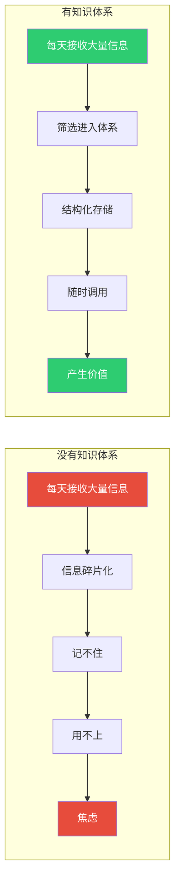
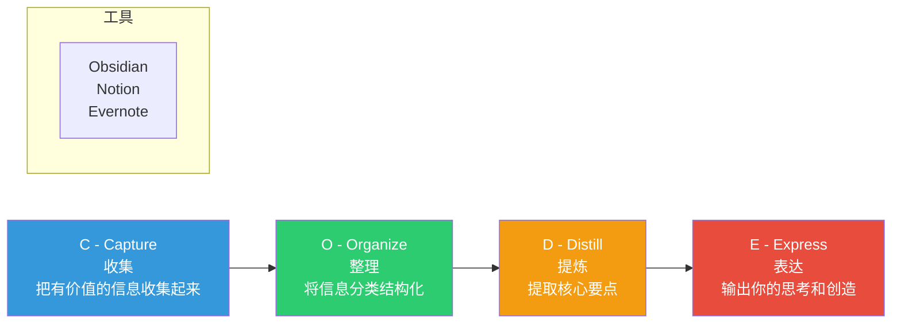
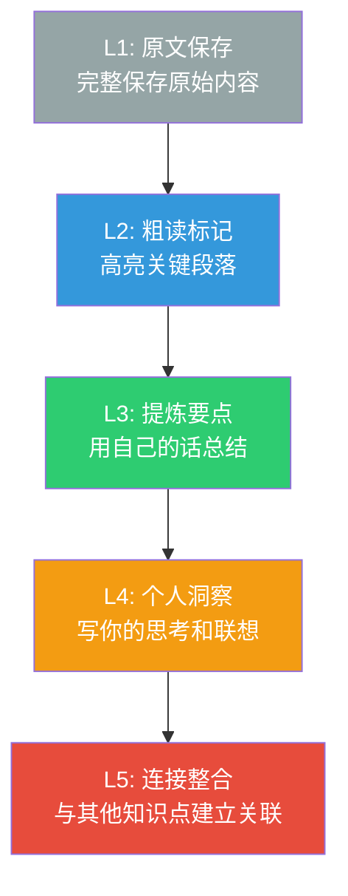

# 个人知识管理体系：建立你的第二大脑

> 知识不是力量，整理过的知识体系才是。在AI时代，拥有一个"第二大脑"不再是可选项，而是必需品。

---

## 一、为什么需要个人知识体系

### 1.1 信息过载 vs 知识体系



### 1.2 知识体系的价值

| 维度 | 没有体系 | 有体系 |
|------|----------|--------|
| 信息处理 | 被动接收 | 主动筛选 |
| 知识存储 | 大脑记忆（不可靠） | 外部存储（可靠） |
| 知识检索 | 凭记忆（时灵时不灵） | 结构化搜索（随时可用） |
| 知识创造 | 凭感觉 | 基于已有知识的整合 |
| 学习效率 | 重复学习 | 累加式学习 |
| 焦虑程度 | 高（怕错过） | 低（知道怎么找） |

---

## 二、知识管理的方法论框架

### 2.1 CODE框架

> [!defn] CODE框架
> 由Tiago Forte在《Building a Second Brain》中提出，是个人知识管理的经典框架。



### 2.2 PARA组织法

**核心原则**：按"可操作性"而不是按"主题"组织信息。

| 层级 | 定义 | 举例 |
|------|------|------|
| **P**rojects 项目 | 有截止日期的短期任务 | "完成AI知识库建设" |
| **A**reas 领域 | 没有截止日期的长期责任 | "HR技能提升"、"健康管理" |
| **R**esources 资源 | 将来可能用到的参考信息 | "AI工具列表"、"面试题库" |
| **A**rchives 归档 | 已完成或不再活跃的 | 已完成的项目、旧笔记 |

### 2.3 渐进式总结

不要一次性完美总结，而是分层次提炼：



---

## 三、AI时代的个人知识管理

### 3.1 AI如何改变知识管理

| 传统PKM | AI时代PKM |
|---------|-----------|
| 手动收集信息 | AI自动筛选和推荐 |
| 手动整理分类 | AI辅助自动分类 |
| 手动提取摘要 | AI自动生成摘要 |
| 靠记忆回忆 | AI搜索即用 |
| 孤立的笔记 | AI连接相关知识 |
| 无法应对信息过载 | AI帮你过滤噪音 |

### 3.2 AI辅助知识管理的具体方法

**1. 用AI做信息筛选**
```
每天让AI帮你筛选关键信息：
"请从以下内容中，提取3个最重要的观点，
并说明为什么它们重要：
[粘贴今日收集的信息]"
```

**2. 用AI做知识提炼**
```
"请把下面这段内容，用50个字总结核心观点，
然后列出3个延伸思考问题：
[粘贴内容]"
```

**3. 用AI做知识连接**
```
"我刚刚学习了[概念A]，我之前了解过[概念B]。
请帮我分析它们之间有什么联系？
有什么洞见是从A看B可以得到的？"
```

### 3.3 知识管理的"三不"原则

> [!tip] 关键原则
> 1. **不追求完美** — 好的笔记系统是"足够好用"，不是"完美无缺"
> 2. **不存储所有** — 只存有价值的信息，定期清理
> 3. **不为了存而存** — 存储的目的是为了用，不是为了收藏

---

## 四、知识体系的建立步骤

### 4.1 第一步：选择工具

推荐使用Obsidian作为核心知识管理工具（因为本知识库就在Obsidian中）。

**为什么选Obsidian**：
- 本地存储，数据完全属于你
- 纯文本Markdown，永不淘汰
- 双向链接，建立知识网络
- 强大的插件生态
- AI集成（Copilot等插件）

### 4.2 第二步：建立结构

**建议的文件夹结构**：
```
📁 我的知识库/
├── 📁 01-项目/        # 当前进行的项目
├── 📁 02-领域/        # 长期关注的领域
├── 📁 03-资源/        # 参考信息
├── 📁 04-归档/        # 已完成内容
├── 📁 05-日记/        # 每日记录
├── 📁 06-收件箱/      # 待处理的信息
└── 📁 附件/           # 图片、文件等
```

### 4.3 第三步：建立习惯

**日常流程**：

| 时间 | 动作 | 工具 |
|------|------|------|
| 早上 | 浏览收件箱，处理待办 | Obsidian |
| 随时 | 有灵感或发现，立刻记录 | 手机/Obsidian |
| 晚上 | 回顾今日笔记，做提炼 | Obsidian |
| 每周 | 整理收件箱，归档旧内容 | Obsidian |
| 每月 | 复盘知识体系，做调整 | Obsidian |

### 4.4 第四步：持续迭代

> [!key] 核心认知
> 知识体系不是一次建成的，而是**持续迭代**的。每过一段时间，你都会发现：
> - 有些分类不再适用
> - 有些笔记需要重新组织
> - 有些领域需要深入
> - 有些旧内容可以归档

---

## 五、Obsidian实战技巧

### 5.1 核心功能速查

| 功能 | 用途 | 操作方法 |
|------|------|----------|
| 双向链接 | 建立知识连接 | `[[笔记名]]` |
| 标签 | 按主题分类 | `#标签名` |
| 属性 | 元数据管理 | frontmatter |
| 图谱 | 可视化知识网络 | 图谱视图 |
| 模板 | 快速创建笔记 | 模板插件 |
| 搜索 | 全文检索 | Ctrl+P |

### 5.2 知识连接的"黄金三问"

每次创建新笔记时，问自己三个问题：

1. **这条笔记连接了谁？** — 和其他什么笔记有关联？
2. **这条笔记属于什么？** — 在哪个知识体系中？
3. **这条笔记能产生什么？** — 能和其他笔记碰撞出什么新想法？

### 5.3 卡片笔记法

> [!tip] 核心方法
> 每张卡片只记录一个想法，然后通过链接建立关联。这样做的优点是：
> - 每个想法独立，便于重组
> - 新想法可以随时插入
> - 知识之间的连接更容易发现

---

## 六、常见问题

### 6.1 "我坚持不下去"

| 问题 | 原因 | 解决方案 |
|------|------|----------|
| 记了两天就停了 | 太追求完美 | 从每天记一条开始 |
| 笔记太多看不完 | 收集太多 | 限制每天收集量 |
| 记了但找不到 | 分类不合理 | 用搜索代替分类 |
| 记了但用不上 | 为记而记 | 只记与目标相关的内容 |

### 6.2 "AI能做一切，为什么还要自己记"

> [!warning] 关键认知
> AI能帮你存储和检索，但**不能替你建立认知连接**。
>
> 记笔记的过程本身，就是在训练你的大脑建立知识网络。AI是加速器，不是替代品。

---

## 七、延伸阅读

- [[07-学习成长/AI时代下的学习法/00_MOC_AI时代下的学习法中枢]] — 知识库总览
- [[07-学习成长/AI时代下的学习法/05_AI辅助学习工具链与方法]] — 选择和管理你的工具
- [[03-HR人事/培训与人才发展/00_MOC_培训与人才发展中枢|培训与人才发展]] — 培训体系中的知识管理
- *Building a Second Brain* — Tiago Forte（必读原著）
- *How to Take Smart Notes* — Sönke Ahrens

---

> [!quote]
> "你的大脑是用来产生想法的，不是用来存储它们的。"
>
> — David Allen《Getting Things Done》

---

*最后更新：2026-07-31*