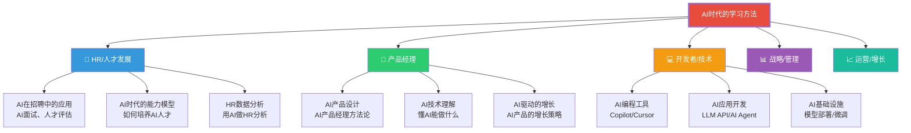

# 不同角色的AI学习路径

> 不同角色在AI时代的学习重点完全不同。通用的学习方法需要结合具体角色，才能产出最大的价值。

---

## 一、学习路径设计原则

### 1.1 角色决定学习重点

### 1.2 学习路径的通用框架

无论什么角色，都遵循以下路径：

| 阶段 | 目标 | 产出 |
|------|------|------|
| 1. 认知建立 | 理解AI能做什么、不能做什么 | 能判断什么场景适合用AI |
| 2. 工具熟练 | 掌握AI工具的基本使用 | 能用AI提升日常工作效率 |
| 3. 深度应用 | 将AI融入工作流 | 能用AI解决实际问题 |
| 4. 创新创造 | 用AI做以前做不到的事 | 创造新的工作方式或产品 |

---

## 二、HR/人才发展学习路径

### 2.1 为什么HR需要学AI

| 传统HR | AI时代HR |
|--------|---------|
| 凭经验筛选简历 | AI辅助简历筛选和匹配 |
| 人工面试评估 | AI面试+人工复核 |
| 标准化的培训方案 | AI个性化的学习路径 |
| 年度绩效考核 | 持续的AI辅助反馈 |
| 手工数据分析 | AI自动分析HR数据 |

### 2.2 学习路径

**第一阶段：AI认知建立（1-2周）**
- 目标：理解AI在HR领域能做什么
- 行动：
  - 阅读本知识库的 [[07-学习成长/AI时代下的学习法/01_学习范式转移：AI如何重塑学习的本质]] 和 [[07-学习成长/AI时代下的学习法/02_认知能力重塑：从记忆到判断]]
  - 了解AI面试工具（如 [[03-HR人事/AI面试全解析/00_MOC_AI面试全解析中枢|AI面试全解析]]）
  - 体验至少3个AI对话工具，感受AI的能力边界
  - 产出：一份"AI在HR中的应用场景清单"

**第二阶段：工具掌握（2-4周）**
- 目标：掌握AI工具在HR工作中的应用
- 行动：
  - 学习 [[07-学习成长/AI时代下的学习法/03_提示工程：与AI对话的核心技能]]，掌握提问技巧
  - 用AI辅助招聘JD撰写、简历筛选、面试问题设计
  - 用AI辅助培训方案设计、课程大纲生成
  - 产出：用AI完成一个完整的HR项目（如招聘流程优化方案）

**第三阶段：深度应用（1-2个月）**
- 目标：将AI融入HR工作流
- 行动：
  - 学习 [[07-学习成长/AI时代下的学习法/06_个人知识管理体系：建立你的第二大脑]]，建立HR知识库
  - 学习 [[06-数据分析/AI时代数据分析学习/00_MOC_AI时代数据分析学习中枢|AI时代数据分析学习]]，掌握HR数据分析
  - 探索AI在人才盘点、继任者计划中的应用
  - 产出：一套AI辅助的HR工作流程

**第四阶段：创新创造（持续）**
- 目标：用AI创造新的HR价值
- 行动：
  - 设计AI辅助的个性化员工发展路径
  - 探索AI在组织发展中的应用
  - 建立HR+AI的实践社区
  - 产出：一个AI驱动的HR创新项目

### 2.3 推荐资源

| 类型 | 资源 | 说明 |
|------|------|------|
| 知识库 | [[03-HR人事/AI面试全解析/00_MOC_AI面试全解析中枢|AI面试全解析]] | AI面试的全面了解 |
| 知识库 | [[02-AI趋势与素养/AI时代能力要求/00_MOC_AI时代能力要求中枢|AI时代能力要求]] | 了解AI时代需要什么能力 |
| 知识库 | [[03-HR人事/HR三支柱与组织设计/00_MOC_HR三支柱与组织设计中枢|HR三支柱与组织设计]] | HR组织设计的基础 |
| 知识库 | [[06-数据分析/AI时代数据分析学习/07_HR数据分析实战：招聘漏斗、离职预测、绩效校准|HR数据分析实战]] | AI辅助HR数据分析 |

---

## 三、产品经理学习路径

### 3.1 为什么PM需要学AI

AI时代，产品经理的角色发生了根本变化：

| 传统PM | AI时代PM |
|--------|---------|
| 定义功能需求 | 定义AI能力 |
| 确定性的交互设计 | 概率性的体验设计 |
| 版本迭代 | 持续进化 |
| 需求文档 | 数据+Prompt |
| 用户研究 | 用户+AI行为研究 |

### 3.2 学习路径

**第一阶段：AI认知建立（1-2周）**
- 目标：理解AI产品与传统产品的区别
- 行动：
  - 阅读 [[07-学习成长/AI时代下的学习法/01_学习范式转移：AI如何重塑学习的本质]]
  - 了解 [[02-AI趋势与素养/AI应用发展阶段演进/00_MOC_AI应用发展阶段演进中枢|AI应用发展阶段演进]]
  - 体验至少10个AI产品，分析其产品逻辑
  - 产出：一份AI产品体验报告，分析5个AI产品的设计差异

**第二阶段：工具掌握（2-3周）**
- 目标：掌握AI产品设计的基础工具
- 行动：
  - 学习 [[07-学习成长/AI时代下的学习法/03_提示工程：与AI对话的核心技能]]
  - 学习用AI辅助产品文档撰写、用户故事编写
  - 学习用AI做竞品分析、用户研究
  - 产出：用AI完成一个AI产品的PRD初稿

**第三阶段：深度应用（1-2个月）**
- 目标：掌握AI产品设计的核心方法论
- 行动：
  - 深入学习 [[05-产品与开发/AI产品经理方法论/00_MOC_AI产品经理方法论中枢|AI产品经理方法论]]
  - 学习 [[05-产品与开发/用户研究与需求洞察/00_MOC_用户研究与需求洞察中枢|用户研究与需求洞察]]
  - 学习 [[06-数据分析/AI时代数据分析学习/08_产品与战略数据分析实战：留存、实验、市场规模|产品数据分析实战]]
  - 产出：一个完整的AI产品设计方案

**第四阶段：创新创造（持续）**
- 目标：设计AI原生产品
- 行动：
  - 学习AI技术基础（至少理解LLM的工作原理）
  - 探索AI Agent、AI原生应用的设计范式
  - 参与AI产品的实际开发
  - 产出：一个AI原生产品的MVP

### 3.3 推荐资源

| 类型 | 资源 | 说明 |
|------|------|------|
| 知识库 | [[05-产品与开发/AI产品经理方法论/00_MOC_AI产品经理方法论中枢|AI产品经理方法论]] | AI产品经理的核心知识 |
| 知识库 | [[02-AI趋势与素养/AI应用发展阶段演进/00_MOC_AI应用发展阶段演进中枢|AI应用发展阶段演进]] | 理解AI产品的发展阶段 |
| 知识库 | [[05-产品与开发/用户研究与需求洞察/00_MOC_用户研究与需求洞察中枢|用户研究与需求洞察]] | 用户研究的基础 |

---

## 四、开发者/技术岗位学习路径

### 4.1 学习路径

**第一阶段：AI工具熟练（1-2周）**
- 目标：用AI编程工具提升日常开发效率
- 行动：
  - 掌握 [[07-学习成长/AI时代下的学习法/03_提示工程：与AI对话的核心技能]]
  - 安装并使用GitHub Copilot或Cursor
  - 学习用AI辅助代码审查、调试、重构
  - 产出：用AI辅助完成一个完整的小项目

**第二阶段：AI应用开发（2-4周）**
- 目标：开发简单的AI应用
- 行动：
  - 学习LLM API的基本使用（OpenAI API / DeepSeek API）
  - 学习Prompt Engineering在代码中的实现
  - 了解RAG（检索增强生成）的基本原理
  - 产出：一个简单的AI应用（如AI客服、内容生成工具）

**第三阶段：AI系统设计（1-2个月）**
- 目标：设计复杂的AI系统
- 行动：
  - 学习AI Agent的架构设计
  - 学习AI应用的评估和测试方法
  - 了解AI安全和伦理在工程中的实现
  - 产出：一个完整的AI系统设计方案

**第四阶段：AI创新（持续）**
- 目标：推动AI技术应用创新
- 行动：
  - 跟进AI技术前沿（论文、开源项目）
  - 探索AI在特定领域的深度应用
  - 参与开源AI项目
  - 产出：开源的AI工具或项目

### 4.2 推荐资源

| 类型 | 资源 | 说明 |
|------|------|------|
| 知识库 | [[05-产品与开发/Vibe Coder/AI产品开发导航系统|AI产品开发导航系统]] | Vibe Coding开发指南 |
| 知识库 | [[01-AI技术/开源AI生态全景/00_MOC_开源AI生态全景中枢|开源AI生态全景]] | 了解开源AI生态 |
| 知识库 | [[01-AI技术/AI Agent 工具/AI_Agent_工具全景对比|AI Agent工具全景]] | AI Agent开发工具 |

---

## 五、学习路径的通用原则

### 5.1 学习路径定制化

> [!tip] 定制原则
> 以上学习路径是"基础模板"，你可以根据自己的情况调整：
> 1. **已有基础**：跳过第一阶段，直接进入第二阶段
> 2. **时间有限**：每个阶段缩短时间，但不要跳过
> 3. **特定需求**：根据你的工作重点，调整每个阶段的深度
> 4. **持续迭代**：定期回顾学习路径，调整方向和重点

### 5.2 学习路径的"检验标准"

**每个阶段结束时，问自己**：
1. 我能用AI做什么？ → 具体说出3个应用场景
2. 我比之前快了多少？ → 量化效率提升
3. 我有没有新的想法？ → 有没有因为AI产生的创新想法
4. 我有没有什么盲区？ → 什么是我还不知道的

### 5.3 学习的"721法则"

| 比例 | 学习方式 | 说明 |
|------|----------|------|
| 70% | 实践 | 在做中学，用AI完成实际任务 |
| 20% | 社交 | 与他人交流，分享经验 |
| 10% | 正式学习 | 阅读知识库、参加课程 |

---

## 六、延伸阅读

- [[07-学习成长/AI时代下的学习法/00_MOC_AI时代下的学习法中枢]] — 知识库总览
- [[02-AI趋势与素养/AI时代能力要求/00_MOC_AI时代能力要求中枢|AI时代能力要求]] — 了解AI时代需要什么能力
- [[05-产品与开发/Vibe Coder/AI产品开发导航系统|AI产品开发导航系统]] — 如果你是开发者
- [[05-产品与开发/AI产品经理方法论/00_MOC_AI产品经理方法论中枢|AI产品经理方法论]] — 如果你是PM

---

> [!quote]
> "最好的学习路径，不是从A到B的一条直线，而是一个不断探索、调整、优化的过程。"
>
> — 学习路径设计的基本原则

---

*最后更新：2026-07-31*