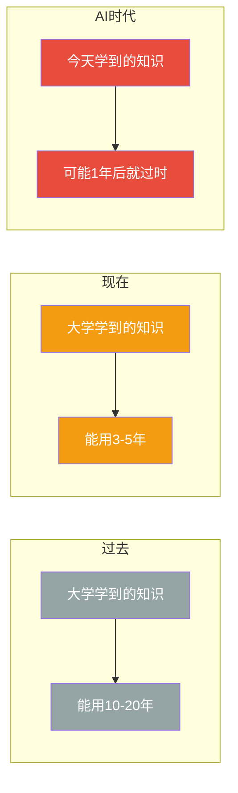
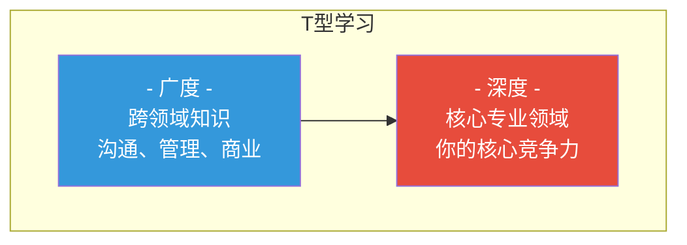
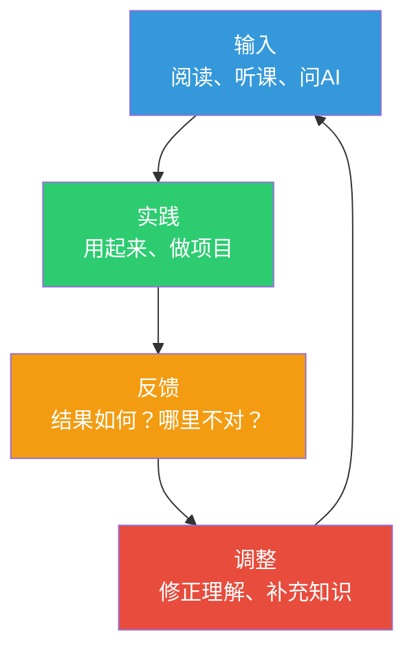
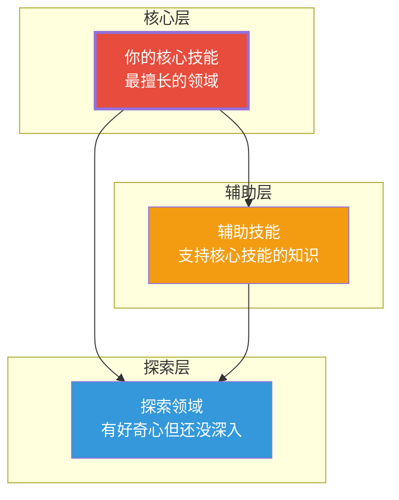

# 终身学习：AI时代的持续成长策略

> 在AI时代，唯一不变的是变化本身。持续学习不再是一种选择，而是生存的底线。

---

## 一、终身学习的时代背景

### 1.1 知识半衰期在缩短

**知识半衰期的变化**：

| 时代 | 知识半衰期 | 学习模式 |
|------|-----------|----------|
| 农业时代 | 100年+ | 一代人学一次 |
| 工业时代 | 30-50年 | 学一次用一生 |
| 信息时代 | 5-10年 | 需要持续学习 |
| AI时代 | 1-3年 | 学习成为日常习惯 |

### 1.2 终身学习的"新常态"

> [!key] 核心认知
> 终身学习不是"活到老学到老"的善良愿望，而是AI时代的**生存策略**。你不需要比AI更聪明，但需要比昨天的自己更会学习。

**终身学习的三个驱动力**：

| 驱动力 | 说明 | 表现 |
|--------|------|------|
| 外部压力 | 技术和市场快速变化 | 不学习就被淘汰 |
| 内部动力 | 自我成长和好奇心 | 学习本身就是乐趣 |
| 能力需求 | 解决新问题的需要 | 遇到问题就学习 |

---

## 二、终身学习的核心策略

### 2.1 T型策略：广度与深度的平衡

**T型学习的三个原则**：

1. **先深后广** — 先在一个领域建立深度，再拓展广度
2. **深度决定下限** — 你的专业能力决定了你的基本价值
3. **广度决定上限** — 跨领域整合能力决定了你能走多远

### 2.2 80/20学习法则

> [!tip] 核心原则
> 20%的核心知识，能解决80%的问题。找到那20%，优先掌握。

**如何找到那20%**：
1. 让AI帮你分析："在[领域]中，哪20%的知识最核心？"
2. 问专家："如果只能学20%，你会选什么？"
3. 从实践反推："我实际需要解决什么问题？需要什么知识？"

### 2.3 学习闭环

> [!tip] 核心原则
> 学习的闭环不是"输入→输出"，而是"输入→实践→反馈→调整→再输入"。

---

## 三、建立可持续的学习系统

### 3.1 学习系统的三个支柱

| 支柱 | 说明 | 具体做法 |
|------|------|----------|
| 习惯 | 学习的日常化 | 每天固定时间学习 |
| 环境 | 减少学习阻力 | 随时可用的学习工具 |
| 反馈 | 看到进步 | 记录学习成果和产出 |

### 3.2 设计你的学习习惯

**好的学习习惯的特征**：
- **足够小**：每天15分钟，而不是2小时
- **固定时间**：每天早上或晚上，形成条件反射
- **低门槛**：打开手机就能学，不需要准备
- **有产出**：每天学完，写一句话总结

**习惯养成示例**：

| 时间 | 习惯 | 时长 | 工具 |
|------|------|------|------|
| 早上7:30 | 阅读一篇AI相关文章 | 15分钟 | AI摘要工具 |
| 通勤路上 | 听一节播客或课程 | 20分钟 | 播客App |
| 午休时间 | 问AI一个学习问题 | 10分钟 | 对话AI |
| 晚上9:00 | 整理今日学习笔记 | 15分钟 | Obsidian |
| 周末上午 | 做一个实践项目 | 2小时 | 项目实践 |

### 3.3 学习环境的优化

**减少阻力的四步法**：

1. **工具触手可及** — 手机、电脑上都装好学习工具
2. **内容自动推送** — 订阅高质量信息源，自动推送到你面前
3. **社交压力** — 加入学习社群，和他人一起学
4. **可视化进度** — 记录学习轨迹，看到自己的进步

---

## 四、克服学习障碍

### 4.1 常见障碍与应对

| 障碍 | 表现 | 应对策略 |
|------|------|----------|
| 没时间 | "工作太忙，没空学" | 从每天15分钟开始，用"微习惯" |
| 没方向 | "不知道学什么" | 从当前工作痛点出发，学以致用 |
| 坚持不了 | "三天打鱼两天晒网" | 建立外部监督（社群、打卡） |
| 学了没用 | "学了很多，用不上" | 学习前先确定"我要解决什么问题" |
| 信息过载 | "信息太多，无从下手" | 用AI筛选，只关注最重要信息 |
| 学习焦虑 | "别人都在学，我落后了" | 专注自己的节奏，不比较 |

### 4.2 应对"学习疲劳"

> [!warning] 学习疲劳的信号
> - 看到学习材料就烦躁
> - 学完感觉什么都没记住
> - 学习效率明显下降
> - 开始怀疑学习的意义

**应对方法**：
1. **主动休息** — 学习45分钟，休息15分钟
2. **切换模式** — 从阅读切换到实践，从输入切换到输出
3. **降低强度** — 从每天1小时降到15分钟，保持连续性
4. **回顾成果** — 翻翻之前的笔记，看到自己的进步
5. **调整方向** — 如果实在没兴趣，换个方向学

### 4.3 应对"FOMO"（害怕错过）

> [!tip] 核心建议
> 你不需要学所有东西。重要的不是"知道什么"，而是"知道什么值得学"。

**FOMO应对策略**：
1. **聚焦一个领域** — 先精通一个领域，再拓展
2. **信任AI** — 需要的时候问AI，不用提前学
3. **接受不完美** — 永远有更好的学习方法，但"足够好"就够了
4. **关注长期** — 大多数短期热点，3个月后就没人在意了

---

## 五、构建你的学习生态系统

### 5.1 学习生态的三层结构

### 5.2 学习资源的分层管理

| 层级 | 资源类型 | 投入比例 | 更新频率 |
|------|----------|----------|----------|
| 核心层 | 专业书籍、课程、导师 | 50% | 持续深入 |
| 辅助层 | 相关领域文章、案例 | 30% | 每周更新 |
| 探索层 | 播客、博客、社交推荐 | 20% | 随时更新 |

### 5.3 年度学习计划模板

**第一季度：建立基础**
- 选定1-2个核心学习目标
- 找到合适的课程和资源
- 建立学习习惯（每天15分钟）

**第二季度：深入实践**
- 完成一个实践项目
- 建立知识体系框架
- 开始输出（写笔记、做分享）

**第三季度：拓展连接**
- 将新知识与已有知识连接
- 尝试跨领域应用
- 参与社群讨论

**第四季度：复盘迭代**
- 回顾全年学习成果
- 调整学习方向和策略
- 制定来年计划

---

## 六、AI时代的终身学习宣言

> [!quote] 终身学习宣言
> 我承诺：
>
> 1. **每天学习**，无论多忙，至少15分钟
> 2. **学以致用**，学到的知识必须立刻用起来
> 3. **保持好奇**，对新事物保持开放心态
> 4. **接受变化**，拥抱AI带来的每一次变革
> 5. **持续输出**，把学到的东西分享出去
> 6. **不惧落后**，按照自己的节奏持续前进
> 7. **相信过程**，持续的微小进步，终将带来巨大改变

---

## 七、延伸阅读

- [[07-学习成长/AI时代下的学习法/00_MOC_AI时代下的学习法中枢]] — 知识库总览
- [[07-学习成长/AI时代下的学习法/01_学习范式转移：AI如何重塑学习的本质]] — 理解学习的本质变化
- [[07-学习成长/AI时代下的学习法/02_认知能力重塑：从记忆到判断]] — 培养最保值的认知能力
- [[07-学习成长/AI时代下的学习法/07_不同角色的AI学习路径]] — 找到你的专属学习路径
- [[02-AI趋势与素养/AI时代能力要求/00_MOC_AI时代能力要求中枢|AI时代能力要求]] — 了解AI时代需要什么能力

---

> [!quote]
> "学习的终极目标不是装满知识，而是学会如何学习本身。"
>
> — 本知识库的核心信条

---

*最后更新：2026-07-31*